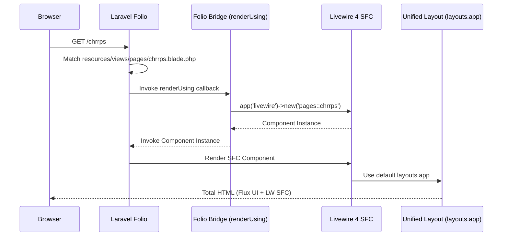
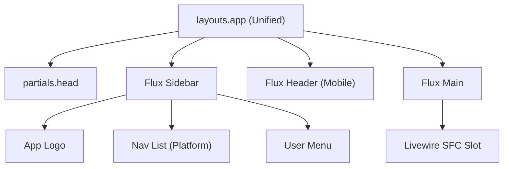

# Laravel Folio & Livewire 4 SFC Integration

This document outlines the architecture and implementation details for integrating **Laravel Folio** with **Livewire 4 Single-File Components (SFCs)** using a unified layout system powered by **Flux UI**.

## Architecture Overview

The integration relies on a "Global Bridge" that intercepts Folio's rendering process and redirects it through Livewire's component instantiation pipeline. This ensures that SFCs are correctly booted, their `$this` context is bound, and they leverage Livewire's native page-rendering features.

### Request Flow

## Key Components

### 1. The Global Bridge
Implemented in `app/Providers/FolioServiceProvider.php`, this bridge uses `Folio::renderUsing()` to automatically detect and render Livewire SFCs found in the `resources/views/pages` directory.

### 2. Unified Layout (`layouts.app`)
The standard Livewire 4 layout file was updated to include the full **Flux UI** sidebar structure. This allows SFCs to remain "clean" by inheriting the layout automatically without needing the `#[Layout]` attribute.

## Setup & Configuration

- **Folio Path**: `resources/views/pages`
- **Component Namespace**: `pages::*`
- **Default Layout**: `resources/views/layouts/app.blade.php`

## History & Decisions

For a detailed breakdown of the implementation steps, previous attempts, and key design decisions, please refer to the following documents:

- [Implementation Plans](history/implementation_plans.md)
- [Walkthroughs](history/walkthroughs.md)
- [Conversation Transcript](history/conversation_transcript.md)
- [Full Code Reference](code_reference.md)
