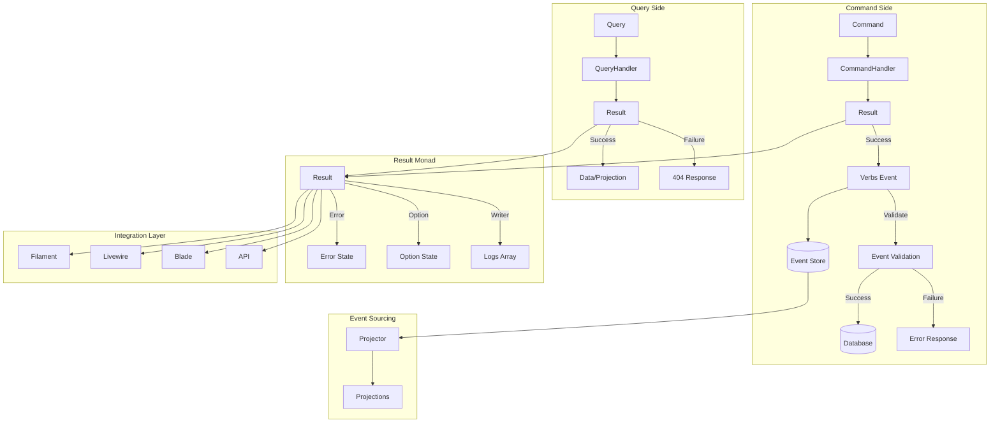
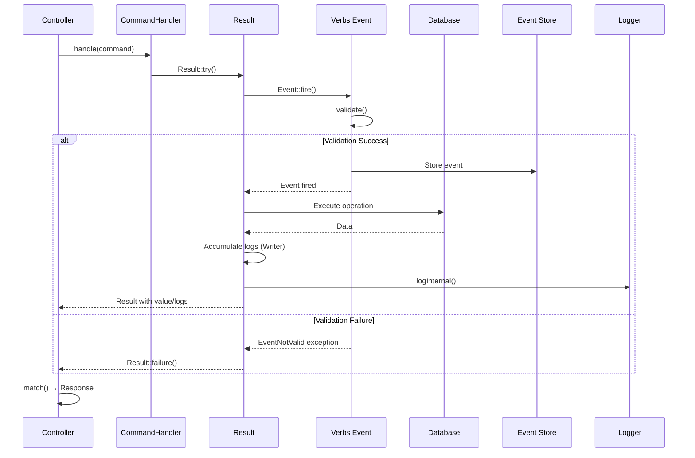
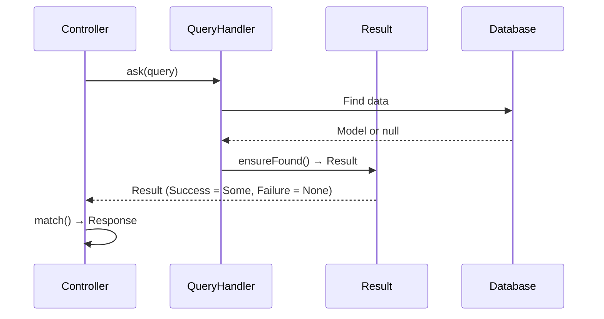
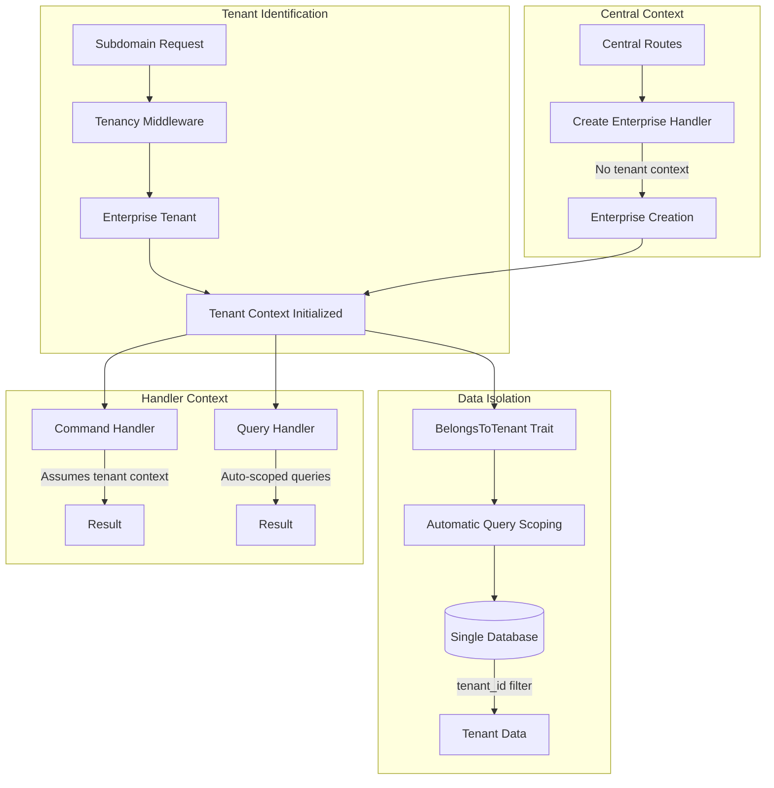
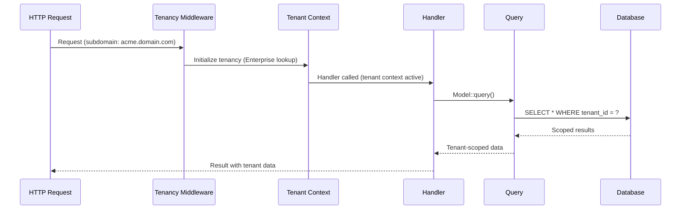

# Monadic CQRS Architecture

System overview and design decisions for the Monadic CQRS architecture.

## Overview

The Monadic CQRS architecture combines three functional programming patterns into a unified system:

1. **Error Monad**: Handles success/failure states without exceptions
2. **Option Monad**: Handles null/missing data without null checks
3. **Writer Monad**: Carries audit logs alongside computation results

All three are unified in a single `Result` class, avoiding the complexity of monad stacking.

## Architecture Diagram



## Component Relationships

### Core Components

```
Result (Monad)
├── Error Monad (Success/Failure)
├── Option Monad (Some/None)
└── Writer Monad (Audit Logs)
    │
    ├── AsyncResult (Concurrency)
    │
    ├── BaseHandler (Helpers)
    │   ├── ensureFound() → Option behavior
    │   └── guard() → Error behavior
    │
    ├── CommandHandler (Interface)
    │   └── handle() → Result
    │
    └── QueryHandler (Interface)
        └── ask() → Result
```

### Integration Points

```
Result Monad
    │
    ├── Verbs Event Sourcing
    │   ├── Events (TeamCreated, etc.)
    │   ├── Projectors (TeamProjector)
    │   └── Projections (TeamProjection)
    │
    ├── Filament Integration
    │   ├── ResultAction (Base class)
    │   └── Resource Pages (handleRecord*)
    │
    ├── Livewire Integration
    │   └── HandlesResults (Trait)
    │
    ├── Folio Integration
    │   └── FolioServiceProvider (Result handling)
    │
    └── Blade Integration
        └── MonadBladeServiceProvider (@success, @failure, @audit)
```

## Data Flow

### Command Flow



### Query Flow



## Design Decisions

### Why a Unified Result Class?

Instead of separate `Either`, `Maybe`, and `Writer` monads, we use a single `Result` class that combines all three:

- **Simpler API**: One class to learn instead of three
- **No Monad Stacking**: Avoids `Writer<Either<Error, Value>>` complexity
- **Laravel Integration**: Works seamlessly with Collections and Laravel patterns
- **Pragmatic**: Mathematically sound but developer-friendly

### Why Verbs Event Sourcing?

Verbs provides persistent event storage while Result handles control flow:

- **Result Monad**: Validates business rules and handles control flow (transient)
- **Verbs Events**: Provides permanent business audit trail (persistent)
- **Writer Monad**: Developer debugging logs (transient, per request)
- **Separation of Concerns**: Result = how (control flow), Verbs = what (audit trail)
- **Two-Layer Validation**: Result validates before Verbs event fires

### Why Property Hooks?

PHP 8.5 property hooks allow computed properties without method calls:

```php
// Instead of: $result->isSuccess()
// We can use: $result->isSuccess
public bool $isSuccess {
    get => $this->error === null;
}
```

This makes the Result feel like a native language feature.

### Why Collection Proxy?

The `__call` magic method allows direct use of Laravel Collection methods:

```php
// Instead of:
$result->map(fn($data) => collect($data)->filter(...))

// We can do:
$result->filter(...)
```

This preserves the monad state while leveraging Laravel's powerful collection API.

### Why AsyncResult?

For high-concurrency scenarios (multiple API calls, parallel database queries), `AsyncResult::all()` provides:

- Automatic log merging from parallel threads
- "All-or-Nothing" error handling
- Seamless integration with Result monad

## Tenant Context Architecture

The application uses **single-database tenancy** where the Enterprise model serves as the tenant. All tenants share the same database and are isolated via the `tenant_id` column and the `BelongsToTenant` trait's automatic query scoping.

### Tenant Architecture Diagram



### Tenant Context Flow



### Key Principles

#### 1. Tenant Context Initialization

- **HTTP Requests**: Tenant context is automatically initialized via middleware (`InitializeTenancyBySubdomain`)
- **Command Handlers**: Assume tenant context is active when called from tenant routes
- **Query Handlers**: Automatically benefit from tenant-scoped queries via `BelongsToTenant` trait
- **Central Context**: Handlers creating Enterprise (tenant) records operate in central context (no tenant initialized)

#### 2. Automatic Query Scoping

Models using the `BelongsToTenant` trait automatically scope queries to the current tenant:

```php
// This query is automatically scoped to current tenant
$teams = Team::query()->get(); // Only returns teams for current Enterprise

// Use withoutGlobalScopes() when accessing parent relationships
$parent = $team->parent()->withoutGlobalScopes()->first();
```

#### 3. Handler Context Awareness

**Tenant-Aware Command Handler** (most common):
```php
final class CreateTeamHandler extends BaseHandler
{
    public function handle(object $command): Result
    {
        // Tenant context already initialized via middleware
        // BelongsToTenant trait automatically scopes queries
        // Handler sets tenant_id correctly (inherited from parent)
        return Result::try(fn() => $this->createTeam($command));
    }
}
```

**Central Context Command Handler** (Enterprise creation):
```php
final class CreateEnterpriseHandler extends BaseHandler
{
    public function handle(object $command): Result
    {
        // Operates in central context (no tenant initialized)
        // Creates Enterprise with domain
        // Tenant context initialized after creation
        return Result::try(fn() => $this->createEnterprise($command));
    }
}
```

**Tenant-Aware Query Handler**:
```php
final class GetTeamHandler extends BaseHandler implements QueryHandler
{
    public function ask(object $query): Result
    {
        // Queries are automatically scoped to current tenant
        // Use withoutGlobalScopes() only when accessing parent relationships
        $team = Team::find($query->id); // Auto-scoped to tenant
        return $this->ensureFound($team);
    }
}
```

#### 4. Tenant Boundary Enforcement

- **Never leak data**: Handlers must never return data from a different tenant
- **Validate ownership**: When accessing resources, ensure they belong to current tenant (automatic via scoping)
- **Cross-tenant operations**: Use `withoutGlobalScopes()` only when necessary (e.g., accessing parent Enterprise)

#### 5. Event Sourcing with Tenancy

- Events fired in tenant context should include tenant identification
- Event validation respects tenant boundaries
- Projectors run in tenant context and use tenant-scoped queries
- Central context events (e.g., EnterpriseCreated) operate without tenant context

### Tenant Context vs Central Context

| Aspect | Tenant Context | Central Context |
|--------|---------------|-----------------|
| **When Used** | Most handlers (creating teams, queries) | Creating Enterprise tenants |
| **Initialization** | Automatic via middleware | Manual (no tenant initialized) |
| **Query Scoping** | Automatic via BelongsToTenant | No automatic scoping |
| **Access Pattern** | `Team::query()` (auto-scoped) | `Enterprise::query()` (no scope) |
| **Tenant ID** | Available via `tenant()` helper | Not available |

### Best Practices

1. **Assume tenant context**: Most handlers should assume tenant context is active
2. **Respect scoping**: Don't bypass `BelongsToTenant` scoping unless necessary
3. **Document exceptions**: Clearly document when handlers operate in central context
4. **Test boundaries**: Ensure tests validate tenant boundary enforcement
5. **Use tenant() helper**: Access current tenant when needed: `tenant()` returns `Enterprise` instance

## Integration Strategies

### Filament Integration

**Strategy**: Page-level integration
- Resource pages call CQRS handlers
- Form submission returns `Result`
- Automatic notification/error handling

**Example:**
```php
protected function handleRecordCreation(array $data): Model
{
    $handler = resolve(CreateTeamHandler::class);
    $result = $handler->handle(new CreateTeamCommand($data));
    
    return $result->match(
        onSuccess: fn($team) => $team,
        onFailure: fn($error) => throw new \RuntimeException($error)
    );
}
```

### Livewire Integration

**Strategy**: Trait-based approach
- `HandlesResults` trait provides common functionality
- Automatic error display via Flux UI notifications
- Loading states preserved via `wire:loading`

**Example:**
```php
use App\Livewire\Concerns\HandlesResults;

class MyComponent extends Component
{
    use HandlesResults;
    
    public function submit(): void
    {
        $this->executeCommand($handler, $command, 'Success!');
    }
}
```

### Folio Integration

**Strategy**: Service Provider enhancement
- `FolioServiceProvider` handles Result objects
- Automatic Result → HTTP response conversion
- Works with existing Folio/Livewire SFC bridge

## Testing Strategy

### Monadic Law Tests

The architecture includes Pest tests that validate:

1. **Left Identity Law**: `flatMap(unit(x), f) == f(x)`
2. **Right Identity Law**: `flatMap(m, unit) == m`
3. **Associativity Law**: `flatMap(flatMap(m, f), g) == flatMap(m, x => flatMap(f(x), g))`

### Integration Tests

- Handler tests verify Result return types
- Controller tests verify Result → Response conversion
- Filament/Livewire tests verify Result → UI integration

### Tenant-Aware Handler Testing

When testing handlers that operate in tenant context, you need to set up tenant context in your tests:

```php
use App\Models\Enterprise;
use App\Models\User;

test('handler creates team in tenant context', function () {
    // Create Enterprise tenant
    $enterprise = Enterprise::factory()->create();
    
    // Create user belonging to tenant
    $user = User::factory()->create(['tenant_id' => $enterprise->id]);
    
    // Initialize tenant context
    tenancy()->initialize($enterprise);
    
    // Now handlers operate in tenant context
    $handler = resolve(CreateTeamHandler::class);
    $command = new CreateTeamCommand([...]);
    
    $result = $handler->handle($command);
    
    expect($result->isSuccess)->toBeTrue();
    
    // Verify team belongs to tenant
    $team = $result->value;
    expect($team->tenant_id)->toBe($enterprise->id);
    
    // Clean up tenant context
    tenancy()->end();
});
```

### Testing Query Handlers

Query handlers benefit from automatic tenant scoping:

```php
test('query handler returns only tenant-scoped data', function () {
    $enterprise1 = Enterprise::factory()->create();
    $enterprise2 = Enterprise::factory()->create();
    
    // Create teams in different tenants
    $team1 = Team::factory()->create(['tenant_id' => $enterprise1->id]);
    $team2 = Team::factory()->create(['tenant_id' => $enterprise2->id]);
    
    // Initialize tenant context for enterprise1
    tenancy()->initialize($enterprise1);
    
    $handler = resolve(GetTeamHandler::class);
    $query = new GetTeamQuery($team1->ulid);
    
    $result = $handler->ask($query);
    
    expect($result->isSuccess)->toBeTrue();
    expect($result->value->id)->toBe($team1->id);
    
    // Query for team2 should fail (different tenant)
    $query2 = new GetTeamQuery($team2->ulid);
    $result2 = $handler->ask($query2);
    
    expect($result2->isFailure)->toBeTrue(); // Not found due to tenant scoping
    
    tenancy()->end();
});
```

### Testing Central Context Handlers

Handlers that create Enterprise records operate in central context:

```php
test('create enterprise handler operates in central context', function () {
    // No tenant context initialized
    expect(tenant())->toBeNull();
    
    $handler = resolve(CreateEnterpriseHandler::class);
    $command = new CreateEnterpriseCommand([...]);
    
    $result = $handler->handle($command);
    
    expect($result->isSuccess)->toBeTrue();
    
    $enterprise = $result->value;
    expect($enterprise)->toBeInstanceOf(Enterprise::class);
    expect($enterprise->type)->toBe(TeamType::ENTERPRISE);
});
```

### Test Helpers

Consider creating test helpers for tenant setup:

```php
// tests/TestCase.php or tests/Helpers/Tenancy.php
trait UsesTenancy
{
    protected function initializeTenant(?Enterprise $enterprise = null): Enterprise
    {
        $enterprise ??= Enterprise::factory()->create();
        tenancy()->initialize($enterprise);
        
        return $enterprise;
    }
    
    protected function endTenancy(): void
    {
        tenancy()->end();
    }
}

// In your test
use UsesTenancy;

test('my test', function () {
    $enterprise = $this->initializeTenant();
    
    // Test code here
    
    $this->endTenancy();
});
```

## Performance Considerations

- **Readonly Classes**: PHP 8.5 optimization for immutability
- **Property Hooks**: Computed properties without method call overhead
- **Collection Proxy**: Direct method forwarding, no wrapping overhead
- **Minimal Overhead**: Result wrapping adds negligible performance cost

## Migration Path

The architecture supports gradual migration:

1. **Coexistence**: Actions and CQRS handlers can coexist
2. **New Features**: Start with new features using CQRS
3. **Incremental**: Migrate existing code incrementally
4. **Backward Compatible**: Existing Actions continue to work

See [Migration Guide](migration.md) for detailed examples.
