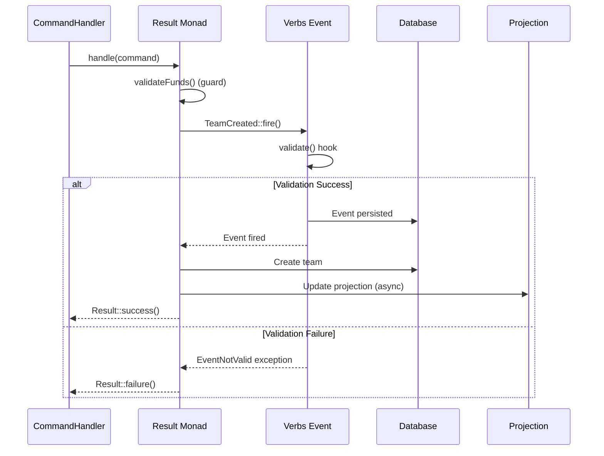

# Verbs Event Sourcing Integration

Examples and patterns for integrating `hirethunk/verbs` event sourcing with the monadic CQRS architecture.

## Overview

Verbs provides persistent event storage (audit trail) while the Result monad handles control flow and validation. This creates a "power setup" where:

- **Result Monad**: Validates business rules and handles control flow (transient)
- **Verbs Events**: Provides permanent business audit trail (persistent)
- **Writer Monad**: Developer debugging logs (transient, per request)
- **Projections**: Optional read models for query optimization

## Architecture Pattern



## Creating a Verbs Event

### Event Structure

```php
// app/Events/Teams/TeamCreated.php
use App\Enums\TeamType;
use App\Models\Team;
use App\Support\Validation\TeamHierarchyValidator;
use Thunk\Verbs\Event;

final class TeamCreated extends Event
{
    public function __construct(
        public TeamType $type,
        public array|string $name,
        public array|string|null $bio = null,
        public ?int $parent_id = null,
        public ?int $tenant_id = null,
        public ?string $state = null,
        public ?string $status = null,
    ) {}

    /**
     * Validate that the team can be created.
     * 
     * This validation runs before the event is fired.
     * If validation fails, EventNotValid is thrown and caught by Result::try().
     */
    public function validate(): void
    {
        $parent = $this->parent_id
            ? Team::query()->withoutGlobalScopes()->find($this->parent_id)
            : null;

        try {
            TeamHierarchyValidator::validate($this->type, $parent);
        } catch (\Illuminate\Validation\ValidationException $e) {
            $messages = $e->errors();
            $firstMessage = collect($messages)->flatten()->first() ?? 'Invalid team hierarchy';

            $this->assert(false, $firstMessage);
        }
    }
}
```

### Key Points

- Events extend `Thunk\Verbs\Event`
- Properties define the event data
- `validate()` method runs before the event fires
- Use `$this->assert()` for validation failures
- Validation exceptions are caught by `Result::try()`

## Command Handler Integration

### Firing Events in Handlers

```php
// app/Handlers/Commands/Teams/CreateTeamHandler.php
use App\Events\Teams\TeamCreated;
use App\Support\Result;

final class CreateTeamHandler extends BaseHandler implements CommandHandler
{
    public function handle(object $command): Result
    {
        if (! $command instanceof CreateTeamCommand) {
            return Result::failure('Invalid command type');
        }

        return Result::try(
            fn () => DB::transaction(fn () => $this->createTeam($command)),
            ['Starting team creation']
        );
    }

    private function createTeam(CreateTeamCommand $command): Team
    {
        $type = $command->data['type'] instanceof TeamType
            ? $command->data['type']
            : TeamType::from($command->data['type']);

        // Fire Verbs event - validates via event's validate() method
        // If validation fails, EventNotValid exception is thrown and caught by Result::try()
        $event = TeamCreated::fire(
            type: $type,
            name: $command->data['name'] ?? '',
            bio: $command->data['bio'] ?? null,
            parent_id: $command->data['parent_id'] ?? null,
            state: $command->data['state'] ?? null,
            status: $command->data['status'] ?? null,
        );

        // Continue with team creation logic...
        $team = Team::query()->create([...]);

        return $team;
    }
}
```

### Integration Pattern

1. **Wrap event firing in `Result::try()`**: Catches `EventNotValid` exceptions
2. **Event validates first**: `validate()` method runs before event fires
3. **Continue with business logic**: After event fires successfully
4. **Writer logs + Verbs events**: Both coexist for different purposes

## Projections

### Creating a Projector

```php
// app/Projections/Teams/TeamProjector.php
use App\Events\Teams\TeamCreated;
use Thunk\Verbs\Attributes\Hooks\Listen;

final class TeamProjector
{
    /**
     * Handle TeamCreated events by updating the projection.
     * 
     * This method is called automatically when a TeamCreated event is fired.
     */
    #[Listen(TeamCreated::class)]
    public function onTeamCreated(TeamCreated $event): void
    {
        // Update denormalized read models, cache, or search index
        // Example: Refresh Laravel Scout search index
        // Team::searchable()->get()->each->searchable();
    }
}
```

### Projection Model

```php
// app/Projections/Teams/TeamProjection.php
use Illuminate\Database\Eloquent\Model;

final class TeamProjection extends Model
{
    // Optional: Separate read table for query optimization
    // protected $table = 'team_projections';
    
    // In current architecture, Team model serves as both write and read model
}
```

### Using Projections in Query Handlers

```php
// app/Handlers/Queries/Teams/GetTeamHandler.php
use App\Projections\Teams\TeamProjection; // Or use Team model directly

final class GetTeamHandler extends BaseHandler implements QueryHandler
{
    public function ask(object $query): Result
    {
        // Option 1: Use projection table (if separate table created)
        $team = TeamProjection::query()->where('ulid', $query->id)->first();
        
        // Option 2: Use Team model directly (current approach)
        // $team = Team::query()->where('ulid', $query->id)->first();
        
        return $this->ensureFound($team, "Team not found: {$query->id}");
    }
}
```

## Error Handling

### Validation Failures

When event validation fails, `EventNotValid` is thrown and caught by `Result::try()`:

```php
// In handler
return Result::try(
    fn () => TeamCreated::fire(...),
    ['Firing TeamCreated event']
);

// If validation fails:
// 1. Event's validate() throws EventNotValid
// 2. Result::try() catches it
// 3. Returns Result::failure() with error message
// 4. Handler chain continues with failure path
```

### Result Monad as Gatekeeper

- **Result validates business rules** BEFORE Verbs event fires
- **Verbs event validates event-level constraints** (e.g., hierarchy rules)
- **Two-layer validation**: Result (control flow) + Verbs (event constraints)
- **Railway-oriented programming**: Failures propagate through Result chain

## Writer Monad vs Verbs Events

### Writer Monad (Transient)

```php
Result::success($team, [
    'Step 1: Validated hierarchy',
    'Step 2: Calculated tenant ID',
    'Step 3: Created team',
    'Step 4: Updated slug',
]);
```

**Purpose**: Developer debugging logs for a single request
**Lifecycle**: Request-scoped, logged via `logInternal()`
**Use case**: "Step 1 took 5ms", "Cache miss occurred"

### Verbs Events (Persistent)

```php
TeamCreated::fire(
    type: TeamType::ORGANISATION,
    name: 'Engineering Team',
    parent_id: 1,
);
```

**Purpose**: Permanent business audit trail
**Lifecycle**: Stored in database (`verb_events` table), permanent
**Use case**: "User X created Team Y on Tuesday", "Team moved on 2024-01-15"

### Coexistence

Both work together:
- Writer logs help developers debug request flow
- Verbs events provide business audit trail
- No conflict: different purposes, different lifecycles

## Best Practices

### 1. Event Validation

- Keep validation focused on event-level constraints
- Use existing validators (e.g., `TeamHierarchyValidator`)
- Convert `ValidationException` to `$this->assert()` pattern

### 2. Handler Structure

- Fire events early in the handler (after data preparation)
- Keep business logic after event fires
- Use `Result::try()` to wrap event firing

### 3. Projections

- Start with existing models as projections
- Create separate projection tables only when needed
- Use projectors for cache/index updates
- Keep projections optional for gradual adoption

### 4. Testing

```php
// Test event validation
it('validates team hierarchy when firing event', function () {
    expect(fn () => TeamCreated::fire(
        type: TeamType::PROJECT,
        name: 'Test Project',
        parent_id: null, // Invalid: PROJECT requires parent
    ))->toThrow(EventNotValid::class);
});

// Test handler integration
it('creates team after event fires successfully', function () {
    $handler = resolve(CreateTeamHandler::class);
    $command = new CreateTeamCommand([...]);
    
    $result = $handler->handle($command);
    
    expect($result->isSuccess)->toBeTrue();
    expect($result->value)->toBeInstanceOf(Team::class);
    
    // Verify event was persisted
    $this->assertDatabaseHas('verb_events', [
        'type' => TeamCreated::class,
    ]);
});
```

## Migration Strategy

1. **Start with events only**: Fire events, keep existing Eloquent models
2. **Add projections gradually**: Create projection tables only when needed
3. **Keep backward compatibility**: Existing handlers continue to work
4. **Document patterns**: Share integration examples with team

## Related Documentation

- [Monadic CQRS Architecture](../architecture.md): System design
- [API Reference](../api-reference.md): Result monad methods
- [Cheat Sheet](../cheat-sheet.md): Quick reference
- [Filament Integration](./filament-integration.md): Filament examples
- [Livewire Integration](./livewire-integration.md): Livewire examples
