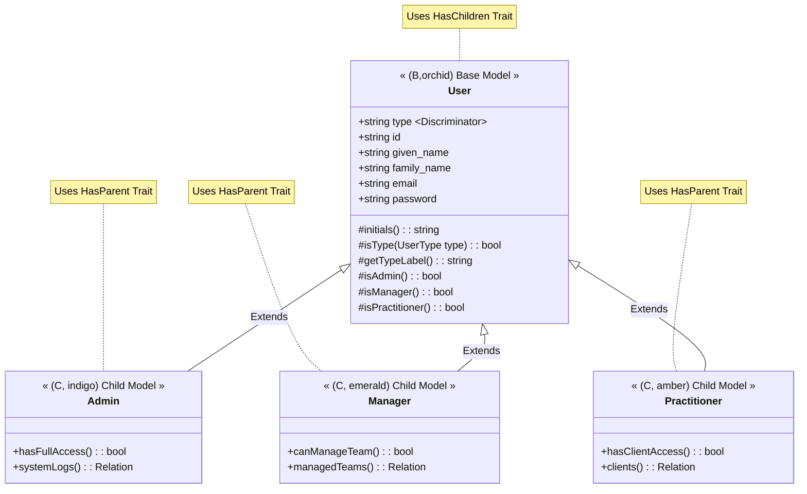

# Building Enhanced User Management with Single Table Inheritance in Laravel 12

--- START SECTION: Meta ---
<style>
:root {
  --primary-color: #4f46e5; /* Indigo */
  --secondary-color: #10b981; /* Emerald */
  --accent-color: #f59e0b; /* Amber */
  --warning-color: #ef4444; /* Red */
  --info-color: #3b82f6; /* Blue */
  --text-color: #1f2937; /* Gray 800 */
  --background-color: #ffffff; /* White */
  --code-background: #f3f4f6; /* Gray 100 */
  --border-color: #e5e7eb; /* Gray 200 */
  --heading-color: #111827; /* Gray 900 */
}

@media (prefers-color-scheme: dark) {
  :root {
    --primary-color: #6366f1; /* Indigo 500 */
    --secondary-color: #34d399; /* Emerald 400 */
    --accent-color: #fbbf24; /* Amber 400 */
    --warning-color: #f87171; /* Red 400 */
    --info-color: #60a5fa; /* Blue 400 */
    --text-color: #e5e7eb; /* Gray 200 */
    --background-color: #1f2937; /* Gray 800 */
    --code-background: #374151; /* Gray 700 */
    --border-color: #4b5563; /* Gray 600 */
    --heading-color: #f3f4f6; /* Gray 100 */
  }
}

h1, h2, h3, h4, h5, h6 {
  color: var(--heading-color);
  margin-top: 1.5em;
  margin-bottom: 0.5em;
}
h1 { border-bottom: 2px solid var(--border-color); padding-bottom: 0.3em; }
h2 { border-bottom: 1px solid var(--border-color); padding-bottom: 0.2em; }

body {
  color: var(--text-color);
  background-color: var(--background-color);
  font-family: sans-serif;
  line-height: 1.6;
}

code {
  background-color: var(--code-background);
  color: var(--primary-color);
  padding: 0.2em 0.4em;
  border-radius: 3px;
  font-family: monospace;
}
pre > code { color: inherit; } /* Reset color inside pre block */

pre {
  background-color: var(--code-background);
  color: var(--text-color);
  padding: 1em;
  border-radius: 8px;
  overflow-x: auto;
}

a {
  color: var(--info-color);
  text-decoration: none;
}
a:hover { text-decoration: underline; }

strong { color: var(--heading-color); }

ul, ol { margin-left: 1.5em; }

/* Custom Boxes */
.box {
  padding: 1em;
  margin: 1.5em 0;
  border-radius: 0 8px 8px 0;
  border-left-width: 4px;
  border-left-style: solid;
  background-color: var(--code-background);
}
.highlight-box { border-left-color: var(--primary-color); }
.info-box { border-left-color: var(--info-color); }
.warning-box { border-left-color: var(--warning-color); }
.tip-box { border-left-color: var(--secondary-color); }
.accent-box { border-left-color: var(--accent-color); }

/* Colored Text Spans */
.primary-text { color: var(--primary-color); }
.secondary-text { color: var(--secondary-color); }
.accent-text { color: var(--accent-color); }
.warning-text { color: var(--warning-color); }
.info-text { color: var(--info-color); }

/* Mermaid Diagram Styling */
.mermaid {
  background-color: var(--code-background);
  padding: 1em;
  border-radius: 8px;
  margin: 1em 0;
}

/* Progress Tracker Styling */
ul.progress-tracker { list-style: none; padding-left: 0; }
ul.progress-tracker li { margin-bottom: 0.5em; }
ul.progress-tracker li span { margin-right: 0.5em; font-weight: bold; }
ul.progress-tracker li span.done { color: var(--secondary-color); }
ul.progress-tracker li span.pending { color: var(--warning-color); }
ul.progress-tracker li span.next { color: var(--info-color); }

</style>
--- END SECTION: Meta ---

--- START SECTION: Introduction ---

## 0. Introduction

### 0.1. Welcome!

Hello and welcome! If you're reading this, you're likely a developer with some basic PHP knowledge, ready to dive deeper into building web applications with the latest version of one of the most popular PHP frameworks: **Laravel 12**. This tutorial is designed specifically for you – the **lone novice developer** embarking on adding a significant set of features to a web application.

Our goal is ambitious but achievable: we'll take a set of requirements for enhancing user management features (we'll call this **User Model Enhancements** or **UME**) and build it step-by-step using modern Laravel practices.

<div class="highlight-box">
A core focus of this revised tutorial is implementing **Single Table Inheritance (STI)** for the User model from the outset. This allows us to elegantly manage different user types (like <span class="primary-text">Admin</span>, <span class="secondary-text">Manager</span>, <span class="accent-text">Practitioner</span>, and regular <span class="info-text">User</span>) within a single `users` table, leveraging the powerful <span class="primary-text">tightenco/parental</span> package.
</div>

Beyond STI, we'll build detailed user profiles, avatars, teams, roles & permissions within those teams, security features like Two-Factor Authentication (2FA), and even real-time features like online presence indicators and basic chat!

**Key Changes in this Edition:**
*   Targets **Laravel 12**.
*   Implements **Single Table Inheritance** for the `User` model using `tightenco/parental` as a foundational element.
*   Uses **Livewire/Volt** with Single File Components (SFCs) as the **primary** user-facing frontend stack.
*   Includes dedicated sections showing alternative implementations for **FilamentPHP** (for admin interfaces), **Inertia.js with React**, and **Inertia.js with Vue** where UI is involved.
*   Utilizes **Tailwind CSS v4** (the default for Laravel 12 starter kits).
*   Starts with a minimal Laravel 12 installation and adds **Laravel Breeze** for basic auth scaffolding.
*   Adds **inline citations** with links to official documentation for package installations and configurations.
*   Includes a **Citation Appendix**.

### 0.2. What We'll Build

Based on a fictional Product Requirements Document (PRD) and an Implementation Plan, we will build the following features, integrating them into a standard Laravel 12 application:

1.  **Single Table Inheritance for Users:** Defining and managing different user types (`Admin`, `Manager`, `Practitioner`, `User`) within the `users` table using `tightenco/parental`.
2.  **Enhanced User Profiles:** Splitting names into components (given, family), managing avatars using a powerful media library package.
3.  **Teams & Hierarchy:** Creating teams, allowing users to belong to multiple teams, establishing parent-child relationships between teams (hierarchy).
4.  **Roles & Permissions:** Implementing fine-grained access control where users have specific roles (like 'Editor', 'Member') *within* specific teams, controlling what actions they can perform, managed via code and potentially a Filament admin panel. (Note: Admins/Managers defined via STI might have inherent global capabilities).
5.  **Security:** Adding Two-Factor Authentication (2FA) for enhanced login security.
6.  **Account Lifecycle:** Managing user account status (e.g., Pending Validation, Active, Suspended) using a robust State Machine pattern.
7.  **Real-time Features (Restricted):**
    *   **Presence:** Showing which users are online/offline, but *only* to members within the same top-level team.
    *   **Chat:** A basic real-time chat system, also restricted *only* to members within the same top-level team.
8.  **Supporting Features:** User impersonation (for admins), user settings (like locale/timezone), commenting (basic setup), search integration (Scout/Typesense), feature flags (Pennant), internationalization (multi-language support), data backups, and more.
9.  **Admin Interface (Filament):** Setting up Filament resources for managing Users (including type changes), Teams, Roles, and Permissions.

### 0.3. Learning Objectives

By the end of this tutorial, you will have:

*   Created a new Laravel 12 project.
*   Installed and configured Laravel Breeze for basic authentication.
*   Installed and configured FilamentPHP for admin interfaces.
*   Installed and configured `tightenco/parental` and implemented Single Table Inheritance for the User model.
*   Created and used PHP 8.1+ Enums for managing user types.
*   Installed and configured numerous essential first-party (Laravel) and third-party (especially Spatie) packages.
*   Understood and implemented core Laravel concepts: Routing, Controllers, Models (Eloquent ORM, STI), Migrations, Seeders, Factories, Middleware, Events, Listeners, Queues (Horizon), Service Container, Blade templating.
*   Applied important architectural patterns: Service Layer, State Machines, Enums, Single Table Inheritance.
*   Built database schemas using migrations, including the `type` column for STI.
*   Managed user authentication and authorization, including 2FA and team-based permissions, considering different user types.
*   Handled file uploads (avatars) effectively using `spatie/laravel-medialibrary`.
*   Implemented real-time features using WebSockets (Laravel Reverb & Echo).
*   Set up basic search functionality with Scout and Typesense.
*   Written basic tests (Unit, Feature, Browser) using PestPHP, including tests for STI functionality.
*   Gained experience building UI components with Livewire/Volt SFCs.
*   Created admin interfaces using FilamentPHP Resources, including managing user types.
*   Understood how to adapt UI implementations for Inertia/React and Inertia/Vue (provided as alternative sections).
*   Prepared your application for deployment.

Most importantly, you'll understand the **"why"** behind the code, not just the "how".

### 0.4. How to Use This Tutorial

This document is structured as a curriculum. Follow the steps sequentially within each Phase.

*   **Primary Path:** The main instructions assume you are building the user-facing UI with **Livewire/Volt**.
*   **Alternative UI Sections:** Where frontend implementation differs significantly, specific sections will be provided for:
    *   **FilamentPHP:** For building administrative interfaces to manage data.
    *   **Inertia/React:** For user-facing UI using React.
    *   **Inertia/Vue:** For user-facing UI using Vue.
    You can focus on the Livewire path and refer to the others, or attempt to implement one of the alternative stacks if you prefer.
*   **Read Carefully:** Pay attention to the explanations – they provide context and reasoning.
*   **Code Along:** Type the commands and code yourself rather than just copy-pasting (though full code is provided). This builds muscle memory.
*   **Verify Steps:** Use the "Verification" sections to ensure things are working as expected before moving on.
*   **Consult the Glossary & Appendix:** If you encounter an unfamiliar term, check the Glossary. Refer to the Appendix for links to official documentation cited throughout the tutorial.
*   **Experiment:** Don't be afraid to tinker! Try changing things slightly (after committing your working code with Git!) to see what happens. That's a great way to learn.
*   **Patience:** Learning takes time. If you get stuck, reread the relevant section, check the verification steps, or consult the official Laravel documentation (linked in the Appendix).

Let's get started!

--- END SECTION: Introduction ---

--- START SECTION: Prerequisites ---

## 1. Prerequisites: Setting Up Your Development Environment

Before we write a single line of Laravel 12 code, we need to make sure your computer is ready. Think of this like gathering your ingredients before cooking. Each tool has a specific purpose in building and running a modern web application.

### 1.1. Understanding the Tools

Here's a quick rundown of *what* we need and *why* for Laravel 12 development:

1.  **PHP (>= 8.2 Recommended):**
    *   **What:** The programming language Laravel is written in. Laravel 12 requires PHP 8.2 or higher. Version 8.2+ includes features like Enums, Readonly Properties, etc., that Laravel leverages (including for our `UserType` Enum).
    *   **Why:** Laravel *is* PHP. You need PHP installed to execute the framework and your application code. Higher versions bring performance improvements and new language features.
2.  **Composer:**
    *   **What:** A dependency manager for PHP. It's like npm for Node.js or pip for Python.
    *   **Why:** Laravel itself and many of the features we'll add (like STI via Parental, permission management, media handling, Filament) are external libraries called "packages". Composer downloads and manages these packages and their dependencies, ensuring everything works together. It reads instructions from a `composer.json` file.
3.  **Node.js and npm/yarn:**
    *   **What:** Node.js is a JavaScript runtime. npm and yarn are package managers for JavaScript.
    *   **Why:** Modern web applications use JavaScript for interactivity. Laravel uses Vite for compiling frontend assets (CSS, JS), which relies on Node.js. Even with Livewire (PHP-centric), you still need Node/npm/yarn for compiling Tailwind CSS and base JavaScript.
4.  **Database (PostgreSQL Recommended):**
    *   **What:** A system for storing your application's data persistently (users, teams, messages, etc.). PostgreSQL and MySQL are common choices compatible with Laravel.
    *   **Why:** Most web applications need to store data. We need a database server running so Laravel can connect to it and save/retrieve information using Eloquent. PostgreSQL is often favoured for its robustness and advanced features, but MySQL works fine too. SQLite can be used for local development/testing (`DB_CONNECTION=sqlite` and `DB_DATABASE=/path/to/database.sqlite` or `:memory:` for tests).
5.  **Git:**
    *   **What:** A version control system.
    *   **Why:** Absolutely essential for tracking changes to your code. Allows saving snapshots (commits), reverting, collaborating, and managing features (branches). We'll commit after each major milestone.
6.  **Code Editor (VS Code Recommended):**
    *   **What:** A text editor designed for writing code.
    *   **Why:** You need a tool to write PHP, JavaScript, CSS, etc. Provides syntax highlighting, code completion, error checking, and tool integration (Git, terminals). VS Code is very popular in the Laravel community with excellent extensions.
7.  **Optional: Redis:**
    *   **What:** An in-memory data structure store, often used as a cache, session driver, and queue broker.
    *   **Why:** For better performance, we'll configure Laravel to use Redis for caching, sessions, and background jobs (queues via Horizon). Laravel can fall back to other drivers (file, database), but Redis is generally faster. Reverb also benefits from Redis for horizontal scaling (though not strictly required for basic use).
8.  **Optional: Typesense:**
    *   **What:** An open-source search engine.
    *   **Why:** We'll implement fast, typo-tolerant search using Laravel Scout and Typesense. Requires a running Typesense server. If skipped, search features won't work.
9.  **Optional: Docker:**
    *   **What:** A platform for containerizing applications.
    *   **Why:** Simplifies setting up a consistent development environment (PHP, DB, Redis, etc.) regardless of your OS. Laravel Sail (`php artisan sail:install` [Official Documentation](https://laravel.com/docs/11.x/sail#installation)) provides a simple Docker environment for Laravel. While not strictly required (we assume local installs), it's valuable.

### 1.2. Installation Steps

Installation varies by OS (Windows, macOS, Linux).

*   **Recommendation:** For the easiest start, especially on macOS or Windows, consider **Laravel Herd** ([https://herd.laravel.com/](https://herd.laravel.com/) [Official Website](https://herd.laravel.com/)). It bundles PHP, Nginx/Caddy, Node.js, Composer, and manages services locally with minimal fuss.
*   **Alternative (Docker):** Use **Laravel Sail**. After creating your project (Step 3.1), run `php artisan sail:install` [Official Documentation](https://laravel.com/docs/11.x/sail#installation) and follow prompts. Then run commands via `./vendor/bin/sail <command>` (e.g., `./vendor/bin/sail up`, `./vendor/bin/sail artisan migrate`).
*   **Manual Installation:** Consult official documentation:
    *   PHP: [https://www.php.net/manual/en/install.php](https://www.php.net/manual/en/install.php) [Official Documentation](https://www.php.net/manual/en/install.php) (Ensure required extensions like `pdo_pgsql` or `pdo_mysql`, `redis`, `gd`, `mbstring`, `xml`, `curl`, `bcmath` are enabled). Check Laravel 12 server requirements [Official Documentation](https://laravel.com/docs/11.x/deployment#server-requirements).
    *   Composer: [https://getcomposer.org/download/](https://getcomposer.org/download/) [Official Documentation](https://getcomposer.org/download/)
    *   Node.js: [https://nodejs.org/](https://nodejs.org/) [Official Documentation](https://nodejs.org/) (LTS version recommended)
    *   PostgreSQL: [https://www.postgresql.org/download/](https://www.postgresql.org/download/) [Official Documentation](https://www.postgresql.org/download/)
    *   MySQL: [https://dev.mysql.com/downloads/](https://dev.mysql.com/downloads/) [Official Documentation](https://dev.mysql.com/downloads/)
    *   Git: [https://git-scm.com/downloads](https://git-scm.com/downloads) [Official Documentation](https://git-scm.com/downloads)
    *   VS Code: [https://code.visualstudio.com/](https://code.visualstudio.com/) [Official Documentation](https://code.visualstudio.com/)
    *   Redis: [https://redis.io/docs/getting-started/installation/](https://redis.io/docs/getting-started/installation/) [Official Documentation](https://redis.io/docs/getting-started/installation/)
    *   Typesense: [https://typesense.org/docs/guide/install-typesense.html](https://typesense.org/docs/guide/install-typesense.html) [Official Documentation](https://typesense.org/docs/guide/install-typesense.html)

#### 1.2.1. PHP (>= 8.2 Recommended)

Follow OS-specific guides or use Herd/Sail. Verify version `php -v`. Ensure necessary extensions are enabled (check `php -m`). Laravel 12 requires PHP >= 8.2 [Official Documentation](https://laravel.com/docs/11.x/deployment#server-requirements).

#### 1.2.2. Composer

Install globally following instructions on [getcomposer.org](https://getcomposer.org/) [Official Documentation](https://getcomposer.org/download/). Verify with `composer -V`.

#### 1.2.3. Node.js and npm/yarn

Install LTS version from [nodejs.org](https://nodejs.org/) [Official Documentation](https://nodejs.org/). Includes npm. Verify `node -v` and `npm -v`.

#### 1.2.4. Database (PostgreSQL Recommended)

Install PostgreSQL server (or MySQL). Create a new, empty database (e.g., `ume_app_db`). Note the connection details (host, port, dbname, username, password). Ensure the server is running.

#### 1.2.5. Git

Install from [git-scm.com](https://git-scm.com/) [Official Documentation](https://git-scm.com/downloads). Verify `git --version`. Configure your identity:
```bash
git config --global user.name "Your Name"
git config --global user.email "your.email@example.com"
```

#### 1.2.6. Code Editor (VS Code Recommended)

Download and install from [code.visualstudio.com](https://code.visualstudio.com/) [Official Documentation](https://code.visualstudio.com/). Recommended extensions:
*   **PHP Intelephense** or **PHP IntelliSense (Crane)**
*   **Laravel Extension Pack** (includes Blade, Snippets, etc.)
*   **Tailwind CSS IntelliSense** (Essential for Tailwind v4)
*   **DotENV**
*   **EditorConfig for VS Code**
*   **Prettier - Code formatter** (Configure for JS/CSS)
*   **Material Icon Theme** (or similar)
*   **Pest Plugin** (if using Pest)
*   **Filament IDEA** (if using Filament - provides autocompletion)

#### 1.2.7. Optional: Redis

Install Redis server (`redis-server`) and CLI (`redis-cli`) [Official Documentation](https://redis.io/docs/getting-started/installation/). Ensure it's running. Verify `redis-cli --version`.

#### 1.2.8. Optional: Typesense

Install Typesense server [Official Documentation](https://typesense.org/docs/guide/install-typesense.html). Ensure it's running. Note the API key. Verify installation as per Typesense docs.

#### 1.2.9. Optional: Docker

Install Docker Desktop ([https://www.docker.com/products/docker-desktop/](https://www.docker.com/products/docker-desktop/) [Official Documentation](https://www.docker.com/products/docker-desktop/)) if planning to use Sail.

#### 1.2.10. Verification

<div class="warning-box">
<strong>Crucially, ensure these commands work in your terminal *before* proceeding:</strong>
</div>

```bash
php -v # Should be 8.2 or higher
composer -V
node -v
npm -v # or yarn -v
git --version
# psql --version # (If using PostgreSQL)
# mysql --version # (If using MySQL)
# redis-cli --version # (If using Redis)
# typesense-server --version # (If using Typesense, command might vary)
```

With your tools ready, let's look at the roadmap.

--- END SECTION: Prerequisites ---

--- START SECTION: Progress Tracker ---

## 2. Progress Tracker: Our Journey

We'll build the UME features in phases, broken down into smaller, manageable milestones. Mark these off as you complete them!

*(Note: [UI] indicates sections with specific framework implementations)*

<ul class="progress-tracker">
<li><span class="done">[✅]</span> <strong>Phase 0: Laying the Foundation</strong>
    <ul>
    <li><span class="done">[✅]</span> <strong>0.1:</strong> Create Laravel 12 Project (using interactive installer, select <strong>Livewire Starter Kit</strong> + Volt + Pest)</li>
    <li><span class="done">[✅]</span> <strong>0.2:</strong> Configure Environment (`.env` Setup)</li>
    <li><span class="done">[✅]</span> <strong>0.3:</strong> Install FilamentPHP</li>
    <li><span class="done">[✅]</span> <strong>0.4:</strong> Install Core Backend Packages (Incl. Parental, Spatie, etc.)</li>
    <li><span class="done">[✅]</span> <strong>0.5:</strong> Publish Configurations & Run Initial Migrations</li>
    <li><span class="done">[✅]</span> <strong>0.6:</strong> Configuring Laravel Pulse Access</li>
    <li><span class="pending">[❌]</span> <strong>0.7:</strong> First Git Commit</li>
    </ul>
</li>
<li><span class="next">[ ]</span> <strong>Phase 1: Building the Core Models & Architecture (with STI)</strong>
    <ul>
    <li><span class="next">[ ]</span> <strong>1.1:</strong> Understanding Single Table Inheritance (STI) & Parental</li>
    <li><span class="next">[ ]</span> <strong>1.2:</strong> Creating the `UserType` Enum</li>
    <li><span class="next">[ ]</span> <strong>1.3:</strong> Understanding Traits & Model Events</li>
    <li><span class="next">[ ]</span> <strong>1.4:</strong> Create `HasUlid` Trait</li>
    <li><span class="next">[ ]</span> <strong>1.5:</strong> Create `HasUserTracking` Trait</li>
    <li><span class="next">[ ]</span> <strong>1.6:</strong> Understanding Database Migrations</li>
    <li><span class="next">[ ]</span> <strong>1.7:</strong> Enhance `users` Table Migration (Add `type`, Name Components, State, etc.)</li>
    <li><span class="next">[ ]</span> <strong>1.8:</strong> Understanding Eloquent Models & Relationships</li>
    <li><span class="next">[ ]</span> <strong>1.9:</strong> Update `User` Model (Apply `HasChildren`, Traits, Casts, Relationships, Name Accessor)</li>
    <li><span class="next">[ ]</span> <strong>1.10:</strong> Create Child Models (`Admin`, `Manager`, `Practitioner` with `HasParent`)</li>
    <li><span class="next">[ ]</span> <strong>1.11:</strong> Create `Team` Model & Migration</li>
    <li><span class="next">[ ]</span> <strong>1.12:</strong> Create `team_user` Pivot Table Migration</li>
    <li><span class="next">[ ]</span> <strong>1.13:</strong> Understanding Factories & Seeders</li>
    <li><span class="next">[ ]</span> <strong>1.14:</strong> Update `UserFactory` (Handle `type`, Add State Methods)</li>
    <li><span class="next">[ ]</span> <strong>1.15:</strong> Create Child Model Factories (`AdminFactory`, etc.)</li>
    <li><span class="next">[ ]</span> <strong>1.16:</strong> Create `UserSeeder` & `TeamSeeder` (Seed different user types)</li>
    <li><span class="next">[ ]</span> <strong>1.17:</strong> Update `DatabaseSeeder`</li>
    <li><span class="next">[ ]</span> <strong>1.18:</strong> Understanding The Service Layer</li>
    <li><span class="next">[ ]</span> <strong>1.19:</strong> Create `BaseService`</li>
    <li><span class="next">[ ]</span> <strong>1.20:</strong> Initial Filament Resource Setup (User with Type Management & Team)</li>
    <li><span class="next">[ ]</span> <strong>1.21:</strong> Phase 1 Git Commit</li>
    </ul>
</li>
<li><span class="next">[ ]</span> <strong>Phase 2: Authentication, Profile Basics & State Machine</strong>
    <ul>
    <li><span class="next">[ ]</span> <strong>2.1:</strong> Understanding Fortify & Authentication</li>
    <li><span class="next">[ ]</span> <strong>2.2:</strong> Configure Fortify Features</li>
    <li><span class="next">[ ]</span> <strong>2.3:</strong> Understanding Enums & State Machines</li>
    <li><span class="next">[ ]</span> <strong>2.4:</strong> Define `AccountStatus` Enum</li>
    <li><span class="next">[ ]</span> <strong>2.5:</strong> Create Account State Machine Classes</li>
    <li><span class="next">[ ]</span> <strong>2.6:</strong> Understanding Email Verification Flow</li>
    <li><span class="next">[ ]</span> <strong>2.7:</strong> Integrate State Machine with Email Verification</li>
    <li><span class="next">[ ]</span> <strong>2.8:</strong> Understanding Two-Factor Authentication (2FA - Fortify Backend)</li>
    <li><span class="next">[ ]</span> <strong>2.9:</strong> Implement 2FA UI [UI] (Livewire/Volt, Filament, Conceptual React/Vue)</li>
    <li><span class="next">[ ]</span> <strong>2.10:</strong> Implement Profile Information UI [UI] (Livewire/Volt, Filament, Conceptual React/Vue)</li>
    <li><span class="next">[ ]</span> <strong>2.11:</strong> Understanding File Uploads & `spatie/laravel-medialibrary`</li>
    <li><span class="next">[ ]</span> <strong>2.12:</strong> Implement Avatar Upload Backend</li>
    <li><span class="next">[ ]</span> <strong>2.13:</strong> Implement Avatar Upload UI [UI] (Livewire/Volt, Filament, Conceptual React/Vue)</li>
    <li><span class="next">[ ]</span> <strong>2.14:</strong> Understanding Dependency Injection & Service Providers</li>
    <li><span class="next">[ ]</span> <strong>2.15:</strong> Create `UserService` (Handles Creation Logic)</li>
    <li><span class="next">[ ]</span> <strong>2.16:</strong> Create `UserTypeService` & `UserTypeChanged` Event</li>
    <li><span class="next">[ ]</span> <strong>2.17:</strong> Customize Fortify's User Creation (Use Services, Set Default Type)</li>
    <li><span class="next">[ ]</span> <strong>2.18:</strong> Understanding Events & Listeners</li>
    <li><span class="next">[ ]</span> <strong>2.19:</strong> Define Initial Events & Listeners (Incl. Type Change)</li>
    <li><span class="next">[ ]</span> <strong>2.20:</strong> Register Events & Listeners</li>
    <li><span class="next">[ ]</span> <strong>2.21:</strong> Phase 2 Git Commit</li>
    </ul>
</li>
<li><span class="next">[ ]</span> <strong>Phase 3: Implementing Teams and Permissions</strong>
    <ul>
    <li><span class="next">[ ]</span> <strong>3.1:</strong> Understanding `spatie/laravel-permission` & Team Scoping</li>
    <li><span class="next">[ ]</span> <strong>3.2:</strong> Configure `spatie/laravel-permission` for Teams</li>
    <li><span class="next">[ ]</span> <strong>3.3:</strong> Create `PermissionSeeder` (Assign Roles based on Team/User Type)</li>
    <li><span class="next">[ ]</span> <strong>3.4:</strong> Create `TeamService`</li>
    <li><span class="next">[ ]</span> <strong>3.5:</strong> Understanding Resource Controllers & Authorization (Policies)</li>
    <li><span class="next">[ ]</span> <strong>3.6:</strong> Set up Team Management Backend (Routes, Controllers, Policy - Consider User Types)</li>
    <li><span class="next">[ ]</span> <strong>3.7:</strong> Implement Team Management UI [UI] (Livewire/Volt, Filament, Conceptual React/Vue)</li>
    <li><span class="next">[ ]</span> <strong>3.8:</strong> Understanding Middleware</li>
    <li><span class="next">[ ]</span> <strong>3.9:</strong> Create Optional `EnsureUserHasTeamRole` Middleware</li>
    <li><span class="next">[ ]</span> <strong>3.10:</strong> Phase 3 Git Commit</li>
    </ul>
</li>
<li><span class="next">[ ]</span> <strong>Phase 4: Real-time Foundation & Activity Logging</strong>
    <ul>
    <li><span class="next">[ ]</span> <strong>4.1:</strong> Understanding WebSockets, Reverb & Echo</li>
    <li><span class="next">[ ]</span> <strong>4.2:</strong> Set Up Laravel Reverb</li>
    <li><span class="next">[ ]</span> <strong>4.3:</strong> Configure Laravel Echo (Backend & Frontend)</li>
    <li><span class="next">[ ]</span> <strong>4.4:</strong> Implement Presence Status Backend (Enum, Migration, Cast)</li>
    <li><span class="next">[ ]</span> <strong>4.5:</strong> Create `PresenceChanged` Broadcast Event</li>
    <li><span class="next">[ ]</span> <strong>4.6:</strong> Create Login/Logout Presence Listeners</li>
    <li><span class="next">[ ]</span> <strong>4.7:</strong> Understanding Contextual Activity Logging</li>
    <li><span class="next">[ ]</span> <strong>4.8:</strong> Implement Activity Logging via Listeners</li>
    <li><span class="next">[ ]</span> <strong>4.9:</strong> Phase 4 Git Commit</li>
    </ul>
</li>
<li><span class="next">[ ]</span> <strong>Phase 5: Advanced Features & Real-time Implementation</strong>
    <ul>
    <li><span class="next">[ ]</span> <strong>5.1:</strong> Implement Impersonation Feature [UI] (Consider permissions based on Admin type)</li>
    <li><span class="next">[ ]</span> <strong>5.2:</strong> Implement Comments Feature [UI]</li>
    <li><span class="next">[ ]</span> <strong>5.3:</strong> Implement User Settings Feature [UI]</li>
    <li><span class="next">[ ]</span> <strong>5.4:</strong> Understanding Full-Text Search (Scout & Typesense)</li>
    <li><span class="next">[ ]</span> <strong>5.5:</strong> Implement Search Backend (Scout Config, Model Setup, Indexing - Works with Base User)</li>
    <li><span class="next">[ ]</span> <strong>5.6:</strong> Implement Search Frontend [UI]</li>
    <li><span class="next">[ ]</span> <strong>5.7:</strong> Understanding Broadcasting Channels & Authorization</li>
    <li><span class="next">[ ]</span> <strong>5.8:</strong> Define Broadcast Channel Authorizations (`channels.php`)</li>
    <li><span class="next">[ ]</span> <strong>5.9:</strong> Implement Real-time Presence UI [UI]</li>
    <li><span class="next">[ ]</span> <strong>5.10:</strong> Implement Real-time Chat Backend (Model, Service, API, Event)</li>
    <li><span class="next">[ ]</span> <strong>5.11:</strong> Implement Real-time Chat UI [UI]</li>
    <li><span class="next">[ ]</span> <strong>5.12:</strong> Understanding API Authentication (Passport & Sanctum)</li>
    <li><span class="next">[ ]</span> <strong>5.13:</strong> Configure API Authentication Guards</li>
    <li><span class="next">[ ]</span> <strong>5.14:</strong> Set Up Passport Routes</li>
    <li><span class="next">[ ]</span> <strong>5.15:</strong> Implement Filament User Type Change Action</li>
    <li><span class="next">[ ]</span> <strong>5.16:</strong> Phase 5 Git Commit</li>
    </ul>
</li>
<li><span class="next">[ ]</span> <strong>Phase 6: Polishing, Testing & Deployment</strong>
    <ul>
    <li><span class="next">[ ]</span> <strong>6.1:</strong> Understanding Internationalization (i18n)</li>
    <li><span class="next">[ ]</span> <strong>6.2:</strong> Implement i18n (Backend)</li>
    <li><span class="next">[ ]</span> <strong>6.3:</strong> Implement Locale Switching [UI]</li>
    <li><span class="next">[ ]</span> <strong>6.4:</strong> Understanding Feature Flags (Pennant)</li>
    <li><span class="next">[ ]</span> <strong>6.5:</strong> Implement Feature Flags</li>
    <li><span class="next">[ ]</span> <strong>6.6:</strong> Understanding Testing (Unit, Feature, Browser - PestPHP)</li>
    <li><span class="next">[ ]</span> <strong>6.7:</strong> Writing Tests (Examples - PestPHP, Filament - Include STI Tests)</li>
    <li><span class="next">[ ]</span> <strong>6.8:</strong> Understanding Performance Optimization (STI Considerations)</li>
    <li><span class="next">[ ]</span> <strong>6.9:</strong> Apply Performance Considerations</li>
    <li><span class="next">[ ]</span> <strong>6.10:</strong> Write Documentation (README, PHPDoc)</li>
    <li><span class="next">[ ]</span> <strong>6.11:</strong> Set Up Data Backups (`spatie/laravel-backup`)</li>
    <li><span class="next">[ ]</span> <strong>6.12:</strong> Understanding Deployment</li>
    <li><span class="next">[ ]</span> <strong>6.13:</strong> Prepare for Deployment</li>
    <li><span class="next">[ ]</span> <strong>6.14:</strong> Final Git Commit</li>
    </ul>
</li>
</ul>

--- END SECTION: Progress Tracker ---

--- START SECTION: Phase 0: Laying the Foundation (Project Setup) ---

## 3. Phase 0: Laying the Foundation (Project Setup)

**Goal:** Create a new Laravel 12 application using the built-in **Livewire Starter Kit**, install FilamentPHP for the admin panel, install necessary third-party packages (including `tightenco/parental` for STI), and set up initial configurations and database migrations.

Think of this phase as establishing the core project, complete with basic authentication and admin capabilities, before adding our custom enhancements like STI.

**(Conceptual Note: SPA vs. MPA and Our Choice)**

Before we begin, let's briefly touch on application architecture.

*   **MPA (Multi-Page Application):** The traditional web model. Each significant user action triggers a full page request. Standard Laravel with Blade views works this way. Simple, robust, SEO-friendly.
*   **SPA (Single-Page Application):** Loads an application shell initially. Subsequent interactions use JavaScript to dynamically update parts of the page by fetching data from a backend API (React, Vue, Angular). Faster, app-like feel.
*   **Livewire:** Offers a middle ground. Build dynamic interfaces like SPAs using mostly PHP/Blade. Updates only necessary DOM parts via AJAX. Feels closer to traditional Laravel development.
*   **Inertia.js:** Facilitates building true SPAs with Laravel. Use familiar backend routing/controllers, returning Inertia responses loading specific JS components (React/Vue).

**Our Approach:**

*   **Primary User Interface:** **Livewire** (with Volt SFCs) for main user-facing parts (profile, teams, chat).
*   **Admin Interface:** **FilamentPHP**, a TALL stack admin panel framework.
*   **Alternative UI Sections:** Conceptual implementations for **Inertia/React** and **Inertia/Vue**.

### 3.1. Milestone 0.1: Creating the Laravel 12 Project (with Livewire Starter Kit)

We'll use the `laravel new` command and select the built-in Livewire starter kit during the interactive setup. This provides our base Laravel 12 application *including* authentication scaffolding powered by Fortify and Livewire/Volt.

*   **Action:** Open your terminal, navigate to your desired projects directory, and run:

```bash
    # Ensure your Laravel Installer is up-to-date
    composer global update laravel/installer # [Official Documentation](https://laravel.com/docs/11.x/installation#installing-laravel)

    # Create the new project
    laravel new ume-app # [Official Documentation](https://laravel.com/docs/11.x/installation#creating-a-laravel-project)
```

*   **Interactive Prompts:** The installer will ask several questions. Choose the following:
    *   `Which starter kit would you like to install?` -> **`Livewire`** [Official Documentation](https://laravel.com/docs/11.x/starter-kits#laravel-breeze)
    *   `Would you like any additional starter kit features?` -> Select **`Volt`** (Use arrow keys and spacebar to select, Enter to confirm). You can also select `Dark mode` if desired. [Official Documentation](https://livewire.laravel.com/docs/volt)
    *   `Which testing framework do you prefer?` -> **`Pest`** [Official Documentation](https://laravel.com/docs/11.x/testing#installation)
    *   `Would you like to initialize a Git repository?` -> **`Yes`**
    *   `Which database will your application use?` -> Choose **`PostgreSQL`** (or `MySQL` if you prefer). Provide database name (e.g., `ume_app_db`).
    *   The installer will then create the project, install Composer dependencies, configure the starter kit, install NPM dependencies, build assets, and initialize Git.

*   **Action:** Navigate into the new directory:

```bash
    cd ume-app
```

*   **What it Does:**
    *   Creates a full Laravel 12 project structure.
    *   Installs and configures the Livewire starter kit [Official Documentation](https://laravel.com/docs/11.x/starter-kits#breeze-and-livewire), which includes:
        *   Laravel Fortify [Official Documentation](https://laravel.com/docs/11.x/fortify) for backend authentication logic.
        *   Routes, Controllers, and Livewire/Volt components for login, registration, password reset, email verification, and basic profile management.
        *   Tailwind CSS v4 setup via Vite [Official Documentation](https://laravel.com/docs/11.x/vite).
        *   Livewire [Official Documentation](https://livewire.laravel.com/docs/installation) and Volt [Official Documentation](https://livewire.laravel.com/docs/volt) packages.
    *   Configures PestPHP for testing [Official Documentation](https://pestphp.com/docs/installation).
    *   Initializes a Git repository.
    *   Installs Composer and NPM dependencies.
    *   Builds initial frontend assets.
    *   Sets basic `.env` variables (like DB connection based on your choice).

*   **Why:** This single command provides a complete, functional Laravel 12 application with a secure authentication system and our chosen primary UI stack (Livewire/Volt) ready to go.

*   **Verification:**
    1.  `ume-app` directory exists and contains Laravel project files.
    2.  Run `git status` - should show a clean working directory after the initial commits made by the installer.
    3.  Check `composer.json` includes `laravel/fortify`, `livewire/livewire`, `livewire/volt`.
    4.  Check `package.json` includes Tailwind v4 (`@tailwindcss/vite` or similar), Alpine.js.
    5.  Check `routes/web.php` includes `auth.php`. Check `routes/auth.php` exists.
    6.  Check `resources/views/` contains `auth/`, `profile/`, `layouts/`, `livewire/` directories with Blade/Volt files.

### 3.2. Milestone 0.2: Configuring the Environment (`.env` Setup)

The installer sets up some `.env` variables, but we need to verify and add others.

*   **Action 1:** Open the `.env` file created by the installer.
*   **Action 2:** Verify/Update/Add variables. [Official Documentation](https://laravel.com/docs/11.x/configuration#environment-configuration)

*   **File (`.env` - Verify/Add/Update):**

```dotenv
    APP_NAME="UME App (STI)"
    APP_ENV=local
    APP_KEY=base64:... # Should already be generated
    APP_DEBUG=true
    APP_URL=http://ume-app.test # IMPORTANT: Set this correctly!

    LOG_CHANNEL=stack
    LOG_LEVEL=debug

    # --- Database ---
    # Verify these match your local setup AND the choices during `laravel new`
    DB_CONNECTION=pgsql # Or mysql
    DB_HOST=127.0.0.1
    DB_PORT=5432 # Or 3306 for MySQL
    DB_DATABASE=ume_app_db # Should match your choice/creation
    DB_USERNAME=sail # Your DB user
    DB_PASSWORD=password # Your DB password

    # --- Broadcasting, Cache, Queue, Session ---
    # Add these if missing, ensure values are correct
    BROADCAST_DRIVER=reverb # Use 'log' or 'null' initially if Reverb not setup [Doc: https://laravel.com/docs/11.x/broadcasting#driver-prerequisites]
    CACHE_DRIVER=redis # Use 'file' if no Redis [Doc: https://laravel.com/docs/11.x/cache#configuration]
    QUEUE_CONNECTION=redis # Use 'sync' if no Redis/Horizon setup yet [Doc: https://laravel.com/docs/11.x/queues#configuration]
    SESSION_DRIVER=redis # Use 'file' if no Redis [Doc: https://laravel.com/docs/11.x/session#configuration]
    SESSION_LIFETIME=120

    # --- Redis (Add if using redis driver) --- [Doc: https://laravel.com/docs/11.x/redis#configuration]
    REDIS_HOST=127.0.0.1
    REDIS_PASSWORD=null
    REDIS_PORT=6379
    REDIS_CLIENT=phpredis # Default in L12

    # --- Reverb (Add these, generate random secrets) --- [Doc: https://laravel.com/docs/11.x/reverb#configuration]
    REVERB_APP_ID=your_reverb_app_id_placeholder
    REVERB_APP_KEY=your_reverb_app_key_placeholder
    REVERB_SECRET=your_reverb_app_secret_placeholder
    REVERB_HOST="localhost"
    REVERB_PORT=8080
    REVERB_SCHEME=http
    # Add corresponding VITE_ vars for frontend JS [Doc: https://laravel.com/docs/11.x/reverb#client-configuration]
    VITE_REVERB_APP_KEY="${REVERB_APP_KEY}"
    VITE_REVERB_HOST="${REVERB_HOST}"
    VITE_REVERB_PORT="${REVERB_PORT}"
    VITE_REVERB_SCHEME="${REVERB_SCHEME}"

    # --- Mail (Verify/Add) --- [Doc: https://laravel.com/docs/11.x/mail#configuration]
    MAIL_MAILER=log # Or smtp, mailtrap, etc.
    MAIL_HOST=127.0.0.1 # Or smtp server
    MAIL_PORT=1025 # Or smtp port
    MAIL_USERNAME=null
    MAIL_PASSWORD=null
    MAIL_ENCRYPTION=null
    MAIL_FROM_ADDRESS="hello@example.com"
    MAIL_FROM_NAME="${APP_NAME}"

    # --- Third-Party Services (Add these) ---
    # Scout/Typesense [Doc: https://laravel.com/docs/11.x/scout#configuration]
    SCOUT_DRIVER=typesense # Use 'null' initially if not using search yet
    SCOUT_QUEUE=true
    TYPESENSE_HOST=localhost
    TYPESENSE_PORT=8108
    TYPESENSE_PROTOCOL=http
    TYPESENSE_API_KEY=your_typesense_api_key_placeholder
    TYPESENSE_COLLECTION_PREFIX=ume_
```

*   **Why:** Ensures the application connects correctly to the database, cache, queues, real-time server, mail driver, and search engine based on your local development setup. `APP_URL` is crucial for generating correct links.
*   **Verification:**
    1.  `.env` file is updated.
    2.  Crucially, `DB_DATABASE`, `DB_USERNAME`, `DB_PASSWORD` match your actual database setup.
    3.  `APP_URL` matches how you access the site locally.

### 3.3. Milestone 0.3: Installing FilamentPHP

Now, add the Filament admin panel framework.

*   **Action:** Install Filament via Composer and run its installer.

```bash
    # Install Filament package
    composer require filament/filament:"^3.3" -W # [Official Documentation](https://filamentphp.com/docs/3.x/panels/installation)

    # Run the installer
    php artisan filament:install --panels # [Official Documentation](https://filamentphp.com/docs/3.x/panels/installation#installing-a-new-panel)
```
    *   Follow prompts: Agree to star the repo (optional), create Filament admin user (say **Yes**), enter admin name, email (use a distinct one like `filament@example.com` or your main admin email), and password.

*   **What it Does:** Installs Filament packages, sets up config/provider [Official Documentation](https://filamentphp.com/docs/3.x/panels/installation#creating-a-panel), publishes assets, creates initial admin user in `users` table, creates `app/Filament/Resources/UserResource.php`.
*   **Why:** Adds the admin panel foundation.
*   **Verification:**
    1.  Commands succeed.
    2.  Visit `/admin`. See Filament login.
    3.  Log in with the Filament user created. See dashboard.
    4.  Check `app/Filament/` directory and `app/Providers/Filament/AdminPanelProvider.php`.
    5.  Check `users` table for the newly created Filament admin user.

### 3.4. Milestone 0.4: Installing Core Backend Packages

Install the other essential backend packages needed for UME features, including the crucial `tightenco/parental` for 
STI.

*   **Action:** Run `composer require` commands.

```bash
    # --- STI Package ---
    composer require tightenco/parental # [Official Documentation](https://github.com/tightenco/parental?tab=readme-ov-file#installation)

    # --- Core Laravel & Utility Packages ---
    composer require laravel/passport # [Official Documentation](https://laravel.com/docs/11.x/passport#installation)
    composer require laravel/reverb # [Official Documentation](https://laravel.com/docs/11.x/reverb#installation)
    composer require laravel/pennant # [Official Documentation](https://laravel.com/docs/11.x/pennant#installation)
    composer require laravel/horizon # [Official Documentation](https://laravel.com/docs/11.x/horizon#installation)
    composer require laravel/pulse # [Official Documentation](https://laravel.com/docs/11.x/pulse#installation)
    composer require laravel/telescope --dev # [Official Documentation](https://laravel.com/docs/11.x/telescope#installation)
    composer require laravel/scout # [Official Documentation](https://laravel.com/docs/11.x/scout#installation)
    composer require typesense/typesense-php # [Official Documentation - Typesense Adapter](https://github.com/typesense/typesense-php)

    # --- Spatie Packages ---
    composer require spatie/laravel-permission # [Official Documentation](https://spatie.be/docs/laravel-permission/v6/installation-laravel)
    composer require spatie/laravel-medialibrary # [Official Documentation](https://spatie.be/docs/laravel-medialibrary/v11/installation-setup)
    composer require spatie/laravel-activitylog # [Official Documentation](https://spatie.be/docs/laravel-activitylog/v4/installation-and-setup)
    composer require spatie/laravel-model-states # [Official Documentation](https://spatie.be/docs/laravel-model-states/v2/installation-setup)
    composer require spatie/laravel-sluggable # [Official Documentation](https://spatie.be/docs/laravel-sluggable/v3/installation-and-setup)
    composer require spatie/laravel-tags # [Official Documentation](https://spatie.be/docs/laravel-tags/v4/installation--setup)
    composer require spatie/laravel-translatable # [Official Documentation](https://spatie.be/docs/laravel-translatable/v6/installation-setup)
    composer require spatie/laravel-translation-loader # [Official Documentation](https://spatie.be/docs/laravel-translation-loader/v3/installation-and-setup)
    composer require spatie/laravel-settings # [Official Documentation](https://spatie.be/docs/laravel-settings/v3/installation-setup)
    composer require spatie/laravel-comments # [Official Documentation](https://spatie.be/docs/laravel-comments/v1/installation-setup)
    composer require spatie/laravel-comments-livewire # [Official Documentation](https://spatie.be/docs/laravel-comments/v2/livewire-components/installation)
    composer require spatie/laravel-backup # [Official Documentation](https://spatie.be/docs/laravel-backup/v8/installation-and-setup)

    # --- Other Utility Packages ---
    composer require lab404/laravel-impersonate # [Official Documentation](https://github.com/lab404/laravel-impersonate?tab=readme-ov-file#installation)
    composer require laravel/socialite # [Official Documentation](https://laravel.com/docs/11.x/socialite#installation)
    composer require doctrine/dbal # [Required by Laravel for schema modifications](https://laravel.com/docs/11.x/migrations#modifying-columns)
```

*   **Verification:** Commands succeed. `composer.json` updated. `vendor/` directory populated.

### 3.5. Milestone 0.5: Publishing Configurations & Initial Migrations

Publish package assets and run all migrations (Laravel defaults, Starter Kit additions, Filament, Pulse, other packages).

*   **Action 1:** Publish necessary files.

```bash
    # Publish config/migration/other files for specific packages
    php artisan vendor:publish --provider="Spatie\Permission\PermissionServiceProvider" # [Official Documentation](https://spatie.be/docs/laravel-permission/v6/installation-laravel#publishing-the-configuration-file)
    php artisan vendor:publish --provider="Spatie\MediaLibrary\MediaLibraryServiceProvider" # [Official Documentation](https://spatie.be/docs/laravel-medialibrary/v11/installation-setup#publishing-the-config-file)
    php artisan vendor:publish --provider="Spatie\Activitylog\ActivitylogServiceProvider" # [Official Documentation](https://spatie.be/docs/laravel-activitylog/v4/installation-and-setup#publishing-the-config-file)
    php artisan vendor:publish --provider="Spatie\Sluggable\SluggableServiceProvider" # [Official Documentation](https://spatie.be/docs/laravel-sluggable/v3/installation-and-setup#publishing-config-file-optional)
    php artisan vendor:publish --provider="Spatie\Tags\TagsServiceProvider" # [Official Documentation](https://spatie.be/docs/laravel-tags/v4/installation--setup#publishing-the-config-file)
    php artisan vendor:publish --provider="Spatie\TranslationLoader\TranslationLoaderServiceProvider" # [Official Documentation](https://spatie.be/docs/laravel-translation-loader/v3/installation-and-setup#publishing-migrations-config-file-optional)
    php artisan vendor:publish --provider="Spatie\LaravelSettings\LaravelSettingsServiceProvider" # [Official Documentation](https://spatie.be/docs/laravel-settings/v3/installation-setup#publishing-config-file)
    php artisan vendor:publish --provider="Spatie\Comments\CommentsServiceProvider" # [Official Documentation](https://spatie.be/docs/laravel-comments/v1/installation-setup#publishing-config--migrations)
    php artisan vendor:publish --provider="Spatie\Backup\BackupServiceProvider" # [Official Documentation](https://spatie.be/docs/laravel-backup/v8/installation-and-setup#publishing-the-config-file)
    php artisan vendor:publish --provider="Lab404\Impersonate\ImpersonateServiceProvider" # [Official Documentation](https://github.com/lab404/laravel-impersonate?tab=readme-ov-file#configuration)
    # php artisan vendor:publish --provider="Laravel\Sanctum\SanctumServiceProvider" # Likely already done by Breeze/Starter Kits
    php artisan vendor:publish --provider="Laravel\Passport\PassportServiceProvider" # [Official Documentation](https://laravel.com/docs/11.x/passport#installation)
    php artisan vendor:publish --provider="Laravel\Pennant\PennantServiceProvider" # [Official Documentation](https://laravel.com/docs/11.x/pennant#installation)
    php artisan vendor:publish --provider="Laravel\Pulse\PulseServiceProvider" # [Official Documentation](https://laravel.com/docs/11.x/pulse#installation)
    php artisan vendor:publish --provider="Laravel\Telescope\TelescopeServiceProvider" # [Official Documentation](https://laravel.com/docs/11.x/telescope#configuration)
    # php artisan vendor:publish --tag=telescope-migrations # Not needed unless customizing telescope migrations
    php artisan vendor:publish --tag=horizon-assets # [Official Documentation](https://laravel.com/docs/11.x/horizon#installation)
    php artisan vendor:publish --tag=horizon-config # [Official Documentation](https://laravel.com/docs/11.x/horizon#configuration)

    # --- Special Install Commands ---
    php artisan passport:install --uuids # Creates keys & DB clients [Official Documentation](https://laravel.com/docs/11.x/passport#installation)
    php artisan reverb:install # Installs config if not already present [Official Documentation](https://laravel.com/docs/11.x/reverb#installation)
```

*   **Action 2:** Run database migrations.

```bash
    php artisan migrate # [Official Documentation](https://laravel.com/docs/11.x/migrations#running-migrations)
```

*   **Verification:** Config files published to `config/`. Migration files added to `database/migrations/`. `migrate` command runs successfully, creating all necessary tables. Database schema contains tables for users, permissions, filament, pulse, telescope, media, etc. (No `type` column on users yet).

### 3.6. Milestone 0.6: Configuring Laravel Pulse Access

Restrict access to the Pulse dashboard (`/pulse`).

*   **Action:** Modify `app/Providers/PulseServiceProvider.php` to define the `viewPulse` gate.

*   **File (`app/Providers/PulseServiceProvider.php` - Update):**

```php
<?php

namespace App\Providers;

use App\Models\User;
// Import the Admin model if checking for specific type
// use App\Models\Admin;
use Illuminate\Support\Facades\Gate;
use Laravel\Pulse\Facades\Pulse;
use Laravel\Pulse\PulseApplicationServiceProvider;

class PulseServiceProvider extends PulseApplicationServiceProvider
{
    /**
     * Register the Pulse gate.
     *
     * This gate determines who can access Pulse in non-local environments.
     */
    protected function gate(): void
    {
        Gate::define('viewPulse', function (?User $user = null) {
            // Option 1: Allow specific emails (Recommended by default docs)
             return $user && in_array($user->email, [
                 'your-admin-email@example.com', // Replace with actual admin emails
             ]);

            // Option 2: Check for Admin user type (if using STI)
            // return $user instanceof Admin;

            // Option 3: Check for a specific role/permission (if using Spatie Permissions)
            // return $user && $user->can('viewPulseDashboard');
        }); // [Official Documentation](https://laravel.com/docs/11.x/pulse#authorization)
    }

    // ... (rest of the provider)
}
```

*   **Why:** Secures the Pulse dashboard, ensuring only authorized users can view sensitive application performance data in production environments.
*   **Verification:** Code added correctly to the `gate()` method within the `PulseServiceProvider`. Choose the authorization logic that fits your application structure (email list, STI type check, or permission check). Access to `/pulse` should be restricted accordingly in `production` environment.

### 3.7. Milestone 0.7: First Git Commit

Save the foundational setup.

*   **Action:** Commit changes.

```bash
    git status # Review changes
    git add .
    git commit -m "Phase 0: Setup L12 + Livewire Starter Kit, Filament, Core Packages (incl. Parental), Configs, Migrations, Pulse Auth"
```

*   **Verification:** `git log`, `git status`.

<div class="tip-box">
<strong>Phase 0 Complete!</strong> You have a running Laravel 12 application using the Livewire starter kit, providing authentication. Filament is installed for admin tasks. All core backend packages (including `tightenco/parental` for STI) are installed and configured. The initial database schema is set up.
</div>

--- END SECTION: Phase 0: Laying the Foundation (Project Setup) ---

--- START SECTION: Phase 1: Building the Core Models & Architecture (with STI) ---

## 4. Phase 1: Building the Core Models & Architecture (with STI)

**Goal:** Implement Single Table Inheritance (STI) for the User model using `tightenco/parental`. Define the base `User` model and specialized child models (`Admin`, `Manager`, `Practitioner`). Set up the database structure (including the `type` column), create reusable Traits (ULIDs, user tracking), configure Factories/Seeders for STI, establish the Service Layer base, and configure initial Filament Resources to manage user types.

**(Conceptual Note: Refactoring the User Name)**

A key requirement is to replace Laravel's default single `name` field on the `User` model with more granular `given_name`, `family_name`, and optional `other_names`. This will be done *alongside* the STI setup.

*   **Why?** Better sorting, personalization, handling diverse names, integration with external systems.
*   **How?**
    1.  **Migration:** Modify the `users` table migration to add `given_name`, `family_name`, `other_names` and crucially, the `type` column for STI.
    2.  **Models:** Add `HasChildren` to `User`, `HasParent` to child models. Add name fields to `$fillable`. Add an **Accessor** for `name` for compatibility.
    3.  **Factories/Seeders:** Update factories to populate new name fields and the `type` column.
    4.  **UI:** Update forms (Livewire, Filament) for name components and potentially user type selection.

### 4.1. Milestone 1.1: Understanding Single Table Inheritance (STI) & Parental

<div class="highlight-box">
**Single Table Inheritance (STI)** is a design pattern allowing an inheritance hierarchy of classes (like different User types) to be stored in a *single database table*. This simplifies the database schema but allows for specialized model classes in your application code.
</div>

**How STI Works:**

*   A single table (`users`) stores data for all user types.
*   A special column, often called the **discriminator column** (we'll use `type`), stores a value identifying which specific subclass each row represents (e.g., `App\Models\Admin`).
*   Child classes (`Admin`, `Manager`, `Practitioner`) extend a base class (`User`).
*   The `tightenco/parental` package [Official Documentation](https://github.com/tightenco/parental) intercepts Eloquent queries. When a record is retrieved, Parental checks the `type` column and instantiates the *correct* model class (`Admin` instead of `User` if the type matches).



**Benefits of STI with Parental:**

*   <span class="primary-text">**Simplicity:**</span> One table to manage.
*   <span class="secondary-text">**Performance:**</span> Often faster queries than complex join strategies for different types.
*   <span class="accent-text">**Flexibility:**</span> Easy to add new user types.
*   <span class="info-text">**True Polymorphism:**</span> Fetch `User` models, get back instances of `Admin`, `Manager`, etc., automatically.
*   <span class="primary-text">**Type Safety:**</span> Work with specific child model instances, benefiting from PHP's type system and IDE support.
*   <span class="secondary-text">**Clean API:**</span> Define type-specific methods directly on the relevant child models.

**Use Cases:**

*   <span class="primary-text">**Admin:**</span> Full system access.
*   <span class="secondary-text">**Manager:**</span> Team management capabilities.
*   <span class="accent-text">**Practitioner:**</span> Service provider features (e.g., client management).
*   <span class="info-text">**User:**</span> Basic application access.

```mermaid
graph TD
    subgraph Database Layer
        A(users Table)
        A -- Contains --> Col1[id]
        A -- Contains --> ColType(type VARCHAR)
        A -- Contains --> Col2[given_name]
        A -- Contains --> Col3[family_name]
        A -- Contains --> Col4[...]
    end
    subgraph Application Layer (PHP Models)
        BaseUser(User Model <br><i>HasChildren</i>)
        AdminUser(Admin Model <br><i>HasParent</i>)
        ManagerUser(Manager Model <br><i>HasParent</i>)
        PractitionerUser(Practitioner Model <br><i>HasParent</i>)
        BaseUser <|-- AdminUser
        BaseUser <|-- ManagerUser
        BaseUser <|-- PractitionerUser
    end
    subgraph Parental Package
        Resolver{Type Resolver}
    end

    A -- Eloquent Query --> Resolver
    Resolver -- Checks 'type' column --> AdminUser
    Resolver -- Checks 'type' column --> ManagerUser
    Resolver -- Checks 'type' column --> PractitionerUser
    Resolver -- Default --> BaseUser

    style A fill:#3b82f6,stroke:#2563eb,color:white
    style ColType fill:#ef4444,stroke:#dc2626,color:white
    style BaseUser fill:#6b7280,stroke:#4b5563,color:white
    style AdminUser fill:#4f46e5,stroke:#4338ca,color:white
    style ManagerUser fill:#10b981,stroke:#059669,color:white
    style PractitionerUser fill:#f59e0b,stroke:#d97706,color:white
    style Resolver fill:#ec4899,stroke:#db2777,color:white
```

### 4.2. Milestone 1.2: Creating the `UserType` Enum

To manage our user types cleanly and safely, we'll use a PHP 8.1 Enum.

*   **Action:** Create the Enum file.

```bash
# Create the directory if it doesn't exist
mkdir -p app/Enums

# Create the file manually or use a make command if available
# Example: php artisan make:enum UserType (if you have a custom command or package)
touch app/Enums/UserType.php
```

*   **File (`app/Enums/UserType.php`):**

```php
<?php

namespace App\Enums;

// Import the model classes
use App\Models\User;
use App\Models\Admin;
use App\Models\Manager;
use App\Models\Practitioner;

// Backed Enum: The value is the fully qualified class name used in the 'type' column
enum UserType: string
{
    /** Regular User Type */
    case USER = User::class;
    /** Administrator Type */
    case ADMIN = Admin::class;
    /** Manager Type */
    case MANAGER = Manager::class;
    /** Practitioner Type */
    case PRACTITIONER = Practitioner::class;

    /**
     * Get a user-friendly label for the type.
     */
    public function label(): string
    {
        return match($this) {
            self::USER => 'User',
            self::ADMIN => 'Admin',
            self::MANAGER => 'Manager',
            self::PRACTITIONER => 'Practitioner',
        };
    }

    /**
     * Get an array of all types suitable for Filament Select options.
     * Key = Enum case name (or value), Value = Label
     * @return array<string, string>
     */
    public static function options(): array
    {
        $options = [];
        foreach (self::cases() as $case) {
            // Using the class name (value) as the key matches how Filament stores it
            $options[$case->value] = $case->label();
        }
        return $options;
    }

    /**
    * Get an array of all type class names
    * @return array<string>
    */
    public static function classes(): array
    {
       return array_column(self::cases(), 'value');
    }

    /**
     * Get the enum case from a class name string.
     *
     * @param string $className
     * @return self|null Returns the matching enum case or null if not found.
     */
    public static function fromClass(string $className): ?self
    {
        foreach (self::cases() as $case) {
            if ($case->value === $className) {
                return $case;
            }
        }
        return null;
    }

    /**
     * Check if a given class name string corresponds to a valid user type.
     *
     * @param string $className
     * @return bool
     */
    public static function isValid(string $className): bool
    {
        return self::fromClass($className) !== null;
    }
}
```

*   **Why:** Provides type safety, centralization, easier refactoring, consistent labeling, and better IDE support compared to using raw strings or constants for the `type` column.
*   **Verification:** Enum file exists with correct cases, values (class names), and helper methods.

### 4.3. Milestone 1.3: Understanding Traits & Model Events

*   **Traits (PHP):** A mechanism for code reuse in single inheritance languages like PHP. Traits allow you to group functionality (methods, properties) that can be easily included (`use`) within multiple classes. We'll use them for common model behaviors like ULID generation and user tracking. [Official Documentation](https://www.php.net/manual/en/language.oop5.traits.php)
*   **Model Events (Eloquent):** Hooks into the lifecycle of an Eloquent model (e.g., `creating`, `created`, `updating`, `updated`, `saving`, `saved`, `deleting`, `deleted`, `restoring`, `restored`). You can listen for these events using Observers or directly within the model's `booted` method to perform actions automatically (like setting default values, logging changes, or updating related models). [Official Documentation](https://laravel.com/docs/11.x/eloquent#events)

### 4.4. Milestone 1.4: Creating the `HasUlid` Trait

Generate unique, sortable identifiers for public-facing IDs.

*   **Action:** Create the trait file `app/Models/Traits/HasUlid.php`.

*   **File (`app/Models/Traits/HasUlid.php`):**

```php
<?php

namespace App\Models\Traits;

use Illuminate\Support\Str;
use Illuminate\Database\Eloquent\Model;

trait HasUlid
{
    /**
     * Boot the trait for a model.
     *
     * Automatically generates a ULID for the 'ulid' attribute
     * when a new model instance is being created.
     * Also configures route model binding to use the 'ulid' column.
     */
    protected static function bootHasUlid(): void
    {
        static::creating(function (Model $model) {
            if (empty($model->ulid) && $model->getConnection()->getSchemaBuilder()->hasColumn($model->getTable(), 'ulid')) {
                 // Only generate if 'ulid' column exists and is empty
                $model->ulid = (string) Str::ulid();
            }
        });
    }

    /**
     * Get the route key for the model.
     *
     * Instructs Laravel to use the 'ulid' column for route model binding
     * instead of the default primary key ('id').
     *
     * @return string The name of the route key column.
     */
    public function getRouteKeyName(): string
    {
        return 'ulid'; // Use 'ulid' for route model binding
    }
}
```

*   **Why:** Provides a reusable way to add auto-generating ULIDs and configure route model binding for any model.
*   **Verification:** Trait file exists with the correct code.

### 4.5. Milestone 1.5: Creating the `HasUserTracking` Trait

Automatically record which user created or last updated a model.

*   **Action:** Create the trait file `app/Models/Traits/HasUserTracking.php`.

*   **File (`app/Models/Traits/HasUserTracking.php`):**

```php
<?php

namespace App\Models\Traits;

use App\Models\User;
use Illuminate\Database\Eloquent\Model;
use Illuminate\Database\Eloquent\Relations\BelongsTo;
use Illuminate\Support\Facades\Auth;
use Illuminate\Support\Facades\Schema; // Import Schema facade

trait HasUserTracking
{
    /**
     * Boot the user tracking trait for a model.
     *
     * Automatically sets 'created_by_id' and 'updated_by_id' based on the
     * currently authenticated user during model creation and updates.
     */
    protected static function bootHasUserTracking(): void
    {
        // Use static::creating for new models
        static::creating(function (Model $model) {
            if (Auth::check()) {
                // Check if columns exist before trying to set them
                if (Schema::hasColumn($model->getTable(), 'created_by_id') && is_null($model->created_by_id)) {
                    $model->created_by_id = Auth::id();
                }
                if (Schema::hasColumn($model->getTable(), 'updated_by_id') && is_null($model->updated_by_id)) {
                     $model->updated_by_id = Auth::id();
                }
            }
        });

        // Use static::updating for existing models
        static::updating(function (Model $model) {
            if (Auth::check()) {
                 // Check if column exists before trying to set it
                 if (Schema::hasColumn($model->getTable(), 'updated_by_id')) {
                    $model->updated_by_id = Auth::id();
                 }
            }
        });

         // Consider adding saving event if you want to ensure updated_by_id is always set on save
         // static::saving(function (Model $model) {
         //     if (Auth::check() && Schema::hasColumn($model->getTable(), 'updated_by_id')) {
         //         $model->updated_by_id = Auth::id();
         //     }
         // });
    }

    /**
     * Defines the relationship to the User who created this model instance.
     *
     * @return BelongsTo The relationship definition.
     */
    public function createdBy(): BelongsTo
    {
        return $this->belongsTo(User::class, 'created_by_id');
    }

    /**
     * Defines the relationship to the User who last updated this model instance.
     *
     * @return BelongsTo The relationship definition.
     */
    public function updatedBy(): BelongsTo
    {
        return $this->belongsTo(User::class, 'updated_by_id');
    }
}
```

*   **Why:** Provides a standard way to track user actions across different models without repeating code.
*   **Verification:** Trait file exists with the correct code and relationships.

### 4.6. Milestone 1.6: Understanding Database Migrations

*   **Migrations:** PHP classes that define changes to your database schema (creating tables, adding columns, defining indexes). They allow you to version control your database structure, making it easy to modify and share the schema across development team members and deployment environments. Migrations are run using `php artisan migrate`. [Official Documentation](https://laravel.com/docs/11.x/migrations)

### 4.7. Milestone 1.7: Enhancing the `users` Table Migration

Modify the *existing* `users` table migration (created by the Livewire starter kit) to add our UME fields, including the crucial `type` column for STI and the name component fields.

*   **Action 1:** Ensure `doctrine/dbal` is installed (done in Phase 0). `composer require doctrine/dbal` [Required by Laravel for schema modifications](https://laravel.com/docs/11.x/migrations#modifying-columns).
*   **Action 2:** Find the migration file typically named `database/migrations/..._create_users_table.php`. **Replace the entire `up()` method content** with the following code.

*   **File (`database/migrations/YYYY_MM_DD_HHMMSS_create_users_table.php` - Modify Existing `up()`):**

```php
    <?php

    use Illuminate\Database\Migrations\Migration;
    use Illuminate\Database\Schema\Blueprint;
    use Illuminate\Support\Facades\Schema;
    use Illuminate\Support\Facades\DB; // Required for potential raw updates
    use Illuminate\Support\Str; // Required for ULID/Slug generation if populating
    use App\Enums\UserType; // Import the UserType enum

    return new class extends Migration
    {
        /**
         * Run the migrations.
         */
        public function up(): void
        {
            // Check if the table already exists (it should from the starter kit)
            if (!Schema::hasTable('users')) {
                // If somehow it doesn't exist, create it first
                Schema::create('users', function (Blueprint $table) {
                    $table->id();
                    // Original Breeze columns (adapt if your starter kit differs)
                    $table->string('name'); // We will make this nullable later
                    $table->string('email')->unique();
                    $table->timestamp('email_verified_at')->nullable();
                    $table->string('password');
                    $table->rememberToken();
                    // Breeze 2FA columns
                    $table->text('two_factor_secret')->nullable();
                    $table->text('two_factor_recovery_codes')->nullable();
                    $table->timestamp('two_factor_confirmed_at')->nullable();
                    $table->timestamps(); // created_at, updated_at
                });
            }

            // Now, modify the existing table to add our UME & STI columns
            Schema::table('users', function (Blueprint $table) {
                // --- STI Column ---
                if (!Schema::hasColumn('users', 'type')) {
                    // Add 'type' column AFTER 'id', default to regular User class
                    $table->string('type')->after('id')->default(UserType::USER->value)->index();
                }

                // --- Unique Identifier ---
                if (!Schema::hasColumn('users', 'ulid')) {
                    // Add 'ulid' AFTER 'type', make it unique, nullable initially
                    $table->ulid('ulid')->after('type')->unique()->nullable();
                }

                // --- Name Components ---
                if (!Schema::hasColumn('users', 'given_name')) {
                    $table->string('given_name')->nullable()->after('name');
                }
                if (!Schema::hasColumn('users', 'family_name')) {
                    $table->string('family_name')->nullable()->after('given_name');
                }
                if (!Schema::hasColumn('users', 'other_names')) {
                    $table->string('other_names')->nullable()->after('family_name');
                }
                // Make original 'name' nullable if it exists and isn't already
                if (Schema::hasColumn('users', 'name')) {
                     try {
                          $table->string('name')->nullable()->change();
                     } catch (\Exception $e) {
                        // Ignore error if already nullable
                     }
                }

                // --- Account State & Slug ---
                if (!Schema::hasColumn('users', 'account_state')) {
                    // Nullable initially, will be updated later
                    $table->string('account_state')->nullable()->index()->after('password');
                }
                if (!Schema::hasColumn('users', 'slug')) {
                    // Nullable initially, will be updated later
                    $table->string('slug')->nullable()->unique()->after('email');
                }

                // --- User Tracking ---
                if (!Schema::hasColumn('users', 'created_by_id')) {
                    $table->foreignId('created_by_id')->nullable()->index()->constrained('users')->nullOnDelete();
                }
                 if (!Schema::hasColumn('users', 'updated_by_id')) {
                    $table->foreignId('updated_by_id')->nullable()->index()->constrained('users')->nullOnDelete();
                }

                 // --- Current Team ---
                 if (!Schema::hasColumn('users', 'current_team_id')) {
                    // Foreign key constraint added AFTER teams table is created
                    $table->foreignId('current_team_id')->nullable()->index();
                }

                // --- Presence ---
                if (!Schema::hasColumn('users', 'presence_status')) {
                     $table->string('presence_status')->nullable()->default('offline')->index(); // Default offline
                }
                 if (!Schema::hasColumn('users', 'last_seen_at')) {
                     $table->timestamp('last_seen_at')->nullable();
                }

                // --- Soft Deletes ---
                if (!Schema::hasColumn('users', 'deleted_at')) {
                     $table->softDeletes(); // Adds deleted_at column
                }

                // --- Ensure Breeze 2FA columns exist if somehow missed ---
                if (!Schema::hasColumn('users', 'two_factor_secret')) { $table->text('two_factor_secret')->nullable()->after('password'); }
                if (!Schema::hasColumn('users', 'two_factor_recovery_codes')) { $table->text('two_factor_recovery_codes')->nullable()->after('two_factor_secret'); }
                if (!Schema::hasColumn('users', 'two_factor_confirmed_at')) { $table->timestamp('two_factor_confirmed_at')->nullable()->after('two_factor_recovery_codes'); }
            });

            // --- Populate and Make Non-Nullable ---
            // IMPORTANT: Only run these updates if migrating existing data.
            // For fresh installs, factories/seeders handle defaults.
            // if (app()->environment() !== 'testing') { // Example: Avoid in tests
            //    DB::table('users')->whereNull('ulid')->cursor()->each(fn($user) => DB::table('users')->where('id', $user->id)->update(['ulid' => (string) Str::ulid()]));
            //    // Similar logic for slug, account_state if needed for existing data
            //    // DB::table('users')->whereNull('slug')->cursor()->each(fn($user) => ... generate slug ...);
            //    // DB::table('users')->whereNull('account_state')->update(['account_state' => 'active']); // Or default state
            // }

            // Now, make columns non-nullable where appropriate (requires doctrine/dbal)
            // Wrap in try-catch if running repeatedly or on different DB states
            Schema::table('users', function (Blueprint $table) {
                 if (Schema::hasColumn('users', 'ulid')) {
                    $table->ulid('ulid')->nullable(false)->change();
                 }
                 // Slug and account_state might be nullable depending on your logic (e.g., set later)
                 // Keep them nullable for now unless you have a solid default population strategy above
                 // if (Schema::hasColumn('users', 'slug')) { $table->string('slug')->nullable(false)->change(); }
                 // if (Schema::hasColumn('users', 'account_state')) { $table->string('account_state')->nullable(false)->change(); }
            });
        }

        /**
         * Reverse the migrations.
         */
        public function down(): void
        {
            // Reversing specific column additions/changes is complex and order-dependent.
            // For development, `migrate:fresh` is often simpler.
            // If you need a robust down method, drop columns in reverse order of addition.
            Schema::table('users', function (Blueprint $table) {
                if (Schema::hasColumn('users', 'deleted_at')) $table->dropSoftDeletes();
                if (Schema::hasColumn('users', 'last_seen_at')) $table->dropColumn('last_seen_at');
                if (Schema::hasColumn('users', 'presence_status')) $table->dropColumn('presence_status');
                // Drop foreign key first if added
                 if (Schema::hasColumn('users', 'current_team_id')) $table->dropColumn('current_team_id');
                if (Schema::hasColumn('users', 'updated_by_id')) $table->dropConstrainedForeignId('updated_by_id');
                if (Schema::hasColumn('users', 'created_by_id')) $table->dropConstrainedForeignId('created_by_id');
                if (Schema::hasColumn('users', 'slug')) $table->dropColumn('slug');
                if (Schema::hasColumn('users', 'account_state')) $table->dropColumn('account_state');
                if (Schema::hasColumn('users', 'other_names')) $table->dropColumn('other_names');
                if (Schema::hasColumn('users', 'family_name')) $table->dropColumn('family_name');
                if (Schema::hasColumn('users', 'given_name')) $table->dropColumn('given_name');
                if (Schema::hasColumn('users', 'ulid')) $table->dropColumn('ulid');
                if (Schema::hasColumn('users', 'type')) $table->dropColumn('type');
                // Optionally restore original 'name' non-nullability if needed
                 if (Schema::hasColumn('users', 'name')) {
                     try { $table->string('name')->nullable(false)->change(); } catch (\Exception $e) {}
                 }
                // Optionally drop Breeze 2FA columns if this migration added them
                // if (Schema::hasColumn('users', 'two_factor_confirmed_at')) $table->dropColumn('two_factor_confirmed_at');
                // ... etc for other 2FA columns
            });

             // If the 'up' method created the table, drop it entirely.
             // Schema::dropIfExists('users');
        }
    };
```

*   **Why:** Sets up the database structure for STI (`type` column), name components, and other UME features. Modifying the *existing* migration ensures compatibility with the starter kit setup.
*   **Verification:**
    1.  Ensure `doctrine/dbal` installed.
    2.  Run `php artisan migrate` (or `php artisan migrate:fresh`).
    3.  Inspect `users` table schema. Verify new columns (`type`, `ulid`, `given_name`, `family_name`, `other_names`, `account_state`, `slug`, `created_by_id`, `updated_by_id`, `current_team_id`, `presence_status`, `last_seen_at`, `deleted_at`) exist.
    4.  Verify `type` column has the correct default value (`App\Models\User`) and is indexed.
    5.  Verify `name` is nullable. Verify `ulid` is non-nullable (after potential population).

### 4.8. Milestone 1.8: Understanding Eloquent Models & Relationships

*   **Eloquent Models:** PHP classes in `app/Models/` representing database tables. They provide a powerful and convenient API (Object-Relational Mapper or ORM) for interacting with your data (creating, reading, updating, deleting records) without writing raw SQL queries. [Official Documentation](https://laravel.com/docs/11.x/eloquent)
*   **Relationships:** Methods defined on Eloquent models that express connections between tables (e.g., a User `hasMany` Posts, a Post `belongsTo` a User). Laravel automatically handles the underlying database joins or subsequent queries needed to retrieve related data. Common types: `hasOne`, `hasMany`, `belongsTo`, `belongsToMany`, `morphMany`, etc. [Official Documentation](https://laravel.com/docs/11.x/eloquent-relationships)

### 4.9. Milestone 1.9: Updating the Base `User` Model

Modify the base `User` model (`app/Models/User.php`) generated by the starter kit to implement STI, use our traits, add relationships, accessors, and configure package integrations.

*   **Action:** Open `app/Models/User.php` and replace its content.

*   **File (`app/Models/User.php` - Update Existing):**

```php
<?php

namespace App\Models;

// Core Laravel & Authentication
use Illuminate\Contracts\Auth\MustVerifyEmail;
use Illuminate\Database\Eloquent\Factories\HasFactory;
use Illuminate\Foundation\Auth\User as Authenticatable;
use Illuminate\Notifications\Notifiable;
use Laravel\Sanctum\HasApiTokens as HasSanctumTokens; // Alias for clarity
use Laravel\Passport\HasApiTokens as HasPassportTokens; // Alias for clarity
use Illuminate\Database\Eloquent\SoftDeletes;
use Illuminate\Database\Eloquent\Casts\Attribute;
use Illuminate\Database\Eloquent\Relations\BelongsTo;
use Illuminate\Database\Eloquent\Relations\BelongsToMany;
use Illuminate\Database\Eloquent\Relations\HasMany;
use Illuminate\Support\Facades\Storage;
use Illuminate\Support\Str;

// STI - Parental
use Tightenco\Parental\HasChildren; // <-- Add this for STI Parent
use App\Enums\UserType; // <-- Import UserType Enum

// Traits
use App\Models\Traits\HasUlid;
use App\Models\Traits\HasUserTracking;

// Spatie Packages
use Spatie\Permission\Traits\HasRoles; // For spatie/laravel-permission
use Spatie\MediaLibrary\HasMedia; // For spatie/laravel-medialibrary
use Spatie\MediaLibrary\InteractsWithMedia; // For spatie/laravel-medialibrary
use Spatie\Activitylog\Traits\LogsActivity; // For spatie/laravel-activitylog
use Spatie\Activitylog\LogOptions; // For spatie/laravel-activitylog
use Spatie\ModelStates\HasStates; // For spatie/laravel-model-states
use App\States\User\AccountState; // Default state for spatie/laravel-model-states
use App\Enums\AccountStatus as AccountStatusEnum; // Enum for state machine keys
use Spatie\Sluggable\HasSlug; // For spatie/laravel-sluggable
use Spatie\Sluggable\SlugOptions; // For spatie/laravel-sluggable
use Spatie\Comments\Contracts\Commentator; // For spatie/laravel-comments
use Spatie\Comments\Concerns\InteractsWithComments; // For spatie/laravel-comments
use Spatie\LaravelSettings\Traits\HasSettings; // For spatie/laravel-settings
use App\Settings\UserSettings; // Settings class for spatie/laravel-settings

// Other Packages
use Lab404\Impersonate\Models\Impersonate; // For lab404/laravel-impersonate
use Laravel\Fortify\TwoFactorAuthenticatable; // For Fortify 2FA

// Filament Integration
use Filament\Models\Contracts\FilamentUser;
use Filament\Models\Contracts\HasAvatar as FilamentHasAvatar; // Alias for clarity
use Filament\Panel;

// Presence Enum
use App\Enums\PresenceStatus;

// Note: Implement interfaces needed by packages and Filament
class User extends Authenticatable implements MustVerifyEmail, HasMedia, Commentator, FilamentUser, FilamentHasAvatar
{
    // --- Core Traits ---
    use HasFactory, Notifiable, SoftDeletes, HasSanctumTokens, HasPassportTokens;

    // --- STI Trait ---
    use HasChildren; // <-- Tells Parental this is the base class

    // --- Custom Traits ---
    use HasUlid, HasUserTracking;

    // --- Package Traits ---
    use HasRoles; // Spatie Permissions (Ensure guard_name is set if needed)
    use InteractsWithMedia; // Spatie Media Library
    use LogsActivity; // Spatie Activity Log
    use HasStates; // Spatie Model States
    use HasSlug; // Spatie Sluggable
    use InteractsWithComments; // Spatie Comments
    use HasSettings; // Spatie Settings
    use Impersonate; // Lab404 Impersonate
    use TwoFactorAuthenticatable; // Fortify 2FA

    /**
     * The column name for STI type. Defaults to 'type'. Explicitly set for clarity.
     * @var string
     */
    protected $childColumn = 'type';

    /**
     * Define the classes allowed as children for STI.
     * Parental can often auto-discover, but explicit definition is safer.
     * Use the UserType Enum to keep this consistent.
     * @var array<string>
     */
    protected $allowedChildren = [
         UserType::USER->value, // Include base User class if it can be instantiated directly
         UserType::ADMIN->value,
         UserType::MANAGER->value,
         UserType::PRACTITIONER->value,
     ];

    /**
     * The attributes that are mass assignable.
     * Include 'type' if you allow setting it during mass assignment (e.g., forms).
     * Be cautious with mass assigning 'type' directly - often better handled via services.
     *
     * @var array<int, string>
     */
    protected $fillable = [
        'ulid', // Usually set automatically by trait
        'type', // Add 'type' here if needed for forms/creation
        'given_name',
        'family_name',
        'other_names',
        'email',
        'password',
        'email_verified_at',
        'account_state', // Managed by state machine
        'current_team_id',
        'presence_status',
        'last_seen_at',
        'slug', // Usually set automatically by trait
        // Add other fillable fields as needed
    ];

    /**
     * The attributes that should be hidden for serialization.
     *
     * @var array<int, string>
     */
    protected $hidden = [
        'password',
        'remember_token',
        'two_factor_secret', // Hide 2FA secret
        'two_factor_recovery_codes', // Hide recovery codes
    ];

    /**
     * The attributes that should be cast.
     *
     * @return array<string, string>
     */
    protected function casts(): array
    {
        return [
            'email_verified_at' => 'datetime',
            'password' => 'hashed',
            'two_factor_confirmed_at' => 'datetime', // Cast 2FA confirmation date
            'account_state' => AccountStatusEnum::class, // Cast to the Enum backing the state machine
            'last_seen_at' => 'datetime',
            'presence_status' => PresenceStatus::class, // Cast to Presence enum
            // Spatie Settings cast - name must match property in settings class
            'settings' => 'array', // Or use the dedicated Settings cast if preferred
            // Cast JSON columns if you add any for type-specific data
            // 'extra_attributes' => 'array',
        ];
    }

    /**
     * The attributes that should be appended to the model's array form.
     * Includes computed properties (accessors).
     *
     * @var array<int, string>
     */
    protected $appends = [
        'name', // Compatibility accessor
        'full_name',
        'initials',
        'avatar_url', // For media library avatar
    ];

    // --- Accessors & Mutators ---

    /**
     * Get the user's full name (Given + Family).
     */
    protected function fullName(): Attribute
    {
        return Attribute::make(
            get: fn () => trim($this->given_name . ' ' . $this->family_name)
        );
    }

    /**
     * Compatibility accessor for 'name'. Concatenates given and family name.
     * Essential for compatibility with parts of Laravel/Packages expecting 'name'.
     */
    protected function name(): Attribute
    {
        return Attribute::make(
            get: fn ($value, $attributes) => trim(($attributes['given_name'] ?? '') . ' ' . ($attributes['family_name'] ?? '')),
            // Optional: Define a setter if you want `$user->name = 'John Doe'` to attempt splitting.
            // set: fn ($value) => [
            //     'given_name' => Str::beforeLast($value, ' '),
            //     'family_name' => Str::afterLast($value, ' '),
            // ],
        );
    }

    /**
     * Get the user's initials from their full name.
     */
    protected function initials(): Attribute
    {
        return Attribute::make(
            get: function () {
                $names = explode(' ', $this->full_name);
                $initials = '';
                foreach ($names as $name) {
                    $initial = Str::ucfirst(Str::substr($name, 0, 1));
                    if ($initial) {
                        $initials .= $initial;
                    }
                }
                // Limit to max 2-3 initials if needed
                return Str::substr($initials, 0, 2);
            }
        );
    }

    /**
     * Get the URL of the user's avatar from the media library.
     */
    protected function avatarUrl(): Attribute
    {
        return Attribute::make(
            get: fn () => $this->getFirstMediaUrl('avatar', 'thumb') ?: $this->defaultAvatarUrl()
        );
    }

    /**
     * Provides a default avatar URL (e.g., using UI Avatars).
     */
    public function defaultAvatarUrl(): string
    {
        // Use initials for UI Avatars service
        $name = urlencode($this->initials ?: '??');
        $bgColor = substr(md5($this->id ?? 'default'), 0, 6); // Background based on ID
        $textColor = 'ffffff'; // White text

        // Example: return "https://ui-avatars.com/api/?name={$name}&color={$textColor}&background={$bgColor}&size=128";
        // Fallback simple SVG
        return 'data:image/svg+xml;base64,' . base64_encode(
            '<svg xmlns="http://www.w3.org/2000/svg" viewBox="0 0 100 100" width="100" height="100"><rect width="100" height="100" fill="#'.$bgColor.'"/><text x="50%" y="50%" dominant-baseline="central" text-anchor="middle" font-size="40" fill="#'.$textColor.'">'.$name.'</text></svg>'
        );
    }

    // --- Relationships ---

    /**
     * The teams that the user belongs to.
     * Uses `team_user` pivot table.
     */
    public function teams(): BelongsToMany
    {
        return $this->belongsToMany(Team::class)
                    ->withPivot('role') // Assuming 'role' is on pivot table
                    ->withTimestamps()
                    ->as('membership'); // Alias for pivot accessor
    }

    /**
     * The team that the user currently belongs to.
     * Based on the `current_team_id` foreign key.
     */
    public function currentTeam(): BelongsTo
    {
        // Ensure foreign key is set correctly if it can be null
        if (is_null($this->current_team_id) && $this->id) {
            $this->switchTeam($this->personalTeam());
        }
        return $this->belongsTo(Team::class, 'current_team_id');
    }

    /**
     * The teams that the user owns.
     * Based on the `owner_id` on the `teams` table.
     */
    public function ownedTeams(): HasMany
    {
        return $this->hasMany(Team::class, 'owner_id');
    }

     /**
      * Get the user's personal team (if applicable, common pattern).
      * Often the first team created or a team where owner_id = user_id.
      */
     public function personalTeam(): ?Team
     {
         return $this->ownedTeams()->where('personal_team', true)->first() ?? $this->teams()->first();
     }

    // Add other relationships as needed (e.g., posts, comments sent, etc.)
     /**
      * Chat messages sent by the user.
      */
     public function chatMessages(): HasMany
     {
         return $this->hasMany(ChatMessage::class, 'user_id');
     }


    // --- STI Helper Methods ---

    /**
     * Check if the user instance is of a specific type using the Enum.
     *
     * @param UserType $type
     * @return bool
     */
    public function isType(UserType $type): bool
    {
        // Check against the actual class name stored in the 'type' column
        return $this->type === $type->value;

        // Alternative: Check the instantiated class type
        // return $this instanceof $type->value;
    }

    /**
     * Get the UserType Enum case for the current user instance.
     *
     * @return UserType|null
     */
    public function getUserType(): ?UserType
    {
        return UserType::fromClass($this->type);
    }

    /**
     * Get the user-friendly label for the user's type.
     *
     * @return string
     */
    public function getTypeLabel(): string
    {
        return $this->getUserType()?->label() ?? 'Unknown';
    }

    /** Check if user is Admin (using instanceof check is often cleaner) */
    public function isAdmin(): bool { return $this instanceof Admin; }
    /** Check if user is Manager */
    public function isManager(): bool { return $this instanceof Manager; }
    /** Check if user is Practitioner */
    public function isPractitioner(): bool { return $this instanceof Practitioner; }
     /** Check if user is a regular User (not a specific child type) */
     public function isRegularUser(): bool { return $this->type === UserType::USER->value; }


    // --- Package Configurations & Methods ---

    /**
     * Spatie Sluggable configuration.
     * Generate slug from name components.
     */
    public function getSlugOptions(): SlugOptions
    {
        return SlugOptions::create()
            ->generateSlugsFrom(['given_name', 'family_name']) // Use name components
            ->saveSlugsTo('slug')
            ->doNotGenerateSlugsOnUpdate()
            ->preventOverwrite();
    }

    /**
     * Spatie Media Library configuration.
     * Defines media collections and conversions.
     */
    public function registerMediaCollections(): void
    {
        $this->addMediaCollection('avatar')
             ->singleFile() // Only allow one avatar
             ->acceptsMimeTypes(['image/jpeg', 'image/png', 'image/gif', 'image/webp'])
             ->registerMediaConversions(function ($media = null) {
                 $this->addMediaConversion('thumb')
                      ->width(128)
                      ->height(128)
                      ->sharpen(10);
                 // Add other conversions like 'profile', 'icon' etc.
             });
    }

    /**
     * Spatie Activity Log configuration.
     * Defines which events to log and attributes.
     */
    public function getActivitylogOptions(): LogOptions
    {
        return LogOptions::defaults()
            ->logOnly(['given_name', 'family_name', 'email', 'type', 'account_state']) // Log changes to these fields
            ->logOnlyDirty() // Only log when attributes actually change
            ->dontSubmitEmptyLogs() // Don't save logs if nothing changed
            ->useLogName('user') // Custom log name
            ->setDescriptionForEvent(fn(string $eventName) => "User {$this->full_name} was {$eventName}");
    }

    /**
     * Spatie Model States configuration.
     * Defines the state machine field and states.
     */
    protected $casts = [
         // ... other casts
         'account_state' => AccountState::class, // Cast state field to base state class
    ];

    /**
     * Spatie Settings configuration.
     * Specifies the Settings class associated with this model.
     */
    public string $settingsClass = UserSettings::class;


    // --- Team Helper Methods ---

    /**
     * Determine if the user belongs to the given team.
     */
    public function belongsToTeam(Team $team): bool
    {
        return $this->teams->contains($team) || $this->ownsTeam($team);
    }

    /**
     * Determine if the user owns the given team.
     */
    public function ownsTeam(?Team $team): bool
    {
        return $team && $this->id === $team->owner_id;
    }

     /**
      * Switch the user's context to the given team.
      */
     public function switchTeam(?Team $team): bool
     {
         if (!$team || !$this->belongsToTeam($team)) {
             return false;
         }
         $this->forceFill([
             'current_team_id' => $team->id,
         ])->save();
         $this->setRelation('currentTeam', $team); // Update relation in memory

         // Optionally dispatch event: CurrentTeamSwitched::dispatch($this, $team);
         return true;
     }

    /**
     * Determine if the user has the given role within the specified team.
     * Requires spatie/laravel-permission with teams enabled.
     */
    public function hasTeamRole(Team $team, string $roleName): bool
    {
        return $this->hasRole($roleName, $team); // Spatie method takes team instance
    }

    /**
     * Determine if the user has the given permission within the specified team.
     * Requires spatie/laravel-permission with teams enabled.
     */
    public function hasTeamPermission(Team $team, string $permissionName): bool
    {
        // Check direct permissions on team first, then role permissions on team
        return $this->hasPermissionTo($permissionName, $team); // Spatie method takes team instance
    }


    // --- Impersonation Methods (lab404/laravel-impersonate) ---

    /**
     * Determine if the user can impersonate others.
     * Typically restricted to Admins.
     */
    public function canImpersonate(): bool
    {
        return $this->isAdmin(); // Only Admins can impersonate
    }

    /**
     * Determine if the user can BE impersonated.
     * Prevent Admins from being impersonated.
     */
    public function canBeImpersonated(): bool
    {
        return !$this->isAdmin(); // Admins cannot be impersonated
    }

    // --- Filament Integration ---

    /**
     * Determine if the user can access the Filament Panel.
     * Customize access logic as needed (e.g., check type, role, or permission).
     */
    public function canAccessPanel(Panel $panel): bool
    {
        // Example: Allow Admins and Managers, or users with a specific permission
         if ($panel->getId() === 'admin') { // Check panel ID if you have multiple
             return $this->isAdmin() || $this->isManager() || $this->hasVerifiedEmail();
             // Or check permission: return $this->can('accessFilamentAdmin');
         }
         return true; // Allow access to other panels by default
    }

    /**
     * Get the URL for the user's avatar to display in Filament.
     * Uses the 'avatar_url' accessor which leverages Spatie Media Library.
     */
    public function getFilamentAvatarUrl(): ?string
    {
        return $this->avatar_url;
    }


    // --- Model Boot Logic ---

    /**
     * The "booted" method of the model.
     * Used for setting default values, registering model event listeners.
     */
    protected static function booted(): void
    {
        // Set default AccountState when a new user is creating
        // Ensure this doesn't conflict with factory/seeder logic
        static::creating(function (User $user) {
            if (is_null($user->account_state)) {
                $user->account_state = AccountStatusEnum::PENDING_VALIDATION; // Default state
            }
             // Set default type if not already set (though child models should handle this)
            if (empty($user->type)) {
                $user->type = UserType::USER->value;
            }
        });
    }
}

```

*   **Why:** Configures the base User model for STI (`HasChildren`, `$childColumn`, `$allowedChildren`), integrates all necessary traits, defines relationships, adds compatibility accessors (`name`), configures package interactions (Media Library, Sluggable, Activity Log, States, Settings, Permissions, Impersonate), and sets up Filament integration.
*   **Verification:** Code compiles. Traits are included. STI properties are set. Accessors, relationships, and package configuration methods exist.

### 4.10. Milestone 1.10: Creating Child Models (`Admin`, `Manager`, `Practitioner`)

Define the specific child model classes that extend the base `User`.

*   **Action:** Create model files `app/Models/Admin.php`, `app/Models/Manager.php`, `app/Models/Practitioner.php`.

*   **File (`app/Models/Admin.php`):**

```php
<?php

namespace App\Models;

use App\Enums\UserType;
use Tightenco\Parental\HasParent; // <-- Add this for STI Child
use Illuminate\Database\Eloquent\Factories\HasFactory; // <-- Add factory trait if needed

class Admin extends User
{
    use HasParent; // <-- Tells Parental this is a child of User
    use HasFactory; // <-- Optional: Use if you create AdminFactory

    /**
     * Ensure the type is set correctly when creating a new Admin instance.
     * This is crucial for STI to work correctly.
     */
    protected static function booted(): void
    {
        // IMPORTANT: Ensure this runs *after* the parent booted method if overriding.
        // Or rely on Parental's automatic type setting if using its factory methods.
        static::creating(function ($model) {
            // Double-check type hasn't been set by parent or factory already
            if (empty($model->type)) {
                 $model->type = UserType::ADMIN->value;
            }
        });

        // Call parent boot method if it exists and performs actions needed by children
        // parent::booted();
    }

    /**
     * Create a new factory instance for the model.
     * Overrides the parent factory to use the correct child factory.
     */
    protected static function newFactory()
    {
        // Assuming you create an AdminFactory at Database\Factories\AdminFactory
        return \Database\Factories\AdminFactory::new();
    }

    // --- Admin-specific Methods ---

    /**
     * Example Admin-specific capability check.
     */
    public function hasFullAccess(): bool
    {
        return true; // Admins have full access by definition
    }

    // --- Admin-specific Relationships ---

    /**
     * Example Admin-specific relationship.
     * Admins might have access to system-wide audit logs.
     * (Assuming an AuditLog model exists)
     */
    // public function auditLogs()
    // {
    //     // Example: Admins can see all logs
    //     return $this->hasMany(AuditLog::class, 'user_id', 'id'); // Incorrect logic, just example structure
    //     // A better approach might be a global scope or policy check
    // }
}
```

*   **File (`app/Models/Manager.php`):**

```php
<?php

namespace App\Models;

use App\Enums\UserType;
use Tightenco\Parental\HasParent;
use Illuminate\Database\Eloquent\Factories\HasFactory;
use Illuminate\Database\Eloquent\Relations\HasMany;
use Illuminate\Database\Eloquent\Relations\HasManyThrough;


class Manager extends User
{
    use HasParent;
    use HasFactory; // Use if you create ManagerFactory

    /**
     * Ensure the type is set correctly when creating a new Manager.
     */
    protected static function booted(): void
    {
        static::creating(function ($model) {
            if (empty($model->type)) {
                 $model->type = UserType::MANAGER->value;
            }
        });
        // parent::booted(); // Call if needed
    }

    /**
     * Create a new factory instance for the model.
     */
    protected static function newFactory()
    {
        // Assuming you create a ManagerFactory at Database\Factories\ManagerFactory
        return \Database\Factories\ManagerFactory::new();
    }

    // --- Manager-specific Methods ---

    /**
     * Example Manager-specific capability check.
     */
    public function canManageTeam(): bool
    {
        // Add specific logic if needed, e.g., check if assigned to a team
        return $this->teams()->exists(); // Example: Can manage if part of any team
    }

    // --- Manager-specific Relationships ---

    /**
     * Teams directly managed by this manager (if 'manager_id' exists on teams).
     */
    public function managedTeams(): HasMany
    {
        return $this->hasMany(Team::class, 'owner_id'); // Assuming owner is manager for this example
        // Adjust foreign key if you have a dedicated 'manager_id'
    }

    /**
     * Get users who are members of the teams managed by this manager.
     */
    public function teamMembers(): HasManyThrough
    {
        // Assumes a 'manager_id' (or 'owner_id') on the 'teams' table relates Manager to Team,
        // and the standard 'team_user' pivot relates Team to User.
        return $this->hasManyThrough(
            User::class, // Target model
            Team::class, // Intermediate model
            'owner_id',    // Foreign key on intermediate model (teams table) linking to Manager
            'team_id',    // Foreign key on pivot table (team_user) linking Team to User
            'id',         // Local key on Manager model (managers table)
            'id'          // Local key on intermediate model (teams table)
        )->join('team_user', 'users.id', '=', 'team_user.user_id'); // Join needed to get users via pivot
    }
}
```

*   **File (`app/Models/Practitioner.php`):**

```php
<?php

namespace App\Models;

use App\Enums\UserType;
use Tightenco\Parental\HasParent;
use Illuminate\Database\Eloquent\Factories\HasFactory;
use Illuminate\Database\Eloquent\Relations\HasMany;


class Practitioner extends User
{
    use HasParent;
    use HasFactory; // Use if you create PractitionerFactory

    /**
     * Ensure the type is set correctly when creating a new Practitioner.
     */
    protected static function booted(): void
    {
        static::creating(function ($model) {
            if (empty($model->type)) {
                 $model->type = UserType::PRACTITIONER->value;
            }
        });
        // parent::booted(); // Call if needed
    }

    /**
     * Create a new factory instance for the model.
     */
    protected static function newFactory()
    {
        // Assuming you create a PractitionerFactory at Database\Factories\PractitionerFactory
        return \Database\Factories\PractitionerFactory::new();
    }

    // --- Practitioner-specific Methods ---

    /**
     * Example Practitioner-specific capability check.
     */
    public function hasClientAccess(): bool
    {
        // Add specific logic if needed
        return true;
    }

    // --- Practitioner-specific Relationships ---

    /**
     * Clients associated with this practitioner.
     * (Assuming a Client model exists with 'practitioner_id')
     */
    // public function clients(): HasMany
    // {
    //     return $this->hasMany(Client::class, 'practitioner_id');
    // }

    /**
     * Appointments scheduled for this practitioner.
     * (Assuming an Appointment model exists with 'practitioner_id')
     */
    // public function appointments(): HasMany
    // {
    //     return $this->hasMany(Appointment::class, 'practitioner_id');
    // }
}```

*   **Why:** Defines the specialized user types. `HasParent` links them to the `User` base class for STI. The `booted` method ensures the correct `type` is set automatically when creating instances of these specific classes. `newFactory()` links to the correct child factory.
*   **Verification:** Child model files exist, extend `User`, use `HasParent`, and have the `booted` method setting the correct `type` from the `UserType` enum. `newFactory` method points to the respective child factory.

### 4.11. Milestone 1.11: Creating the `Team` Model and Migration

Define the structure for Teams.

*   **Action 1:** Generate Model, Migration, Factory, Seeder.

```bash
    php artisan make:model Team -mfs
```

*   **Action 2:** Define the schema in the generated migration file (`database/migrations/..._create_teams_table.php`).

*   **File (`..._create_teams_table.php`):**

```php
    <?php

    use Illuminate\Database\Migrations\Migration;
    use Illuminate\Database\Schema\Blueprint;
    use Illuminate\Support\Facades\Schema;

    return new class extends Migration
    {
        public function up(): void
        {
            Schema::create('teams', function (Blueprint $table) {
                $table->id();
                $table->ulid('ulid')->unique(); // Public ID
                $table->foreignId('owner_id')->index()->constrained('users')->cascadeOnDelete();
                $table->foreignId('parent_id')->nullable()->index()->constrained('teams')->nullOnDelete(); // For hierarchy
                $table->string('name');
                $table->string('slug')->unique();
                $table->text('description')->nullable();
                $table->boolean('personal_team')->default(false); // Flag for personal teams

                // User Tracking (Optional but recommended)
                $table->foreignId('created_by_id')->nullable()->constrained('users')->nullOnDelete();
                $table->foreignId('updated_by_id')->nullable()->constrained('users')->nullOnDelete();

                $table->timestamps();
                $table->softDeletes();
            });

            // Add foreign key constraint for users.current_team_id AFTER teams table exists
            Schema::table('users', function (Blueprint $table) {
                 if (Schema::hasColumn('users', 'current_team_id')) {
                    $table->foreign('current_team_id')->references('id')->on('teams')->nullOnDelete();
                 }
            });
        }

        public function down(): void
        {
             Schema::table('users', function (Blueprint $table) {
                 if (Schema::hasColumn('users', 'current_team_id')) {
                    // Drop foreign key constraint before dropping teams table
                    // Constraint name format might vary: users_current_team_id_foreign
                    try { $table->dropForeign(['current_team_id']); } catch (\Exception $e) {}
                 }
             });
            Schema::dropIfExists('teams');
        }
    };
```

*   **Action 3:** Set up the `Team` model.

*   **File (`app/Models/Team.php`):**

```php
<?php

namespace App\Models;

use Illuminate\Database\Eloquent\Factories\HasFactory;
use Illuminate\Database\Eloquent\Model;
use Illuminate\Database\Eloquent\SoftDeletes;
use Illuminate\Database\Eloquent\Relations\BelongsTo;
use Illuminate\Database\Eloquent\Relations\BelongsToMany;
use Illuminate\Database\Eloquent\Relations\HasMany;

// Traits
use App\Models\Traits\HasUlid;
use App\Models\Traits\HasUserTracking;

// Spatie Packages
use Spatie\Sluggable\HasSlug;
use Spatie\Sluggable\SlugOptions;
use Spatie\Activitylog\Traits\LogsActivity;
use Spatie\Activitylog\LogOptions;

class Team extends Model
{
    use HasFactory, SoftDeletes, HasUlid, HasUserTracking, HasSlug, LogsActivity;

    protected $fillable = [
        'ulid', 'owner_id', 'parent_id', 'name', 'slug', 'description', 'personal_team',
    ];

    protected $casts = [
        'personal_team' => 'boolean',
    ];

    /**
     * Get the options for generating the slug.
     */
    public function getSlugOptions(): SlugOptions
    {
        return SlugOptions::create()
            ->generateSlugsFrom('name')
            ->saveSlugsTo('slug')
             ->doNotGenerateSlugsOnUpdate()
            ->preventOverwrite();
    }

    /**
     * Get the activity log options for the model.
     */
    public function getActivitylogOptions(): LogOptions
    {
        return LogOptions::defaults()
            ->logOnly(['name', 'description', 'parent_id'])
            ->logOnlyDirty()
            ->dontSubmitEmptyLogs()
            ->useLogName('team')
            ->setDescriptionForEvent(fn(string $eventName) => "Team {$this->name} was {$eventName}");
    }

    // --- Relationships ---

    /** Owner of the team */
    public function owner(): BelongsTo
    {
        return $this->belongsTo(User::class, 'owner_id');
    }

    /** Parent team (for hierarchy) */
    public function parent(): BelongsTo
    {
        return $this->belongsTo(Team::class, 'parent_id');
    }

    /** Child teams (for hierarchy) */
    public function children(): HasMany
    {
        return $this->hasMany(Team::class, 'parent_id');
    }

     /** Get all ancestor teams recursively */
     public function ancestors(): BelongsTo
     {
         return $this->parent()->with('ancestors');
     }

     /** Get all descendant teams recursively */
     public function descendants(): HasMany
     {
         return $this->children()->with('descendants');
     }

     /** Users belonging to this team */
     public function users(): BelongsToMany
     {
         return $this->belongsToMany(User::class)
                     ->withPivot('role') // Role within the team
                     ->withTimestamps()
                     ->as('membership');
     }

     /** Check if team is a top-level team (no parent) */
     public function isTopLevel(): bool
     {
         return is_null($this->parent_id);
     }

      /** Get the top-level ancestor team */
      public function topLevelAncestor(): ?Team
      {
          $team = $this;
          while ($team->parent) {
              $team = $team->parent;
          }
          return $team;
      }
}
```

*   **Why:** Defines the database table and Eloquent model for teams, including ownership, hierarchy, and relationships.
*   **Verification:** Model and migration files exist. Schema is correct. Model uses traits and defines relationships. Foreign key for `users.current_team_id` is added.

### 4.12. Milestone 1.12: Creating the `team_user` Pivot Table

Define the intermediate table for the many-to-many relationship between users and teams.

*   **Action:** Generate migration.

```bash
    php artisan make:migration create_team_user_table
```

*   **File (`..._create_team_user_table.php`):**

```php
    <?php

    use Illuminate\Database\Migrations\Migration;
    use Illuminate\Database\Schema\Blueprint;
    use Illuminate\Support\Facades\Schema;

    return new class extends Migration
    {
        public function up(): void
        {
            Schema::create('team_user', function (Blueprint $table) {
                $table->id();
                $table->foreignId('user_id')->constrained()->cascadeOnDelete();
                $table->foreignId('team_id')->constrained()->cascadeOnDelete();
                $table->string('role')->nullable(); // Role of the user within this specific team
                $table->timestamps();

                // Ensure a user can only be added to a team once
                $table->unique(['user_id', 'team_id']);
            });
        }

        public function down(): void
        {
            Schema::dropIfExists('team_user');
        }
    };
```

*   **Why:** Creates the necessary pivot table to link users and teams, allowing users to belong to multiple teams and have a specific role within each.
*   **Verification:** Migration file exists and defines the `team_user` table with correct foreign keys, role column, and unique constraint.

### 4.13. Milestone 1.13: Understanding Factories & Seeders

*   **Factories (Eloquent Factories):** Classes located in `database/factories/` that define a blueprint for creating fake model instances, typically for testing or database seeding. They use the Faker library to generate realistic fake data. [Official Documentation](https://laravel.com/docs/11.x/eloquent-factories)
*   **Seeders:** Classes in `database/seeders/` used to populate your database with initial or test data. They often use factories to generate model instances. The main `DatabaseSeeder` class orchestrates calling other specific seeders. Run using `php artisan db:seed`. [Official Documentation](https://laravel.com/docs/11.x/seeding)

### 4.14. Milestone 1.14: Updating the `UserFactory`

Update the main `UserFactory` to handle the new name components, the `type` column, and provide states for creating specific child model instances.

*   **Action:** Open `database/factories/UserFactory.php` and replace its content.

*   **File (`database/factories/UserFactory.php` - Update Existing):**

```php
<?php

namespace Database\Factories;

use App\Models\User;
use App\Models\Admin;
use App\Models\Manager;
use App\Models\Practitioner;
use App\Enums\UserType;
use App\Enums\AccountStatus as AccountStatusEnum; // Import state enum
use Illuminate\Database\Eloquent\Factories\Factory;
use Illuminate\Support\Facades\Hash;
use Illuminate\Support\Str;
use Laravel\Fortify\Contracts\CreatesNewUsers; // Might be used by actions

/**
 * @extends \Illuminate\Database\Eloquent\Factories\Factory<\App\Models\User>
 */
class UserFactory extends Factory
{
    /**
     * The name of the factory's corresponding model.
     * Use the base User model here.
     *
     * @var string
     */
    protected $model = User::class;

    /**
     * The current password being used by the factory.
     */
    protected static ?string $password;

    /**
     * Define the model's default state.
     * Defaults to a regular User type.
     *
     * @return array<string, mixed>
     */
    public function definition(): array
    {
        $firstName = fake()->firstName();
        $lastName = fake()->lastName();

        return [
            'ulid' => (string) Str::ulid(), // Generate ULID
            'type' => UserType::USER->value, // Default to regular User type
            'given_name' => $firstName,
            'family_name' => $lastName,
            // 'name' => $firstName . ' ' . $lastName, // DO NOT set 'name' directly, rely on accessor
            'email' => fake()->unique()->safeEmail(),
            'email_verified_at' => now(),
            'password' => static::$password ??= Hash::make('password'),
            'remember_token' => Str::random(10),
            'account_state' => AccountStatusEnum::ACTIVE, // Default to Active state
            'current_team_id' => null, // Set later if needed
            'presence_status' => \App\Enums\PresenceStatus::OFFLINE,
            'last_seen_at' => null,
            'slug' => Str::slug($firstName . ' ' . $lastName) . '-' . Str::lower(Str::random(4)), // Basic unique slug
            'created_by_id' => null, // Set via seeder or manually if needed
            'updated_by_id' => null,
        ];
    }

    /**
     * Indicate that the model's email address should be unverified.
     */
    public function unverified(): static
    {
        return $this->state(fn (array $attributes) => [
            'email_verified_at' => null,
            'account_state' => AccountStatusEnum::PENDING_VALIDATION, // Set state to pending if unverified
        ]);
    }

    /**
     * Indicate that the user should have 2FA enabled (but not confirmed).
     * Requires fortify setup.
     */
    public function withTwoFactorEnabled(): static
    {
        if (! class_exists(CreatesNewUsers::class)) {
            return $this->state([]); // Skip if fortify action missing
        }

        return $this->state(function (array $attributes) {
            $user = User::forceCreate($attributes); // Temp user to generate secret
            $tfa = app(CreatesNewUsers::class)->generateTwoFactorSecret($user);

            return [
                'two_factor_secret' => $tfa['secretKey'],
                'two_factor_recovery_codes' => json_encode($tfa['recoveryCodes']),
                'two_factor_confirmed_at' => null, // Not confirmed yet
            ];
        });
    }

    /**
     * Indicate that the user should have 2FA enabled AND confirmed.
     */
    public function withTwoFactorConfirmed(): static
    {
        return $this->withTwoFactorEnabled()->state([
            'two_factor_confirmed_at' => now(),
        ]);
    }

    /**
     * Configure the factory to create an Admin.
     * Changes the 'type' and tells Parental which model to instantiate.
     */
    public function admin(): static
    {
        return $this->state([
            'type' => UserType::ADMIN->value,
        ])->setModel(Admin::class); // Use setModel for Parental compatibility
    }

    /**
     * Configure the factory to create a Manager.
     */
    public function manager(): static
    {
        return $this->state([
            'type' => UserType::MANAGER->value,
        ])->setModel(Manager::class);
    }

    /**
     * Configure the factory to create a Practitioner.
     */
    public function practitioner(): static
    {
        return $this->state([
            'type' => UserType::PRACTITIONER->value,
        ])->setModel(Practitioner::class);
    }

     /**
      * Set a specific account state.
      */
     public function withState(AccountStatusEnum $state): static
     {
         return $this->state(['account_state' => $state]);
     }
}
```

*   **Why:** Configures the factory to generate users with the correct name components, default `type` (User), default `account_state` (Active), and provides state methods (`admin()`, `manager()`, `practitioner()`) to easily create instances of specific child models using the correct type and class via `setModel()`.
*   **Verification:** Tinker `User::factory()->create()` creates a User with `type = App\Models\User`. Tinker `User::factory()->admin()->create()` creates a User record with `type = App\Models\Admin` and returns an `Admin` model instance. Verify name components and default state.

### 4.15. Milestone 1.15: Creating Child Model Factories

While the base factory's state methods work, creating dedicated factories for child models can sometimes be cleaner, especially if they have significantly different default attributes or relationships specific to their type.

*   **Action:** Create factory files `database/factories/AdminFactory.php`, `database/factories/ManagerFactory.php`, `database/factories/PractitionerFactory.php`.

*   **File (`database/factories/AdminFactory.php`):**

```php
<?php

namespace Database\Factories;

use App\Models\Admin;
use App\Enums\UserType;

class AdminFactory extends UserFactory // Extend the base UserFactory
{
    /**
     * The name of the factory's corresponding model.
     *
     * @var string
     */
    protected $model = Admin::class;

    /**
     * Define the model's default state.
     * Inherits from UserFactory and overrides the type.
     *
     * @return array<string, mixed>
     */
    public function definition(): array
    {
        // Get base user definition and override the type
        return array_merge(parent::definition(), [
            'type' => UserType::ADMIN->value,
            // Add any Admin-specific default attributes here if needed
            // e.g., 'some_admin_flag' => true,
        ]);
    }
}
```

*   **File (`database/factories/ManagerFactory.php`):**

```php
<?php

namespace Database\Factories;

use App\Models\Manager;
use App\Enums\UserType;

class ManagerFactory extends UserFactory
{
    /**
     * The name of the factory's corresponding model.
     *
     * @var string
     */
    protected $model = Manager::class;

    /**
     * Define the model's default state.
     *
     * @return array<string, mixed>
     */
    public function definition(): array
    {
        return array_merge(parent::definition(), [
            'type' => UserType::MANAGER->value,
             // Add any Manager-specific defaults
        ]);
    }
}```

*   **File (`database/factories/PractitionerFactory.php`):**

```php
<?php

namespace Database\Factories;

use App\Models\Practitioner;
use App\Enums\UserType;

class PractitionerFactory extends UserFactory
{
    /**
     * The name of the factory's corresponding model.
     *
     * @var string
     */
    protected $model = Practitioner::class;

    /**
     * Define the model's default state.
     *
     * @return array<string, mixed>
     */
    public function definition(): array
    {
        return array_merge(parent::definition(), [
            'type' => UserType::PRACTITIONER->value,
             // Add any Practitioner-specific defaults
        ]);
    }
}
```

*   **Why:** Provides dedicated factories for child models, inheriting the base user attributes and specifically setting the correct `type` and `$model` class. Makes creating specific types via `Admin::factory()->create()` possible and clean.
*   **Verification:** Tinker `Admin::factory()->create()` creates a user record with `type = App\Models\Admin` and returns an `Admin` instance. Similarly for `Manager::factory()` and `Practitioner::factory()`.

### 4.16. Milestone 1.16: Creating `UserSeeder` and `TeamSeeder`

Seed initial data, including different user types.

*   **Action:** Create/Update Seeders. `php artisan make:seeder UserSeeder -f`, `php artisan make:seeder TeamSeeder -f`.

*   **File (`database/seeders/UserSeeder.php`):**

```php
<?php

namespace Database\Seeders;

use Illuminate\Database\Console\Seeds\WithoutModelEvents;
use Illuminate\Database\Seeder;
use App\Models\User;
use App\Models\Admin;
use App\Models\Manager;
use App\Models\Practitioner;
use App\Models\Team; // Import Team for assigning users
use Illuminate\Support\Facades\Hash;
use Illuminate\Support\Facades\Log; // For logging

class UserSeeder extends Seeder
{
    /**
     * Run the database seeds.
     */
    public function run(): void
    {
        Log::info('Starting UserSeeder...');

        // --- Create Specific Users ---
        $adminUser = Admin::factory()->create([
            'given_name' => 'Admin',
            'family_name' => 'User',
            'email' => 'admin@example.com',
            'password' => Hash::make('password'), // Use a secure default ONLY for seeding/testing
        ]);
        Log::info('Admin user created.', ['email' => $adminUser->email]);

        $managerUser = Manager::factory()->create([
            'given_name' => 'Manager',
            'family_name' => 'User',
            'email' => 'manager@example.com',
            'password' => Hash::make('password'),
        ]);
         Log::info('Manager user created.', ['email' => $managerUser->email]);

        $practitionerUser = Practitioner::factory()->create([
            'given_name' => 'Practitioner',
            'family_name' => 'User',
            'email' => 'practitioner@example.com',
            'password' => Hash::make('password'),
        ]);
        Log::info('Practitioner user created.', ['email' => $practitionerUser->email]);

        $regularUser = User::factory()->create([
             'given_name' => 'Regular',
             'family_name' => 'User',
             'email' => 'user@example.com',
             'password' => Hash::make('password'),
         ]);
         Log::info('Regular user created.', ['email' => $regularUser->email]);


        // --- Create Additional Random Users ---
        Log::info('Creating additional random users...');
        $users = User::factory(10)->create();
        $admins = Admin::factory(2)->create();
        $managers = Manager::factory(3)->create();
        $practitioners = Practitioner::factory(5)->create();
        Log::info('Finished creating additional random users.');


        // --- Assign Users to Teams (Example) ---
        // Requires TeamSeeder to run first or teams to exist
        $firstTeam = Team::first();
        if ($firstTeam) {
             Log::info('Assigning users to team.', ['team_id' => $firstTeam->id]);
             // Assign admin and manager with specific roles to the first team
             $firstTeam->users()->attach($adminUser->id, ['role' => 'Team Owner']); // Use Spatie role name if applicable
             $firstTeam->users()->attach($managerUser->id, ['role' => 'Team Manager']);

             // Assign some random users as members
             $usersToAttach = $users->take(5)->pluck('id');
             foreach ($usersToAttach as $userId) {
                 $firstTeam->users()->attach($userId, ['role' => 'Member']);
             }
            Log::info('Finished assigning users to team.');

            // Set current team for these users
            User::whereIn('id', $usersToAttach->merge([$adminUser->id, $managerUser->id]))
                 ->update(['current_team_id' => $firstTeam->id]);
             Log::info('Set current team for assigned users.');
        } else {
            Log::warning('No teams found to assign users.');
        }

         Log::info('UserSeeder finished.');
    }
}
```

*   **File (`database/seeders/TeamSeeder.php`):**

```php
<?php

namespace Database\Seeders;

use Illuminate\Database\Console\Seeds\WithoutModelEvents;
use Illuminate\Database\Seeder;
use App\Models\Team;
use App\Models\User; // Need User to find owners
use App\Models\Admin; // Import Admin
use Illuminate\Support\Facades\Log;

class TeamSeeder extends Seeder
{
    /**
     * Run the database seeds.
     */
    public function run(): void
    {
        Log::info('Starting TeamSeeder...');

        // Find the Admin user created in UserSeeder to be the owner
        $adminOwner = Admin::where('email', 'admin@example.com')->first();

        if (!$adminOwner) {
             Log::warning('Admin owner not found (admin@example.com). Creating a fallback owner.');
             // Create a fallback owner if admin doesn't exist (should not happen if UserSeeder runs first)
             $adminOwner = Admin::factory()->create(['email' => 'fallback-admin@example.com']);
        }

        // Create a top-level team owned by the Admin
        $mainTeam = Team::factory()->create([
            'owner_id' => $adminOwner->id,
            'name' => 'Acme Corporation',
            'parent_id' => null, // Top level
            'personal_team' => false,
        ]);
        Log::info('Main team created.', ['id' => $mainTeam->id, 'name' => $mainTeam->name]);


        // Create a child team owned by the same Admin (or another user)
        $childTeam = Team::factory()->create([
             'owner_id' => $adminOwner->id, // Or find the manager user
             'name' => 'Support Department',
             'parent_id' => $mainTeam->id, // Child of main team
             'personal_team' => false,
         ]);
         Log::info('Child team created.', ['id' => $childTeam->id, 'name' => $childTeam->name, 'parent_id' => $mainTeam->id]);


        // Create a "Personal Team" for the admin user (common pattern)
         $personalTeam = Team::factory()->create([
             'owner_id' => $adminOwner->id,
             'name' => $adminOwner->given_name . "'s Team",
             'parent_id' => null,
             'personal_team' => true, // Mark as personal
         ]);
         Log::info('Personal team created for admin.', ['id' => $personalTeam->id]);

         // Set the admin's current team to their personal team
         $adminOwner->forceFill(['current_team_id' => $personalTeam->id])->save();


        // Create a few more random teams (optional)
        // Ensure owners exist for these teams
        $otherOwners = User::where('id', '!=', $adminOwner->id)->inRandomOrder()->take(3)->get();
        if ($otherOwners->count() > 0) {
             Team::factory(3)->sequence(
                 fn ($sequence) => ['owner_id' => $otherOwners->random()->id]
             )->create();
            Log::info('Created additional random teams.');
        } else {
             Log::warning('No other users found to own additional random teams.');
        }

         Log::info('TeamSeeder finished.');
    }
}
```

*   **Verification:** Run seeders in the next step. Check `users` table has entries with different `type` values. Check `teams` table has entries. Check `team_user` pivot table has relationships.

### 4.17. Milestone 1.17: Updating `DatabaseSeeder`

Orchestrate the order of seeders.

*   **Action:** Update `database/seeders/DatabaseSeeder.php`.

*   **File (`database/seeders/DatabaseSeeder.php`):**

```php
<?php

namespace Database\Seeders;

use Illuminate\Database\Seeder;
use Illuminate\Support\Facades\Log;

class DatabaseSeeder extends Seeder
{
    /**
     * Seed the application's database.
     */
    public function run(): void
    {
        Log::info('--- Starting Database Seeding ---');

        // Order is important:
        // 1. Create Users (including owners/managers needed for teams/permissions)
        // 2. Create Teams (assigning owners from created users)
        // 3. Create Permissions/Roles (if using Spatie Permissions)
        // 4. Assign Roles/Permissions to Users within Teams

        $this->call([
            UserSeeder::class,
            TeamSeeder::class,
            // Add PermissionSeeder here if/when created (Phase 3)
            // PermissionSeeder::class,
        ]);

        // Add calls to other seeders as needed

        Log::info('--- Finished Database Seeding ---');
    }
}
```

*   **Verification:** Run `php artisan migrate:fresh --seed`. Check database tables (`users`, `teams`, `team_user`) for seeded data, including different user types and relationships. Check log output for seeding progress.

### 4.18. Milestone 1.18: Understanding The Service Layer

*   **Service Layer:** An architectural pattern that encapsulates application-specific business logic into dedicated "Service" classes. Controllers delegate complex operations to services, keeping controllers thin and focused on handling HTTP requests/responses. Services coordinate interactions between models, repositories (if used), external APIs, events, etc. This promotes code reusability, testability, and better organization.

### 4.19. Milestone 1.19: Creating a `BaseService`

Optional, but can provide common functionality or structure for other services.

*   **Action:** Create `app/Services/BaseService.php`.

*   **File (`app/Services/BaseService.php`):**

```php
<?php

namespace App\Services;

use Illuminate\Support\Facades\Log;

/**
 * Base Service Class
 *
 * Provides common functionalities or properties for other service classes.
 * Can be extended by specific services like UserService, TeamService, etc.
 */
abstract class BaseService
{
    /**
     * Log an informational message specific to the service context.
     *
     * @param string $message The message to log.
     * @param array $context Additional context data.
     */
    protected function logInfo(string $message, array $context = []): void
    {
        Log::info('[' . class_basename($this) . '] ' . $message, $context);
    }

    /**
     * Log an error message specific to the service context.
     *
     * @param string $message The error message.
     * @param array $context Additional context data, often including the exception.
     */
    protected function logError(string $message, array $context = []): void
    {
        Log::error('[' . class_basename($this) . '] ' . $message, $context);
    }

    // Add other common helper methods needed by services (e.g., transaction handling helpers)
}

```

*   **Verification:** File exists.

### 4.20. Milestone 1.20: Initial Filament Resource Setup (User with Type Management & Team)

Configure basic Filament admin views, ensuring the User resource handles STI types.

*   **Action 1:** Ensure Resources exist (Filament installer likely created `UserResource`). Generate `TeamResource` if needed.

```bash
    # php artisan make:filament-resource User --generate # If not created/needs reset
    php artisan make:filament-resource Team --generate
```

*   **Action 2:** Customize `UserResource` for STI and other fields.

    *   **File (`app/Filament/Resources/UserResource.php` - Modify Existing):**

```php
<?php

namespace App\Filament\Resources;

use App\Filament\Resources\UserResource\Pages;
use App\Filament\Resources\UserResource\RelationManagers; // If you add relation managers later
use App\Models\User;
use App\Models\Admin; // Import child models
use App\Models\Manager;
use App\Models\Practitioner;
use App\Enums\UserType; // Import Enum
use App\Enums\AccountStatus as AccountStatusEnum; // Import State Enum
use Filament\Forms;
use Filament\Forms\Form;
use Filament\Resources\Resource;
use Filament\Tables;
use Filament\Tables\Table;
use Illuminate\Support\Facades\Hash;
use Illuminate\Database\Eloquent\Builder;
use Illuminate\Database\Eloquent\SoftDeletingScope;
use Filament\Tables\Columns\TextColumn;
use Filament\Tables\Columns\IconColumn;
use Filament\Tables\Filters\SelectFilter;
use Filament\Forms\Components\Select;
use Filament\Forms\Components\TextInput;
use Filament\Forms\Components\DateTimePicker;
use Filament\Forms\Components\Section;
use Filament\Forms\Components\Toggle; // For boolean flags if needed
use Filament\Tables\Actions\Action; // For custom actions
use Filament\Tables\Actions\BulkActionGroup;
use Filament\Tables\Actions\DeleteBulkAction;
use Filament\Tables\Actions\EditAction;
use App\Services\UserTypeService; // Import the service for type changes
use Filament\Notifications\Notification; // For feedback

class UserResource extends Resource
{
    // Use the base User model - Parental handles the rest
    protected static ?string $model = User::class;

    protected static ?string $navigationIcon = 'heroicon-o-users';
    protected static ?string $recordTitleAttribute = 'name'; // Use computed name

    public static function form(Form $form): Form
    {
        return $form
            ->schema([
                Section::make('User Details')
                    ->columns(2)
                    ->schema([
                        // --- STI Type Selection ---
                        Select::make('type')
                            ->label('User Type')
                            ->options(UserType::options()) // Use Enum options
                            ->required()
                            ->reactive() // Make reactive if other fields depend on it
                            ->native(false) // Use enhanced searchable select
                            // Disable changing type via this form? Often better via dedicated action.
                            // ->disabled(fn (string $context): bool => $context === 'edit')
                            ->helperText('Select the role type for this user. Determines capabilities.'),

                        TextInput::make('given_name')
                            ->required()
                            ->maxLength(255),
                        TextInput::make('family_name')
                            ->required()
                            ->maxLength(255),
                        TextInput::make('other_names')
                            ->maxLength(255),
                        TextInput::make('email')
                            ->email()
                            ->required()
                            ->unique(ignoreRecord: true) // Ignore current record on edit
                            ->maxLength(255),
                        DateTimePicker::make('email_verified_at')
                             ->label('Email Verified At')
                             ->nullable(), // Allow null
                        // Password - only required on create, hidden on edit unless changing
                        TextInput::make('password')
                            ->password()
                            ->dehydrateStateUsing(fn (?string $state): ?string => filled($state) ? Hash::make($state) : null)
                            ->required(fn (string $context): bool => $context === 'create')
                            ->revealable()
                            ->helperText('Leave blank to keep current password when editing.')
                             ->visible(fn (string $context): bool => $context === 'create') // Only show on create page initially
                             ->columnSpanFull(),
                        // Placeholder to allow changing password on edit form
                        TextInput::make('password_confirmation')
                             ->password()
                             ->revealable()
                             ->helperText('Enter new password again to confirm change.')
                             ->visible(fn (string $context): bool => $context === 'edit') // Only show on edit page
                             ->dehydrated(false) // Don't save this field
                              ->columnSpanFull(),

                         // Account State (Consider if managed elsewhere, e.g., via actions)
                         Select::make('account_state')
                             ->label('Account Status')
                             ->options(AccountStatusEnum::class) // Filament handles enums
                             ->required()
                             ->native(false),

                         // Current Team (Select relationship) - Needs TeamResource available
                         Select::make('current_team_id')
                             ->relationship('currentTeam', 'name')
                             ->searchable()
                             ->preload()
                             ->native(false)
                             ->helperText('The team context the user is currently operating under.'),
                    ]),

                // Add sections for other fields like Avatar, 2FA Status, Settings etc. later
                // Section::make('Avatar')...
                // Section::make('Security')...
            ]);
    }

    public static function table(Table $table): Table
    {
        return $table
            ->columns([
                // Spatie Media Library Column (Add in Phase 2)
                // Tables\Columns\SpatieMediaLibraryImageColumn::make('avatar')
                //     ->collection('avatar')
                //     ->circular(),

                TextColumn::make('full_name') // Use accessor
                    ->searchable(['given_name', 'family_name', 'email']) // Search individual components
                    ->sortable(['family_name', 'given_name']), // Sort by name parts

                TextColumn::make('email')
                    ->searchable()
                    ->icon('heroicon-m-envelope')
                    ->copyable()
                    ->copyableState(fn (User $record): string => $record->email)
                    ->copyMessage('Email address copied'),

                TextColumn::make('type')
                    ->label('Type')
                    ->badge() // Display as a badge
                    ->formatStateUsing(fn (string $state): string => UserType::fromClass($state)?->label() ?? 'Unknown')
                    ->color(fn (string $state): string => match (UserType::fromClass($state)) {
                        UserType::ADMIN => 'danger', // Admins are dangerous! :)
                        UserType::MANAGER => 'warning',
                        UserType::PRACTITIONER => 'success',
                        UserType::USER => 'info',
                        default => 'gray',
                    })
                    ->sortable()
                    ->searchable(), // Allows searching by the raw class name

                // Account State Badge (Add in Phase 2)
                // TextColumn::make('account_state')
                //     ->label('Status')
                //     ->badge()
                //     ->formatStateUsing(fn (AccountStatusEnum $state): string => $state->label())
                //     ->color(fn (AccountStatusEnum $state): string => $state->color()),

                TextColumn::make('teams.name') // Display names of teams user belongs to
                    ->label('Teams')
                    ->listWithLineBreaks()
                    ->limitList(2)
                    ->expandableLimitedList(),

                IconColumn::make('email_verified_at')
                    ->label('Verified')
                    ->boolean()
                    ->trueIcon('heroicon-o-check-badge')
                    ->falseIcon('heroicon-o-x-circle'),

                TextColumn::make('created_at')
                    ->dateTime('Y-m-d H:i')
                    ->sortable()
                    ->toggleable(isToggledHiddenByDefault: true),
                TextColumn::make('updated_at')
                    ->dateTime('Y-m-d H:i')
                    ->sortable()
                    ->toggleable(isToggledHiddenByDefault: true),
            ])
            ->filters([
                SelectFilter::make('type')
                    ->options(UserType::options())
                    ->label('User Type'),
                 // Add TrashedFilter later if needed
                 // Tables\Filters\TrashedFilter::make(),
            ])
            ->actions([
                EditAction::make(),
                // Custom Action to Change User Type (Using the Service)
                Action::make('changeType')
                    ->label('Change Type')
                    ->icon('heroicon-o-arrow-path')
                    ->form([
                        Select::make('new_type')
                            ->label('New User Type')
                            ->options(UserType::options()) // Use enum options
                            ->required()
                            ->native(false)
                            ->default(fn (User $record) => $record->type) // Default to current type
                             ->helperText('Select the new type for this user.')
                    ])
                    ->action(function (User $record, array $data, UserTypeService $userTypeService) {
                        $newTypeEnum = UserType::fromClass($data['new_type']);
                        if ($newTypeEnum && $record->type !== $newTypeEnum->value) {
                            try {
                                $userTypeService->changeUserType($record, $newTypeEnum);
                                Notification::make()
                                    ->title('User type changed successfully')
                                    ->success()
                                    ->send();
                            } catch (\Exception $e) {
                                Notification::make()
                                    ->title('Failed to change user type')
                                    ->body($e->getMessage())
                                    ->danger()
                                    ->send();
                            }
                        } else if ($record->type === $newTypeEnum->value) {
                             Notification::make()
                                ->title('User is already of the selected type')
                                ->warning()
                                ->send();
                        }
                    })
                    ->modalHeading(fn (User $record) => 'Change User Type for ' . $record->full_name)
                     ->modalWidth('md')
                     // Only show if user has permission to change types
                     // ->visible(fn (User $record): bool => auth()->user()->can('changeUserType', $record)),
                    , // End Change Type Action
                 // DeleteAction::make(), // Usually in Bulk Actions
            ])
            ->bulkActions([
                BulkActionGroup::make([
                    DeleteBulkAction::make(),
                     // Add RestoreBulkAction, ForceDeleteBulkAction later if using soft deletes
                ]),
            ]);
    }

    public static function getRelations(): array
    {
        return [
            // Define relation managers later (e.g., TeamsRelationManager, RolesRelationManager)
        ];
    }

    public static function getPages(): array
    {
        return [
            'index' => Pages\ListUsers::route('/'),
            'create' => Pages\CreateUser::route('/create'),
            'edit' => Pages\EditUser::route('/{record}/edit'),
        ];
    }

    /**
     * Optional: Eager load relationships for performance.
     */
    // public static function getEloquentQuery(): Builder
    // {
    //     return parent::getEloquentQuery()
    //         ->with(['teams']) // Eager load teams relationship
    //         ->withoutGlobalScopes([
    //             SoftDeletingScope::class, // If you want to include trashed users by default
    //         ]);
    // }
}
```

*   **Action 3:** Customize `TeamResource`.

    *   **File (`app/Filament/Resources/TeamResource.php` - Modify Existing):**

```php
<?php

namespace App\Filament\Resources;

use App\Filament\Resources\TeamResource\Pages;
use App\Filament\Resources\TeamResource\RelationManagers; // Add User relation manager later
use App\Models\Team;
use App\Models\User; // Import User for owner/parent selects
use Filament\Forms;
use Filament\Forms\Form;
use Filament\Resources\Resource;
use Filament\Tables;
use Filament\Tables\Table;
use Illuminate\Database\Eloquent\Builder;
use Illuminate\Database\Eloquent\SoftDeletingScope;

class TeamResource extends Resource
{
    protected static ?string $model = Team::class;

    protected static ?string $navigationIcon = 'heroicon-o-user-group';
    protected static ?string $recordTitleAttribute = 'name';

    public static function form(Form $form): Form
    {
        return $form
            ->schema([
                Forms\Components\Section::make('Team Details')
                 ->columns(2)
                 ->schema([
                    Forms\Components\TextInput::make('name')
                        ->required()
                        ->maxLength(255)
                         ->columnSpanFull(),
                    Forms\Components\Textarea::make('description')
                        ->maxLength(65535)
                        ->columnSpanFull(),
                    // Select Owner (User Relationship)
                    Forms\Components\Select::make('owner_id')
                        ->relationship('owner', 'name') // Use computed name? Requires accessor on User
                        // Alternatively search multiple columns:
                        // ->relationship(name: 'owner', titleAttribute: 'email') // Display email
                         ->getOptionLabelFromRecordUsing(fn (User $record) => "{$record->given_name} {$record->family_name} ({$record->email})") // Custom label
                        ->searchable(['given_name', 'family_name', 'email']) // Searchable fields on User
                        ->preload()
                        ->required()
                         ->native(false),
                    // Select Parent Team (Self Relationship)
                    Forms\Components\Select::make('parent_id')
                        ->relationship('parent', 'name')
                        ->searchable()
                        ->preload()
                         ->native(false)
                        ->helperText('Select a parent team to create a hierarchy.'),
                     Forms\Components\Toggle::make('personal_team')
                          ->label('Personal Team')
                          ->helperText('Indicates if this is a user\'s personal default team.'),
                 ]),
            ]);
    }

    public static function table(Table $table): Table
    {
        return $table
            ->columns([
                Tables\Columns\TextColumn::make('name')
                    ->searchable()
                    ->sortable(),
                Tables\Columns\TextColumn::make('slug')
                    ->searchable()
                     ->toggleable(isToggledHiddenByDefault: true),
                 Tables\Columns\TextColumn::make('owner.name') // Access owner's name via relationship
                     ->label('Owner')
                     ->searchable(query: function (Builder $query, string $search): Builder {
                         // Custom search logic for relationship
                         return $query->whereHas('owner', function ($q) use ($search) {
                             $q->where('given_name', 'like', "%{$search}%")
                               ->orWhere('family_name', 'like', "%{$search}%")
                               ->orWhere('email', 'like', "%{$search}%");
                         });
                     })
                     ->sortable(),
                 Tables\Columns\TextColumn::make('parent.name')
                    ->label('Parent Team')
                    ->searchable()
                    ->sortable()
                     ->default('-'), // Show dash if no parent
                Tables\Columns\IconColumn::make('personal_team')
                    ->label('Personal')
                    ->boolean(),
                 Tables\Columns\TextColumn::make('users_count') // Show member count
                      ->counts('users') // Counts related users
                      ->label('Members')
                      ->sortable(),
                Tables\Columns\TextColumn::make('created_at')
                    ->dateTime('Y-m-d')
                    ->sortable()
                    ->toggleable(isToggledHiddenByDefault: true),
            ])
            ->filters([
                Tables\Filters\SelectFilter::make('owner')
                    ->relationship('owner', 'email') // Filter by owner's email
                    ->searchable()
                    ->preload(),
                 Tables\Filters\Filter::make('is_top_level')
                    ->label('Top Level Teams Only')
                    ->query(fn (Builder $query): Builder => $query->whereNull('parent_id')),
                 // TrashedFilter if using soft deletes
            ])
            ->actions([
                Tables\Actions\EditAction::make(),
                Tables\Actions\ViewAction::make(), // Add view action
            ])
            ->bulkActions([
                Tables\Actions\BulkActionGroup::make([
                    Tables\Actions\DeleteBulkAction::make(),
                    // ForceDeleteBulkAction, RestoreBulkAction if using soft deletes
                ]),
            ]);
    }

    public static function getRelations(): array
    {
        return [
             // Add RelationManagers later, e.g., UsersRelationManager
        ];
    }

    public static function getPages(): array
    {
        return [
            'index' => Pages\ListTeams::route('/'),
            'create' => Pages\CreateTeam::route('/create'),
            'edit' => Pages\EditTeam::route('/{record}/edit'),
             'view' => Pages\ViewTeam::route('/{record}'), // Add view page
        ];
    }

     /** Optional: Eager load for performance */
     // public static function getEloquentQuery(): Builder
     // {
     //     return parent::getEloquentQuery()
     //         ->with(['owner', 'parent']) // Eager load owner and parent
     //         ->withCount('users'); // Get member count efficiently
     // }
}
```

*   **Why:** Configures the admin interface for Users (including a `type` selector/badge/filter and later a type change action) and Teams. Uses the base `User` model for the resource, relying on Parental for type handling.
*   **Verification:** Check `/admin/users` and `/admin/teams`. View/Edit/Create work. User form includes `Type` select. User table displays `Type` badge with color. Team form allows selecting owner/parent. Team table displays owner/parent names.

### 4.21. Milestone 1.21: Phase 1 Git Commit

Save core models, STI implementation, architecture, and initial admin setup.

*   **Action:** Commit changes.

```bash
    git add .
    git commit -m "Phase 1: Implement STI (Parental), User/Team Models, Traits, Migrations (type col), Factories/Seeders (STI), BaseService, Initial Filament Resources (User type mgmt)"
```

*   **Verification:** `git log`, `git status`.

<div class="tip-box">
<strong>Phase 1 Complete!</strong> The core architecture using Single Table Inheritance is established. Database structure, base User model, child models (Admin, Manager, Practitioner), core traits, seed data, service base, and basic Filament admin interfaces (including user type management) are in place.
</div>

--- END SECTION: Phase 1: Building the Core Models & Architecture (with STI) ---

--- START SECTION: Phase 2: Authentication, Profile Basics & State Machine ---

## 5. Phase 2: Authentication, Profile Basics & State Machine

**Goal:** Implement core user authentication features (Login, Register, Email Verification, 2FA) leveraging Fortify and the Livewire Starter Kit. Build basic profile management (name components, email, avatar) for both the user-facing Livewire/Volt stack and the Filament admin panel. Implement the User Account State Machine using `spatie/laravel-model-states`. Introduce the `UserTypeService` for managing type transitions programmatically.

This phase focuses on establishing the core user account functionality, security layer, and lifecycle management, now built upon our STI foundation.

### 5.1. Milestone 2.1: Understanding Fortify & Authentication

*   **Laravel Fortify:** A frontend-agnostic backend implementation for common authentication features like login, registration, password reset, email verification, and two-factor authentication. It provides the routes and controllers for the *logic* but doesn't dictate the UI. [Official Documentation](https://laravel.com/docs/11.x/fortify)
*   **Laravel Breeze (Livewire Kit):** Provides the necessary UI scaffolding (Livewire components, Blade views, Alpine.js) that interacts with Fortify's backend routes to create a complete authentication system out of the box. [Official Documentation](https://laravel.com/docs/11.x/starter-kits#breeze-and-livewire)
*   **Our Setup:** We use Fortify (installed via Breeze) for the backend logic and the Breeze-provided Livewire/Volt components for the user interface.

### 5.2. Milestone 2.2: Configuring Fortify Features

Ensure Fortify (installed via the starter kit) has the necessary features enabled in its configuration file.

*   **Action:** Verify `config/fortify.php` (created by starter kit installation).

*   **File (`config/fortify.php` - Verify `features` section):**

```php
<?php

use Laravel\Fortify\Features;

return [
    // ... guard, password, username, email, etc. ...

    'features' => [
        Features::registration(), // Enable user registration
        Features::resetPasswords(), // Enable password reset
        Features::emailVerification(), // Enable email verification flows
        Features::updateProfileInformation(), // Enable profile info updates
        Features::updatePasswords(), // Enable password changes via profile
        Features::twoFactorAuthentication([ // Enable 2FA
            'confirm' => true, // Require confirmation step
            'confirmPassword' => true, // Require password confirmation for sensitive actions
        ]),
    ], // [Official Documentation](https://laravel.com/docs/11.x/fortify#features)

    // ... views, home, etc. ...
];
```

*   **Why:** Enables the specific backend authentication routes and logic provided by Fortify that our UI (Breeze/Livewire) will interact with.
*   **Verification:** Run `php artisan route:list | grep -E 'login|register|password|verify|two-factor|user-'`. Verify that routes corresponding to the enabled features (e.g., `/register`, `/login`, `/two-factor-challenge`, `/user/profile-information`) are present.

### 5.3. Milestone 2.3: Understanding Enums & State Machines

*   **Enums (PHP 8.1+):** Provide a way to define a type that has a fixed, limited number of possible values. Ideal for representing states, types, or categories in a type-safe manner. We use `UserType` for STI and will use `AccountStatus` for the user's lifecycle state. [Official Documentation](https://www.php.net/manual/en/language.enumerations.php)
*   **State Machines:** A design pattern that defines the possible states an object can be in and the allowed transitions between those states. Helps manage complex lifecycles robustly. We'll use `spatie/laravel-model-states` to implement this for user accounts. [Official Documentation](https://spatie.be/docs/laravel-model-states/v2/introduction)

### 5.4. Milestone 2.4: Defining the `AccountStatus` Enum

Define possible account statuses using a PHP Enum, including integration helpers for Filament UI.

*   **Action:** Create `app/Enums/AccountStatus.php`.

```bash
# Ensure directory exists
mkdir -p app/Enums
# Create the file
touch app/Enums/AccountStatus.php
```

*   **File (`app/Enums/AccountStatus.php`):**

```php
<?php

namespace App\Enums;

use Filament\Support\Contracts\HasLabel;
use Filament\Support\Contracts\HasColor;
use Filament\Support\Contracts\HasIcon;

// Backed Enum for storing the state key (string)
enum AccountStatus: string implements HasLabel, HasColor, HasIcon
{
    // Define the possible states
    case PENDING_VALIDATION = 'pending_validation';
    case ACTIVE = 'active';
    case SUSPENDED = 'suspended';
    case DEACTIVATED = 'deactivated';

    /**
     * Get the display label for Filament.
     */
    public function getLabel(): ?string
    {
        return match ($this) {
            self::PENDING_VALIDATION => 'Pending Validation',
            self::ACTIVE => 'Active',
            self::SUSPENDED => 'Suspended',
            self::DEACTIVATED => 'Deactivated',
        };
    }

    /**
     * Get the display color for Filament badges etc.
     */
    public function getColor(): string|array|null
    {
        return match ($this) {
            self::PENDING_VALIDATION => 'warning', // Yellow/Orange
            self::ACTIVE => 'success', // Green
            self::SUSPENDED => 'danger', // Red
            self::DEACTIVATED => 'gray', // Gray
        };
    }

    /**
     * Get the display icon for Filament.
     */
    public function getIcon(): ?string
    {
        return match ($this) {
            self::PENDING_VALIDATION => 'heroicon-o-clock',
            self::ACTIVE => 'heroicon-o-check-circle',
            self::SUSPENDED => 'heroicon-o-no-symbol',
            self::DEACTIVATED => 'heroicon-o-minus-circle',
        };
    }

    /**
     * Get options array suitable for Filament Select.
     * @return array<string, string>
     */
    public static function options(): array
    {
        $options = [];
        foreach (self::cases() as $case) {
            $options[$case->value] = $case->getLabel();
        }
        return $options;
    }
}
```

*   **Why:** Creates a type-safe way to represent user account states. Implementing Filament contracts provides automatic label, color, and icon display in the admin panel.
*   **Verification:** File exists, implements Filament contracts. `options()` method provides correct format.

### 5.5. Milestone 2.5: Creating the Account State Machine Classes

Implement the state machine using `spatie/laravel-model-states`.

*   **Action 1:** Create base state directory `app/States/User`.
*   **Action 2:** Create the base state class `app/States/User/AccountState.php`.

*   **File (`app/States/User/AccountState.php`):**

```php
<?php

namespace App\States\User;

use Spatie\ModelStates\State;
use Spatie\ModelStates\StateConfig;
use App\Enums\AccountStatus as AccountStatusEnum; // Use the Enum

// Abstract base state class
abstract class AccountState extends State
{
    // Associate state classes with the enum keys
    public static function config(): StateConfig
    {
        return parent::config()
            ->default(PendingValidation::class) // Default state for new users
            ->allowTransition(PendingValidation::class, Active::class) // Can go from Pending -> Active
            ->allowTransition(Active::class, Suspended::class) // Active -> Suspended
            ->allowTransition(Active::class, Deactivated::class) // Active -> Deactivated
            ->allowTransition(Suspended::class, Active::class) // Suspended -> Active (Reactivate)
            // ->allowTransition(Suspended::class, Deactivated::class) // Optional: Suspended -> Deactivated
            // Deactivated is often a final state, no transitions out? Or allow reactivation?
             ->allowTransition(Deactivated::class, Active::class) // Example: Allow reactivation from Deactivated

            // Map state classes to their corresponding enum values for storage
            ->map(PendingValidation::class, AccountStatusEnum::PENDING_VALIDATION)
            ->map(Active::class, AccountStatusEnum::ACTIVE)
            ->map(Suspended::class, AccountStatusEnum::SUSPENDED)
            ->map(Deactivated::class, AccountStatusEnum::DEACTIVATED);
    }

     // Optional: Define abstract methods required by all states
     // abstract public function color(): string;
     // abstract public function label(): string;
}
```

*   **Action 3:** Create concrete state classes in `app/States/User/`.

*   **File (`app/States/User/PendingValidation.php`):**

```php
<?php

namespace App\States\User;

class PendingValidation extends AccountState { }```

*   **File (`app/States/User/Active.php`):**

```php
<?php

namespace App\States\User;

class Active extends AccountState { }
```

*   **File (`app/States/User/Suspended.php`):**

```php
<?php

namespace App\States\User;

class Suspended extends AccountState { }
```

*   **File (`app/States/User/Deactivated.php`):**

```php
<?php

namespace App\States\User;

class Deactivated extends AccountState { }
```

*   **Action 4:** Ensure `User` model uses `HasStates` trait and casts `account_state` to the Enum (Done in Phase 1). Ensure `spatie/laravel-model-states` config and migration were published/run [Official Documentation](https://spatie.be/docs/laravel-model-states/v2/installation-setup#publishing-config--migrations).
*   **Why:** Defines the structure of the state machine, allowed transitions, and links state classes to the database enum values via the `map` configuration.
*   **Verification:** Files exist, code correct. Base `AccountState` defines transitions and mapping. Concrete state classes exist. User model configured with trait and cast.

### 5.6. Milestone 2.6: Understanding Email Verification Flow

*   **Standard Flow (Fortify/Breeze):**
    1.  User registers.
    2.  `Registered` event fires. Breeze listener sends `MustVerifyEmail` notification containing a signed URL.
    3.  User clicks link in email.
    4.  Request hits `/email/verify/{id}/{hash}` route (protected by `signed` middleware).
    5.  `VerifyEmailController` (provided by Fortify/Breeze) handles the request.
    6.  Controller checks signature, finds user, calls `$user->markEmailAsVerified()`. This sets `email_verified_at` timestamp.
    7.  `Verified` event fires.
    8.  User is redirected (usually to dashboard).
*   **Our Goal:** Hook into step 6/7 to transition the user's `account_state` from `PendingValidation` to `Active`.

### 5.7. Milestone 2.7: Integrating State Machine with Email Verification

Modify the starter kit's `VerifyEmailController` (or listen for the `Verified` event) to transition the user state upon successful email verification. Listening to the event is generally cleaner.

*   **Action 1:** Create a Listener for the `Verified` event.

```bash
    php artisan make:listener User/ActivateAccountOnEmailVerification --event=\Illuminate\Auth\Events\Verified
```

*   **Action 2:** Implement the Listener.

*   **File (`app/Listeners/User/ActivateAccountOnEmailVerification.php`):**

```php
<?php

namespace App\Listeners\User;

use Illuminate\Auth\Events\Verified;
use Illuminate\Contracts\Queue\ShouldQueue; // Optional: Queue if slow
use Illuminate\Queue\InteractsWithQueue;
use App\Models\User;
use App\States\User\PendingValidation;
use App\States\User\Active;
use Illuminate\Support\Facades\Log;
use App\Events\AccountActivated; // Optional: Dispatch custom event

class ActivateAccountOnEmailVerification // implements ShouldQueue // Uncomment for queueing
{
    // use InteractsWithQueue; // Uncomment for queueing

    /**
     * Handle the event.
     *
     * @param  \Illuminate\Auth\Events\Verified  $event
     * @return void
     */
    public function handle(Verified $event): void
    {
        /** @var User $user */
        $user = $event->user;

        // Check if the user is currently in the PendingValidation state
        if ($user->account_state->is(PendingValidation::class)) {
            try {
                // Transition the state to Active
                $user->account_state->transitionTo(Active::class);

                Log::info('User account activated via email verification.', ['user_id' => $user->id]);

                // Optional: Dispatch a custom event after activation
                // AccountActivated::dispatch($user);

            } catch (\Spatie\ModelStates\Exceptions\TransitionNotFound $e) {
                // Log error if transition is not allowed (shouldn't happen based on config)
                Log::error('Failed to transition user state after email verification: Transition not allowed.', [
                    'user_id' => $user->id,
                    'current_state' => $user->account_state->getValue(), // Get current state value
                    'target_state' => Active::class,
                    'exception' => $e->getMessage(),
                ]);
            } catch (\Exception $e) {
                 // Log any other unexpected errors
                 Log::error('Failed to transition user state after email verification: Unknown error.', [
                     'user_id' => $user->id,
                     'exception' => $e,
                 ]);
            }
        } else {
            // Log if user wasn't in pending state (already verified or different state)
             Log::info('User email verified, but account state was not PendingValidation.', [
                 'user_id' => $user->id,
                 'current_state' => $user->account_state?->getValue() ?? 'N/A',
             ]);
        }
    }
}
```

*   **Action 3:** Register the listener in `app/Providers/EventServiceProvider.php`.

*   **File (`app/Providers/EventServiceProvider.php` - Add to `$listen`):**

```php
    protected $listen = [
        Registered::class => [
            SendEmailVerificationNotification::class,
            // LogRegistrationActivity::class, // Add custom listener if needed
        ],
        Verified::class => [ // <-- Add listener for Verified event
             \App\Listeners\User\ActivateAccountOnEmailVerification::class,
        ],
        // ... other events
        UserTypeChanged::class => [
             \App\Listeners\SendUserTypeChangeNotification::class, // Add listener from Milestone 2.16
        ],
         AccountActivated::class => [
             // \App\Listeners\NotifyAdminOnActivation::class, // Example custom listener
         ],
          AccountSuspended::class => [
             // \App\Listeners\LogAccountSuspensionActivity::class, // Example custom listener
         ],
    ];
```

*   **Why:** Decouples the state transition logic from the core email verification controller. Reacts to the `Verified` event, ensuring the state changes only *after* successful verification. Using a listener is more maintainable than modifying the vendor (Fortify/Breeze) controller directly.
*   **Verification:**
    1.  Register a new user. Their state should be `pending_validation`.
    2.  Verify their email by clicking the link.
    3.  Check the database: `email_verified_at` should be populated, and `account_state` should now be `active`. Check logs for confirmation.

### 5.8. Milestone 2.8: Understanding Two-Factor Authentication (2FA)

*   **Concept:** An extra layer of security requiring users to provide a second piece of information (usually a time-based code from an authenticator app like Google Authenticator or Authy) in addition to their password during login.
*   **Fortify Backend:** Handles the core logic:
    *   Generating secrets and recovery codes.
    *   Enabling/disabling 2FA for a user.
    *   Confirming 2FA setup using a code.
    *   Challenging the user for a code during login if 2FA is enabled.
    *   Storing secrets/codes/confirmation status in `users` table columns (added by Breeze migration). [Official Documentation](https://laravel.com/docs/11.x/fortify#two-factor-authentication)
*   **Breeze Frontend:** Provides the UI components (Livewire/Volt in our case) for users to manage 2FA (enable, disable, view codes) on their profile page and the challenge form during login.

### 5.9. Milestone 2.9: Implementing the 2FA UI [UI]

Review and potentially customize the 2FA management and challenge forms provided by the Livewire Starter Kit.

#### 5.9.1. 2FA Management Form (Profile - Livewire/Volt)

*   **Component Location:** Typically `resources/views/profile/partials/update-two-factor-authentication-form.blade.php` (likely a Volt SFC).
*   **Action:** Review this component provided by Breeze. Ensure it correctly:
    *   Uses Livewire properties for state (`enabling`, `confirming`, `disabling`, `qrCode`, `setupKey`, `recoveryCodes`).
    *   Calls methods (`enableTwoFactorAuthentication`, `confirmTwoFactorAuthentication`, `regenerateRecoveryCodes`, `showRecoveryCodes`, `disableTwoFactorAuthentication`) that internally interact with Fortify endpoints (`POST /user/two-factor-authentication`, `POST /user/confirmed-two-factor-authentication`, `POST /user/two-factor-recovery-codes`, `DELETE /user/two-factor-authentication`).
    *   Displays QR code (`{!! $this->user->twoFactorQrCodeSvg() !!}`), setup key, and recovery codes conditionally.
    *   Includes an input for the confirmation code (`wire:model="code"`).
    *   May use password confirmation (`<x-confirms-password>`) for enabling/disabling if `confirmPassword` is true in `config/fortify.php`.
*   **Customization (Optional):** You might adjust styling or layout, but the core logic provided by Breeze should generally work.
*   **Verification:** Navigate to the user profile page (`/profile`). Test the entire 2FA flow: Enable -> Scan QR/Enter Key -> Confirm with code -> View Recovery Codes -> Regenerate Codes -> Disable. Ensure each step works as expected and interacts correctly with the backend.

#### 5.9.2. 2FA Challenge Form (Login - Livewire/Volt)

*   **Component Location:** View is typically `resources/views/auth/two-factor-challenge.blade.php`. This view likely uses a Livewire/Volt component internally.
*   **Action:** Verify this component correctly:
    *   Provides inputs for the `code` (from authenticator app) or `recovery_code`.
    *   Allows switching between using a code or a recovery code.
    *   Submits a `POST` request to the `/two-factor-challenge` route (handled by Fortify).
    *   Displays validation errors if the code is incorrect.
*   **Verification:** Enable 2FA for a user. Log out. Log back in with email/password. Verify you are redirected to the 2FA challenge page. Test logging in successfully using *both* an authenticator code and one of the recovery codes.

#### 5.9.3. 2FA Management (Admin - Filament)

Enhance the `UserResource` in Filament to display 2FA status and allow admins (with permission) to disable it for a user.

*   **Component:** `app/Filament/Resources/UserResource.php`.
*   **Action 1 (Form Display):** Add read-only placeholders in the `form()` method to show 2FA status.

```php
    // In UserResource::form() schema array:
    Forms\Components\Section::make('Two-Factor Authentication')
        ->description('Status of Two-Factor Authentication for this user.')
        ->columns(2)
        ->schema([
            Forms\Components\Placeholder::make('two_factor_status')
                ->label('2FA Status')
                ->content(fn(?User $record): string => $record?->two_factor_secret ? 'Enabled' : 'Disabled'),
            Forms\Components\Placeholder::make('two_factor_confirmed_at')
                ->label('2FA Confirmed At')
                // Display human-readable time if confirmed, otherwise '-'
                ->content(fn(?User $record): ?string => $record?->two_factor_confirmed_at?->diffForHumans() ?? '-'),
        ])->collapsible()->collapsed(), // Make it collapsible and collapsed by default
```

*   **Action 2 (Table Display):** Add an `IconColumn` in the `table()` method to indicate 2FA status.

```php
    // In UserResource::table() columns array:
    Tables\Columns\IconColumn::make('two_factor_confirmed_at')
         ->label('2FA') // Short label
         ->tooltip('Two-Factor Authentication Status')
         ->boolean() // Treats non-null timestamp as true
         ->trueIcon('heroicon-o-lock-closed')
         ->falseIcon('heroicon-o-lock-open')
         ->trueColor('success')
         ->falseColor('warning'),
```

*   **Action 3 (Disable Action):** Add a custom table action to disable 2FA.

```php
    // In UserResource::table() actions array:
    Tables\Actions\Action::make('disable2fa')
        ->label('Disable 2FA')
        ->icon('heroicon-o-lock-open')
        ->color('danger')
        ->requiresConfirmation() // Ask for confirmation
        ->modalHeading('Disable Two-Factor Authentication')
        ->modalDescription('Are you sure you want to disable 2FA for this user? They will lose the extra security layer.')
        ->modalSubmitActionLabel('Yes, Disable 2FA')
        ->action(function (User $record) {
            // Directly clear 2FA fields using forceFill (bypasses mass assignment)
            // Or ideally, call a dedicated method in UserService
            $record->forceFill([
                'two_factor_secret' => null,
                'two_factor_recovery_codes' => null,
                'two_factor_confirmed_at' => null,
            ])->save();

            // Provide feedback
            Notification::make()
                ->title('2FA Disabled successfully')
                ->success()
                ->send();

            // Log this important administrative action
            activity()
                ->performedOn($record)
                ->causedBy(auth()->user())
                ->withProperties(['admin_id' => auth()->id(), 'target_user_id' => $record->id])
                ->log('Admin disabled Two-Factor Authentication'); // Spatie Activity Log
        })
        // Only show the action IF 2FA is currently enabled AND the logged-in admin has permission
        ->visible(function (User $record): bool {
            // Check if 2FA secret exists (basic check for enabled)
            $isCurrentlyEnabled = !is_null($record->two_factor_secret);
            // Check permission using a policy (best practice)
            $canAdminDisable = auth()->user()->can('disableUser2FA', $record); // Assumes UserPolicy->disableUser2FA method
            return $isCurrentlyEnabled && $canAdminDisable;
        }),
```

*   **Action 4 (Policy - Optional but Recommended):** Create a `UserPolicy` (`php artisan make:policy UserPolicy --model=User`) and add the `disableUser2FA` method. Register the policy in `AuthServiceProvider`.

```php
    // app/Policies/UserPolicy.php
    use App\Models\User;
    use App\Models\Admin; // Or check specific permission

    // ... other policy methods ...

    /**
     * Determine whether the user can disable 2FA for the given model.
     */
    public function disableUser2FA(User $user, User $model): bool
    {
        // Example: Only allow Admins to disable 2FA for others
        return $user->isAdmin();
        // Or check for a specific permission: return $user->can('manage user security');
    }
```

*   **Why:** Provides administrators visibility into user 2FA status and a controlled way to disable it in emergencies (e.g., user loses phone), while ensuring proper authorization and logging.
*   **Verification:** View users list in Filament (`/admin/users`). Verify the 2FA icon column displays correctly. View/Edit a user. Verify the 2FA status section shows correct information. If authorized, test the "Disable 2FA" action. Check the user's 2FA fields in the database are cleared and an activity log entry is created.

#### 5.9.4. 2FA UI (Conceptual - Inertia/React)

*   Adapt components from the **React Starter Kit** (if used). Use `useForm` from Inertia/React. Fetch QR/codes via separate API calls or pass them initially. Submit enable/confirm/disable actions to Fortify endpoints via Axios/fetch. Manage UI state (`isEnabling`, `isShowingCodes`, etc.) based on responses. Login challenge form posts to `/two-factor-challenge`.

#### 5.9.5. 2FA UI (Conceptual - Inertia/Vue)

*   Adapt components from the **Vue Starter Kit** (if used). Use `useForm` from Inertia/Vue. Fetch QR/codes. Submit actions to Fortify endpoints. Manage UI state. Login challenge form posts to `/two-factor-challenge`.

### 5.10. Milestone 2.10: Implementing Profile Information UI [UI]

Adapt profile forms to use the separate name component fields (`given_name`, `family_name`).

#### 5.10.1. Profile Info Backend (Fortify Action & Request)

Fortify handles profile updates via an "Action" class. Breeze registers a default one. We need to ensure it handles our name components. Breeze's default likely uses `ProfileUpdateRequest`.

*   **Action 1:** Review the `ProfileUpdateRequest` (likely created by Breeze at `app/Http/Requests/ProfileUpdateRequest.php`). Ensure validation rules exist for `given_name` and `family_name` (and `other_names` if used) and *remove* or adjust the rule for the original `name`.

*   **File (`app/Http/Requests/ProfileUpdateRequest.php` - Modify `rules()`):**

```php
    use App\Models\User;
    use Illuminate\Foundation\Http\FormRequest;
    use Illuminate\Validation\Rule;

    public function rules(): array
    {
        return [
            // 'name' => ['required', 'string', 'max:255'], // <-- Remove or comment out original name rule
            'given_name' => ['required', 'string', 'max:255'], // <-- Add rule for given_name
            'family_name' => ['required', 'string', 'max:255'], // <-- Add rule for family_name
            'other_names' => ['nullable', 'string', 'max:255'], // <-- Add rule if using other_names
            'email' => ['required', 'string', 'lowercase', 'email', 'max:255', Rule::unique(User::class)->ignore($this->user()->id)],
        ];
    }
```

*   **Action 2:** Review Fortify's Profile Update Action. Breeze typically registers `Laravel\Fortify\Actions\UpdateUserProfileInformation`. This action *should* work correctly as long as `given_name` and `family_name` are in the request's validated data and the `User` model has them in `$fillable`. If more complex logic is needed (e.g., updating the slug), you might need to create a custom action (see Milestone 2.17). For now, assume the default works with the updated request.
*   **Why:** Ensures the backend correctly validates and processes the separate name components when the profile form is submitted.
*   **Verification:** Submit the profile update form (after modifying the frontend in the next step). Ensure validation works for the new name fields.

#### 5.10.2. Profile Info UI (Livewire/Volt)

Modify the profile update form provided by the Breeze Livewire kit to use separate inputs for name components.

*   **Component:** `resources/views/profile/partials/update-profile-information-form.blade.php` (Volt SFC provided by Breeze).
*   **Action:** Modify the Blade template within the Volt component.

```php
    // Inside update-profile-information-form.blade.php

    // Replace the single 'name' input section:
    // <div>
    //     <x-input-label for="name" :value="__('Name')" />
    //     <x-text-input wire:model="name" id="name" name="name" type="text" class="mt-1 block w-full" required autofocus autocomplete="name" />
    //     <x-input-error class="mt-2" :messages="$errors->get('name')" />
    // </div>

    // With separate inputs for given_name and family_name:
    <div class="grid grid-cols-1 md:grid-cols-2 gap-4"> // Use grid for layout
        <div>
            <x-input-label for="given_name" :value="__('Given Name')" />
            <x-text-input wire:model="state.given_name" id="given_name" name="given_name" type="text" class="mt-1 block w-full" required autofocus autocomplete="given-name" />
            <x-input-error class="mt-2" :messages="$errors->get('given_name')" />
        </div>

        <div>
            <x-input-label for="family_name" :value="__('Family Name')" />
            <x-text-input wire:model="state.family_name" id="family_name" name="family_name" type="text" class="mt-1 block w-full" required autocomplete="family-name" />
            <x-input-error class="mt-2" :messages="$errors->get('family_name')" />
        </div>

         {{-- Optional: Input for other_names --}}
         <div class="md:col-span-2"> {{-- Span full width on medium screens up --}}
             <x-input-label for="other_names" :value="__('Other Names (Optional)')" />
             <x-text-input wire:model="state.other_names" id="other_names" name="other_names" type="text" class="mt-1 block w-full" autocomplete="additional-name" />
             <x-input-error class="mt-2" :messages="$errors->get('other_names')" />
         </div>
    </div>

    {{-- Keep the Email input section as is --}}
    <div>
        <x-input-label for="email" :value="__('Email')" />
        <x-text-input wire:model="state.email" id="email" name="email" type="email" class="mt-1 block w-full" required autocomplete="username" />
        <x-input-error class="mt-2" :messages="$errors->get('email')" />

        {{-- Email verification status logic (Keep as is) --}}
        @if (auth()->user() instanceof \Illuminate\Contracts\Auth\MustVerifyEmail && ! auth()->user()->hasVerifiedEmail())
            {{-- ... verification notice ... --}}
        @endif
    </div>

    {{-- Keep the Save button and 'Saved.' message as is --}}
    {{-- ... --}}
```
*   **Action (Component Logic - PHP part of Volt file):** Ensure the `$state` array is initialized correctly in the `mount()` method and that the validation rules within the component (if any) match the `ProfileUpdateRequest`. Breeze's default component usually just relies on Fortify's backend validation via the action. Ensure `given_name`, `family_name`, `other_names` are initialized from `auth()->user()`.

```php
    // Inside <?php ... ?> block of update-profile-information-form.blade.php
    use Livewire\Volt\Component;
    use Illuminate\Support\Facades\Auth;
    // ... other use statements

    new class extends Component
    {
        public array $state = []; // Holds form state

        public function mount(): void
        {
            // Initialize state with current user data including name components
            $this->state = Auth::user()->only(['given_name', 'family_name', 'other_names', 'email']);
        }

        // The updateProfileInformation method provided by Breeze likely
        // already calls the correct Fortify action. Verify it passes
        // the $this->state array. No changes usually needed here unless
        // you customize the action itself.
        public function updateProfileInformation(): void
        {
            $user = Auth::user();

            // This part usually calls Fortify's action via the UpdateUserProfileInformation contract
            // The action uses ProfileUpdateRequest for validation.
             app(UpdateUserProfileInformation::class)->update($user, $this->state);

            // ... rest of the method (dispatch saved event etc.)
        }
        // ... other methods (sendVerification etc.)
    };
```

*   **Why:** Updates the user-facing profile form to collect the separate name components required by our refactored User model.
*   **Verification:** Visit the `/profile` page. Verify the form now shows separate inputs for Given Name and Family Name. Test updating these fields and the email. Check the database to confirm the `given_name` and `family_name` columns are updated correctly. Verify email verification flow still works if email is changed.

#### 5.10.3. Profile Info UI (Filament - User Resource Form)

*   **Component:** `app/Filament/Resources/UserResource.php`.
*   **Action:** We already configured the form in **Milestone 1.20** to use separate inputs (`given_name`, `family_name`, `other_names`), email, and handle password updates. No further changes are needed here specifically for basic profile info editing within Filament.
*   **Verification:** Navigate to `/admin/users` and edit a user. Verify the form fields for name components and email are present and function correctly. Save changes and check the database.

#### 5.10.4. Profile Info UI (Conceptual - Inertia/React)

*   Adapt the `UpdateProfileInformationForm.jsx` component provided by the React Starter Kit. Change the `name` input (`<TextInput>`) to separate inputs for `given_name`, `family_name`, `other_names`. Update the `useForm` hook's initial data and fields accordingly. Ensure the form still `patch`es to the correct `profile.update` route, sending the new fields.

#### 5.10.5. Profile Info UI (Conceptual - Inertia/Vue)

*   Adapt the `UpdateProfileInformationForm.vue` component provided by the Vue Starter Kit. Change the `name` input (`<TextInput>`) to separate inputs using `v-model` for `given_name`, `family_name`, `other_names`. Update the `useForm` hook's data. Ensure the form `patch`es correctly.

### 5.11. Milestone 2.11: Understanding File Uploads & `spatie/laravel-medialibrary`

*   **File Uploads:** Web applications often need to handle user-uploaded files (images, documents). This involves receiving the file via an HTTP request, validating it (size, type), storing it securely (usually on disk or cloud storage like S3), and associating it with relevant data (like a user's profile).
*   **`spatie/laravel-medialibrary`:** A comprehensive package that greatly simplifies file management in Laravel. It handles:
    *   Associating files (media) with Eloquent models.
    *   Storing files using Laravel's Filesystem abstraction (local, S3, etc.).
    *   Storing metadata about files in a dedicated `media` database table.
    *   Generating image manipulations (conversions like thumbnails, watermarks).
    *   Providing helper methods for retrieving media URLs.
    [Official Documentation](https://spatie.be/docs/laravel-medialibrary/v11/introduction)

### 5.12. Milestone 2.12: Implementing Avatar Upload (Backend)

Create the route and controller logic to handle avatar uploads using `spatie/laravel-medialibrary`.

*   **Action 1:** Create a dedicated controller for avatar updates.

```bash
    php artisan make:controller Profile/AvatarController --invokable
```

*   **Action 2:** Define the route in `routes/web.php` (must be within `auth` middleware group).

*   **File (`routes/web.php` - Add inside `auth` group):**

```php
    use App\Http\Controllers\Profile\AvatarController;

    // ... other routes inside auth middleware group ...

    // Route for updating user avatar
    Route::post('/user/avatar', AvatarController::class)
        ->middleware('auth') // Ensure user is authenticated
        ->name('user-avatar.update');
```

*   **Action 3:** Implement the `AvatarController` logic.

*   **File (`app/Http/Controllers/Profile/AvatarController.php`):**

```php
<?php

namespace App\Http\Controllers\Profile;

use App\Http\Controllers\Controller;
use Illuminate\Http\Request;
use Illuminate\Support\Facades\Auth;
use Illuminate\Http\RedirectResponse;
use Illuminate\Validation\Rules\File; // Use the File validation rule

class AvatarController extends Controller
{
    /**
     * Handle the incoming request to update the user's avatar.
     */
    public function __invoke(Request $request): RedirectResponse
    {
        // Validate the uploaded file
        $request->validate([
            'avatar' => [
                'required',
                File::image() // Ensure it's an image
                    ->max(2 * 1024) // Max size: 2MB (adjust as needed)
                    ->dimensions(Rule::dimensions()->maxWidth(2000)->maxHeight(2000)), // Optional: Max dimensions
            ],
        ]);

        // Get the currently authenticated user
        $user = Auth::user();

        try {
            // Add the uploaded file to the 'avatar' media collection
            // Clears previous avatars in this single-file collection automatically
            $user->addMediaFromRequest('avatar')
                 ->toMediaCollection('avatar');

            // Optionally, trigger an event or return specific data
            // UserAvatarUpdated::dispatch($user);

            // Redirect back to profile page with success message
            return back()->with('status', 'avatar-updated'); // Status for feedback

        } catch (\Exception $e) {
             // Log the error
             \Illuminate\Support\Facades\Log::error('Avatar upload failed for user: ' . $user->id, [
                 'message' => $e->getMessage(),
                 'trace' => $e->getTraceAsString(),
             ]);

             // Redirect back with error message
             return back()->withErrors(['avatar' => 'Failed to upload avatar. Please try again.']);
        }
    }
}
```

*   **Action 4:** Ensure `User` model uses `InteractsWithMedia` trait and has `registerMediaCollections` method defined (Done in Phase 1). Ensure Media Library config/migration published/run [Official Documentation](https://spatie.be/docs/laravel-medialibrary/v11/installation-setup#publishing-the-config-file).
*   **Why:** Provides a dedicated, secure backend endpoint to handle the validation and storage logic for avatar uploads, using the Media Library package for association with the User model.
*   **Verification:** Route `/user/avatar` exists and points to the controller. Controller logic includes validation and uses `addMediaFromRequest`. User model is configured for media library.

### 5.13. Milestone 2.13: Implementing Avatar Upload UI [UI]

Build the frontend components for users to upload their avatars.

#### 5.13.1. Avatar Upload UI (Livewire/Volt)

*   **Action 1:** Create a new Livewire/Volt component for the avatar form.

```bash
    # Create Volt SFC directly
    touch resources/views/profile/partials/update-avatar-form.blade.php```

*   **Action 2:** Add the component to the main profile edit page.

*   **File (`resources/views/profile/edit.blade.php` - Include the new component):**

```html
    {{-- Inside the main profile edit view, likely within a <div class="space-y-6"> --}}
    <div class="p-4 sm:p-8 bg-white dark:bg-gray-800 shadow sm:rounded-lg">
        <div class="max-w-xl">
            {{-- Include the Avatar Form Component --}}
            <livewire:profile.partials.update-avatar-form />
        </div>
    </div>
    {{-- ... include other forms like update-profile-information-form, update-password-form etc. ... --}}```

*   **Action 3:** Implement the Livewire/Volt component logic and template.

*   **File (`resources/views/profile/partials/update-avatar-form.blade.php`):**

```php
<?php

use Livewire\Volt\Component;
use Livewire\WithFileUploads; // Trait for handling file uploads in Livewire
use Illuminate\Support\Facades\Auth;
use Illuminate\Support\Facades\Storage; // If manually handling previews/temp files

new class extends Component
{
    use WithFileUploads;

    // Property to bind the file input to (Livewire handles temporary storage)
    public $avatar;
    // Property to hold the current avatar URL for display
    public string $currentAvatarUrl;

    public function mount(): void
    {
        // Load the current avatar URL when the component mounts
        $this->currentAvatarUrl = Auth::user()->avatar_url; // Uses the accessor from User model
    }

    /**
     * Validate and save the new avatar.
     * This method is triggered by the form submission.
     */
    public function updateAvatar(): void
    {
        // Validate the uploaded file directly within the component
        $this->validate([
            'avatar' => [
                'required',
                'image', // Livewire's built-in image validation
                'max:2048', // Max size 2MB
                 // Add dimension rules if needed: 'dimensions:max_width=2000,max_height=2000'
            ],
        ]);

        /** @var \App\Models\User $user */
        $user = Auth::user();

        try {
             // Use Spatie Media Library to add the temporary Livewire upload
             // Pass the temporary file path obtained from Livewire's upload handling
             $user->addMedia($this->avatar->getRealPath())
                  ->usingName($this->avatar->getClientOriginalName()) // Use original filename
                  ->toMediaCollection('avatar'); // Add to the 'avatar' collection

             // Reset the file input property
             $this->avatar = null;

             // Refresh the current avatar URL
             // We need to get the FRESH user model instance after the media has been added
             $this->currentAvatarUrl = $user->fresh()->avatar_url;

             // Dispatch an event for other components (like the main navigation) to update the avatar
             $this->dispatch('avatar-updated'); // Generic event name

             // Optionally flash a success message
             session()->flash('status', 'Avatar successfully updated.');

        } catch (\Exception $e) {
             Log::error('Livewire Avatar upload failed for user: ' . $user->id, ['message' => $e->getMessage()]);
             // Add error feedback to the user
             $this->addError('avatar', 'Failed to update avatar. Please try again.');
        }
    }

    /**
     * Provide initial state to the component's view.
     */
    public function with(): array
    {
        return [
            'user' => Auth::user(),
        ];
    }
}; ?>

<section>
    <header>
        <h2 class="text-lg font-medium text-gray-900 dark:text-gray-100">
            {{ __('Profile Avatar') }}
        </h2>
        <p class="mt-1 text-sm text-gray-600 dark:text-gray-400">
            {{ __('Update your account\'s profile avatar.') }}
        </p>
    </header>

    {{-- Display status message on success --}}
    @if (session('status') === 'avatar-updated')
        <p
            x-data="{ show: true }"
            x-show="show"
            x-transition
            x-init="setTimeout(() => show = false, 2000)"
            class="text-sm text-green-600 dark:text-green-400 mt-2"
        >{{ __('Avatar Updated.') }}</p>
    @endif

    {{-- Form for avatar upload --}}
    <form wire:submit="updateAvatar" class="mt-6 space-y-6">
        <div>
            {{-- Current Avatar Preview --}}
            <label class="block font-medium text-sm text-gray-700 dark:text-gray-300 mb-2">{{ __('Current Avatar') }}</label>
            
        </div>

        <div>
             <x-input-label for="avatar" :value="__('New Avatar')" />
             {{-- File Input --}}
             <input wire:model="avatar" type="file" id="avatar" name="avatar" class="block w-full text-sm text-gray-900 border border-gray-300 rounded-lg cursor-pointer bg-gray-50 dark:text-gray-400 focus:outline-none dark:bg-gray-700 dark:border-gray-600 dark:placeholder-gray-400 mt-1" accept="image/*">
             {{-- Livewire Loading State Indicator --}}
             <div wire:loading wire:target="avatar" class="mt-2 text-sm text-gray-500 dark:text-gray-400">Uploading...</div>
             {{-- Validation Error --}}
             <x-input-error class="mt-2" :messages="$errors->get('avatar')" />
        </div>

        <div class="flex items-center gap-4">
            <x-primary-button>{{ __('Save Avatar') }}</x-primary-button>
        </div>
    </form>
</section>
```

*   **Why:** Creates a self-contained Livewire component to handle the avatar upload UI, temporary file handling (`WithFileUploads`), validation, interaction with the Media Library backend logic, and provides user feedback.
*   **Verification:** Visit the `/profile` page. Verify the avatar upload section appears with the current avatar. Test uploading a valid image file. Verify the preview updates after saving. Check the `media` database table and configured storage disk (`public/avatars` or S3 bucket) for the uploaded file and its conversions. Check `users` table `avatar_url` (via accessor) reflects the change. Test validation for file type and size.

#### 5.13.2. Avatar Upload UI (Filament - User Resource Form)

Use Filament's built-in Spatie Media Library integration.

*   **Component:** Modify `app/Filament/Resources/UserResource.php`.
*   **Action 1 (Add Form Field):** Add the `SpatieMediaLibraryFileUpload` component to the `form()` method.

```php
    // In UserResource::form() schema array:
    Forms\Components\Section::make('Avatar')
        ->schema([
            Forms\Components\SpatieMediaLibraryFileUpload::make('avatar')
                ->collection('avatar') // Match the collection name in User model
                ->image() // Specify it's an image upload
                ->avatar() // Use circular styling suitable for avatars
                ->maxSize(2048) // Max size in KB
                ->imageEditor() // Optional: Enable Filament's image editor
                ->rules(['image', 'max:2048']) // Backend validation rules
                ->columnSpanFull(), // Take full width
        ]),
```

*   **Action 2 (Add Table Column):** Add the `SpatieMediaLibraryImageColumn` to the `table()` method.

```php
    // In UserResource::table() columns array (usually near the beginning):
    Tables\Columns\SpatieMediaLibraryImageColumn::make('avatar')
        ->collection('avatar') // Match collection name
        ->circular() // Display as circular image
        ->label(''), // No explicit label needed, it's visual
```

*   **Why:** Leverages Filament's seamless integration with `spatie/laravel-medialibrary` to provide a clean UI for uploading and displaying avatars directly within the User resource form and table with minimal code.
*   **Verification:** Navigate to `/admin/users`. Verify the avatar column appears in the table. Edit a user. Verify the avatar upload field is present and allows selecting/uploading/removing an image. Check database `media` table and storage.

#### 5.13.3. Avatar Upload UI (Conceptual - Inertia/React)

*   Create an `UpdateAvatarForm.jsx` component. Use `useState` to manage the selected file and preview URL. Use a standard `<input type="file">`. On form submission, use Inertia's `useForm` hook (`form.post('/user/avatar', { avatar: fileInputRef.current.files[0], ... })`). Inertia handles multipart form data automatically. Update the displayed avatar on success (might require fetching updated user data or relying on events).

#### 5.13.4. Avatar Upload UI (Conceptual - Inertia/Vue)

*   Create an `UpdateAvatarForm.vue` component. Use `ref` for the file input model and preview URL. Use `<input type="file" @input="form.avatar = $event.target.files[0]">`. Use Inertia's `useForm` hook to `post('/user/avatar')`. Update display on success.

### 5.14. Milestone 2.14: Understanding Dependency Injection & Service Providers

*   **Dependency Injection (DI):** A design pattern where an object's dependencies (other objects it needs to function) are "injected" into it (typically via constructor or method parameters) rather than the object creating them itself.
*   **Service Container (IoC Container):** The tool Laravel uses to manage class dependencies and perform DI. It knows how to create objects and automatically inject their required dependencies when you type-hint them in constructors, controller methods, listener handles, etc. [Official Documentation](https://laravel.com/docs/11.x/container)
*   **Service Providers:** The primary place to register bindings into the Service Container. You tell the container how to resolve certain classes or interfaces (e.g., binding an interface to a concrete implementation, registering singletons). Located in `app/Providers/`. [Official Documentation](https://laravel.com/docs/11.x/providers)

### 5.15. Milestone 2.15: Creating `UserService` (Initial Version)

Create a service class to encapsulate user creation logic, separate from controllers or Fortify actions.

*   **Action:** Create `app/Services/UserService.php`.

```bash
    mkdir -p app/Services
    touch app/Services/UserService.php
```

*   **File (`app/Services/UserService.php`):**

```php
<?php

namespace App\Services;

use App\Models\User;
use App\Models\Team; // Needed for personal team creation
use App\Enums\UserType; // Import UserType
use App\Enums\AccountStatus as AccountStatusEnum; // Import AccountStatus
use Illuminate\Support\Facades\DB;
use Illuminate\Support\Facades\Hash;
use Illuminate\Support\Facades\Log;
use Illuminate\Support\Str;
use App\Events\UserRegistered; // Assuming you have this event

class UserService extends BaseService // Extend BaseService for logging helpers
{
    /**
     * Create a new user and their personal team.
     *
     * @param array $data User data (given_name, family_name, email, password)
     * @param UserType $type The type of user to create (defaults to USER)
     * @param AccountStatusEnum $initialState The initial account state
     * @return User Returns the created User instance (could be Admin, Manager etc.)
     * @throws \Exception
     */
    public function createUser(
        array $data,
        UserType $type = UserType::USER,
        AccountStatusEnum $initialState = AccountStatusEnum::PENDING_VALIDATION
    ): User {
        // Use a database transaction to ensure atomicity
        return DB::transaction(function () use ($data, $type, $initialState) {
            $this->logInfo('Attempting to create user.', ['email' => $data['email'], 'type' => $type->value]);

            // Determine the correct model class based on the type Enum
            $modelClass = $type->value; // Get the class name string (e.g., App\Models\Admin)

            /** @var User $user */
            $user = $modelClass::create([ // Use the specific model class to create
                'given_name' => $data['given_name'],
                'family_name' => $data['family_name'],
                 'other_names' => $data['other_names'] ?? null,
                'email' => $data['email'],
                'password' => Hash::make($data['password']),
                // 'type' is set automatically by the child model's booted method
                'account_state' => $initialState,
                // ULID and Slug are handled by traits/model events
            ]);

            $this->logInfo('User record created.', ['user_id' => $user->id, 'type' => $user->type]);

            // Create a personal team for the new user (common pattern)
            $this->createPersonalTeam($user);
            $this->logInfo('Personal team created.', ['user_id' => $user->id, 'team_id' => $user->current_team_id]);


            // Dispatch a registration event
            // Use the specific user instance ($user), which could be Admin, Manager etc.
            UserRegistered::dispatch($user);
            $this->logInfo('UserRegistered event dispatched.', ['user_id' => $user->id]);


            // Return the specific user instance (Admin, Manager, User...)
            return $user;
        });
    }

    /**
     * Create a personal team for the user.
     */
    protected function createPersonalTeam(User $user): void
    {
        // Use forceCreate to bypass mass assignment restrictions if needed
        $team = Team::forceCreate([
            'owner_id' => $user->id,
            'name' => $user->given_name . "'s Team", // Use given_name
            'personal_team' => true,
            // created_by_id / updated_by_id will be set by trait if used on Team model
        ]);

        // Automatically switch the user's context to their new personal team
        $user->forceFill([
            'current_team_id' => $team->id,
        ])->save();

         // Add user to the team pivot table (optional, depends on logic)
         // $user->teams()->attach($team->id, ['role' => 'Owner']);
    }

    // Add other user-related service methods here...
    // public function updateUserProfile(User $user, array $data): User { ... }
    // public function changePassword(User $user, string $newPassword): bool { ... }
    // public function suspendUser(User $user): bool { ... }
    // public function deleteUser(User $user): bool { ... }
}
```

*   **Why:** Encapsulates the logic for creating a new user, including hashing passwords, setting default state/type, creating a personal team, and dispatching events. Keeps controllers and actions thin. Using `$modelClass::create()` ensures the correct child model (`Admin`, `Manager`, etc.) is used, triggering its specific `booted` method to set the `type` correctly.
*   **Verification:** Service class exists, `createUser` method handles data, type, state, transaction, logging, team creation, and event dispatching. Uses the correct model class based on `UserType`.

### 5.16. Milestone 2.16: Create `UserTypeService` & `UserTypeChanged` Event

Create the service responsible for changing a user's type *after* creation and the corresponding event.

*   **Action 1:** Create `app/Services/UserTypeService.php`.

```bash
    touch app/Services/UserTypeService.php
```

*   **File (`app/Services/UserTypeService.php`):**

```php
<?php

namespace App\Services;

use App\Models\User;
use App\Enums\UserType;
use Illuminate\Support\Facades\DB;
use Illuminate\Support\Facades\Log;
use Illuminate\Support\Facades\Event;
use App\Events\UserTypeChanged; // Import the event

class UserTypeService extends BaseService
{
    /**
     * Change a user's type.
     *
     * This method handles the core logic of updating the 'type' column,
     * refreshing the model to get the correct instance, and dispatching an event.
     *
     * @param User $user The user instance (could be User, Admin, Manager, etc.)
     * @param UserType $newType The target UserType Enum case
     * @param array $additionalAttributes Optional attributes to set during the change
     * @return User Returns the refreshed user instance of the NEW type
     * @throws \Exception If the type change fails
     */
    public function changeUserType(User $user, UserType $newType, array $additionalAttributes = []): User
    {
        $currentType = $user->getUserType(); // Get current type Enum
        $newClassName = $newType->value; // Get target class name (e.g., App\Models\Admin)

        // Prevent changing to the same type
        if ($currentType === $newType) {
            $this->logInfo('User is already of the target type.', ['user_id' => $user->id, 'type' => $newType->value]);
            return $user; // Return the original user instance
        }

        $oldTypeLabel = $currentType ? $currentType->label() : 'Unknown';
        $newTypeLabel = $newType->label();
        $userId = $user->id; // Store ID before potential refresh issues

        $this->logInfo("Attempting to change user type: {$oldTypeLabel} -> {$newTypeLabel}", ['user_id' => $userId]);

        try {
            DB::beginTransaction();

            // Update the 'type' column directly on the existing record
            DB::table('users')->where('id', $userId)->update([
                'type' => $newClassName,
                // Add other attributes to update if needed from $additionalAttributes
                // 'updated_at' => now(), // Manually update timestamp if needed
            ]);

            // --- Crucial Step: Refresh the model ---
            // Find the user again by ID to get a *new* instance of the *correct* class
            // Use findOrFail to ensure the user still exists
            /** @var User $refreshedUser */
            $refreshedUser = User::findOrFail($userId);

            // Verify the refreshed user is of the expected type
            if (!$refreshedUser instanceof $newClassName) {
                 throw new \RuntimeException("Failed to refresh user model to the correct type ({$newClassName}) after type change.");
            }

            // Apply any additional attributes AFTER refreshing, if necessary
             if (!empty($additionalAttributes)) {
                 $refreshedUser->forceFill($additionalAttributes)->saveQuietly(); // Save without triggering events again if needed
             }

            DB::commit();

            $this->logInfo("User type changed successfully: {$oldTypeLabel} -> {$newTypeLabel}", ['user_id' => $userId]);

            // Dispatch the event with the *refreshed* user instance (which is the correct type)
            Event::dispatch(new UserTypeChanged($refreshedUser, $currentType, $newType));
            $this->logInfo("UserTypeChanged event dispatched.", ['user_id' => $userId]);


            return $refreshedUser; // Return the new instance (e.g., Admin instance)

        } catch (\Exception $e) {
            DB::rollBack();
            $this->logError("Failed to change user type: {$e->getMessage()}", [
                'user_id' => $userId,
                'old_type' => $currentType?->value,
                'new_type' => $newClassName,
                'exception' => $e,
            ]);
            throw $e; // Re-throw the exception
        }
    }

    /**
     * Get options for user types suitable for selects.
     * @return array<string, string>
     */
    public function getAvailableTypeOptions(): array
    {
        return UserType::options();
    }

    /** Get all UserType enum cases */
    public function getUserTypeEnums(): array
    {
        return UserType::cases();
    }

    // --- Convenience methods ---

    /** Convert user to Admin */
    public function makeAdmin(User $user, array $attrs = []): \App\Models\Admin
    {
        /** @var \App\Models\Admin */
        return $this->changeUserType($user, UserType::ADMIN, $attrs);
    }
    /** Convert user to Manager */
    public function makeManager(User $user, array $attrs = []): \App\Models\Manager
    {
        /** @var \App\Models\Manager */
        return $this->changeUserType($user, UserType::MANAGER, $attrs);
    }
    /** Convert user to Practitioner */
    public function makePractitioner(User $user, array $attrs = []): \App\Models\Practitioner
    {
        /** @var \App\Models\Practitioner */
        return $this->changeUserType($user, UserType::PRACTITIONER, $attrs);
    }
     /** Convert user to Regular User */
     public function makeRegularUser(User $user, array $attrs = []): \App\Models\User
     {
         /** @var \App\Models\User */
         return $this->changeUserType($user, UserType::USER, $attrs);
     }

     /** Get counts of users by type */
     public function getUserTypeCounts(): array
     {
         $counts = [];
         foreach (UserType::cases() as $type) {
             $counts[$type->label()] = User::where('type', $type->value)->count();
         }
         return $counts;
     }
}
```

*   **Action 2:** Create the `UserTypeChanged` Event.

```bash
    php artisan make:event UserTypeChanged
```

*   **File (`app/Events/UserTypeChanged.php`):**

```php
<?php

namespace App\Events;

use App\Models\User;
use App\Enums\UserType; // Use Enum
use Illuminate\Broadcasting\InteractsWithSockets;
use Illuminate\Foundation\Events\Dispatchable;
use Illuminate\Queue\SerializesModels;

class UserTypeChanged
{
    use Dispatchable, InteractsWithSockets, SerializesModels;

    /**
     * Create a new event instance.
     *
     * @param User $user The user instance AFTER the type change (e.g., now an Admin instance)
     * @param UserType|null $oldType The previous user type Enum case
     * @param UserType $newType The new user type Enum case
     */
    public function __construct(
        public User $user,
        public ?UserType $oldType,
        public UserType $newType
    ) {}

    /** Get the old type label */
    public function getOldTypeLabel(): string { return $this->oldType?->label() ?? 'Unknown'; }
    /** Get the new type label */
    public function getNewTypeLabel(): string { return $this->newType->label(); }
}
```

*   **Action 3:** Register `UserTypeService` as a singleton in `AppServiceProvider`.

*   **File (`app/Providers/AppServiceProvider.php` - Add to `register()`):**

```php
    use App\Services\UserTypeService; // Import

    public function register(): void
    {
        // ... other bindings
        $this->app->singleton(UserTypeService::class, function ($app) {
            return new UserTypeService();
        });
    }
```

*   **Why:** Centralizes the logic for changing user types, ensuring consistency, atomicity (via transactions), proper model refreshing (crucial for STI), and event dispatching. Makes this functionality easily reusable (e.g., in Filament actions, controllers, commands).
*   **Verification:** Service, Event, and Notification classes exist. Service is registered. Logic correctly updates the `type` column, refreshes the model instance, and dispatches the event.

### 5.17. Milestone 2.17: Customizing Fortify's User Creation

Tell Fortify (via the starter kit's binding) to use our `UserService` to handle new user registration, ensuring the correct default type and state are set.

*   **Action 1:** Create a custom Fortify Action class. Breeze likely already created one or uses the default. If `app/Actions/Fortify/CreateNewUser.php` exists, modify it. If not, create it.

```bash
    # Check if app/Actions/Fortify/CreateNewUser.php exists. If not:
    mkdir -p app/Actions/Fortify
    # Create the file manually or copy structure from Laravel Fortify package
    touch app/Actions/Fortify/CreateNewUser.php
```

*   **File (`app/Actions/Fortify/CreateNewUser.php` - Create or Modify):**

```php
<?php

namespace App\Actions\Fortify;

use App\Models\User;
use App\Services\UserService; // Import our service
use App\Enums\UserType; // Import UserType enum
use Illuminate\Support\Facades\Hash;
use Illuminate\Support\Facades\Validator;
use Illuminate\Validation\Rule;
use Laravel\Fortify\Contracts\CreatesNewUsers; // Implement the contract

class CreateNewUser implements CreatesNewUsers
{
    use PasswordValidationRules; // Use Fortify's password validation rules

    /**
     * The user service instance.
     */
    protected UserService $userService;

    /**
     * Create a new action instance. Inject the UserService.
     */
    public function __construct(UserService $userService)
    {
        $this->userService = $userService;
    }

    /**
     * Validate and create a newly registered user.
     *
     * @param  array<string, string>  $input
     * @return \App\Models\User Returns the created User model instance
     */
    public function create(array $input): User
    {
        // Validate the input using standard Laravel validation
        Validator::make($input, [
            // Use the name components now
            'given_name' => ['required', 'string', 'max:255'],
            'family_name' => ['required', 'string', 'max:255'],
            'other_names' => ['nullable', 'string', 'max:255'],
            'email' => [
                'required',
                'string',
                'email',
                'max:255',
                Rule::unique(User::class), // Ensure email is unique in the users table
            ],
            'password' => $this->passwordRules(), // Use Fortify's password rules
            // Add terms validation if using Jetstream/Fortify features
            // 'terms' => Jetstream::hasTermsAndPrivacyPolicyFeature() ? ['accepted', 'required'] : '',
        ])->validate();

        // Use the UserService to create the user
        // Pass the default type (UserType::USER) for standard registration
        return $this->userService->createUser(
             [
                 'given_name' => $input['given_name'],
                 'family_name' => $input['family_name'],
                 'other_names' => $input['other_names'] ?? null,
                 'email' => $input['email'],
                 'password' => $input['password'],
             ],
             UserType::USER // <-- Explicitly set default type for registration
             // Initial state is handled by UserService default (PendingValidation)
         );
    }
}
```

*   **Action 2:** Ensure Fortify is configured to use this custom action. This is usually done in `app/Providers/FortifyServiceProvider.php` (create if it doesn't exist) or sometimes `AppServiceProvider`.

*   **File (`app/Providers/FortifyServiceProvider.php` - Create or Modify `boot()`):**

```php
<?php

namespace App\Providers;

use Illuminate\Support\ServiceProvider;
use Laravel\Fortify\Fortify; // Import Fortify
use App\Actions\Fortify\CreateNewUser; // Import your custom action

class FortifyServiceProvider extends ServiceProvider
{
    /**
     * Register any application services.
     */
    public function register(): void
    {
        // Optional: Bind the CreatesNewUsers contract to your implementation if needed elsewhere
         $this->app->singleton(
             \Laravel\Fortify\Contracts\CreatesNewUsers::class,
             CreateNewUser::class
         );
    }

    /**
     * Bootstrap any application services.
     */
    public function boot(): void
    {
        // Tell Fortify to use your custom action for creating users
        Fortify::createUsersUsing(CreateNewUser::class); // [Official Documentation](https://laravel.com/docs/11.x/fortify#customizing-user-creation)

        // Configure other Fortify views or actions if needed...
        // Fortify::loginView(fn () => view('auth.login'));
        // Fortify::registerView(fn () => view('auth.register'));
        // ...etc
    }
}
```
*   **Action 3:** Register `FortifyServiceProvider` in `config/app.php` providers array if you created it.

*   **Why:** Intercepts Fortify's user creation process, allowing us to use our `UserService` which correctly handles setting the default `UserType` enum value, name components, initial state, personal team creation, and event dispatching according to our application's logic.
*   **Verification:** Test user registration via the UI (`/register`). Verify the new user is created in the `users` table with `type = App\Models\User`, `account_state = pending_validation`, correct name components, a hashed password, and an associated personal team. Check the `UserRegistered` event was dispatched (e.g., check logs or queue worker).

### 5.18. Milestone 2.18: Understanding Events & Listeners

*   **Events:** Objects representing something significant that happened in your application (e.g., `UserRegistered`, `OrderShipped`, `UserTypeChanged`). They announce that something occurred without knowing who might be interested. [Official Documentation](https://laravel.com/docs/11.x/events#introduction)
*   **Listeners:** Classes that "listen" for specific events and perform actions when those events are dispatched. They contain the logic to handle the event (e.g., send a welcome email when `UserRegistered` occurs, update permissions when `UserTypeChanged` occurs). Listeners can be synchronous or queued for background processing. [Official Documentation](https://laravel.com/docs/11.x/events#registering-events-and-listeners)
*   **Benefits:** Decouples different parts of your application. The code that triggers an event doesn't need to know about the code that reacts to it, leading to more modular and maintainable applications.

### 5.19. Milestone 2.19: Defining Initial Events & Listeners

Define necessary Event classes and generate corresponding Listener classes.

*   **Action 1:** Generate Events (if not already created).

```bash
    # php artisan make:event UserRegistered # Likely exists from previous steps
    # php artisan make:event UserTypeChanged # Created in Milestone 2.16
    php artisan make:event AccountActivated
    php artisan make:event AccountSuspended
    # Add other events as needed (e.g., TeamCreated, UserAddedToTeam)
```

*   **Action 2:** Implement Event classes (add public properties to hold relevant data).

*   **File (`app/Events/AccountActivated.php` - Example):**

```php
<?php
namespace App\Events;
// ... use statements ...
use App\Models\User;

class AccountActivated {
    use Dispatchable, InteractsWithSockets, SerializesModels;
    public User $user; // User who was activated
    public function __construct(User $user) { $this->user = $user; }
}
```
*   *(Implement other event classes similarly)*

*   **Action 3:** Generate Listeners (some may exist, like `ActivateAccountOnEmailVerification`).

```bash
    # php artisan make:listener SendWelcomeEmail --event=UserRegistered --queued
    # php artisan make:listener LogRegistrationActivity --event=UserRegistered
    php artisan make:listener NotifyAdminOnActivation --event=AccountActivated --queued
    php artisan make:listener LogAccountSuspensionActivity --event=AccountSuspended
    # php artisan make:listener SendUserTypeChangeNotification --event=UserTypeChanged # Created earlier
```

*   **Action 4:** Implement Listener `handle()` methods.
    *   `SendWelcomeEmail`: Create a `WelcomeEmail` Mailable (`php artisan make:mail WelcomeEmail`) and send it.
    *   `LogRegistrationActivity`: Use `spatie/laravel-activitylog` (`activity()->performedOn($event->user)->log('User registered');`).
    *   `NotifyAdminOnActivation`: Create a Notification (`php artisan make:notification UserAccountActivated`), find Admin users (`Admin::all()`), and send the notification.
    *   `LogAccountSuspensionActivity`: Log the suspension using `spatie/laravel-activitylog`.
    *   *(Implement other listener logic)*

*   **Why:** Defines the contracts (Events) for significant occurrences and creates the handlers (Listeners) that will react to them. Using `--queued` offloads potentially slow tasks (like sending emails/notifications) to background workers.
*   **Verification:** Event and Listener files exist. Event classes have necessary public properties. Listener `handle` methods contain the correct logic (mailing, logging, notifications). Mailables/Notifications are created.

### 5.20. Milestone 2.20: Registering Events & Listeners

Map Events to their corresponding Listeners in the `EventServiceProvider`.

*   **Action:** Verify/update the `$listen` array in `app/Providers/EventServiceProvider.php`.

*   **File (`app/Providers/EventServiceProvider.php` - Update `$listen`):**

```php
    use Illuminate\Auth\Events\Registered;
    use Illuminate\Auth\Events\Verified;
    use Illuminate\Auth\Listeners\SendEmailVerificationNotification;
    use App\Events\UserRegistered; // Use custom event if preferred over Registered
    use App\Events\UserTypeChanged;
    use App\Events\AccountActivated;
    use App\Events\AccountSuspended;
    use App\Listeners\User\ActivateAccountOnEmailVerification;
    use App\Listeners\SendWelcomeEmail;
    use App\Listeners\LogRegistrationActivity;
    use App\Listeners\NotifyAdminOnActivation;
    use App\Listeners\LogAccountSuspensionActivity;
    use App\Listeners\SendUserTypeChangeNotification;

    protected $listen = [
        // --- Authentication Events ---
        Registered::class => [ // Built-in Fortify/Breeze event
            SendEmailVerificationNotification::class, // Sends verification email
            // LogRegistrationActivity::class, // Optional: Log registration here too
            // SendWelcomeEmail::class, // Optional: Send welcome email on initial registration
        ],
         // OR Use custom UserRegistered event dispatched from UserService
         // UserRegistered::class => [
         //     SendEmailVerificationNotification::class, // Need to manually trigger this if not using Registered
         //     SendWelcomeEmail::class,
         //     LogRegistrationActivity::class,
         // ],

        Verified::class => [ // Built-in event when email is verified
            ActivateAccountOnEmailVerification::class, // Our listener to activate account state
        ],

        // --- Custom Application Events ---
        UserTypeChanged::class => [
            SendUserTypeChangeNotification::class, // Notify relevant parties
            // Maybe: \App\Listeners\UpdateUserPermissionsOnTypeChange::class,
        ],
        AccountActivated::class => [
            NotifyAdminOnActivation::class, // Notify admins
            // Maybe: \App\Listeners\LogAccountActivationActivity::class,
        ],
        AccountSuspended::class => [
            LogAccountSuspensionActivity::class, // Log the suspension
             // Maybe: \App\Listeners\NotifyUserOfSuspension::class,
        ],

        // Add other event/listener mappings...
    ];
```

*   **Why:** Tells Laravel which listeners should be executed when a specific event is dispatched. This is the central place for managing event subscriptions.
*   **Verification:** Mappings exist in the `$listen` array. Running `php artisan event:list` shows the registered mappings. Test triggering events (e.g., register user, verify email) and check if corresponding listeners execute (check logs, emails, database changes, queues).

### 5.21. Milestone 2.21: Phase 2 Git Commit

Core authentication, profile management, state machine, and foundational event system (built on STI) are complete.

*   **Action:** Commit changes.

```bash
    git add .
    git commit -m "Phase 2: Implement Auth (Fortify/LivewireKit+STI), 2FA, State Machine, Profile/Avatar (Livewire/Filament), User/Type Services, Events/Listeners"
```

*   **Verification:** `git log`, `git status`.

<div class="tip-box">
<strong>Phase 2 Complete!</strong> User accounts are functional with core security features (2FA), profile management (via Livewire and Filament), a state machine integrated with email verification, and services for managing user creation and type changes. Foundational event system is in place. All built upon the Single Table Inheritance structure.
</div>

--- END SECTION: Phase 2: Authentication, Profile Basics & State Machine ---

--- START SECTION: Phase 3: Implementing Teams and Permissions ---

## 6. Phase 3: Implementing Teams and Permissions

**Goal:** Introduce Teams, allow users (of potentially different types) to belong to multiple teams with specific roles *within* each team, establish team hierarchy, and implement fine-grained access control using `spatie/laravel-permission`. Provide UIs for team management in Livewire/Volt and Filament.

This phase builds the core collaboration structure and integrates team-based authorization, considering our STI user model.

### 6.1. Milestone 3.1: Understanding `spatie/laravel-permission` & Team Scoping

*   **`spatie/laravel-permission`:** A widely used package for managing user roles and permissions in Laravel. It allows defining roles (like 'Admin', 'Editor', 'Member') and permissions (like 'edit articles', 'manage users') and assigning them to users. [Official Documentation](https://spatie.be/docs/laravel-permission/v6/introduction)
*   **Team Scoping:** The package offers built-in support for scoping roles and permissions to specific "teams" (or any other model). When enabled, role/permission assignments are linked not only to a user but also to a specific team instance via a `team_id` foreign key on the pivot tables (`model_has_roles`, `model_has_permissions`). This allows a user to have different roles in different teams (e.g., 'Admin' in Team A, 'Member' in Team B). [Official Documentation](https://spatie.be/docs/laravel-permission/v6/advanced-usage/teams)
*   **Interaction with STI:** Our STI user types (`Admin`, `Manager`) might grant *global* capabilities or default roles, while `spatie/laravel-permission` with teams manages fine-grained access *within specific team contexts*. An `Admin` user (STI type) might *also* have the 'Editor' role within a specific team via this package.

### 6.2. Milestone 3.2: Configuring `spatie/laravel-permission` for Teams

Enable the teams feature and add the necessary `team_id` column to the package's pivot tables.

*   **Action 1:** Configure `config/permission.php` (published in Phase 0).

    *   **File (`config/permission.php` - Modify):**

    ```php
    <?php

    use App\Models\Team; // <-- Import your Team model

    return [
        // ... other config keys ...

        'models' => [
            // ... permission and role models ...
        ],

        'table_names' => [
            // ... table names ...
        ],

        'column_names' => [
            'role_pivot_key' => null,
            'permission_pivot_key' => null,
            'model_morph_key' => 'model_id',
            'team_foreign_key' => 'team_id', // <-- Column name for team scoping
        ],

        // ... display_permission_in_exception, display_role_in_exception ...

        'enable_wildcard_permission' => false,

        'permission_via_role_check_enabled' => true,

        'cache' => [
            // ... cache settings ...
        ],

        'teams' => true, // <-- Enable Teams Feature

        'team_model' => Team::class, // <-- Specify your Team model class

        // ... foreign_keys, users_table ...
    ]; // [Official Documentation](https://spatie.be/docs/laravel-permission/v6/advanced-usage/teams#configuration)
    ```

*   **Action 2:** Create a migration to add the `team_id` foreign key column to the permission package's pivot tables.

```bash
    # You can name the migration descriptively
    php artisan make:migration add_team_foreign_key_to_permission_tables```
    *   **File (`database/migrations/..._add_team_foreign_key_to_permission_tables.php`):**

    ```php
    <?php

    use Illuminate\Support\Facades\Schema;
    use Illuminate\Database\Schema\Blueprint;
    use Illuminate\Database\Migrations\Migration;

    return new class extends Migration
    {
        /**
         * Run the migrations.
         */
        public function up(): void
        {
            $teamForeignKeyName = config('permission.column_names.team_foreign_key');
            $tableNames = config('permission.table_names');

            // Add team_id to model_has_permissions table
            if (Schema::hasTable($tableNames['model_has_permissions']) && !Schema::hasColumn($tableNames['model_has_permissions'], $teamForeignKeyName)) {
                Schema::table($tableNames['model_has_permissions'], function (Blueprint $table) use ($teamForeignKeyName) {
                    $table->unsignedBigInteger($teamForeignKeyName)->nullable()->after('model_id'); // Nullable allows global permissions
                     $table->index($teamForeignKeyName, 'model_has_permissions_team_foreign_key_index');
                    // Optional: Add foreign key constraint if your teams table uses standard IDs
                    // $table->foreign($teamForeignKeyName)->references('id')->on('teams')->onDelete('cascade');
                });
            }

            // Add team_id to model_has_roles table
            if (Schema::hasTable($tableNames['model_has_roles']) && !Schema::hasColumn($tableNames['model_has_roles'], $teamForeignKeyName)) {
                Schema::table($tableNames['model_has_roles'], function (Blueprint $table) use ($teamForeignKeyName) {
                    $table->unsignedBigInteger($teamForeignKeyName)->nullable()->after('model_id'); // Nullable allows global roles
                     $table->index($teamForeignKeyName, 'model_has_roles_team_foreign_key_index');
                    // Optional: Add foreign key constraint
                    // $table->foreign($teamForeignKeyName)->references('id')->on('teams')->onDelete('cascade');
                });
            }

            // --- IMPORTANT: Unique Constraints ---
            // Drop the old unique constraints and add new ones including team_id
            // This prevents assigning the same role/permission multiple times globally AND per team.

            // For model_has_permissions
             if (Schema::hasTable($tableNames['model_has_permissions'])) {
                 Schema::table($tableNames['model_has_permissions'], function (Blueprint $table) use ($tableNames, $teamForeignKeyName) {
                     // Drop old unique index (names might vary based on original migration)
                     // Check your DB or original migration for the exact name. Common pattern:
                      try { $table->dropUnique("{$tableNames['model_has_permissions']}_model_id_permission_id_model_type_unique"); } catch (\Exception $e) {}
                      try { $table->dropUnique("{$tableNames['model_has_permissions']}_permission_id_model_id_model_type_unique"); } catch (\Exception $e) {} // Another possible name

                     // Add new unique index including team_id
                     $table->unique([$teamForeignKeyName, 'permission_id', 'model_id', 'model_type'], "{$tableNames['model_has_permissions']}_team_permission_model_type_unique");
                 });
             }

             // For model_has_roles
              if (Schema::hasTable($tableNames['model_has_roles'])) {
                  Schema::table($tableNames['model_has_roles'], function (Blueprint $table) use ($tableNames, $teamForeignKeyName) {
                      // Drop old unique index
                       try { $table->dropUnique("{$tableNames['model_has_roles']}_model_id_role_id_model_type_unique"); } catch (\Exception $e) {}
                       try { $table->dropUnique("{$tableNames['model_has_roles']}_role_id_model_id_model_type_unique"); } catch (\Exception $e) {}

                      // Add new unique index including team_id
                      $table->unique([$teamForeignKeyName, 'role_id', 'model_id', 'model_type'], "{$tableNames['model_has_roles']}_team_role_model_type_unique");
                  });
              }

            // Clear permission cache
            app(Spatie\Permission\PermissionRegistrar::class)->forgetCachedPermissions();
        }

        /**
         * Reverse the migrations.
         */
        public function down(): void
        {
            $teamForeignKeyName = config('permission.column_names.team_foreign_key');
            $tableNames = config('permission.table_names');

             // Drop the new unique constraints first
             if (Schema::hasTable($tableNames['model_has_permissions'])) {
                  Schema::table($tableNames['model_has_permissions'], function (Blueprint $table) use ($tableNames, $teamForeignKeyName) {
                     try { $table->dropUnique("{$tableNames['model_has_permissions']}_team_permission_model_type_unique"); } catch (\Exception $e) {}
                  });
             }
             if (Schema::hasTable($tableNames['model_has_roles'])) {
                 Schema::table($tableNames['model_has_roles'], function (Blueprint $table) use ($tableNames, $teamForeignKeyName) {
                    try { $table->dropUnique("{$tableNames['model_has_roles']}_team_role_model_type_unique"); } catch (\Exception $e) {}
                 });
             }

            // Remove the team_id column and index
             if (Schema::hasTable($tableNames['model_has_permissions']) && Schema::hasColumn($tableNames['model_has_permissions'], $teamForeignKeyName)) {
                 Schema::table($tableNames['model_has_permissions'], function (Blueprint $table) use ($teamForeignKeyName) {
                     // $table->dropForeign([$teamForeignKeyName]); // Drop foreign key if added
                     $table->dropIndex('model_has_permissions_team_foreign_key_index');
                     $table->dropColumn($teamForeignKeyName);
                 });
             }
             if (Schema::hasTable($tableNames['model_has_roles']) && Schema::hasColumn($tableNames['model_has_roles'], $teamForeignKeyName)) {
                 Schema::table($tableNames['model_has_roles'], function (Blueprint $table) use ($teamForeignKeyName) {
                     // $table->dropForeign([$teamForeignKeyName]); // Drop foreign key if added
                     $table->dropIndex('model_has_roles_team_foreign_key_index');
                     $table->dropColumn($teamForeignKeyName);
                 });
             }

             // Optional: Re-add the original unique constraints if needed for rollback
             // Schema::table($tableNames['model_has_permissions'], function (Blueprint $table) use ($tableNames) {
             //     $table->unique(['permission_id', 'model_id', 'model_type'], "{$tableNames['model_has_permissions']}_permission_id_model_id_model_type_unique");
             // });
             // Schema::table($tableNames['model_has_roles'], function (Blueprint $table) use ($tableNames) {
             //     $table->unique(['role_id', 'model_id', 'model_type'], "{$tableNames['model_has_roles']}_role_id_model_id_model_type_unique");
             // });

            // Clear permission cache
            app(Spatie\Permission\PermissionRegistrar::class)->forgetCachedPermissions();
        }
    };
    ```

*   **Action 3:** Run the migration.

```bash
    php artisan migrate
```

*   **Why:** Modifies the permission package's database schema and configuration to enable team-specific role and permission assignments. The `nullable()` nature of `team_id` still allows for global roles/permissions (where `team_id` is `NULL`). Updating unique constraints prevents duplicate assignments.
*   **Verification:** Config `permission.php` has `teams => true` and `team_model` set. Migration runs successfully. Inspect `model_has_roles` and `model_has_permissions` tables; verify the `team_id` column exists and is nullable. Verify unique constraints include `team_id`.

### 6.3. Milestone 3.3: Creating the `PermissionSeeder`

Define default Roles, Permissions, and seed initial assignments, including team-scoped ones.

*   **Action 1:** Create the seeder file.

```bash
    php artisan make:seeder PermissionSeeder
```

*   **File (`database/seeders/PermissionSeeder.php`):**

```php
<?php

namespace Database\Seeders;

use Illuminate\Database\Console\Seeds\WithoutModelEvents;
use Illuminate\Database\Seeder;
use Spatie\Permission\Models\Role;
use Spatie\Permission\Models\Permission;
use Spatie\Permission\PermissionRegistrar;
use App\Models\User; // Base User model
use App\Models\Admin; // Import specific types
use App\Models\Manager;
use App\Models\Team; // Import Team model
use Illuminate\Support\Facades\Log;

class PermissionSeeder extends Seeder
{
    /**
     * Run the database seeds.
     */
    public function run(): void
    {
        Log::info('Starting PermissionSeeder...');

        // Reset cached roles and permissions
        app()[PermissionRegistrar::class]->forgetCachedPermissions();
        Log::info('Permission cache cleared.');


        // --- Define Permissions ---
        // Define permissions relevant to team context first
        Permission::firstOrCreate(['name' => 'view team dashboard', 'guard_name' => 'web']);
        Permission::firstOrCreate(['name' => 'manage team settings', 'guard_name' => 'web']);
        Permission::firstOrCreate(['name' => 'manage team members', 'guard_name' => 'web']);
        Permission::firstOrCreate(['name' => 'delete team', 'guard_name' => 'web']);
        Permission::firstOrCreate(['name' => 'create team invitations', 'guard_name' => 'web']);
        // Add app-specific permissions
        Permission::firstOrCreate(['name' => 'view reports', 'guard_name' => 'web']);
        Permission::firstOrCreate(['name' => 'manage articles', 'guard_name' => 'web']);
        // Define global/admin permissions
        Permission::firstOrCreate(['name' => 'access admin panel', 'guard_name' => 'web']);
        Permission::firstOrCreate(['name' => 'manage users', 'guard_name' => 'web']);
        Permission::firstOrCreate(['name' => 'manage roles and permissions', 'guard_name' => 'web']);
        Permission::firstOrCreate(['name' => 'view system logs', 'guard_name' => 'web']);
        Log::info('Permissions created/verified.');


        // --- Define Roles ---
        // Team-specific roles
        $roleTeamAdmin = Role::firstOrCreate(['name' => 'Team Admin', 'guard_name' => 'web']);
        $roleEditor = Role::firstOrCreate(['name' => 'Editor', 'guard_name' => 'web']);
        $roleMember = Role::firstOrCreate(['name' => 'Member', 'guard_name' => 'web']);
        // Global roles (Consider if STI Admin/Manager types cover this)
        $roleSuperAdmin = Role::firstOrCreate(['name' => 'Super Admin', 'guard_name' => 'web']);
        Log::info('Roles created/verified.');


        // --- Assign Permissions to Roles ---
        // Team Admin gets all team-related permissions
        $roleTeamAdmin->givePermissionTo([
            'view team dashboard', 'manage team settings', 'manage team members',
            'delete team', 'create team invitations', 'view reports', 'manage articles',
        ]);
        // Editor gets article management and basic view
        $roleEditor->givePermissionTo(['view team dashboard', 'manage articles']);
        // Member gets basic view
        $roleMember->givePermissionTo(['view team dashboard']);
        // Super Admin gets all permissions (use wildcard or assign all)
         // $roleSuperAdmin->givePermissionTo(Permission::all()); // Or be selective
         $roleSuperAdmin->givePermissionTo([
             'access admin panel', 'manage users', 'manage roles and permissions', 'view system logs',
             // Also grant all team permissions globally? Or rely on team assignments?
             // 'view team dashboard', 'manage team settings', 'manage team members', etc.
         ]);
         Log::info('Permissions assigned to roles.');


        // --- Assign Roles to Users ---
        // Find specific users created in UserSeeder
        $adminUser = Admin::where('email', 'admin@example.com')->first();
        $managerUser = Manager::where('email', 'manager@example.com')->first();
        $regularUser = User::where('email', 'user@example.com')->first();
        $firstTeam = Team::where('name', 'Acme Corporation')->first(); // Find specific team

        if ($adminUser) {
            // Assign Super Admin role GLOBALLY (team_id = null)
            $adminUser->assignRole($roleSuperAdmin);
            Log::info('Super Admin role assigned globally.', ['user_id' => $adminUser->id]);

            // Optionally, assign a role within a specific team too
            if ($firstTeam) {
                 $adminUser->assignRole($roleTeamAdmin, $firstTeam); // Team Admin role within Acme Corp
                 Log::info('Team Admin role assigned to admin within team.', ['user_id' => $adminUser->id, 'team_id' => $firstTeam->id]);
            }
        } else { Log::warning('Admin user (admin@example.com) not found for role assignment.'); }

        if ($managerUser && $firstTeam) {
             // Assign Team Admin role specifically within the first team
             $managerUser->assignRole($roleTeamAdmin, $firstTeam);
             Log::info('Team Admin role assigned to manager within team.', ['user_id' => $managerUser->id, 'team_id' => $firstTeam->id]);
        } else { Log::warning('Manager user or first team not found for role assignment.'); }

        if ($regularUser && $firstTeam) {
             // Assign Member role specifically within the first team
             $regularUser->assignRole($roleMember, $firstTeam);
              Log::info('Member role assigned to regular user within team.', ['user_id' => $regularUser->id, 'team_id' => $firstTeam->id]);
        } else { Log::warning('Regular user or first team not found for role assignment.'); }

        Log::info('PermissionSeeder finished.');
    }
}
```

*   **Action 2:** Add `PermissionSeeder` to `DatabaseSeeder` **after** `UserSeeder` and `TeamSeeder`.

    *   **File (`database/seeders/DatabaseSeeder.php` - Update `run()`):**
    ```php
        public function run(): void {
            // ... Log start ...
            $this->call([
                UserSeeder::class,
                TeamSeeder::class,
                PermissionSeeder::class, // <-- Add this
            ]);
            // ... Log end ...
        }
    ```

*   **Why:** Creates the necessary roles and permissions for your application and sets up initial assignments. Demonstrates assigning global roles (like Super Admin) and team-specific roles (like Team Admin, Member) to users within the context of a team.
*   **Verification:** Run `php artisan migrate:fresh --seed`. Check `permissions`, `roles`, `role_has_permissions` tables for created records. Check `model_has_roles` table; verify entries exist with correct `user_id`, `role_id`, and `team_id` (being `NULL` for global roles like Super Admin, and populated for team-specific roles).

### 6.4. Milestone 3.4: Creating the `TeamService`

Create the service class for team management business logic.

*   **Action:** Create `app/Services/TeamService.php`.

```bash
    touch app/Services/TeamService.php
```

*   **File (`app/Services/TeamService.php`):**

```php
<?php

namespace App\Services;

use App\Models\Team;
use App\Models\User;
use Illuminate\Support\Facades\DB;
use Illuminate\Support\Facades\Log;
use Illuminate\Support\Facades\Event;
use App\Events\TeamCreated; // Define these events later
use App\Events\UserAddedToTeam;
use App\Events\UserRemovedFromTeam;
use App\Events\CurrentTeamSwitched;
use Spatie\Permission\Models\Role; // Import Role if managing roles here

class TeamService extends BaseService
{
    /**
     * Create a new team.
     *
     * @param User $owner The user creating the team (becomes owner).
     * @param array $data Team data (name, description, parent_id).
     * @param bool $isPersonal Is this a personal team?
     * @return Team The created team instance.
     * @throws \Exception
     */
    public function createTeam(User $owner, array $data, bool $isPersonal = false): Team
    {
        return DB::transaction(function () use ($owner, $data, $isPersonal) {
            $this->logInfo('Attempting to create team.', ['owner_id' => $owner->id, 'name' => $data['name']]);

            $team = Team::create([
                'owner_id' => $owner->id,
                'name' => $data['name'],
                'description' => $data['description'] ?? null,
                'parent_id' => $data['parent_id'] ?? null,
                'personal_team' => $isPersonal,
                // Slug is handled by trait
                // created_by/updated_by handled by trait
            ]);

            // Automatically add the owner to the team pivot table
            // Assign a default role like 'Team Admin' or 'Owner'
            // Ensure the role exists (created by PermissionSeeder)
            $ownerRole = Role::where('name', 'Team Admin')->first(); // Or fetch 'Owner' role
            if ($ownerRole) {
                $team->users()->attach($owner->id, ['role' => $ownerRole->name]);
                $this->logInfo('Owner added to team pivot.', ['user_id' => $owner->id, 'team_id' => $team->id, 'role' => $ownerRole->name]);

                // Assign Spatie role scoped to the team
                $owner->assignRole($ownerRole, $team);
                $this->logInfo('Spatie role assigned to owner within team.', ['user_id' => $owner->id, 'team_id' => $team->id, 'role' => $ownerRole->name]);

            } else {
                $this->logError('Default team owner role not found.', ['role_name' => 'Team Admin']);
                // Handle error - maybe throw exception or just log
            }

            // If this is the owner's first team or a personal team, set as current team
            if ($isPersonal || $owner->teams()->count() === 1) {
                 $owner->switchTeam($team);
                  $this->logInfo('Set as current team for owner.', ['user_id' => $owner->id, 'team_id' => $team->id]);
            }

            // Dispatch event
            // TeamCreated::dispatch($team, $owner);
             $this->logInfo('Team created successfully.', ['team_id' => $team->id, 'name' => $team->name]);

            return $team;
        });
    }

    /**
     * Add a user to a team with a specific role.
     *
     * @param Team $team The team to add the user to.
     * @param User $user The user to add.
     * @param string $roleName The name of the Spatie role to assign within the team.
     * @return bool Success status.
     */
    public function addUserToTeam(Team $team, User $user, string $roleName): bool
    {
        // Ensure the role exists
        $role = Role::where('name', $roleName)->first();
        if (!$role) {
            $this->logError('Role not found for adding user to team.', ['role_name' => $roleName, 'team_id' => $team->id, 'user_id' => $user->id]);
            return false;
        }

        // Check if user is already in the team
        if ($team->users()->where('user_id', $user->id)->exists()) {
            $this->logInfo('User is already in the team.', ['user_id' => $user->id, 'team_id' => $team->id]);
            // Optionally update the role instead? See updateUserRoleInTeam.
            return true; // Or false if considered an error state
        }

        try {
            // Add user to the pivot table
            $team->users()->attach($user->id, ['role' => $roleName]); // Store role name on pivot if needed

            // Assign the Spatie role scoped to the team
            $user->assignRole($role, $team);

            $this->logInfo('User added to team.', ['user_id' => $user->id, 'team_id' => $team->id, 'role' => $roleName]);

            // Dispatch event
            // UserAddedToTeam::dispatch($team, $user, $roleName);

            return true;

        } catch (\Exception $e) {
            $this->logError('Failed to add user to team.', [
                'user_id' => $user->id, 'team_id' => $team->id, 'role' => $roleName, 'exception' => $e
            ]);
            return false;
        }
    }

    /**
     * Remove a user from a team.
     *
     * @param Team $team The team to remove the user from.
     * @param User $user The user to remove.
     * @return bool Success status.
     */
    public function removeUserFromTeam(Team $team, User $user): bool
    {
        // Prevent removing the owner? Or handle ownership transfer?
        if ($team->owner_id === $user->id) {
             $this->logError('Cannot remove the team owner.', ['user_id' => $user->id, 'team_id' => $team->id]);
             // throw new \App\Exceptions\CannotRemoveOwnerException("Cannot remove the owner from the team.");
             return false;
        }

        try {
             // Remove user from pivot table
             $detached = $team->users()->detach($user->id);

             if ($detached) {
                // Remove all team-specific roles for this user from this team
                 $user->syncRoles([], $team); // Pass empty array to remove all roles for this team

                 $this->logInfo('User removed from team.', ['user_id' => $user->id, 'team_id' => $team->id]);

                 // Check if the removed team was the user's current team
                 if ($user->current_team_id === $team->id) {
                     // Switch to personal team or first available team
                     $this->logInfo('Removed team was current team, switching.', ['user_id' => $user->id]);
                     $newTeam = $user->personalTeam() ?? $user->teams()->first();
                     if ($newTeam) {
                         $user->switchTeam($newTeam);
                         $this->logInfo('Switched user to new current team.', ['user_id' => $user->id, 'new_team_id' => $newTeam->id]);
                     } else {
                         // Handle case where user has no teams left
                         $user->forceFill(['current_team_id' => null])->save();
                         $this->logWarning('User has no remaining teams after removal.', ['user_id' => $user->id]);
                     }
                 }

                 // Dispatch event
                 // UserRemovedFromTeam::dispatch($team, $user);
                 return true;
             } else {
                 $this->logInfo('User was not found in the team to remove.', ['user_id' => $user->id, 'team_id' => $team->id]);
                 return false; // User wasn't in the team
             }

        } catch (\Exception $e) {
            $this->logError('Failed to remove user from team.', [
                'user_id' => $user->id, 'team_id' => $team->id, 'exception' => $e
            ]);
            return false;
        }
    }

    /**
     * Update a user's role within a specific team.
     *
     * @param Team $team The team context.
     * @param User $user The user whose role is being updated.
     * @param string $newRoleName The name of the new Spatie role.
     * @return bool Success status.
     */
    public function updateUserRoleInTeam(Team $team, User $user, string $newRoleName): bool
    {
        // Ensure the role exists
        $newRole = Role::where('name', $newRoleName)->first();
        if (!$newRole) {
            $this->logError('New role not found for updating user role in team.', ['role_name' => $newRoleName, 'team_id' => $team->id, 'user_id' => $user->id]);
            return false;
        }

        // Ensure user is actually in the team
        if (!$team->users()->where('user_id', $user->id)->exists()) {
            $this->logError('User not found in team for role update.', ['user_id' => $user->id, 'team_id' => $team->id]);
            return false;
        }

        try {
             // Update role name on pivot table (optional, depends if you use it)
             $team->users()->updateExistingPivot($user->id, ['role' => $newRoleName]);

             // Sync Spatie roles for this specific team
             // This removes all other roles the user might have *in this team* and assigns only the new one.
             $user->syncRoles([$newRole], $team);

             $this->logInfo('User role updated in team.', ['user_id' => $user->id, 'team_id' => $team->id, 'new_role' => $newRoleName]);

             // Dispatch event if needed
             // UserRoleUpdatedInTeam::dispatch($team, $user, $newRoleName);

             return true;

        } catch (\Exception $e) {
            $this->logError('Failed to update user role in team.', [
                'user_id' => $user->id, 'team_id' => $team->id, 'new_role' => $newRoleName, 'exception' => $e
            ]);
            return false;
        }
    }


    /**
     * Switch the user's active team context.
     *
     * @param User $user The user switching teams.
     * @param Team $team The target team.
     * @return bool Success status.
     */
    public function switchUserTeam(User $user, Team $team): bool
    {
        // Use the helper method on the User model
        $switched = $user->switchTeam($team);

        if ($switched) {
            $this->logInfo('User switched current team.', ['user_id' => $user->id, 'team_id' => $team->id]);
            // Dispatch event
             CurrentTeamSwitched::dispatch($user, $team);
            return true;
        } else {
             $this->logWarning('Failed to switch team. User might not belong to target team.', ['user_id' => $user->id, 'team_id' => $team->id]);
            return false;
        }
    }

    /**
     * Delete a team.
     *
     * @param Team $team The team to delete.
     * @return bool Success status.
     */
    public function deleteTeam(Team $team): bool
    {
        // Add checks: Can this team be deleted? (e.g., not personal, handle children?)
        if ($team->personal_team) {
            $this->logError('Cannot delete a personal team.', ['team_id' => $team->id]);
             // throw new \App\Exceptions\CannotDeletePersonalTeamException();
            return false;
        }

         // Handle child teams (e.g., reassign children or delete them too?)
         if ($team->children()->exists()) {
             // Option 1: Prevent deletion
              $this->logError('Cannot delete team with child teams.', ['team_id' => $team->id]);
              return false;
             // Option 2: Reassign children to parent (or null)
             // $team->children()->update(['parent_id' => $team->parent_id]);
             // Option 3: Cascade delete children (dangerous) - handled by DB constraint if set
         }

        try {
            $team->delete(); // Uses SoftDeletes if trait is present
            $this->logInfo('Team deleted (soft delete).', ['team_id' => $team->id]);
            // Dispatch event
            // TeamDeleted::dispatch($team);
            return true;
        } catch (\Exception $e) {
            $this->logError('Failed to delete team.', ['team_id' => $team->id, 'exception' => $e]);
            return false;
        }
    }

     /**
      * Get available roles for assigning within a team.
      * Excludes global roles like 'Super Admin'.
      * @return \Illuminate\Database\Eloquent\Collection|Role[]
      */
     public function getAssignableTeamRoles()
     {
         // Example: Exclude Super Admin role by name
         return Role::where('name', '!=', 'Super Admin')->get();
         // Or filter by a specific property/guard if needed
     }
}
```

*   **(Remember to create the events used: `php artisan make:event Team/EventName`)**
*   **Why:** Encapsulates all business logic related to team creation, membership management, role assignment within teams, context switching, and deletion. Ensures consistency and makes controllers thinner. Handles assigning Spatie roles scoped to the team.
*   **Verification:** Service class exists with methods for CRUD operations and membership/role management. Uses transactions where appropriate. Dispatches (placeholder) events. Uses Spatie Permission methods (`assignRole`, `syncRoles`) with the team instance.

### 6.5. Milestone 3.5: Understanding Resource Controllers & Authorization (Policies)

*   **Resource Controllers:** Controllers that handle typical CRUD operations for a specific resource (like Teams). Generated with `php artisan make:controller TeamController --resource`, they come pre-filled with methods like `index`, `create`, `store`, `show`, `edit`, `update`, `destroy`. They map well to RESTful routes. [Official Documentation](https://laravel.com/docs/11.x/controllers#resource-controllers)
*   **Authorization (Policies):** Classes that organize authorization logic for a particular model or resource (e.g., `TeamPolicy`). They contain methods like `viewAny`, `view`, `create`, `update`, `delete` that determine if a *given user* can perform the action on a *given model instance* (or globally). Policies keep authorization logic separate from controllers and models. Registered in `AuthServiceProvider`. [Official Documentation](https://laravel.com/docs/11.x/authorization#creating-policies)

### 6.6. Milestone 3.6: Setting up Team Management Backend (Routes, Controllers, Policy)

Create the backend infrastructure for managing teams via HTTP requests.

*   **Action 1:** Generate Controllers and Policy.

```bash
    php artisan make:controller TeamController --model=Team --resource
    php artisan make:controller TeamMemberController --model=Team # For managing members within a team
    php artisan make:controller CurrentTeamController --invokable # For switching team context
    php artisan make:policy TeamPolicy --model=Team
```

*   **Action 2:** Define routes in `routes/web.php` (inside `auth` and potentially `verified` middleware group).

*   **File (`routes/web.php` - Add inside `auth` group):**

```php
    use App\Http\Controllers\TeamController;
    use App\Http\Controllers\TeamMemberController;
    use App\Http\Controllers\CurrentTeamController;
    use App\Http\Controllers\UserProfileController; // Assuming profile routes are separate
    use App\Livewire\Teams\ListTeams; // Import Livewire components if used for pages
    use App\Livewire\Teams\CreateTeamForm;
    use App\Livewire\Teams\ShowTeam;

    Route::middleware(['auth', 'verified'])->group(function () { // Add 'verified' if needed

        // --- Profile Routes (Example - likely already exist from Breeze) ---
        // Route::get('/profile', [UserProfileController::class, 'edit'])->name('profile.edit');
        // Route::patch('/profile', [UserProfileController::class, 'update'])->name('profile.update');
        // Route::delete('/profile', [UserProfileController::class, 'destroy'])->name('profile.destroy');
        // Route::post('/user/avatar', \App\Http\Controllers\Profile\AvatarController::class)->name('user-avatar.update');
        // Route::put('/user/settings', \App\Http\Controllers\Profile\UserSettingsController::class)->name('user-settings.update');


        // --- Team Routes ---
        // Option 1: Using Resource Controller (if Views/Forms handled separately)
        // Route::resource('teams', TeamController::class);

        // Option 2: Using Livewire Page Components for Index/Create/Show/Edit
        Route::get('/teams', ListTeams::class)->name('teams.index'); // Livewire Page
        // Form might be inside CreateTeam/EditTeam pages, posting to Controller
        Route::get('/teams/create', CreateTeamForm::class)->name('teams.create'); // Livewire Form Page/Component
        Route::post('/teams', [TeamController::class, 'store'])->name('teams.store'); // POST to controller
        Route::get('/teams/{team:ulid}', ShowTeam::class)->name('teams.show'); // Livewire Page (using ULID binding)
        // Edit might be part of ShowTeam Livewire component or separate page
        // Route::get('/teams/{team:ulid}/edit', EditTeam::class)->name('teams.edit'); // Livewire Page
        Route::put('/teams/{team:ulid}', [TeamController::class, 'update'])->name('teams.update'); // PUT to controller
        Route::delete('/teams/{team:ulid}', [TeamController::class, 'destroy'])->name('teams.destroy'); // DELETE to controller


        // --- Team Member Management Routes (Scoped to a team) ---
        Route::post('/teams/{team:ulid}/members', [TeamMemberController::class, 'store'])
             ->name('team-members.store');
        Route::put('/teams/{team:ulid}/members/{user}', [TeamMemberController::class, 'update']) // Update role
             ->name('team-members.update');
        Route::delete('/teams/{team:ulid}/members/{user}', [TeamMemberController::class, 'destroy']) // Remove member
             ->name('team-members.destroy');


        // --- Current Team Switching ---
        Route::put('/current-team', CurrentTeamController::class)
            ->name('current-team.update');

        // Add other authenticated routes here...

    }); // End auth middleware group
```

*   **Action 3:** Implement `TeamPolicy`.

    *   **File (`app/Policies/TeamPolicy.php`):**

    ```php
    <?php

    namespace App\Policies;

    use App\Models\Team;
    use App\Models\User;
    use App\Models\Admin; // Import Admin type
    use Illuminate\Auth\Access\HandlesAuthorization; // Use correct trait/base class

    class TeamPolicy
    {
        use HandlesAuthorization; // Trait is commonly used

        /**
         * Perform pre-authorization checks.
         * Admins can do anything related to teams.
         */
        public function before(User $user, string $ability): bool|null
        {
            return $user->isAdmin() ? true : null; // Grant all permissions to Admins
        }

        /**
         * Determine whether the user can view any models.
         */
        public function viewAny(User $user): bool
        {
            return true; // Any authenticated user can view the list of teams they belong to
        }

        /**
         * Determine whether the user can view the model.
         */
        public function view(User $user, Team $team): bool
        {
            // User must belong to the team to view it
            return $user->belongsToTeam($team);
        }

        /**
         * Determine whether the user can create models.
         */
        public function create(User $user): bool
        {
            // Any authenticated user can create teams (adjust as needed)
            return true;
             // Or limit by subscription, role, etc.
             // return $user->can('create teams');
        }

        /**
         * Determine whether the user can update the model.
         */
        public function update(User $user, Team $team): bool
        {
            // User must be the owner or have 'manage team settings' permission within the team
             return $user->ownsTeam($team) || $user->hasTeamPermission($team, 'manage team settings');
        }

        /**
         * Determine whether the user can delete the model.
         */
        public function delete(User $user, Team $team): bool
        {
             // Only owner can delete? Or user with specific permission?
             // Also prevent deleting personal teams.
             return !$team->personal_team && ($user->ownsTeam($team) || $user->hasTeamPermission($team, 'delete team'));
        }

        /**
         * Determine whether the user can restore the model.
         */
        public function restore(User $user, Team $team): bool
        {
            // Typically same as delete or admin only
             return $user->ownsTeam($team) || $user->hasTeamPermission($team, 'delete team');
        }

        /**
         * Determine whether the user can permanently delete the model.
         */
        public function forceDelete(User $user, Team $team): bool
        {
             // Typically admin only or very restricted
             return false; // Disallow force delete by default
        }

         // --- Team Member Permissions ---

         /**
          * Determine whether the user can add members to the team.
          */
         public function addMember(User $user, Team $team): bool
         {
             return $user->ownsTeam($team) || $user->hasTeamPermission($team, 'manage team members');
         }

         /**
          * Determine whether the user can update a team member's role.
          */
          public function updateMemberRole(User $user, Team $team): bool
          {
              return $user->ownsTeam($team) || $user->hasTeamPermission($team, 'manage team members');
          }

          /**
           * Determine whether the user can remove a team member.
           */
          public function removeMember(User $user, Team $team): bool
          {
               // Prevent removing self unless owner? Prevent removing owner?
               return $user->ownsTeam($team) || $user->hasTeamPermission($team, 'manage team members');
          }

           // --- Permissions for related features (Chat/Presence) ---
            /** Determine if user can view chat for this team */
           public function viewChat(User $user, Team $team): bool
           {
                // Requires team membership and potentially top-level team
                return $user->belongsToTeam($team) && $team->isTopLevel();
           }
            /** Determine if user can create chat messages in this team */
           public function createChatMessage(User $user, Team $team): bool
           {
                // Requires team membership and potentially top-level team
                return $user->belongsToTeam($team) && $team->isTopLevel();
           }
    }
    ```

*   **Action 4:** Register `TeamPolicy` in `app/Providers/AuthServiceProvider.php`.

*   **File (`app/Providers/AuthServiceProvider.php` - Add to `$policies`):**

```php
    use App\Models\Team;
    use App\Policies\TeamPolicy;

    protected $policies = [
        Team::class => TeamPolicy::class, // Register Team Policy
        // User::class => UserPolicy::class, // Register User Policy if created
    ];
```

*   **Action 5:** Implement Controller methods using `TeamService`.

    *   **Modify `TeamController`:** Use Form Requests for validation. Delegate logic to `TeamService`. Authorize actions using `$this->authorize()`. Return appropriate responses (redirects or data for Livewire).

    ```php
        // app/Http/Controllers/TeamController.php
        namespace App\Http\Controllers;

        use App\Models\Team;
        use App\Services\TeamService;
        use App\Http\Requests\StoreTeamRequest; // Create these requests
        use App\Http\Requests\UpdateTeamRequest;
        use Illuminate\Http\Request;
        use Illuminate\Support\Facades\Auth;
        use Illuminate\Http\RedirectResponse;

        class TeamController extends Controller
        {
            protected TeamService $teamService;

            public function __construct(TeamService $teamService) { $this->teamService = $teamService; }

            // Index, Create, Show, Edit methods might just return views or be handled by Livewire page components.

            /** Store a newly created resource in storage. */
            public function store(StoreTeamRequest $request): RedirectResponse
            {
                $this->authorize('create', Team::class); // Authorize based on policy

                try {
                    $team = $this->teamService->createTeam(Auth::user(), $request->validated());
                    return redirect()->route('teams.show', $team)->with('status', 'Team created successfully!');
                } catch (\Exception $e) {
                    return back()->withInput()->withErrors(['general' => 'Failed to create team: ' . $e->getMessage()]);
                }
            }

             /** Update the specified resource in storage. */
            public function update(UpdateTeamRequest $request, Team $team): RedirectResponse
            {
                $this->authorize('update', $team); // Authorize instance

                try {
                     // Simple update example - extend TeamService if needed
                     $team->update($request->validated());
                     return redirect()->route('teams.show', $team)->with('status', 'Team updated successfully!');
                 } catch (\Exception $e) {
                     return back()->withInput()->withErrors(['general' => 'Failed to update team: ' . $e->getMessage()]);
                 }
            }

             /** Remove the specified resource from storage. */
             public function destroy(Team $team): RedirectResponse
             {
                  $this->authorize('delete', $team);

                  if ($this->teamService->deleteTeam($team)) {
                      return redirect()->route('teams.index')->with('status', 'Team deleted successfully!');
                  } else {
                      return back()->withErrors(['general' => 'Failed to delete team. It might be a personal team or have dependencies.']);
                  }
             }
        }
    ```
    *   **Implement `TeamMemberController`:** Methods validate input, call `TeamService` methods (`addUserToTeam`, `updateUserRoleInTeam`, `removeUserFromTeam`), and return `RedirectResponse`. Use route model binding for `Team` and `User`. Authorize actions using `TeamPolicy` methods (`addMember`, `updateMemberRole`, `removeMember`). Create Form Requests (`AddTeamMemberRequest`, `UpdateTeamMemberRoleRequest`).
    *   **Implement `CurrentTeamController`:** Method validates `team_id`, calls `TeamService::switchUserTeam`, returns `RedirectResponse`. Authorize if necessary (user must belong to target team).
    *   **(Create Form Requests: `php artisan make:request StoreTeamRequest`, `UpdateTeamRequest`, `AddTeamMemberRequest`, `UpdateTeamMemberRoleRequest`)** Add appropriate rules and authorize methods.

*   **Why:** Establishes the backend routes, authorization rules (Policy), and controller logic (delegating to Service) needed to manage teams and their members via HTTP requests initiated by frontend components (Livewire/Filament/Inertia).
*   **Verification:** Routes exist (`php artisan route:list`). Policy is registered and methods implemented. Controllers use `TeamService` and authorization checks. Form Requests created with validation rules.

### 6.7. Milestone 3.7: Implementing Team Management UI [UI]

Build frontend interfaces for creating teams, viewing teams, managing members, and switching team context.

#### 6.7.1. Team List & Creation UI (Livewire/Volt)

*   **Components:**
    *   Livewire Page: `php artisan make:livewire Teams/ListTeams` -> `app/Livewire/Teams/ListTeams.php` & view.
    *   Livewire Page/Component: `php artisan make:livewire Teams/CreateTeamForm` -> `app/Livewire/Teams/CreateTeamForm.php` & view.
*   **Route (`routes/web.php`):** Point `/teams` and `/teams/create` routes to these Livewire components (as shown in Milestone 3.6). Keep `POST /teams` pointing to `TeamController@store`.
*   **Logic (`ListTeams.php`):** Fetch and display paginated list of teams the user belongs to (`Auth::user()->teams()->paginate()`).
*   **Template (`list-teams.blade.php`):** Display teams, links to view/create.
*   **Logic (`CreateTeamForm.php`):** Manage form state (`$name`, `$description`), handle validation, call `TeamController@store` via form submission or dispatch event/call action. Can be a full page or modal component.
    ```php
    // Example: resources/views/livewire/teams/create-team-form.blade.php (Volt SFC)
    <?php
    use Livewire\Volt\Component;
    use App\Models\Team; // For authorization check if needed
    new class extends Component {
        public string $name = '';
        public ?string $description = null;
        // No service injection needed if posting to controller

        // Uses standard HTML form POSTing to TeamController@store
    }; ?>
    <section>
      <header>...</header>
      <form method="POST" action="{{ route('teams.store') }}" class="mt-6 space-y-6">
          @csrf
          <div>
              <x-input-label for="name" :value="__('Team Name')" />
              <x-text-input id="name" name="name" type="text" class="mt-1 block w-full" required autofocus :value="old('name')" />
              <x-input-error class="mt-2" :messages="$errors->get('name')" />
          </div>
          <div>
              <x-input-label for="description" :value="__('Description (Optional)')" />
              <textarea id="description" name="description" class="mt-1 block w-full border-gray-300..." rows="3">{{ old('description') }}</textarea>
              <x-input-error class="mt-2" :messages="$errors->get('description')" />
          </div>
          <div class="flex items-center gap-4">
              <x-primary-button>{{ __('Create Team') }}</x-primary-button>
          </div>
      </form>
    </section>
    ```

#### 6.7.2. Team Settings & Member Management UI (Livewire/Volt)

*   **Components:**
    *   Livewire Page: `php artisan make:livewire Teams/ShowTeam`
    *   Volt SFC: `resources/views/livewire/teams/update-team-form.blade.php`
    *   Volt SFC: `resources/views/livewire/teams/team-member-manager.blade.php`
*   **Route (`routes/web.php`):** Point `/teams/{team:ulid}` to `ShowTeam` component (as shown in Milestone 3.6).
*   **Logic (`ShowTeam.php`):** Route model binds `Team`. Authorizes view access. Loads relations (`owner`, `users`, `parent`, `children`). Includes methods/properties to interact with child components. Can include delete logic (posting to `TeamController@destroy`).
*   **Template (`show-team.blade.php`):** Display team details. Conditionally include child components using `@can` checks against `TeamPolicy` methods.
    ```blade
    {{-- Inside show-team.blade.php --}}
    <div>
        <h1>{{ $team->name }} Details</h1>

        {{-- Update Team Form --}}
        @can('update', $team)
            <livewire:teams.update-team-form :team="$team" />
        @endcan

        {{-- Member Manager --}}
        @can('viewAny', App\Models\User::class) {{-- Or specific member view permission --}}
            <livewire:teams.team-member-manager :team="$team" />
        @endcan

        {{-- Delete Team Form/Button --}}
        @can('delete', $team)
            <form method="POST" action="{{ route('teams.destroy', $team) }}" class="mt-6">
                @csrf
                @method('DELETE')
                <x-danger-button type="submit" onclick="return confirm('Are you sure you want to delete this team?')">
                    {{ __('Delete Team') }}
                </x-danger-button>
            </form>
        @endcan
    </div>
    ```
*   **Component (`update-team-form.blade.php` - Volt):** Form fields (`name`, `description`). `wire:submit` could potentially call a method on the parent `ShowTeam` component, or more simply, POST/PUT to `TeamController@update`.
*   **Component (`team-member-manager.blade.php` - Volt):**
    *   Lists team members (`$team->users` relationship). Displays pivot role.
    *   Form to add new members: Search users (maybe another component), select role, POST to `TeamMemberController@store`.
    *   Actions per member: Change role (form PUTs to `TeamMemberController@update`), Remove member (form DELETEs to `TeamMemberController@destroy`). Requires `@can` checks (`updateMemberRole`, `removeMember`). Use `TeamService::getAssignableTeamRoles()` for role select options.

#### 6.7.3. Team Switcher UI (Livewire/Volt - Layout)

*   **Component:** Modify `resources/views/layouts/navigation.blade.php` (or a dedicated component included there).
*   **Logic:** Display dropdown of user's teams (`Auth::user()->teams`). Each item submits a hidden form (`method="POST"`, `@csrf`, `@method('PUT')`) to the `current-team.update` route, sending the selected `team_id`. The `CurrentTeamController` handles the switch via `TeamService` and redirects, causing the page to reload with the new context.

#### 6.7.4. Team & Member Management (Filament Resources)

*   **Component:** `app/Filament/Resources/TeamResource.php`.
    *   **Form:** Ensure owner/parent selects work correctly (configured in Phase 1).
    *   **Relation Manager:** Create `UsersRelationManager`.
        ```bash
        php artisan make:filament-relation-manager TeamResource users name --attach --soft-deletes
        ```
        *   **Modify `UsersRelationManager.php`:**
            *   In `form()`: Add fields needed when *attaching* (usually none needed here if roles handled elsewhere).
            *   In `table()`: Display user columns (`name`, `email`). Add column for pivot `role`.
            *   **Crucially:** Add actions for attaching existing users, editing the pivot `role`, and detaching users. Use `Select` for roles (`TeamService::getAssignableTeamRoles()`). Authorize these actions.
*   **Component:** `app/Filament/Resources/UserResource.php`.
    *   **Form:** Ensure `current_team_id` Select exists (configured Phase 1).
    *   **Relation Manager:** Create `TeamsRelationManager`.
        ```bash
        php artisan make:filament-relation-manager UserResource teams name --existing-soft-deletes
        ```
        *   **Modify `TeamsRelationManager.php`:** Display team info (`name`). Display user's role in that team (read-only from pivot `role` or Spatie). Actions might include "View Team" or "Switch to Team".

#### 6.7.5. Team Management UI (Conceptual - Inertia/React)

*   Create pages/components (`Teams/Index.jsx`, `Teams/Show.jsx`, `Teams/Partials/TeamMemberManager.jsx`, etc.). Fetch data (user's teams, specific team details + members) from `TeamController` / `TeamMemberController` via `axios` in `useEffect`. Use `useForm` for create/update/add member forms. POST/PUT/DELETE requests to controller endpoints. Team switcher requires `axios.put` to `current-team.update` and likely an Inertia reload (`router.reload()`) or context update.

#### 6.7.6. Team Management UI (Conceptual - Inertia/Vue)

*   Similar to React: Create pages/components (`Teams/Index.vue`, etc.). Fetch data in `onMounted` or via Inertia props. Use `useForm` for forms. Send requests via `axios` or form helper. Team switcher uses `axios.put` and `router.reload()`.

*   **Verification:** Test all team management flows via Livewire/Volt UI: Create team, view team list, view team details, update team settings, add members with roles, change member roles, remove members, switch current team via dropdown. Test equivalent management via Filament Resources and Relation Managers. Verify authorization rules (`TeamPolicy`) are correctly enforced throughout. Check `teams`, `users`, `team_user`, and `model_has_roles` tables for correct data.

### 6.8. Milestone 3.8: Understanding Middleware

*   **Middleware:** Classes that sit between the incoming HTTP request and the final Controller action (or between the Controller action and the outgoing HTTP response). They provide a mechanism to filter or act upon requests globally or for specific routes. Common uses include authentication checks (`auth`), validating CSRF tokens, logging requests, modifying headers, or checking specific permissions before allowing access to a route. [Official Documentation](https://laravel.com/docs/11.x/middleware)

### 6.9. Milestone 3.9: Creating Optional Team Role Middleware

Create middleware to protect routes based on the user's role within their *current* team context.

*   **Action 1:** Generate Middleware.

```bash
    php artisan make:middleware EnsureUserHasTeamRole
```

*   **Action 2:** Implement Middleware logic.

*   **File (`app/Http/Middleware/EnsureUserHasTeamRole.php`):**

```php
<?php

namespace App\Http\Middleware;

use Closure;
use Illuminate\Http\Request;
use Illuminate\Support\Facades\Auth;
use Symfony\Component\HttpFoundation\Response;
use Illuminate\Support\Facades\Log;

class EnsureUserHasTeamRole
{
    /**
     * Handle an incoming request.
     * Checks if the user has one of the specified roles within their CURRENT team context.
     * Expects roles as parameters: e.g., middleware('team_role:Team Admin,Editor')
     *
     * @param  \Closure(\Illuminate\Http\Request): (\Symfony\Component\HttpFoundation\Response)  $next
     * @param  string  ...$roles The names of the roles required.
     */
    public function handle(Request $request, Closure $next, ...$roles): Response
    {
        // Ensure user is authenticated
        if (!Auth::check()) {
            return redirect()->route('login'); // Or abort(401) for APIs
        }

        $user = Auth::user();
        $currentTeam = $user->currentTeam; // Get the user's current team context

        // If user has no current team, access is denied
        if (!$currentTeam) {
             Log::warning('Access denied by EnsureUserHasTeamRole: No current team.', ['user_id' => $user->id]);
            abort(403, 'No active team context.');
        }

        // Check if the user has ANY of the required roles *within the current team*
        foreach ($roles as $roleName) {
            // Use Spatie's hasTeamRole helper (assuming User model uses HasRoles trait)
            // If not available, implement the check manually using $user->roles()->wherePivot('team_id', $currentTeam->id)->...
            if ($user->hasTeamRole($currentTeam, trim($roleName))) {
                return $next($request); // User has at least one required role, allow access
            }
        }

        // User does not have any of the required roles in the current team
         Log::warning('Access denied by EnsureUserHasTeamRole.', [
             'user_id' => $user->id,
             'current_team_id' => $currentTeam->id,
             'required_roles' => $roles,
             'user_roles_in_team' => $user->roles()->wherePivot('team_id', $currentTeam->id)->pluck('name')->all(),
         ]);
        abort(403, 'Insufficient permissions within the current team.');
    }
}
```

*   **Action 3:** Register Middleware Alias in `app/Http/Kernel.php`.

*   **File (`app/Http/Kernel.php` - Add to `$middlewareAliases`):**

```php
    protected $middlewareAliases = [
        // ... other aliases
        'verified' => \Illuminate\Auth\Middleware\EnsureEmailIsVerified::class,
        'team_role' => \App\Http\Middleware\EnsureUserHasTeamRole::class, // <-- Add this
    ];
```

*   **Why:** Provides a reusable way to protect routes or route groups, ensuring the authenticated user holds a specific role within the team they are currently interacting with. Uses Spatie Permission's team-scoped role checking.
*   **Verification:** Apply the middleware to a test route: `Route::get('/team-admin-area', fn() => 'Welcome Team Admin!')->middleware('auth', 'team_role:Team Admin');`. Test accessing this route with users who: a) are not logged in, b) have no current team, c) have the 'Team Admin' role in their current team, d) do not have the 'Team Admin' role in their current team. Verify access is granted/denied correctly with a 403 error.

### 6.10. Milestone 3.10: Phase 3 Git Commit

Save Teams and Permissions implementation.

*   **Action:** Commit changes.

```bash
    git add .
    git commit -m "Phase 3: Implement Teams, Spatie Permissions (team-scoped), TeamService, Team Mgmt Backend & UI (Livewire/Filament), Team Role Middleware"
```

*   **Verification:** `git log`, `git status`.

<div class="tip-box">
<strong>Phase 3 Complete!</strong> Team functionality with scoped roles and permissions is now integrated. Management UIs (Livewire/Filament) are available, and backend logic is handled by services and authorized by policies. A team role middleware is available for route protection.
</div>

--- END SECTION: Phase 3: Implementing Teams and Permissions ---

--- START SECTION: Phase 4: Real-time Foundation & Activity Logging ---

## 7. Phase 4: Real-time Foundation & Activity Logging

**Goal:** Establish the infrastructure for real-time communication using Laravel Reverb and Echo. Implement the backend logic for tracking user online/offline presence based on login/logout events and broadcast these changes. Refine activity logging to leverage listeners for better context.

This phase sets the stage for the interactive presence and chat UIs in Phase 5 by building the underlying real-time system.

### 7.1. Milestone 4.1: Understanding WebSockets, Reverb & Echo

*   **WebSockets:** A communication protocol providing full-duplex communication channels over a single TCP connection. Unlike traditional HTTP request-response, WebSockets allow the server to push data to the client *instantly* without the client needing to ask, enabling real-time features.
*   **Laravel Reverb:** Laravel's official, first-party WebSocket server designed for speed and seamless integration with Laravel's broadcasting system. It handles managing persistent WebSocket connections from clients. [Official Documentation](https://laravel.com/docs/11.x/reverb)
*   **Laravel Broadcasting:** The system within Laravel for sending server-side events (like `PresenceChanged`) over WebSocket channels. You define broadcast events, configure a driver (like `reverb`), and Laravel handles sending the event data to the appropriate WebSocket server (Reverb). [Official Documentation](https://laravel.com/docs/11.x/broadcasting)
*   **Laravel Echo:** A JavaScript library that makes it easy to subscribe to WebSocket channels and listen for broadcast events on the frontend. It works with Reverb (using the Pusher JS driver internally) to receive real-time updates pushed from the server. [Official Documentation](https://laravel.com/docs/11.x/broadcasting#installing-laravel-echo)

```mermaid
graph LR
    subgraph Browser (Frontend)
        A[JavaScript App] -- Subscribes --> B(Laravel Echo);
        B -- Listens for Events --> A;
        B -- Manages Connection --> C(WebSocket Connection);
    end
    subgraph Server (Backend)
        D(Laravel App) -- Dispatches Event --> E(Broadcasting System);
        E -- Uses 'reverb' driver --> F(Reverb WebSocket Server);
        F -- Manages Connection --> G(WebSocket Connection);
        F -- Pushes Event Data --> B;
    end
    C <--> G;

    style A fill:#60a5fa,stroke:#3b82f6,color:white
    style B fill:#fbbf24,stroke:#f59e0b,color:white
    style C fill:#a78bfa,stroke:#8b5cf6,color:white
    style D fill:#60a5fa,stroke:#3b82f6,color:white
    style E fill:#34d399,stroke:#10b981,color:white
    style F fill:#f87171,stroke:#ef4444,color:white
    style G fill:#a78bfa,stroke:#8b5cf6,color:white
```

### 7.2. Milestone 4.2: Setting Up Laravel Reverb

Install, configure, and run the Reverb WebSocket server.

*   **Action 1:** Ensure Reverb `.env` variables (`REVERB_APP_ID`, `_KEY`, `_SECRET`, `_HOST`, `_PORT`, `_SCHEME`) are set correctly (Done in Phase 0). Use `php artisan reverb:generate` to generate secure random values if needed. [Official Documentation](https://laravel.com/docs/11.x/reverb#configuration)
    ```bash
    # Example generation (run in terminal, then copy to .env)
    php artisan reverb:generate --app-id=your_placeholder_id --key=your_placeholder_key --secret=your_placeholder_secret
    ```
*   **Action 2:** Ensure Reverb package is installed and configuration published (Done in Phase 0).
    ```bash
    # composer require laravel/reverb # If not already installed
    # php artisan reverb:install # If config/reverb.php is missing
    ```
*   **Action 3:** Run database migrations (Reverb might add tables for scaling/metrics if using database persistence).
    ```bash
    php artisan migrate
    ```
*   **Action 4:** Start Reverb server in a **dedicated terminal**.

```bash
    # In a NEW terminal, navigate to your project root (ume-app)
    php artisan reverb:start --host=0.0.0.0 --port=8080 --debug # [Official Documentation](https://laravel.com/docs/11.x/reverb#running-the-server)
    # Use --host=0.0.0.0 to allow connections from other devices on your network if needed
    # --debug flag provides verbose logging
```

*   **Why:** Starts the dedicated WebSocket server process that will handle incoming client connections and receive broadcasted events from your Laravel application.
*   **Verification:** Reverb server starts without errors in its dedicated terminal, logging its status and listening port. `config/reverb.php` exists. Any Reverb-specific migrations have run.

### 7.3. Milestone 4.3: Configuring Laravel Echo (Backend & Frontend)

Configure Laravel broadcasting to use Reverb and configure the frontend Echo client to connect to it.

*   **Action 1:** Configure backend `config/broadcasting.php`.

    *   **File (`config/broadcasting.php` - Verify/Update):**

    ```php
    <?php

    return [
        // Default broadcaster used when dispatching events
        'default' => env('BROADCAST_DRIVER', 'reverb'), // Use 'reverb'

        'connections' => [
            'reverb' => [ // Configuration for Reverb driver
                'driver' => 'reverb', // Specify the driver
                'app_id' => env('REVERB_APP_ID'),
                'key' => env('REVERB_APP_KEY'),
                'secret' => env('REVERB_SECRET'),
                'host' => env('REVERB_HOST'), // Host Reverb is running on
                'port' => env('REVERB_PORT', 8080),
                'scheme' => env('REVERB_SCHEME', 'http'),
                'useTLS' => env('REVERB_SCHEME') === 'https', // Auto-detect based on scheme
                'timeout' => 30,
                'curl_options' => [ // Optional cURL options
                    // CURLOPT_SSL_VERIFYHOST => 0,
                    // CURLOPT_SSL_VERIFYPEER => 0,
                ],
            ], // [Official Documentation](https://laravel.com/docs/11.x/broadcasting#driver-prerequisites)

            'pusher' => [ /* ... Pusher config if needed ... */ ],
            'ably' => [ /* ... Ably config if needed ... */ ],
            'redis' => [ /* ... Redis config if needed ... */ ],
            'log' => [ 'driver' => 'log', ],
            'null' => [ 'driver' => 'null', ],
        ],
    ];
    ```

*   **Action 2:** Configure frontend `resources/js/bootstrap.js` (setup by starter kit, verify).

    *   **File (`resources/js/bootstrap.js` - Verify Echo setup):**

    ```javascript
    import axios from 'axios';
    window.axios = axios;
    window.axios.defaults.headers.common['X-Requested-With'] = 'XMLHttpRequest';

    // Import Echo and Pusher (Reverb uses Pusher protocol)
    import Echo from 'laravel-echo';
    import Pusher from 'pusher-js';

    window.Pusher = Pusher;

    // Initialize Echo
    window.Echo = new Echo({
        broadcaster: 'reverb', // Use 'reverb' broadcaster
        key: import.meta.env.VITE_REVERB_APP_KEY, // App key from .env
        wsHost: import.meta.env.VITE_REVERB_HOST, // Host from .env
        wsPort: import.meta.env.VITE_REVERB_PORT, // Port from .env
        wssPort: import.meta.env.VITE_REVERB_PORT, // Use same port for wss if scheme is https
        forceTLS: (import.meta.env.VITE_REVERB_SCHEME ?? 'http') === 'https', // Enable TLS based on scheme
        enabledTransports: ['ws', 'wss'], // Specify transports
        // cluster: import.meta.env.VITE_PUSHER_APP_CLUSTER, // Usually not needed for self-hosted Reverb
        // If using auth endpoints with custom domain/path:
        // authEndpoint: '/broadcasting/auth',
        // host: window.location.hostname // Ensures auth request goes to same domain
    }); // [Official Documentation](https://laravel.com/docs/11.x/broadcasting#installing-laravel-echo), [Reverb Client Config](https://laravel.com/docs/11.x/reverb#client-configuration)

    // Optional: Log connection state changes in browser console
    window.Echo.connector.pusher.connection.bind('state_change', (states) => {
        console.log("Reverb connection state changed:", states.previous, '->', states.current);
    });
    window.Echo.connector.pusher.connection.bind('error', (err) => {
        console.error("Reverb connection error:", err);
    });
    ```

*   **Action 3:** Ensure corresponding `VITE_REVERB_*` variables exist in `.env` (Done in Phase 0).
*   **Action 4:** Ensure JS libraries are installed (`laravel-echo`, `pusher-js`). Should be handled by `reverb:install` or starter kit setup. Run `npm install` [Official Documentation](https://laravel.com/docs/11.x/broadcasting#installing-laravel-echo) if unsure.
*   **Action 5:** Compile assets and ensure the Vite development server is running (`npm run dev`). [Official Documentation](https://laravel.com/docs/11.x/vite#running-vite)

*   **Why:** Connects Laravel's backend broadcasting system to the running Reverb server and configures the frontend JavaScript (Echo) to establish a WebSocket connection with Reverb, enabling real-time communication.
*   **Verification:**
    1.  Keep the Reverb server running (`php artisan reverb:start --debug`).
    2.  Keep the Vite dev server running (`npm run dev`).
    3.  Load your application in the browser.
    4.  Check the **Reverb terminal output**. You should see logs indicating successful client connections (e.g., `INFO Connection established successfully.`).
    5.  Check the **browser's Developer Console (Network tab > WS filter)**. You should see an active WebSocket connection to your Reverb host/port (e.g., `ws://localhost:8080/...`). The status should be `101 Switching Protocols`.
    6.  Check the **browser's Developer Console (Console tab)**. You should see the Echo connection state change logs (e.g., `connecting -> connected`) without errors.

### 7.4. Milestone 4.4: Implementing Presence Status Backend (Enum, Migration, Cast)

Add database fields and Enum to store and manage user online/offline presence status.

*   **Action 1:** Create `app/Enums/PresenceStatus.php`.

```bash
    touch app/Enums/PresenceStatus.php # Create file manually
```
    *   **File (`app/Enums/PresenceStatus.php`):**

    ```php
    <?php

    namespace App\Enums;

    // Enum for User Presence Status
    enum PresenceStatus: string
    {
        case ONLINE = 'online';
        case OFFLINE = 'offline';
        case AWAY = 'away'; // Optional: Add other statuses like 'away', 'dnd'

        /** Get user-friendly label */
        public function label(): string
        {
            return match ($this) {
                self::ONLINE => 'Online',
                self::OFFLINE => 'Offline',
                self::AWAY => 'Away',
            };
        }

        /** Get CSS class for indicator */
        public function indicatorClass(): string
        {
            return match ($this) {
                self::ONLINE => 'bg-green-500', // Example Tailwind class
                self::OFFLINE => 'bg-gray-400',
                self::AWAY => 'bg-yellow-500',
            };
        }

         /** Get color name for Filament badges etc. */
         public function color(): string
         {
             return match ($this) {
                 self::ONLINE => 'success',
                 self::OFFLINE => 'gray',
                 self::AWAY => 'warning',
             };
         }
    }
    ```

*   **Action 2:** Create migration `add_presence_status_to_users_table`.

```bash
    php artisan make:migration add_presence_status_to_users_table --table=users
```
    *   **File (`database/migrations/..._add_presence_status_to_users_table.php`):**

    ```php
    <?php
    use Illuminate\Database\Migrations\Migration;
    use Illuminate\Database\Schema\Blueprint;
    use Illuminate\Support\Facades\Schema;
    use App\Enums\PresenceStatus; // Import Enum

    return new class extends Migration {
        public function up(): void {
            Schema::table('users', function (Blueprint $table) {
                if (!Schema::hasColumn('users', 'presence_status')) {
                     // Add column AFTER account_state (or similar logical place)
                    $table->string('presence_status')
                          ->after('account_state')
                          ->default(PresenceStatus::OFFLINE->value) // Default to offline
                          ->index(); // Index for potential lookups
                }
                if (!Schema::hasColumn('users', 'last_seen_at')) {
                    $table->timestamp('last_seen_at')->nullable()->after('presence_status');
                }
            });
        }
        public function down(): void {
            Schema::table('users', function (Blueprint $table) {
                 if (Schema::hasColumn('users', 'last_seen_at')) $table->dropColumn('last_seen_at');
                 if (Schema::hasColumn('users', 'presence_status')) $table->dropColumn('presence_status');
            });
        }
    };
    ```

*   **Action 3:** Run migration (`php artisan migrate`).
*   **Action 4:** Add casts to `User` model.

    *   **File (`app/Models/User.php` - Add to `$casts` array):**
    ```php
        protected function casts(): array
        {
            return [
                // ... other casts ...
                'presence_status' => PresenceStatus::class, // Cast to PresenceStatus Enum
                'last_seen_at' => 'datetime',
            ];
        }
    ```

*   **Why:** Adds the necessary database structure (`presence_status`, `last_seen_at`) and Enum to represent user presence states in a type-safe way. Casting ensures you always work with Enum instances in your code.
*   **Verification:** Migration runs successfully. `users` table has `presence_status` (default 'offline') and `last_seen_at` columns. Casts are added to the `User` model. Tinker `User::first()->presence_status` should return an instance of `App\Enums\PresenceStatus`.

### 7.5. Milestone 4.5: Creating the `PresenceChanged` Broadcast Event

Create the event that will be broadcasted over WebSockets whenever a user's presence status changes.

*   **Action:** Create the event class.

```bash
    php artisan make:event User/PresenceChanged
```

*   **File (`app/Events/User/PresenceChanged.php` - Modify Generated):**

```php
<?php

namespace App\Events\User;

use App\Models\User;
use App\Enums\PresenceStatus;
use Illuminate\Broadcasting\Channel;
use Illuminate\Broadcasting\InteractsWithSockets;
use Illuminate\Broadcasting\PresenceChannel; // Use PresenceChannel
use Illuminate\Broadcasting\PrivateChannel;
use Illuminate\Contracts\Broadcasting\ShouldBroadcast; // Implement ShouldBroadcast
use Illuminate\Foundation\Events\Dispatchable;
use Illuminate\Queue\SerializesModels;
use Illuminate\Support\Facades\Log;

class PresenceChanged implements ShouldBroadcast // Implement interface
{
    use Dispatchable, InteractsWithSockets, SerializesModels;

    // Public properties become part of the broadcast payload
    public int $userId;
    public string $status; // Send enum value ('online', 'offline')
    public ?string $lastSeen; // Send formatted timestamp

    /**
     * Create a new event instance.
     * We pass the User model to easily access related data for channel definition.
     */
    public function __construct(
        public User $user, // Keep user model for channel logic
        public PresenceStatus $presenceStatus // Pass the enum status
    ) {
        $this->userId = $user->id;
        $this->status = $presenceStatus->value; // Get string value from enum
        $this->lastSeen = $user->last_seen_at?->diffForHumans(); // Example: send human-readable time
    }

    /**
     * Get the channels the event should broadcast on.
     * We broadcast presence changes only to members of the same top-level team(s).
     * Uses Presence Channels so Echo knows who is currently subscribed.
     *
     * @return array<int, \Illuminate\Broadcasting\Channel>
     */
    public function broadcastOn(): array
    {
        $channels = [];
        // Ensure user is loaded with teams relation if needed, or query separately
        $this->user->loadMissing('teams');

        if ($this->user->teams->isEmpty()) {
             Log::info('PresenceChanged event skipped broadcasting: User belongs to no teams.', ['user_id' => $this->user->id]);
            return []; // Don't broadcast if user has no teams
        }

        // Find unique top-level teams the user belongs to
        $topLevelTeamIds = $this->user->teams->map(function ($team) {
            return $team->topLevelAncestor()->id; // Use helper from Team model
        })->unique()->filter(); // Filter nulls just in case

        if ($topLevelTeamIds->isEmpty()) {
             Log::warning('PresenceChanged event skipped broadcasting: Could not determine top-level teams.', ['user_id' => $this->user->id]);
             return [];
        }

        foreach ($topLevelTeamIds as $teamId) {
            // Use team ULID if team model uses HasUlid trait, otherwise use ID
             $teamIdentifier = Team::find($teamId)?->ulid ?? $teamId;
             // IMPORTANT: Use PresenceChannel for presence events
             $channels[] = new PresenceChannel('presence-team.' . $teamIdentifier); // Channel per top-level team
             Log::debug('PresenceChanged broadcasting on channel.', ['channel' => 'presence-team.' . $teamIdentifier, 'user_id' => $this->user->id]);
        }

        // Also broadcast on the user's private channel for potential direct use? (Optional)
        // $channels[] = new PrivateChannel('user.' . $this->user->ulid);

        return $channels;
    }

    /**
     * The event's broadcast name.
     * Defaults to the class name without namespace, but can be customized.
     * Prefix with '.' to avoid namespacing on the client side with Echo.
     *
     * @return string
     */
    public function broadcastAs(): string
    {
        return '.user.presence.changed'; // Example custom name
    }

    /**
     * Get the data to broadcast.
     * Only public properties are broadcast by default, but this allows customization.
     *
     * @return array<string, mixed>
     */
    public function broadcastWith(): array
    {
        return [
            'user_id' => $this->userId,
            'status' => $this->status,
            'last_seen_human' => $this->lastSeen,
            // Add other relevant info if needed, e.g., initials
            // 'initials' => $this->user->initials,
        ];
    }

     /**
      * Determine if this event should broadcast.
      * Example: Don't broadcast if user is suspended?
      *
      * @return bool
      */
     // public function broadcastWhen(): bool
     // {
     //     return $this->user->account_state->isActive(); // Only broadcast if user is active
     // }

     /**
      * The name of the queue connection to use when broadcasting the event.
      *
      * @var string|null
      */
     // public ?string $broadcastQueue = 'broadcasts'; // Optional: Specify queue

      /**
       * The name of the queue connection to use when broadcasting the event.
       *
       * @var string|null
       */
      // public ?string $broadcastConnection = 'redis'; // Optional: Specify connection
}
```

*   **Why:** Defines the event structure (`ShouldBroadcast`, payload via `broadcastWith`, channels via `broadcastOn`, name via `broadcastAs`) that Laravel's broadcasting system uses to send presence updates to the Reverb server, targeted at specific presence channels based on team membership. Using `PresenceChannel` is crucial for Echo's presence features.
*   **Verification:** File exists, implements `ShouldBroadcast`. `broadcastOn` returns an array of `PresenceChannel` instances correctly named based on top-level teams. `broadcastAs` defines a custom event name. `broadcastWith` defines the data payload.

### 7.6. Milestone 4.6: Creating Login/Logout Presence Listeners

Create listeners that react to Laravel's built-in authentication events (`Login`, `Logout`) to update the user's `presence_status` and `last_seen_at` in the database, and then dispatch the `PresenceChanged` broadcast event.

*   **Action:** Create listener classes for `Login` and `Logout` events.

```bash
    php artisan make:listener Listeners/User/UpdatePresenceOnLogin --event=\Illuminate\Auth\Events\Login
    php artisan make:listener Listeners/User/UpdatePresenceOnLogout --event=\Illuminate\Auth\Events\Logout
    # Consider Logout event alternatives if using different auth mechanisms
    # Maybe: php artisan make:listener Listeners/User/UpdatePresenceOnTokenRevoked --event=Laravel\Passport\Events\AccessTokenCreated (Just kidding, use Logout or middleware)
```

*   **File (`app/Listeners/User/UpdatePresenceOnLogin.php`):**

```php
<?php

namespace App\Listeners\User;

use Illuminate\Auth\Events\Login;
use Illuminate\Contracts\Queue\ShouldQueue;
use Illuminate\Queue\InteractsWithQueue;
use App\Enums\PresenceStatus;
use App\Events\User\PresenceChanged; // Import broadcast event
use Illuminate\Support\Facades\Log;

// Queue this listener to avoid blocking the login process
class UpdatePresenceOnLogin implements ShouldQueue
{
    use InteractsWithQueue;

    /**
     * Handle the event.
     */
    public function handle(Login $event): void
    {
        /** @var \App\Models\User $user */
        $user = $event->user;
        $newStatus = PresenceStatus::ONLINE;

        // Check if status is already Online to avoid unnecessary updates/broadcasts
        if ($user->presence_status === $newStatus) {
            // Still update last_seen_at?
            // $user->forceFill(['last_seen_at' => now()])->saveQuietly();
            return;
        }

        try {
            // Update presence status and last seen timestamp
            // Use forceFill + saveQuietly to avoid triggering other model events if not needed
            $user->forceFill([
                'presence_status' => $newStatus,
                'last_seen_at' => now(),
            ])->saveQuietly(); // saveQuietly prevents triggering 'updated' events

            Log::info('User presence updated on login.', ['user_id' => $user->id, 'status' => $newStatus->value]);

            // Dispatch the broadcast event
            PresenceChanged::dispatch($user, $newStatus);

        } catch (\Exception $e) {
            Log::error('Failed to update user presence on login.', [
                'user_id' => $user->id,
                'exception' => $e,
            ]);
        }
    }
}
```

*   **File (`app/Listeners/User/UpdatePresenceOnLogout.php`):**

```php
<?php

namespace App\Listeners\User;

use Illuminate\Auth\Events\Logout; // Listen for Logout event
use Illuminate\Contracts\Queue\ShouldQueue;
use Illuminate\Queue\InteractsWithQueue;
use App\Enums\PresenceStatus;
use App\Events\User\PresenceChanged;
use Illuminate\Support\Facades\Log;

// Queue this listener
class UpdatePresenceOnLogout implements ShouldQueue
{
    use InteractsWithQueue;

    /**
     * Handle the event.
     */
    public function handle(Logout $event): void
    {
        /** @var \App\Models\User|null $user */
        $user = $event->user; // User can be null if guard doesn't support it

        if (!$user) {
            Log::info('Presence update skipped on logout: No user associated with the event.');
            return; // Cannot update presence if user is not available
        }

        $newStatus = PresenceStatus::OFFLINE;

        // Check if status is already Offline
        if ($user->presence_status === $newStatus) {
            return;
        }

        try {
            // Update presence status (last_seen_at already reflects last activity)
            $user->forceFill([
                'presence_status' => $newStatus,
                // last_seen_at is usually left as is on logout
            ])->saveQuietly();

            Log::info('User presence updated on logout.', ['user_id' => $user->id, 'status' => $newStatus->value]);

            // Dispatch the broadcast event
            PresenceChanged::dispatch($user, $newStatus);

        } catch (\Exception $e) {
            Log::error('Failed to update user presence on logout.', [
                'user_id' => $user->id,
                'exception' => $e,
            ]);
        }
    }
}
```

*   **Action:** Ensure listeners are registered for `Login` and `Logout` events in `app/Providers/EventServiceProvider.php`.

*   **File (`app/Providers/EventServiceProvider.php` - Add to `$listen`):**

```php
    use Illuminate\Auth\Events\Login;
    use Illuminate\Auth\Events\Logout;
    use App\Listeners\User\UpdatePresenceOnLogin;
    use App\Listeners\User\UpdatePresenceOnLogout;

    protected $listen = [
        // ... other listeners ...
        Login::class => [
            UpdatePresenceOnLogin::class, // Add Login listener
        ],
        Logout::class => [
            UpdatePresenceOnLogout::class, // Add Logout listener
        ],
    ];
```

*   **Why:** Connects the application's authentication lifecycle to the presence system. When users log in or out, these listeners automatically update their status in the database and trigger the real-time broadcast to other connected clients. Queueing prevents blocking the auth flow.
*   **Verification:**
    1.  Ensure Reverb server is running (`php artisan reverb:start`).
    2.  Ensure Queue worker is running for the `default` queue (or whichever queue the listeners use): `php artisan queue:work --queue=default --tries=3`.
    3.  Log in as a user. Check the `users` table: `presence_status` should be 'online', `last_seen_at` updated. Check Reverb logs for the `PresenceChanged` event being broadcast.
    4.  Log out. Check `users` table: `presence_status` should be 'offline'. Check Reverb logs for the `PresenceChanged` event.

### 7.7. Milestone 4.7: Understanding Contextual Activity Logging

*   **Concept:** Instead of relying solely on model traits (`LogsActivity`) which log simple attribute changes, we can trigger activity logging from within Event Listeners or Service classes.
*   **Benefits:**
    *   **Richer Context:** Log entries can include information about the *action* being performed (e.g., "User suspended by Admin X") rather than just "User attribute 'state' changed".
    *   **Decoupling:** Keeps logging logic separate from models.
    *   **Control:** More fine-grained control over *when* and *what* gets logged based on specific events or service operations.
*   **Implementation:** Use `spatie/laravel-activitylog`'s helper function (`activity()`) within listeners or services. Chain methods like `performedOn()`, `causedBy()`, `withProperties()`, `log()`. [Official Documentation](https://spatie.be/docs/laravel-activitylog/v4/basic-usage/logging-activity)

### 7.8. Milestone 4.8: Implementing Activity Logging via Listeners

Ensure key domain events trigger listeners that log meaningful activity using `spatie/laravel-activitylog`.

*   **Action 1:** Review/Refine `LogRegistrationActivity` listener (created Milestone 5.19). Ensure it logs useful context.

*   **File (`app/Listeners/LogRegistrationActivity.php` - Example Implementation):**

```php
<?php
namespace App\Listeners;
use Illuminate\Auth\Events\Registered; // Or use App\Events\UserRegistered
use Illuminate\Contracts\Queue\ShouldQueue;
use Illuminate\Queue\InteractsWithQueue;
use Illuminate\Support\Facades\Log; // Use standard Log facade if needed

class LogRegistrationActivity // implements ShouldQueue
{
    public function handle(Registered $event): void // Type hint correct event
    {
        /** @var \App\Models\User $user */
        $user = $event->user;

        activity()
           ->performedOn($user) // Subject of the activity
           // ->causedBy($user) // Caused by the user themselves (optional)
           ->withProperties(['ip_address' => request()?->ip(), 'user_agent' => request()?->userAgent()]) // Add context
           ->log("User registered: {$user->email}"); // Descriptive message

        Log::info('Registration activity logged.', ['user_id' => $user->id]);
    }
}
```

*   **Action 2:** Review/Refine `LogAccountSuspensionActivity` listener (created Milestone 5.19). Log who caused the suspension if possible.

*   **File (`app/Listeners/LogAccountSuspensionActivity.php` - Example):**

```php
<?php
namespace App\Listeners;
use App\Events\AccountSuspended;
use Illuminate\Contracts\Queue\ShouldQueue;
use Illuminate\Queue\InteractsWithQueue;
use Illuminate\Support\Facades\Auth; // To get the actor
use Illuminate\Support\Facades\Log;

class LogAccountSuspensionActivity // implements ShouldQueue
{
    public function handle(AccountSuspended $event): void
    {
        /** @var \App\Models\User $user */
        $user = $event->user;
        $causer = $event->causer ?? Auth::user(); // Get causer from event or fallback to Auth

        activity()
           ->performedOn($user) // Subject: The user being suspended
           ->causedBy($causer) // Actor: Who initiated the suspension
           ->withProperties(['reason' => $event->reason ?? null]) // Add context like reason
           ->log("Account suspended" . ($causer ? " by {$causer->email}" : ""));

        Log::info('Account suspension activity logged.', ['user_id' => $user->id, 'causer_id' => $causer?->id]);
    }
}
// **Note:** Ensure AccountSuspended event includes `$causer` and `$reason` properties.
```

*   **Action 3:** Create/Implement listener for `TeamCreated`.

```bash
    # Ensure event exists from TeamService
    # php artisan make:event Team/TeamCreated
    php artisan make:listener Listeners/Team/LogTeamCreationActivity --queued --event=Team/TeamCreated
```
    *   **Implement `handle()`:**
    ```php
    // app/Listeners/Team/LogTeamCreationActivity.php
    namespace App\Listeners\Team;
    use App\Events\TeamCreated; // Use correct event
    // ... other imports ...
    class LogTeamCreationActivity implements ShouldQueue {
        use InteractsWithQueue;
        public function handle(TeamCreated $event): void {
            activity()
                ->performedOn($event->team) // Subject: The new team
                ->causedBy($event->creator) // Actor: The user who created it
                ->withProperties(['parent_id' => $event->team->parent_id])
                ->log("Team created: {$event->team->name}");
        }
    }
    // **Note:** Ensure TeamCreated event includes `$team` and `$creator` properties.
    ```
*   **Action 4:** Create/Implement listeners for `UserAddedToTeam`, `UserRemovedFromTeam`, `UserTypeChanged`. Log relevant context (actor, target user, team, role changes, type changes). Register all listeners in `EventServiceProvider`.

*   **Why:** Creates a detailed audit trail of important application events with more context than simple model attribute logging, improving traceability and debugging.
*   **Verification:** Trigger the relevant events (register user, suspend user, create team, add/remove member, change user type). Ensure a queue worker is running for the queue specified by the activity log config (usually `default` or a dedicated `logging` queue). Check the `activity_log` table for detailed, contextual log entries including causer, subject, and properties.

### 7.9. Milestone 4.9: Phase 4 Git Commit

Real-time foundation and contextual logging are set up.

*   **Action:** Commit changes.

```bash
    git add .
    git commit -m "Phase 4: Setup Reverb/Echo, Implement Presence Backend & Broadcast, Contextual Activity Logging via Listeners"
```

*   **Verification:** `git log`, `git status`.

<div class="tip-box">
<strong>Phase 4 Complete!</strong> The real-time infrastructure using Reverb and Echo is operational. User presence is tracked in the database and broadcasted in real-time based on login/logout events. Activity logging provides richer, contextual information via event listeners.
</div>

--- END SECTION: Phase 4: Real-time Foundation & Activity Logging ---

--- START SECTION: Phase 5: Advanced Features & Real-time Implementation ---

## 8. Phase 5: Advanced Features & Real-time Implementation

**Goal:** Implement Impersonation, Comments, User Settings, and Search, including necessary UI elements (Livewire/Volt, Filament). Build the **frontend UI** for real-time Presence and Chat features, connecting to the Phase 4 backend. Finalize API authentication setup.

This phase integrates the remaining features and brings the real-time components to life for the user, respecting STI user types where relevant.

### 8.1. Milestone 5.1: Implementing Impersonation Feature [UI]

Allow Admins (STI type) to temporarily log in as other users.

*   **Package:** `lab404/laravel-impersonate` [Official Documentation](https://github.com/lab404/laravel-impersonate) (Installed Phase 0)

*   **8.1.1. Backend Setup:**
    *   **User Model:** Ensure `User` model uses `Impersonate` trait and implements `canImpersonate()` / `canBeImpersonated()` (Done in Phase 1 User model setup, restricting to Admins).
    *   **Configuration:** Publish and review `config/impersonate.php` [Official Documentation](https://github.com/lab404/laravel-impersonate?tab=readme-ov-file#configuration). Pay attention to `redirect_to` and middleware.
    *   **Routes:** The package typically registers routes automatically (`/impersonate/take/{id}`, `/impersonate/leave`). Ensure they are protected (e.g., by `auth` middleware and potentially the `canImpersonate` check from the User model).

*   **8.1.2. Frontend Button (Livewire/Volt):**
    *   In components displaying user lists (e.g., team member manager, admin user list if not using Filament), add a button/link conditionally.
    ```blade
    @can('impersonate', $userToList) {{-- Check policy/model method --}}
        <a href="{{ route('impersonate', $userToList->id) }}" class="text-indigo-600 hover:text-indigo-900">
            Impersonate
        </a>
    @endcan
    ```

*   **8.1.3. Frontend Banner (Livewire/Volt - Layout):**
    *   Use the Blade directive in `resources/views/layouts/app.blade.php` (or main layout).
    ```blade
    @impersonating($guard = null) {{-- Checks if currently impersonating --}}
        <div class="bg-yellow-100 border-l-4 border-yellow-500 text-yellow-700 p-4 fixed bottom-0 right-0 left-0 z-50" role="alert">
            <p class="font-bold">Impersonating: {{ auth()->user()->full_name }} (ID: {{ auth()->user()->id }})</p>
            <p>You are currently logged in as another user. <a href="{{ route('impersonate.leave') }}" class="font-bold underline hover:text-yellow-800">Click here to leave impersonation</a>.</p>
        </div>
    @endImpersonating
    ```

*   **8.1.4. Frontend UI (Filament):**
    *   **Table Action:** Add custom "Impersonate" action to `UserResource` table.
    ```php
    // In UserResource::table() actions:
    Tables\Actions\Action::make('impersonate')
        ->label('Impersonate')
        ->icon('heroicon-o-identification')
        ->color('warning')
        ->url(fn (User $record): string => route('impersonate', $record->id)) // Link to package route
        ->openUrlInNewTab() // Optional: Open in new tab
        // Only show if AUTH user can impersonate AND target user can BE impersonated
        ->visible(fn (User $record): bool =>
             auth()->user()->canImpersonate() && $record->canBeImpersonated()
        ),
    ```
    *   **Banner:** Register a view hook in `app/Providers/Filament/AdminPanelProvider.php` to render the `@impersonating` banner.
    ```php
    // In AdminPanelProvider::panel()
    use Filament\Support\Facades\FilamentView;
    use Illuminate\Support\Facades\Blade;

    public function panel(Panel $panel): Panel {
        return $panel
            // ... other panel config
            ->renderHook( // [Official Documentation](https://filamentphp.com/docs/3.x/panels/advanced#rendering-a-hook-beforeafter-a-component)
                'panels::body.end', // Render at the end of the body
                fn (): string => Blade::render('@impersonating($guard = null) <div class=\"fixed bottom-0 left-0 right-0 z-50 p-4 bg-red-600 text-white text-center\">You are impersonating: {{ auth()->user()->name }}. <a href=\"{{ route(\'impersonate.leave\') }}\" class=\"font-bold underline\">Leave</a></div> @endImpersonating')
            );
    }
    ```

*   **8.1.5. Frontend UI (Conceptual - Inertia/React):** Button links to `impersonate.take` route. Banner component conditionally rendered based on shared prop `auth.is_impersonating` (add this prop in `HandleInertiaRequests` middleware). Leave button links to `impersonate.leave`.

*   **8.1.6. Frontend UI (Conceptual - Inertia/Vue):** Button links to route. Banner component uses `v-if="$page.props.auth.is_impersonating"`. Leave button links to route.

*   **Why:** Provides a secure way for administrators (defined by STI type) to troubleshoot issues or perform actions as other users, with clear visual indication and an easy way to return.
*   **Verification:** Log in as an Admin. View user lists (Livewire/Filament). Verify impersonate button/action appears only for non-Admin users. Click impersonate. Verify the banner appears, and you are acting as the target user. Click "Leave" link. Verify you return to your original Admin session and the banner disappears.

### 8.2. Milestone 5.2: Implementing Comments Feature [UI]

Add a basic commenting system using `spatie/laravel-comments`.

*   **Package:** `spatie/laravel-comments` [Official Documentation](https://spatie.be/docs/laravel-comments/v1/introduction) (Installed Phase 0)

*   **8.2.1. Backend Setup:**
    *   **Commentable Model:** Choose a model to be commentable (e.g., create a simple `Post` model: `php artisan make:model Post -mfs`).
        *   Implement `Spatie\Comments\Contracts\Commentable` interface on `Post`.
        *   Use `Spatie\Comments\Concerns\InteractsWithComments` trait in `Post`.
    *   **Commentator Model:** `User` model already implements `Commentator` and uses `InteractsWithComments` (Done in Phase 1).
    *   **Configuration:** Publish and review `config/comments.php` [Official Documentation](https://spatie.be/docs/laravel-comments/v1/installation-setup#publishing-config--migrations).
    *   **Migrations:** Ensure comments migration was published and run (`php artisan migrate`).
    *   **Routes/Controller:** Create routes and controller for viewing the commentable model (e.g., `PostController@show`) and storing new comments.
        ```php
        // routes/web.php
        Route::get('/posts/{post}', [PostController::class, 'show'])->name('posts.show');
        Route::post('/posts/{post}/comments', [PostCommentController::class, 'store'])->name('post-comments.store')->middleware('auth');

        // app/Http/Controllers/PostCommentController.php
        use App\Models\Post; use Illuminate\Http\Request; use Illuminate\Support\Facades\Auth;
        class PostCommentController extends Controller {
            public function store(Request $request, Post $post) {
                $request->validate(['comment' => 'required|string']);
                // Use package helper to create comment
                Auth::user()->comment($post, $request->input('comment'));
                return back()->with('status', 'Comment added!');
            }
        }
        // Implement PostController@show to return view with $post
        ```

*   **8.2.2. Frontend UI (Livewire/Volt):**
    *   Create a Livewire page component for `posts.show` (`php artisan make:livewire Posts/ShowPost`).
    *   Route `/posts/{post}` to this component.
    *   Inside `ShowPost.php`: Load the `$post` with its comments (`$post->load('comments.commentator')`).
    *   In `show-post.blade.php`:
        *   Display post content.
        *   Include the package's Livewire component (`<livewire:comments :model="$post" />`) which handles displaying comments and the comment form internally. [Official Documentation](https://spatie.be/docs/laravel-comments/v1/using-the-livewire-component/overview)

*   **8.2.3. Frontend UI (Filament):**
    *   Create a `PostResource` (`php artisan make:filament-resource Post`).
    *   Create a `CommentsRelationManager` for the `PostResource`.
        ```bash
        php artisan make:filament-relation-manager PostResource comments original_comment_text --soft-deletes
        ```
    *   **Modify `CommentsRelationManager.php`:** Configure the form (`TextArea` for `original_comment_text`) and table (display `commentator.name`, `original_comment_text`, `created_at`). Allow create/edit/delete actions based on permissions.

*   **8.2.4. Frontend UI (Conceptual - Inertia/React):** `Pages/Posts/Show.jsx` receives `$post` with comments. Render comments. Create a `CommentForm.jsx` component using `useForm` to `POST` to the `post-comments.store` route. Update comment list on success.

*   **8.2.5. Frontend UI (Conceptual - Inertia/Vue):** `Pages/Posts/Show.vue` receives `$post` with comments. Use `v-for` to display comments. Create `CommentForm.vue` using `useForm` to `POST`. Update list on success.

*   **Why:** Adds user interaction via comments to relevant models. Leverages a dedicated package for common comment functionality.
*   **Verification:** Create a Post record. Visit the post's page (`/posts/{post}`). Verify comments can be added via the Livewire component. Verify comments appear correctly. Manage comments via Filament `PostResource` and `CommentsRelationManager`.

### 8.3. Milestone 5.3: Implementing User Settings Feature [UI]

Allow users to manage personal settings like locale and timezone using `spatie/laravel-settings`.

*   **Package:** `spatie/laravel-settings` [Official Documentation](https://spatie.be/docs/laravel-settings/v3/introduction) (Installed Phase 0)

*   **8.3.1. Backend Setup:**
    *   **Settings Class:** Define `app/Settings/UserSettings.php`.
        ```php
        // app/Settings/UserSettings.php
        namespace App\Settings;
        use Spatie\LaravelSettings\Settings;
        class UserSettings extends Settings {
            public ?string $locale; // User's preferred language locale (e.g., 'en', 'es')
            public ?string $timezone; // User's preferred timezone (e.g., 'UTC', 'America/New_York')
            // Add other user-specific settings...
            // public bool $receive_newsletter;

            public static function group(): string { return 'user'; } // Group name for storage
            // Note: By default, settings are stored globally unless associated with a model.
            // We will associate these with the User model via HasSettings trait.
        }
        ```
    *   **User Model:** Ensure `User` model uses `HasSettings` trait and defines `$settingsClass = UserSettings::class` (Done in Phase 1).
    *   **Migrations:** Ensure settings migration was published and run (`php artisan migrate`). [Official Documentation](https://spatie.be/docs/laravel-settings/v3/installation-setup#publishing-migrations)
    *   **Route/Controller:** Create route and controller for updating settings.
        ```php
        // routes/web.php (inside auth group)
        Route::put('/user/settings', [App\Http\Controllers\Profile\UserSettingsController::class, 'update'])->name('user-settings.update');

        // app/Http/Controllers/Profile/UserSettingsController.php
        namespace App\Http\Controllers\Profile;
        use App\Http\Controllers\Controller; use Illuminate\Http\Request; use Illuminate\Support\Facades\Auth; use App\Settings\UserSettings;
        class UserSettingsController extends Controller {
            public function update(Request $request, UserSettings $settings) { // Use route model binding for settings? No, settings are on user.
                $user = Auth::user();
                $validated = $request->validate([
                    'locale' => ['nullable', 'string', 'max:10'], // Validate locales if needed
                    'timezone' => ['nullable', 'string', 'timezone:all'], // Validate timezone
                    // Validate other settings...
                ]);

                // Update settings directly on the user model's settings property
                $user->settings->locale = $validated['locale'] ?? null;
                $user->settings->timezone = $validated['timezone'] ?? null;
                // $user->settings->receive_newsletter = $request->boolean('receive_newsletter');

                $user->settings->save(); // Save the settings

                // Optional: Apply locale immediately for the current request
                if ($user->settings->locale) {
                     app()->setLocale($user->settings->locale);
                     session()->put('locale', $user->settings->locale);
                }

                return back()->with('status', 'Settings updated successfully!');
            }
        }
        ```

*   **8.3.2. Frontend UI (Livewire/Volt):**
    *   Create Volt SFC `resources/views/profile/partials/update-settings-form.blade.php`.
    *   Include in `profile/edit.blade.php`.
    *   **Logic & Template:** Form with selects/inputs for locale, timezone, etc. `wire:model` binds to component properties. `mount()` loads current settings (`Auth::user()->settings->locale`). Form submits (`method="POST"`, `@csrf`, `@method('PUT')`) to the `user-settings.update` route.

*   **8.3.3. Frontend UI (Filament):**
    *   Create a custom Filament Settings page. [Official Documentation](https://filamentphp.com/docs/3.x/panels/pages#settings-pages) (Alternatively, add fields to `UserResource` form).
        ```bash
        php artisan make:filament-page Settings --resource=UserResource --type=custom
        # OR simply add to UserResource form
        ```
    *   **Modify Settings Page (if created):** Use `HasForms` trait. Define form schema matching `UserSettings` properties (locale select, timezone select). `mount()` loads `$this->form->fill(Auth::user()->settings->toArray())`. `save()` method validates form, updates `Auth::user()->settings->property = $value`, calls `Auth::user()->settings->save()`.
    *   **Modify UserResource Form (alternative):** Add Select components for `settings.locale` and `settings.timezone`. Filament handles dot notation for HasSettings trait.

*   **8.3.4. Frontend UI (Conceptual - Inertia/React):** Create `UpdateSettingsForm.jsx`. Fetch initial settings or pass via props. Use `useForm` to manage state. Form `put`s to `user-settings.update` route.

*   **8.3.5. Frontend UI (Conceptual - Inertia/Vue):** Create `UpdateSettingsForm.vue`. Use `ref` or `reactive` for state, initialized from props/fetch. Use `useForm` to `put` to `user-settings.update`.

*   **Why:** Provides a persistent way for users to store preferences using a clean settings object associated with their User model, leveraging the `spatie/laravel-settings` package.
*   **Verification:** Visit profile page (Livewire). Update locale/timezone settings. Verify changes persist after page reload. Verify `settings` database table contains correct data associated with the user. Test updating via Filament settings page or User resource form.

### 8.4. Milestone 5.4: Understanding Full-Text Search with Scout & Typesense

*   **Full-Text Search:** Allows users to search application data based on keywords, often with features like typo tolerance, relevance ranking, and filtering/faceting. Traditional database `LIKE` queries are often too slow and basic for good search experiences.
*   **Laravel Scout:** An official Laravel package providing a simple, driver-based solution for adding full-text search to Eloquent models. It automatically keeps your search indexes in sync with your database records. [Official Documentation](https://laravel.com/docs/11.x/scout)
*   **Typesense:** A fast, open-source, typo-tolerant search engine that can be used as a Scout driver. Requires running a separate Typesense server process. Offers features like faceting, filtering, sorting, and easy configuration. [Official Documentation](https://typesense.org/)
*   **Integration:** We use Scout to abstract the search implementation, configure it to use the Typesense driver, make our `User` and `Team` models "searchable", and then run commands to index the data in the Typesense server. Scout handles keeping the Typesense index updated automatically when models are created/updated/deleted.

### 8.5. Milestone 5.5: Implementing Search Backend (Scout Config, Model Setup, Indexing)

Configure Scout, make models searchable, and perform the initial import into Typesense.

*   **Action 1:** Configure Scout and Typesense.
    *   Ensure `.env` variables for Scout/Typesense are set (Done Phase 0). `SCOUT_DRIVER=typesense`, `TYPESENSE_HOST`, `TYPESENSE_PORT`, `TYPESENSE_API_KEY`, etc.
    *   Verify `config/scout.php` [Official Documentation](https://laravel.com/docs/11.x/scout#configuration) is configured for Typesense:
        ```php
        // config/scout.php
        'driver' => env('SCOUT_DRIVER', 'typesense'), // Default driver
        // ... other config
        'typesense' => [ // Typesense specific config
            'nodes' => [
                [
                    'host' => env('TYPESENSE_HOST', 'localhost'),
                    'port' => env('TYPESENSE_PORT', '8108'),
                    'protocol' => env('TYPESENSE_PROTOCOL', 'http'),
                ],
                // Add more nodes for clustering if needed
            ],
            'api_key' => env('TYPESENSE_API_KEY', ''),
            'connection_timeout_seconds' => 2,
            // ... other options
        ],
        ```
    *   Ensure Typesense PHP client is installed (`composer require typesense/typesense-php`) (Done Phase 0). [Adapter Repo](https://github.com/typesense/typesense-php)

*   **Action 2:** Make models searchable. Add `Searchable` trait and configure `toSearchableArray()`.

    *   **File (`app/Models/User.php` - Add Trait & Method):**
    ```php
    use Laravel\Scout\Searchable; // Import Scout trait

    class User extends Authenticatable ... {
        use Searchable; // Add trait
        // ... other traits ...

        /**
         * Get the index name for the model. Uses table name by default.
         * Optional: Customize index name.
         */
        // public function searchableAs(): string { return 'users_index'; }

        /**
         * Get the value used to index the model. Modify primary key if needed.
         */
        // public function getScoutKey(): mixed { return $this->ulid; } // Use ULID? Default is ID.
        // public function getScoutKeyName(): mixed { return 'ulid'; }

        /**
         * Determine if the model should be searchable.
         * Example: Only index active users.
         */
        // public function shouldBeSearchable(): bool {
        //     return $this->account_state->isActive();
        // }

        /**
         * Get the data array to index. Select ONLY needed fields.
         * This controls what data goes into Typesense.
         */
        public function toSearchableArray(): array
        {
            // Load relationships if needed, but be selective to avoid large payloads
            // $this->loadMissing('currentTeam:id,name'); // Example: Load only ID and name

            return [
                'id' => (int) $this->id, // Use integer ID for Typesense compatibility if default key
                'ulid' => $this->ulid,
                'objectID' => $this->ulid, // Often useful to have ULID as objectID
                'given_name' => $this->given_name,
                'family_name' => $this->family_name,
                'full_name' => $this->full_name, // Computed full name
                'email' => $this->email,
                'type' => $this->type, // Index the raw type class name
                'type_label' => $this->getTypeLabel(), // Index the friendly label
                'account_state' => $this->account_state->value, // Index state value
                'created_at' => $this->created_at->timestamp, // Index timestamps as integers
                // 'current_team_name' => $this->currentTeam?->name, // Index related data cautiously
            ];
        }
    }
    ```
    *   **File (`app/Models/Team.php` - Add Trait & Method):**
    ```php
    use Laravel\Scout\Searchable; // Import

    class Team extends Model {
        use Searchable; // Add trait
        // ... other traits ...

        /** Get data array to index */
        public function toSearchableArray(): array
        {
            $this->loadMissing('owner:id,given_name,family_name'); // Load necessary owner info
            return [
                'id' => (int) $this->id,
                'ulid' => $this->ulid,
                'objectID' => $this->ulid,
                'name' => $this->name,
                'description' => $this->description,
                'owner_name' => $this->owner?->full_name,
                'created_at' => $this->created_at->timestamp,
            ];
        }
    }
    ```

*   **Action 3:** **Define Schema in Typesense Server (External Step).** Before importing, you need to tell Typesense what fields to expect and how to treat them (string, int, facet, sortable, etc.). This is usually done via Typesense API call or config file, *outside* of Laravel.
    *   **Example API Call (using curl, adapt fields from `toSearchableArray`):**
    ```bash
    curl -k "http://localhost:8108/collections" \
      -X POST \
      -H "Content-Type: application/json" \
      -H "X-TYPESENSE-API-KEY: ${TYPESENSE_API_KEY}" \
      -d '{
            "name": "users", # Matches searchableAs() or table name
            "fields": [
              {"name": "given_name", "type": "string" },
              {"name": "family_name", "type": "string" },
              {"name": "full_name", "type": "string" },
              {"name": "email", "type": "string" },
              {"name": "type_label", "type": "string", "facet": true }, # Make type searchable/filterable
              {"name": "account_state", "type": "string", "facet": true },
              {"name": "created_at", "type": "int64", "sort": true } # Allow sorting by creation date
              # Add other fields from toSearchableArray
            ],
            "default_sorting_field": "created_at" # Optional default sort
          }'
    # Repeat for "teams" collection
    ```
    [Official Documentation](https://typesense.org/docs/0.25.2/api/collections.html#create-a-collection)

*   **Action 4:** Run the initial import using Scout's Artisan command. Ensure Typesense server is running.

```bash
    # Import all searchable models
    php artisan scout:import # [Official Documentation](https://laravel.com/docs/11.x/scout#importing-records)

    # Or import specific model
    # php artisan scout:import "App\Models\User"
```

*   **Action 5:** Ensure queue worker is running if `SCOUT_QUEUE=true` in `.env`. Scout queues the indexing operations for better performance.
    ```bash
    php artisan queue:work --queue=scout,default --tries=3 # Listen on scout queue
    ```

*   **Why:** Configures Laravel to use Typesense for search, tells Scout which models and data to index, creates the necessary index schema in Typesense, and populates the index with initial data. Queueing ensures indexing doesn't slow down web requests.
*   **Verification:** Typesense server is running. Schema is created in Typesense (check via API or dashboard if available). `scout:import` command runs without errors. Data for Users and Teams appears in the Typesense collections/indexes. Create/update/delete a User or Team in Laravel; verify the changes are reflected in Typesense automatically (check Typesense data or search results). Ensure queue worker processes Scout jobs if queueing is enabled.

### 8.6. Milestone 5.6: Implementing Search Frontend [UI]

Add UI elements for searching users/teams.

#### 8.6.1. Backend Search Endpoint

Create a simple API endpoint that performs the search using Scout and returns results.

*   **Action 1:** Create Controller.

```bash
    php artisan make:controller Api/SearchController
```

*   **Action 2:** Implement search method.

*   **File (`app/Http/Controllers/Api/SearchController.php`):**

```php
<?php

namespace App\Http\Controllers\Api;

use App\Http\Controllers\Controller;
use Illuminate\Http\Request;
use App\Models\User;
use App\Models\Team;
use Illuminate\Http\JsonResponse;

class SearchController extends Controller
{
    /**
     * Perform a global search across multiple models.
     */
    public function globalSearch(Request $request): JsonResponse
    {
        $query = $request->input('query', '');
        $limit = $request->integer('limit', 5); // Limit results per model type

        if (empty($query)) {
            return response()->json(['users' => [], 'teams' => []]);
        }

        // Search Users - use Scout's search method
        $users = User::search($query)
                     // ->where('account_state', 'active') // Add filters if needed
                     ->take($limit)
                     ->get()
                     // Select only needed fields for frontend display
                     ->map(fn(User $user) => [
                         'id' => $user->ulid, // Use ULID for links
                         'name' => $user->full_name,
                         'email' => $user->email,
                         'type_label' => $user->getTypeLabel(),
                         'avatar' => $user->avatar_url,
                         'url' => route('profile.edit'), // Example URL, adjust route
                     ]);

        // Search Teams
        $teams = Team::search($query)
                     ->take($limit)
                     ->get()
                     ->map(fn(Team $team) => [
                          'id' => $team->ulid,
                          'name' => $team->name,
                          'owner_name' => $team->owner?->full_name, // Access loaded relationship
                          'url' => route('teams.show', $team), // Link to team page
                     ]);

        return response()->json([
            'users' => $users,
            'teams' => $teams,
        ]);
    }
}
```

*   **Action 3:** Define API route in `routes/api.php`.

*   **File (`routes/api.php` - Add):**

```php
    use App\Http\Controllers\Api\SearchController;

    // Protect with auth:sanctum if only logged-in users can search
    // Route::middleware('auth:sanctum')->group(function () {
        Route::get('/search', [SearchController::class, 'globalSearch'])->name('api.search.global');
    // });
```

*   **Why:** Provides a backend endpoint that the frontend can call to get search results powered by Scout/Typesense.
*   **Verification:** Test the endpoint (`/api/search?query=...`) using an API client (like Postman, Insomnia) or browser. Verify it returns relevant User and Team results from Typesense in JSON format. Test with different query terms.

#### 8.6.2. Frontend Search UI (Livewire/Volt - Header)

Add a global search input, likely in the main navigation bar.

*   **Action 1:** Create Volt SFC `resources/views/livewire/search/global-search.blade.php`.
*   **Action 2:** Include in main layout (`resources/views/layouts/navigation.blade.php` or `app.blade.php`).
    ```html
    {{-- In navigation layout --}}
    <div class="hidden sm:ml-6 sm:flex sm:items-center">
        <livewire:search.global-search />
        {{-- Other nav items --}}
    </div>
    ```
*   **Action 3:** Implement the component logic and template.

*   **File (`resources/views/livewire/search/global-search.blade.php`):**

```php
<?php
use Livewire\Volt\Component;
use Illuminate\Support\Facades\Http; // Use Http client to call API

new class extends Component {
    public string $query = '';
    public array $users = [];
    public array $teams = [];
    public bool $showResults = false;

    // Use computed property with debounce to trigger search
    #[Computed(debounce: 300)] // Debounce API calls by 300ms
    public function results()
    {
        if (strlen($this->query) < 2) { // Minimum query length
            $this->users = [];
            $this->teams = [];
            $this->showResults = false;
            return;
        }

        try {
            // Call the backend API endpoint
            $response = Http::acceptJson()->get(route('api.search.global'), [
                'query' => $this->query,
                'limit' => 5, // Limit results shown in dropdown
            ]);

            if ($response->successful()) {
                $data = $response->json();
                $this->users = $data['users'] ?? [];
                $this->teams = $data['teams'] ?? [];
                $this->showResults = !empty($this->users) || !empty($this->teams);
            } else {
                 Log::error('Global search API call failed.', ['status' => $response->status(), 'body' => $response->body()]);
                $this->users = [];
                $this->teams = [];
                $this->showResults = false;
            }
        } catch (\Exception $e) {
             Log::error('Global search error.', ['exception' => $e]);
             $this->users = [];
             $this->teams = [];
             $this->showResults = false;
        }
    }

    // Reset results when input is cleared or loses focus (using Alpine potentially)
    public function clearSearch() {
        $this->query = '';
        $this->users = [];
        $this->teams = [];
        $this->showResults = false;
    }

    // Placeholder needed to trigger computed property update on query change
    public function updatedQuery() {
        // Trigger the computed property recalculation
        unset($this->results);
        $this->results(); // Call it explicitly if needed immediately
    }

     // Use withoutLayout to prevent injecting standard layout tags
     // public function configure(): void { $this->withoutLayout(); } // If needed

}; ?>

<div class="relative" x-data="{ open: @entangle('showResults') }">
    {{-- Search Input --}}
    <input
        wire:model.live="query" {{-- Use .live for instant updates --}}
        wire:keydown.escape="clearSearch" {{-- Clear on escape --}}
        @click.away="open = false; setTimeout(() => $wire.clearSearch(), 300)" {{-- Close dropdown on click away with delay --}}
        @focus="open = true" {{-- Show dropdown on focus --}}
        type="search"
        placeholder="Search users, teams..."
        class="block w-full rounded-md border-gray-300 py-2 pl-10 pr-3 leading-5 placeholder-gray-500 focus:border-indigo-500 focus:placeholder-gray-400 focus:outline-none focus:ring-1 focus:ring-indigo-500 sm:text-sm dark:bg-gray-700 dark:border-gray-600 dark:text-gray-100 dark:placeholder-gray-400"
    >
    {{-- Search Icon --}}
    <div class="absolute inset-y-0 left-0 flex items-center pl-3 pointer-events-none">
        <svg class="h-5 w-5 text-gray-400" xmlns="http://www.w3.org/2000/svg" viewBox="0 0 20 20" fill="currentColor" aria-hidden="true">
            <path fill-rule="evenodd" d="M9 3.5a5.5 5.5 0 100 11 5.5 5.5 0 000-11zM2 9a7 7 0 1112.452 4.391l3.328 3.329a.75.75 0 11-1.06 1.06l-3.329-3.328A7 7 0 012 9z" clip-rule="evenodd" />
        </svg>
    </div>

    {{-- Loading Indicator --}}
     <div wire:loading wire:target="results" class="absolute top-full mt-1 text-xs text-gray-500">Searching...</div>

    {{-- Results Dropdown --}}
    <div
        x-show="open && (users.length > 0 || teams.length > 0)"
        x-transition:enter="transition ease-out duration-100"
        x-transition:enter-start="opacity-0 scale-95"
        x-transition:enter-end="opacity-100 scale-100"
        x-transition:leave="transition ease-in duration-75"
        x-transition:leave-start="opacity-100 scale-100"
        x-transition:leave-end="opacity-0 scale-95"
        class="absolute z-10 mt-1 w-72 origin-top-right rounded-md bg-white dark:bg-gray-800 shadow-lg ring-1 ring-black ring-opacity-5 focus:outline-none max-h-96 overflow-y-auto"
        style="display: none;" {{-- Hide initially, Alpine controls visibility --}}
    >
        <div class="py-1" role="none">
            {{-- User Results --}}
            @if (!empty($users))
                <div class="px-4 py-2 text-xs font-semibold text-gray-500 dark:text-gray-400 uppercase">Users</div>
                @foreach ($users as $user)
                    <a href="{{ $user['url'] ?? '#' }}" wire:navigate class="flex items-center px-4 py-2 text-sm text-gray-700 dark:text-gray-200 hover:bg-gray-100 dark:hover:bg-gray-700" role="menuitem">
                        
                        <div>
                            <span class="font-medium">{{ $user['name'] ?? 'N/A' }}</span>
                            <span class="text-xs text-gray-500 dark:text-gray-400 ml-1">({{ $user['type_label'] ?? 'User' }})</span>
                            <div class="text-xs text-gray-500 dark:text-gray-400">{{ $user['email'] ?? '' }}</div>
                        </div>
                    </a>
                @endforeach
            @endif

            {{-- Team Results --}}
            @if (!empty($teams))
                 @if(!empty($users)) <hr class="my-1 border-gray-200 dark:border-gray-700"> @endif
                <div class="px-4 py-2 text-xs font-semibold text-gray-500 dark:text-gray-400 uppercase">Teams</div>
                @foreach ($teams as $team)
                    <a href="{{ $team['url'] ?? '#' }}" wire:navigate class="block px-4 py-2 text-sm text-gray-700 dark:text-gray-200 hover:bg-gray-100 dark:hover:bg-gray-700" role="menuitem">
                         <span class="font-medium">{{ $team['name'] ?? 'N/A' }}</span>
                         @if(!empty($team['owner_name']))
                             <span class="text-xs text-gray-500 dark:text-gray-400 ml-1"> (Owner: {{ $team['owner_name'] }})</span>
                         @endif
                    </a>
                @endforeach
            @endif
        </div>
    </div>
</div>
```

*   **Why:** Provides a user-friendly search input that calls the backend API asynchronously (debounced) and displays results in a dropdown, leveraging Livewire for reactivity and Alpine.js for dropdown visibility.
*   **Verification:** Type in the search input in the header. Verify results appear in the dropdown after a short delay. Verify results are relevant to the query and clicking a result navigates to the correct user/team page. Check network tab to confirm API calls are debounced.

#### 8.6.3. Frontend Search UI (Filament - Global Search)

Filament has built-in global search, which uses database queries by default. Integrating Scout requires more advanced customization or plugins. We'll configure the default DB search.

*   **Action:** Configure relevant Filament Resources (`UserResource`, `TeamResource`).
    *   **File (`app/Filament/Resources/UserResource.php` - Modify):**
        ```php
            // Ensure record title is set
            protected static ?string $recordTitleAttribute = 'email'; // Or 'full_name' if reliably available

            // Define globally searchable attributes (DB columns)
            protected static ?array $globallySearchableAttributes = ['given_name', 'family_name', 'email'];

            // Optional: Customize search result display
            public static function getGlobalSearchResultTitle(Model $record): string { return $record->full_name; }
            public static function getGlobalSearchResultDetails(Model $record): array { return ['Email' => $record->email, 'Type' => $record->getTypeLabel()]; }
            // public static function getGlobalSearchResultUrl(Model $record): string { return self::getUrl('edit', ['record' => $record]); }
        ```    *   **File (`app/Filament/Resources/TeamResource.php` - Modify):**
        ```php
            protected static ?string $recordTitleAttribute = 'name';
            protected static ?array $globallySearchableAttributes = ['name', 'slug']; // Searchable DB columns

            // public static function getGlobalSearchResultDetails(Model $record): array { return ['Owner' => $record->owner?->full_name ?? 'N/A']; }
        ```
*   **Why:** Enables Filament's built-in global search bar to find users and teams based on specified database columns.
*   **Verification:** Use the global search bar in the top right of the Filament admin panel. Search for users by name/email and teams by name. Verify relevant results appear and link correctly. Note this uses DB search, not Typesense, unless further customization is done.

#### 8.6.4. Frontend Search UI (Conceptual - Inertia/React)

*   Create a `GlobalSearch.jsx` component. Use `useState` for query and results. Use `useEffect` with debounce logic (e.g., `setTimeout`/`clearTimeout` or a library like `use-debounce`) to call the `/api/search` endpoint via `axios`. Render results in a dropdown. Manage dropdown visibility with state and potentially `react-use-click-away`.

#### 8.6.5. Frontend Search UI (Conceptual - Inertia/Vue)

*   Create a `GlobalSearch.vue` component. Use `ref` for query and results. Use `watch` with debounce option or `useDebounce` from `vueuse` to call the API endpoint. Render results using `v-if`/`v-for`. Manage dropdown visibility.

### 8.7. Milestone 5.7: Understanding Broadcasting Channels & Authorization

*   **Channels:** Named pathways for WebSocket messages. Laravel defines three types:
    *   **Public Channels (`Channel`):** Anyone connected can subscribe. No authorization needed.
    *   **Private Channels (`PrivateChannel`):** Require authorization. Only authenticated users who pass an authorization check can subscribe. Useful for user-specific or resource-specific notifications.
    *   **Presence Channels (`PresenceChannel`):** A special type of private channel that also keeps track of *who* is subscribed. Requires authorization. Ideal for "who's online" lists, chat rooms, collaborative editing. [Official Documentation](https://laravel.com/docs/11.x/broadcasting#defining-channel-classes)
*   **Authorization:** For Private and Presence channels, you define authorization logic in `routes/channels.php`. This file contains callbacks that receive the currently authenticated user and route parameters (like a team ID) and return `true` or `false` to allow/deny subscription. [Official Documentation](https://laravel.com/docs/11.x/broadcasting#authorizing-channels)

### 8.8. Milestone 5.8: Defining Broadcast Channel Authorizations (`channels.php`)

Define authorization callbacks for the presence and chat channels.

*   **Action:** Open/Create `routes/channels.php`.

*   **File (`routes/channels.php`):**

```php
<?php

use Illuminate\Support\Facades\Broadcast;
use App\Models\Team;
use App\Models\User;

/*
|--------------------------------------------------------------------------
| Broadcast Channels
|--------------------------------------------------------------------------
|
| Here you may register all of the event broadcasting channels that your
| application supports. The given channel authorization callbacks are
| used to check if an authenticated user can listen to the channel.
|
*/

// Example: Private channel for user-specific notifications
// Channel name: user.{ulid}
Broadcast::channel('user.{userUlid}', function (User $user, string $userUlid) {
    // Allow user to listen only to their own private channel
    return $user->ulid === $userUlid;
    // Could also use ID: return (int) $user->id === (int) $userId;
});


// --- Presence Channel for Team Members ---
// Channel name: presence-team.{teamUlid} - Based on TOP-LEVEL team
// Only members of the SAME top-level team can join and see each other.
Broadcast::channel('presence-team.{teamUlid}', function (User $user, string $teamUlid) {
    // Find the top-level team by its ULID
    $team = Team::where('ulid', $teamUlid)->whereNull('parent_id')->first();

    if (!$team) {
        return false; // Team not found or not a top-level team
    }

    // Check if the user belongs to this specific top-level team OR any of its descendants
    // This requires a more complex check than just $user->belongsToTeam($team) if hierarchy matters.
    $userTeams = $user->teams()->pluck('id'); // Get IDs of teams user belongs to
    $allowedTeamIds = $team->descendants()->pluck('id')->push($team->id); // Get IDs of team + all children

    // Check if there's any overlap between user's teams and the allowed teams
    $canAccess = $userTeams->intersect($allowedTeamIds)->isNotEmpty();

    if ($canAccess) {
        // Data returned to presence channel subscribers about this user
        return [
            'id' => $user->id,
            'ulid' => $user->ulid,
            'name' => $user->full_name, // Send full name
            'initials' => $user->initials, // Send initials
            'avatar_url' => $user->avatar_url, // Send avatar
             // Do NOT send sensitive info like email here
        ];
    }

    return false; // User doesn't belong to the top-level team hierarchy
}); // [Official Documentation](https://laravel.com/docs/11.x/broadcasting#authorizing-presence-channels)


// --- Private Channel for Team Chat ---
// Channel name: chat.team.{teamUlid} - Based on TOP-LEVEL team
// Only members of the SAME top-level team can listen for chat messages.
Broadcast::channel('chat.team.{teamUlid}', function (User $user, string $teamUlid) {
     // Use the same logic as the presence channel to check membership in the top-level team hierarchy
     $team = Team::where('ulid', $teamUlid)->whereNull('parent_id')->first();
     if (!$team) return false;
     $userTeams = $user->teams()->pluck('id');
     $allowedTeamIds = $team->descendants()->pluck('id')->push($team->id);
     return $userTeams->intersect($allowedTeamIds)->isNotEmpty();
}); // [Official Documentation](https://laravel.com/docs/11.x/broadcasting#authorizing-channels)

```

*   **Why:** Secures private/presence channels, ensuring only authorized users can subscribe and receive real-time updates meant for specific groups (like members of the same top-level team). Defines the user data returned on presence channels.
*   **Verification:** With Reverb running, use browser developer console to test subscriptions:
    *   `Echo.private('user.USER_ULID')` (Should succeed for own ULID, fail for others).
    *   `Echo.join('presence-team.TEAM_ULID')` (Should succeed if user is in that top-level team hierarchy, fail otherwise. Check `here()`, `joining()`, `leaving()` callbacks).
    *   `Echo.private('chat.team.TEAM_ULID')` (Should succeed/fail based on same team logic).
    *   Check Network tab for `/broadcasting/auth` requests. Verify they return 200 OK for allowed subscriptions and 403 Forbidden for denied ones.

### 8.9. Milestone 5.9: Implementing Real-time Presence UI [UI]

Display real-time online status indicators for users, restricted to members within the same top-level team.

#### 8.9.1. Presence UI: Livewire/Volt Implementation

*   **Component:** Modify component displaying team members (e.g., `livewire/teams/team-member-manager.blade.php` created in Phase 3).
*   **Logic (PHP part of Volt file or separate class):**

```php
<?php
use Livewire\Volt\Component;
use App\Models\Team;
use App\Models\User;
use Illuminate\Support\Collection; // Use Laravel collections
use Illuminate\Support\Facades\Auth;

new class extends Component {
    public Team $team; // Injected via parent or route model binding
    public Collection $members; // Store team members
    public array $memberPresence = []; // Store presence status [userId => status]
    public bool $showPresence = false; // Control rendering based on top-level team

    public function mount(Team $team): void
    {
        $this->team = $team->load('users'); // Load users relationship
        $this->members = $this->team->users;

        // Determine if presence should be shown (only for top-level teams)
        $this->showPresence = $this->team->isTopLevel(); // Assumes Team model has isTopLevel()

        // Initialize presence state (optional, 'here' event handles initial)
        // foreach ($this->members as $member) {
        //     $this->memberPresence[$member->id] = 'offline'; // Default
        // }
    }

    // Define listeners for Echo events
    public function getListeners(): array
    {
        // Only listen if this is a top-level team
        if ($this->showPresence) {
            // Channel name includes team ULID (or ID if not using ULIDs)
             $channelName = "presence-team.{$this->team->ulid}";
             Log::debug('Presence UI subscribing to channel: ' . $channelName, ['team_id' => $this->team->id]);

            return [
                // Listen on the presence channel for the top-level team
                // Use echo-presence syntax for presence channel events
                "echo-presence:{$channelName},here" => 'handleHere', // Initial members present
                "echo-presence:{$channelName},joining" => 'handleJoining', // Member joins channel
                "echo-presence:{$channelName},leaving" => 'handleLeaving', // Member leaves channel
                 // Also listen for our custom status change event
                 "echo-presence:{$channelName},.user.presence.changed" => 'handlePresenceChange',
            ];
        }
        return []; // No listeners if not top-level
    }

    // Handle initial list of present users
    public function handleHere($users): void
    {
         Log::debug('Presence UI received "here" event.', ['users' => $users]);
        $this->memberPresence = []; // Reset
        foreach ($users as $userData) {
            // Ensure user exists in the component's member list before setting status
            if ($this->members->contains('id', $userData['id'])) {
                 $this->memberPresence[$userData['id']] = 'online'; // Assume online if 'here'
            }
        }
    }

    // Handle a user joining the channel
    public function handleJoining($userData): void
    {
         Log::debug('Presence UI received "joining" event.', ['user' => $userData]);
        if ($this->members->contains('id', $userData['id'])) {
             $this->memberPresence[$userData['id']] = 'online';
        }
    }

    // Handle a user leaving the channel
    public function handleLeaving($userData): void
    {
        Log::debug('Presence UI received "leaving" event.', ['user' => $userData]);
        if ($this->members->contains('id', $userData['id'])) {
             $this->memberPresence[$userData['id']] = 'offline';
        }
    }

     // Handle our custom presence status update event
     public function handlePresenceChange($data): void
     {
         Log::debug('Presence UI received "presence.changed" event.', ['data' => $data]);
          $userId = $data['user_id'];
          $status = $data['status']; // 'online', 'offline', 'away' etc.
          if ($this->members->contains('id', $userId)) {
               $this->memberPresence[$userId] = $status;
          }
     }

}; ?>
```

*   **Template (Blade part of Volt file):** Display indicator next to each member, *only if* `$showPresence` is true.

```html
{{-- Inside team-member-manager.blade.php or similar --}}
<div class="mt-6">
    <h3 class="text-lg font-medium text-gray-900 dark:text-gray-100">Team Members</h3>
    <ul class="mt-3 space-y-3">
        @forelse ($members as $member)
            <li class="flex items-center justify-between p-3 bg-white dark:bg-gray-700 rounded-md shadow-sm">
                <div class="flex items-center">
                    {{-- Avatar --}}
                    avatar_url }}" alt="{{ $member->full_name }}" class="h-8 w-8 rounded-full mr-3">
                    <div>
                        <span class="text-sm font-medium text-gray-900 dark:text-gray-100">{{ $member->full_name }}</span>
                        <span class="text-xs text-gray-500 dark:text-gray-400">({{ $member->membership->role ?? 'N/A' }})</span> {{-- Pivot role --}}
                    </div>
                </div>
                <div class="flex items-center space-x-2">
                    {{-- Presence Indicator --}}
                    @if ($showPresence)
                        @php
                             // Determine status and class based on memberPresence array
                             $status = $memberPresence[$member->id] ?? 'offline'; // Default to offline if not in array
                             $statusEnum = \App\Enums\PresenceStatus::tryFrom($status) ?? \App\Enums\PresenceStatus::OFFLINE;
                             $indicatorClass = $statusEnum->indicatorClass();
                             $statusLabel = $statusEnum->label();
                        @endphp
                         <span title="{{ $statusLabel }}" class="h-3 w-3 rounded-full {{ $indicatorClass }}"></span>
                    @endif

                    {{-- Member Actions (Edit Role, Remove) --}}
                     {{-- Add buttons/forms here, protected by @can --}}
                     @can('updateMemberRole', $team)
                         {{-- Button/Link to modal or form to update role --}}
                     @endcan
                     @can('removeMember', $team)
                          @if(Auth::id() !== $member->id && !$team->owns($member)) {{-- Can't remove self or owner --}}
                              {{-- Form/Button to remove user --}}
                          @endif
                     @endcan
                </div>
            </li>
        @empty
            <li class="text-sm text-gray-500 dark:text-gray-400">No members found.</li>
        @endforelse
    </ul>

     {{-- Add Member Form --}}
      @can('addMember', $team)
          {{-- Include form/component to invite/add members --}}
      @endcan
</div>

```

*   **Why:** Subscribes the team member list component to the correct presence channel *only* when viewing a top-level team. Uses Echo's presence channel events (`here`, `joining`, `leaving`) and our custom event (`.user.presence.changed`) to update the UI in real-time, showing status indicators next to member names.
*   **Verification:** Log in with multiple users belonging to the same top-level team hierarchy. View the team member list for that top-level team. Verify presence indicators appear next to members. Open another browser/tab and log in/out with one of the other members. Verify their indicator updates instantly on the first user's screen. Verify indicators do *not* appear when viewing a child team.

#### 8.9.2. Presence UI: Filament Implementation (Info Only)

*   **Challenge:** Implementing real-time updates directly within standard Filament tables/forms is complex and often requires custom solutions or specific plugins (like `echo` integration packages for Filament).
*   **Alternative:** Show the *non-real-time* presence status stored in the database using a Badge or Icon column in `UserResource`.
    ```php
    // In UserResource::table() columns:
    Tables\Columns\BadgeColumn::make('presence_status')
        ->label('Presence')
        ->formatStateUsing(fn (?string $state): string => \App\Enums\PresenceStatus::tryFrom($state ?? 'offline')->label())
        ->color(fn (?string $state): string => \App\Enums\PresenceStatus::tryFrom($state ?? 'offline')->color())
        ->sortable()
        ->toggleable(isToggledHiddenByDefault: true), // Hide by default
    ```
*   This shows the status as of the last page load or database update (login/logout), but won't update instantly without a page refresh or polling mechanism.

#### 8.9.3. Presence UI: Inertia/React Implementation

*   **Component:** Modify the component displaying team members (e.g., `TeamMemberManager.jsx`).
*   **Logic:** Use `useState` for `memberPresence` object (`{ userId: status }`). In `useEffect`, check if `props.team.is_top_level`. If true, use `Echo.join('presence-team.TEAM_ULID')` and set up listeners for `here`, `joining`, `leaving`, `.user.presence.changed`. Update the `memberPresence` state in the listeners. Use `Echo.leave(...)` in the `useEffect` cleanup function.
*   **Render:** Conditionally render (`{showPresence && <Indicator.../>}`) the status indicator next to each member based on the `memberPresence` state.

#### 8.9.4. Presence UI: Inertia/Vue Implementation

*   **Component:** Modify the component displaying team members (e.g., `TeamMemberManager.vue`).
*   **Logic:** Use `ref` or `reactive` for `memberPresence`. In `onMounted`, check `props.team.is_top_level`. If true, `Echo.join(...)` and set up listeners. Update state in listeners. Use `onUnmounted` to call `Echo.leave(...)`.
*   **Template:** Conditionally render (`<Indicator v-if="showPresence" ... />`) based on `memberPresence` state.

### 8.10. Milestone 5.10: Implementing Real-time Chat Backend (Model, Service, API, Event)

Set up backend components for a basic, real-time chat restricted to members of the same top-level team.

*   **Action 1:** Create `ChatMessage` Model & Migration.

```bash
    php artisan make:model ChatMessage -m
```    *   **File (`database/migrations/..._create_chat_messages_table.php`):**
    ```php
    <?php
    use Illuminate\Database\Migrations\Migration;
    use Illuminate\Database\Schema\Blueprint;
    use Illuminate\Support\Facades\Schema;

    return new class extends Migration {
        public function up(): void {
            Schema::create('chat_messages', function (Blueprint $table) {
                $table->id();
                $table->foreignId('user_id')->constrained()->cascadeOnDelete(); // Sender
                $table->foreignId('team_id')->constrained()->cascadeOnDelete(); // Team context (TOP LEVEL team ID)
                $table->text('message');
                $table->timestamps();
            });
        }
        public function down(): void { Schema::dropIfExists('chat_messages'); }
    };
    ```
    *   **File (`app/Models/ChatMessage.php`):**
    ```php
    <?php
    namespace App\Models;
    use Illuminate\Database\Eloquent\Factories\HasFactory;
    use Illuminate\Database\Eloquent\Model;
    use Illuminate\Database\Eloquent\Relations\BelongsTo;

    class ChatMessage extends Model {
        use HasFactory;
        protected $fillable = ['user_id', 'team_id', 'message'];
        public function user(): BelongsTo { return $this->belongsTo(User::class); } // Sender
        public function team(): BelongsTo { return $this->belongsTo(Team::class); } // Team context
    }
    ```
    *   Run `php artisan migrate`.

*   **Action 2:** Create `ChatMessageService`.

```bash
    touch app/Services/ChatMessageService.php
```
    *   **File (`app/Services/ChatMessageService.php`):**
    ```php
    <?php
    namespace App\Services;
    use App\Models\User;
    use App\Models\Team;
    use App\Models\ChatMessage;
    use App\Events\Chat\ChatMessageSent; // Broadcast event
    use Illuminate\Support\Facades\Auth;
    use Illuminate\Support\Facades\Log;
    use Illuminate\Pagination\LengthAwarePaginator;

    class ChatMessageService extends BaseService {
        /** Send a message within a team context */
        public function sendMessage(User $sender, Team $team, string $messageText): ?ChatMessage {
            // Ensure team is top-level for chat context
            $topLevelTeam = $team->isTopLevel() ? $team : $team->topLevelAncestor();
            if (!$topLevelTeam) {
                $this->logError('Cannot send chat message: Could not determine top-level team.', ['team_id' => $team->id]);
                return null;
            }
            // Ensure sender belongs to the top-level team hierarchy (Policy should also check this)
            if (!$sender->belongsToTeam($topLevelTeam) && !$sender->teams()->whereIn('id', $topLevelTeam->descendants()->pluck('id')->push($topLevelTeam->id))->exists()) {
                 $this->logError('Cannot send chat message: Sender does not belong to team hierarchy.', ['user_id' => $sender->id, 'team_id' => $topLevelTeam->id]);
                 return null;
            }

            try {
                $message = ChatMessage::create([
                    'user_id' => $sender->id,
                    'team_id' => $topLevelTeam->id, // Store against TOP LEVEL team ID
                    'message' => trim($messageText),
                ]);

                // Dispatch broadcast event (pass top-level team)
                ChatMessageSent::dispatch($message, $topLevelTeam);
                $this->logInfo('Chat message sent and broadcasted.', ['message_id' => $message->id, 'team_id' => $topLevelTeam->id]);

                return $message;
            } catch (\Exception $e) {
                 $this->logError('Failed to send chat message.', ['user_id' => $sender->id, 'team_id' => $topLevelTeam->id, 'exception' => $e]);
                 return null;
            }
        }

        /** Get messages for a specific top-level team */
        public function getMessages(Team $team, int $perPage = 50): ?LengthAwarePaginator {
             $topLevelTeam = $team->isTopLevel() ? $team : $team->topLevelAncestor();
             if (!$topLevelTeam) return null;

             return ChatMessage::where('team_id', $topLevelTeam->id)
                                 ->with('user:id,ulid,given_name,family_name') // Eager load sender info (select only needed fields)
                                 ->latest() // Order by newest first
                                 ->paginate($perPage);
        }
    }
    ```

*   **Action 3:** Create API Controller, Resource, and Broadcast Event.
    *   `php artisan make:controller Api/TeamChatController`
    *   `php artisan make:resource ChatMessageResource`
    *   `php artisan make:event Chat/ChatMessageSent`

    *   **File (`app/Http/Resources/ChatMessageResource.php`):** Format message data for API/broadcast payload.
    ```php
    <?php
    namespace App\Http\Resources;
    use Illuminate\Http\Request;
    use Illuminate\Http\Resources\Json\JsonResource;
    class ChatMessageResource extends JsonResource {
        public function toArray(Request $request): array {
            return [
                'id' => $this->id,
                'message' => $this->message,
                'sent_at' => $this->created_at->diffForHumans(),
                'timestamp' => $this->created_at->toIso8601String(),
                'sender' => [ // Include basic sender info
                    'id' => $this->user->ulid, // Use ULID
                    'name' => $this->user->full_name,
                    'initials' => $this->user->initials,
                    'avatar_url' => $this->user->avatar_url,
                ],
            ];
        }
    }
    ```
    *   **File (`app/Events/Chat/ChatMessageSent.php`):** Implement `ShouldBroadcast`, broadcast on private team channel `chat.team.{teamUlid}`.
    ```php
    <?php
    namespace App\Events\Chat;
    use App\Models\ChatMessage; use App\Models\Team; use App\Http\Resources\ChatMessageResource;
    use Illuminate\Broadcasting\Channel; use Illuminate\Broadcasting\InteractsWithSockets;
    use Illuminate\Broadcasting\PresenceChannel; use Illuminate\Broadcasting\PrivateChannel;
    use Illuminate\Contracts\Broadcasting\ShouldBroadcast;
    use Illuminate\Foundation\Events\Dispatchable; use Illuminate\Queue\SerializesModels;

    class ChatMessageSent implements ShouldBroadcast {
        use Dispatchable, InteractsWithSockets, SerializesModels;
        public ChatMessageResource $messageResource; // Send formatted resource
        protected Team $team; // Team context (Top Level)

        public function __construct(ChatMessage $message, Team $team) {
             $message->loadMissing('user'); // Ensure sender is loaded
             $this->messageResource = new ChatMessageResource($message);
             $this->team = $team; // The top-level team
        }
        public function broadcastOn(): array {
             // Broadcast on the PRIVATE channel for the top-level team
             return [new PrivateChannel('chat.team.' . $this->team->ulid)];
        }
        public function broadcastAs(): string { return '.chat.message.new'; } // Custom event name
        // broadcastWith() is implicitly handled by the public ChatMessageResource property
    }
    ```
    *   **File (`app/Http/Controllers/Api/TeamChatController.php`):** Implement `index` (get messages) and `store` (send message) methods. Use `ChatMessageService`. Authorize using `TeamPolicy` (`viewChat`, `createChatMessage`).
    ```php
    <?php
    namespace App\Http\Controllers\Api;
    use App\Http\Controllers\Controller; use App\Models\Team; use App\Models\User;
    use App\Services\ChatMessageService; use Illuminate\Http\Request; use Illuminate\Support\Facades\Auth;
    use App\Http\Resources\ChatMessageResource; use Illuminate\Http\JsonResponse;

    class TeamChatController extends Controller {
        protected ChatMessageService $chatService;
        public function __construct(ChatMessageService $chatService) { $this->chatService = $chatService; }

        /** Fetch messages for a team */
        public function index(Team $team): JsonResponse { // Route model binding with ULID works if trait used
            $this->authorize('viewChat', $team); // Check policy
            $messages = $this->chatService->getMessages($team);
            return $messages
                 ? ChatMessageResource::collection($messages)->response()
                 : response()->json(['message' => 'Could not retrieve messages or invalid team.'], 400);
        }

        /** Store a new chat message */
        public function store(Request $request, Team $team): JsonResponse {
             /** @var User $user */
             $user = Auth::user();
             $this->authorize('createChatMessage', $team); // Check policy
             $validated = $request->validate(['message' => 'required|string|max:2000']);

             $message = $this->chatService->sendMessage($user, $team, $validated['message']);

             return $message
                  ? (new ChatMessageResource($message))->response()->setStatusCode(201) // Return created message
                  : response()->json(['message' => 'Failed to send message.'], 500);
        }
    }
    ```

*   **Action 4:** Define API routes in `routes/api.php`. Use `auth:sanctum` middleware.

*   **File (`routes/api.php` - Add):**
    ```php
    use App\Http\Controllers\Api\TeamChatController;

    Route::middleware('auth:sanctum')->prefix('v1')->group(function () { // Prefix with API version
        // Chat routes scoped to a team (using ULID)
        Route::get('/teams/{team:ulid}/chat/messages', [TeamChatController::class, 'index'])->name('api.v1.teams.chat.index');
        Route::post('/teams/{team:ulid}/chat/messages', [TeamChatController::class, 'store'])->name('api.v1.teams.chat.store');
    });
    ```

*   **Action 5:** Ensure `TeamPolicy` has `viewChat`, `createChatMessage` methods checking for top-level team and membership (Done Phase 3).

*   **Why:** Sets up the complete backend for the chat feature: data storage (`ChatMessage`), business logic (`ChatMessageService`), data transformation (`ChatMessageResource`), real-time broadcasting (`ChatMessageSent` event), and an API endpoint (`TeamChatController`) for the frontend to interact with. Ensures chat is restricted to top-level team contexts.
*   **Verification:** Test API endpoints using an API client:
    *   `POST /api/v1/teams/{teamUlid}/chat/messages` with valid message and auth token. Verify 201 response, message saved in DB, `ChatMessageSent` event broadcasted (check Reverb logs). Test sending to a non-top-level team (should fail or store against parent). Test sending if not a member (should fail based on policy).
    *   `GET /api/v1/teams/{teamUlid}/chat/messages` with auth token. Verify paginated list of messages returned in correct resource format. Test getting messages for a non-top-level team (should return parent's messages).

### 8.11. Milestone 5.11: Implementing Real-time Chat UI [UI]

Build the frontend chat interface, rendering only when viewing a top-level team.

#### 8.11.1. Chat UI: Livewire/Volt Implementation

*   **Action 1:** Create Volt SFC `resources/views/livewire/chat/team-chat-box.blade.php`.
*   **Action 2:** Include conditionally in `livewire/teams/show-team.blade.php`.

```html
    {{-- Inside show-team.blade.php (main team view component) --}}
    @if ($team->isTopLevel() && auth()->user()->can('viewChat', $team))
        <div class="mt-8">
             <livewire:chat.team-chat-box :team="$team" />
        </div>
    @endif
```

*   **Action 3:** Implement the chat box component.

*   **File (`resources/views/livewire/chat/team-chat-box.blade.php`):**

```php
<?php
use Livewire\Volt\Component;
use App\Models\Team;
use App\Models\User;
use Illuminate\Support\Collection;
use Illuminate\Support\Facades\Auth;
use App\Services\ChatMessageService; // Inject service
use Livewire\WithPagination; // For loading more messages

new class extends Component {
    use WithPagination;

    public Team $team; // Injected Team model (must be top-level)
    public Collection $messages; // Collection of message objects/arrays
    public string $newMessage = '';
    public int $perPage = 20; // How many messages to load initially/per page
    public int $page = 1; // Current page for loading more

    // Inject service
    public function boot(ChatMessageService $chatService): void { /* Optional setup */ }

    public function mount(Team $team): void
    {
        $this->team = $team; // Assumes parent passes the correct top-level team
        $this->loadMessages();
    }

    // Load initial/more messages
    public function loadMessages(ChatMessageService $chatService): void
    {
        // Fetch paginated messages using the service
        $paginatedMessages = $chatService->getMessages($this->team, $this->perPage);

        if ($paginatedMessages) {
            // Prepend older messages if loading more, otherwise set initial list
             $newMessages = collect($paginatedMessages->items())->reverse(); // Reverse to show oldest first when loading
             $this->messages = ($this->page > 1)
                ? $newMessages->merge($this->messages) // Prepend older messages
                : $newMessages; // Set initial messages

            // Increment page number for next load
            $this->page++;

            // Dispatch browser event to scroll after loading/rendering
             $this->dispatch('messages-loaded');
        } else {
            $this->messages = collect(); // Initialize empty collection
        }
    }

    // Define listeners for Echo events
    public function getListeners(): array
    {
        // Listen on the private channel for the team
        return [
            "echo-private:chat.team.{$this->team->ulid},.chat.message.new" => 'handleNewMessage',
        ];
    }

    // Handle incoming new message from broadcast
    public function handleNewMessage($eventData): void
    {
        // Append the new message (already formatted by resource) to the end
        $this->messages->push($eventData['messageResource']);

        // Dispatch browser event to scroll to bottom
        $this->dispatch('new-message-received');
    }

    // Send a new message
    public function sendMessage(ChatMessageService $chatService): void
    {
         /** @var User $user */
         $user = Auth::user();

         // Basic validation
         $this->validate(['newMessage' => 'required|string|max:2000']);

         // Check permission (optional, controller/service also checks)
         if (!$user->can('createChatMessage', $this->team)) {
              // Show error feedback
              session()->flash('chat_error', 'You do not have permission to send messages.');
              return;
         }

         // Call the service to send the message
         $message = $chatService->sendMessage($user, $this->team, $this->newMessage);

         if ($message) {
             $this->newMessage = ''; // Clear input on success
             // Note: The message will appear via the broadcast listener handleNewMessage
              $this->dispatch('message-sent'); // Dispatch event to scroll to bottom
         } else {
              // Show error feedback
              session()->flash('chat_error', 'Failed to send message. Please try again.');
         }
    }

    // Load more messages on demand (e.g., scroll to top)
    public function loadMore(ChatMessageService $chatService): void {
        $this->loadMessages($chatService);
    }

}; ?>

<div class="bg-white dark:bg-gray-800 shadow-md rounded-lg p-4">
    <h3 class="text-lg font-medium text-gray-900 dark:text-gray-100 mb-4">Team Chat ({{ $team->name }})</h3>

    {{-- Message Display Area --}}
    <div
        x-data="{
             init() {
                 this.scrollToBottom();
                 $wire.on('new-message-received', () => { this.scrollToBottom() });
                 $wire.on('messages-loaded', () => { /* Optional: handle scroll preservation */ });
                 $wire.on('message-sent', () => { this.scrollToBottom() });
             },
             scrollToBottom() {
                 // Needs slight delay for Livewire DOM update
                 setTimeout(() => { this.$refs.messageArea.scrollTop = this.$refs.messageArea.scrollHeight; }, 100);
             }
         }"
        x-ref="messageArea"
        class="h-96 overflow-y-auto border border-gray-200 dark:border-gray-700 rounded-md p-3 space-y-4 mb-4"
    >
        {{-- Button to load older messages --}}
         {{-- Add logic to check if more pages exist from pagination data --}}
         <div class="text-center">
             <button wire:click="loadMore" wire:loading.attr="disabled" class="text-sm text-indigo-600 dark:text-indigo-400 hover:underline disabled:opacity-50">
                 Load Older Messages
                 <span wire:loading wire:target="loadMore">...</span>
             </button>
         </div>

        {{-- Loop through messages --}}
        @forelse ($messages as $msg)
            @php
                // Ensure msg is an array or object before accessing properties
                 $isSender = is_array($msg) ? ($msg['sender']['id'] === Auth::user()->ulid) : ($msg->sender->id === Auth::id());
                 $senderName = is_array($msg) ? $msg['sender']['name'] : $msg->sender->full_name;
                 $senderAvatar = is_array($msg) ? $msg['sender']['avatar_url'] : $msg->sender->avatar_url;
                 $messageText = is_array($msg) ? $msg['message'] : $msg->message;
                 $sentAt = is_array($msg) ? $msg['sent_at'] : $msg->sent_at; // Assumes resource added 'sent_at'
            @endphp
            <div @class(['flex', 'justify-end' => $isSender, 'justify-start' => !$isSender])>
                <div @class(['flex items-end gap-2', 'flex-row-reverse' => $isSender])>
                    {{-- Avatar --}}
                    
                    {{-- Message Bubble --}}
                    <div @class([
                        'rounded-lg px-3 py-2 max-w-xs lg:max-w-md',
                        'bg-indigo-500 text-white' => $isSender,
                        'bg-gray-200 dark:bg-gray-600 text-gray-800 dark:text-gray-200' => !$isSender,
                    ])>
                        @if(!$isSender)
                             <p class="text-xs font-semibold mb-1 {{ $isSender ? 'text-indigo-100' : 'text-indigo-600 dark:text-indigo-400' }}">{{ $senderName }}</p>
                        @endif
                        <p class="text-sm">{{ $messageText }}</p>
                        <p class="text-xs opacity-70 mt-1 text-right">{{ $sentAt }}</p>
                    </div>
                </div>
            </div>
        @empty
            <p class="text-center text-sm text-gray-500 dark:text-gray-400">No messages yet. Start the conversation!</p>
        @endforelse
    </div>

    {{-- Message Input Form --}}
    @can('createChatMessage', $team)
    <form wire:submit.prevent="sendMessage">
        @if (session('chat_error'))
            <p class="text-sm text-red-600 dark:text-red-400 mb-2">{{ session('chat_error') }}</p>
        @endif
        <div class="flex items-center space-x-2">
            <textarea
                wire:model="newMessage"
                wire:keydown.enter.prevent="sendMessage" {{-- Send on Enter --}}
                placeholder="Type your message..."
                rows="1"
                class="flex-grow resize-none block w-full border-gray-300 rounded-md shadow-sm focus:ring-indigo-500 focus:border-indigo-500 sm:text-sm dark:bg-gray-700 dark:border-gray-600 dark:text-gray-100 dark:placeholder-gray-400"
                required
            ></textarea>
            <x-primary-button type="submit" wire:loading.attr="disabled">
                <span wire:loading wire:target="sendMessage" class="mr-1">
                    <svg class="animate-spin h-4 w-4 text-white" xmlns="http://www.w3.org/2000/svg" fill="none" viewBox="0 0 24 24"> <circle class="opacity-25" cx="12" cy="12" r="10" stroke="currentColor" stroke-width="4"></circle> <path class="opacity-75" fill="currentColor" d="M4 12a8 8 0 018-8V0C5.373 0 0 5.373 0 12h4zm2 5.291A7.962 7.962 0 014 12H0c0 3.042 1.135 5.824 3 7.938l3-2.647z"></path> </svg>
                </span>
                <span>Send</span>
            </x-primary-button>
        </div>
        <x-input-error class="mt-2" :messages="$errors->get('newMessage')" />
    </form>
    @endcan
</div>
```

*   **Why:** Creates the user interface for team chat. It loads initial messages, subscribes to the private team channel via Echo, appends new incoming messages instantly, and provides a form to send new messages by calling the `ChatMessageService` via a Livewire action. Alpine.js is used for smooth scrolling. Renders only for authorized users on top-level teams.
*   **Verification:** Navigate to a top-level team's page. Verify the chat box appears (if authorized). Send a message. Verify it appears instantly for yourself and other members viewing the same team page in different browser tabs/sessions. Verify scrolling works correctly. Test sending messages when unauthorized or on a child team page (UI should not render or sending should fail). Test loading older messages.

#### 8.11.2. Chat UI: Filament Implementation (Info Only)

*   Implementing a fully real-time chat interface within standard Filament layouts is complex and generally outside its core scope. It would likely require custom pages, custom Livewire components embedded within Filament, or dedicated Filament plugins for chat/real-time features. Not implemented in this tutorial.

#### 8.11.3. Chat UI: Inertia/React Implementation

*   Create `Chat/TeamChatBox.jsx`. Include conditionally in `Pages/Teams/Show.jsx` based on `props.team.is_top_level` and `props.canViewChat`.
*   **Logic:** Use `useState` for messages array, new message input. In `useEffect`: Fetch initial messages via `axios`. Use `Echo.private('chat.team.TEAM_ULID').listen('.chat.message.new', (e) => ...)` to append new messages to state. Use `axios.post` to send new messages. Use `useRef` and `useEffect` to manage scrolling to bottom.
*   **Render:** Map over messages state to display list. Input form calls send message function.

#### 8.11.4. Chat UI: Inertia/Vue Implementation

*   Create `Chat/TeamChatBox.vue`. Include conditionally in `Pages/Teams/Show.vue`.
*   **Logic:** Use `ref` for messages array, new message input. In `onMounted`: Fetch initial messages. `Echo.private(...).listen(...)` to push new messages to array. Use `axios.post` to send messages. Use `ref` for message area and `watch` or `nextTick` to manage scrolling.
*   **Template:** Use `v-for` for messages, `v-model` for input, `@submit.prevent` for form.

### 8.12. Milestone 5.12: Understanding API Authentication (Passport & Sanctum)

*   **Goal:** Secure backend API endpoints (like our `/api/v1/...` routes) so only authenticated applications or users can access them.
*   **Laravel Sanctum:** Primarily designed for authenticating Single Page Applications (SPAs like our Inertia examples), mobile applications, and simple token-based APIs. It uses session-based authentication (cookies) for SPAs interacting with the same domain and API tokens (simpler, non-expiring or expiring) for other clients. Often simpler to set up for first-party usage. [Official Documentation](https://laravel.com/docs/11.x/sanctum)
*   **Laravel Passport:** A full OAuth2 server implementation. More complex but provides industry-standard authorization flows (Authorization Code Grant, Client Credentials, Password Grant, etc.). Suitable for third-party API access, complex authorization scenarios, or when full OAuth2 compliance is needed. [Official Documentation](https://laravel.com/docs/11.x/passport)
*   **Our Choice:** We installed both. Sanctum is likely sufficient for our first-party UI (Livewire/Inertia potentially using cookie auth) and simple API needs. Passport provides the full OAuth2 server if needed later for external integrations. We'll ensure both guards are configured.

### 8.13. Milestone 5.13: Configuring API Authentication Guards

Ensure Laravel's authentication configuration defines the necessary guards.

*   **Action:** Verify `config/auth.php`.

*   **File (`config/auth.php` - Verify/Update `defaults` and `guards`):**

```php
<?php
return [
    'defaults' => [
        'guard' => 'web', // Default guard for web UI
        'passwords' => 'users',
    ],

    'guards' => [
        'web' => [ // Standard web session guard
            'driver' => 'session',
            'provider' => 'users',
        ],
        'sanctum' => [ // Sanctum guard for API tokens / SPA cookies
            'driver' => 'sanctum',
            'provider' => 'users', // Or null if only using transient tokens
        ], // [Official Documentation](https://laravel.com/docs/11.x/sanctum#api-token-authentication)
         'api' => [ // Passport guard for OAuth2 tokens
             'driver' => 'passport',
             'provider' => 'users',
             // 'hash' => false, // Set to true if using client secrets hashing
         ], // [Official Documentation](https://laravel.com/docs/11.x/passport#configuration)
    ],

    'providers' => [
        'users' => [
            'driver' => 'eloquent',
            'model' => App\Models\User::class, // Use BASE User model
        ],
        // 'clients' => [ // Passport client provider
        //     'driver' => 'database',
        //     'table' => 'oauth_clients',
        // ],
    ],

    // ... password reset config ...
];
```

*   **Why:** Defines the different ways Laravel can authenticate users or clients, specifying the driver (session, token, oauth2) and user provider for each method. This allows us to apply different authentication middleware (`auth:web`, `auth:sanctum`, `auth:api`) to different routes.
*   **Verification:** Config file has `web`, `sanctum`, and `api` (passport) guards correctly defined. Default guard is `web`. User provider points to the base `App\Models\User` model.

### 8.14. Milestone 5.14: Setting Up Passport Routes

Ensure Passport's routes (for issuing tokens, managing clients, etc.) are registered if you plan to use its OAuth2 capabilities.

*   **Action 1:** Ensure Passport migrations were run (`php artisan migrate`) (Done Phase 0).
*   **Action 2:** Ensure Passport install command was run (`php artisan passport:install --uuids`) (Done Phase 0). [Official Documentation](https://laravel.com/docs/11.x/passport#installation)
*   **Action 3:** Register Passport routes in `app/Providers/AuthServiceProvider.php`.

*   **File (`app/Providers/AuthServiceProvider.php` - Add to `boot()`):**

```php
    use Laravel\Passport\Passport; // Import Passport facade

    public function boot(): void
    {
        $this->registerPolicies();

        // Register Passport routes (token issuance, authorization endpoints)
        // Only register if Passport is installed and needed
        if (class_exists(Passport::class)) {
            Passport::routes(); // [Official Documentation](https://laravel.com/docs/11.x/passport#installation)

            // Optional: Customize token/client lifetimes
             Passport::tokensExpireIn(now()->addDays(15));
             Passport::refreshTokensExpireIn(now()->addDays(30));
             Passport::personalAccessTokensExpireIn(now()->addMonths(6));
        }

        // Implicitly grant 'Super Admin' role all permissions (optional alternative)
        // Gate::before(function ($user, $ability) {
        //     return $user->hasRole('Super Admin') ? true : null;
        // });
    }
```

*   **Why:** Registers the necessary API endpoints provided by Passport for handling OAuth2 flows, allowing clients (including your own frontend if using Password Grant, or third-party apps) to obtain API access tokens.
*   **Verification:** Run `php artisan route:list | grep oauth`. Verify Passport routes (`/oauth/token`, `/oauth/authorize`, etc.) are present.

### 8.15. Milestone 5.15: Implement Filament User Type Change Action

We already added the "Change Type" action button to the `UserResource` table in Milestone 4.20. Now, let's ensure the action logic correctly uses the `UserTypeService`.

*   **Action:** Review the `changeType` action definition in `app/Filament/Resources/UserResource.php`.

*   **File (`app/Filament/Resources/UserResource.php` - Review `changeType` Action in `table()`):**

```php
    // In UserResource::table() ->actions([...])
    Tables\Actions\Action::make('changeType')
        ->label('Change Type')
        ->icon('heroicon-o-arrow-path')
        ->form([ // Form fields for the modal
            Forms\Components\Select::make('new_type')
                ->label('New User Type')
                ->options(UserType::options()) // Use enum options
                ->required()
                ->native(false)
                ->default(fn (User $record) => $record->type) // Default to current type
                ->helperText('Select the new type for this user.'),
             // Optional: Add fields for additional attributes if needed by UserTypeService
             // Forms\Components\TextInput::make('department')->visible(fn($get) => $get('new_type') === UserType::MANAGER->value),
        ])
        ->action(function (User $record, array $data, UserTypeService $userTypeService) {
            // Resolve the Enum case from the form data (which is the class name string)
            $newTypeEnum = UserType::fromClass($data['new_type']);

            // Check if a valid type was selected and if it's different from the current type
            if ($newTypeEnum && $record->type !== $newTypeEnum->value) {
                try {
                    // Prepare additional attributes if any were collected in the form
                    $additionalAttributes = []; // e.g., ['department' => $data['department']]

                    // Call the service to perform the type change
                    $userTypeService->changeUserType($record, $newTypeEnum, $additionalAttributes);

                    // Success notification
                    Notification::make()
                        ->title('User type changed successfully')
                        ->success()
                        ->send();
                } catch (\Exception $e) {
                    // Error notification
                    Notification::make()
                        ->title('Failed to change user type')
                        ->body($e->getMessage()) // Show error message from service/exception
                        ->danger()
                        ->send();
                    Log::error("Filament change type action failed: " . $e->getMessage(), ['user_id' => $record->id]);
                }
            } else if ($newTypeEnum && $record->type === $newTypeEnum->value) {
                 // Warning if trying to change to the same type
                 Notification::make()
                    ->title('User is already of the selected type')
                    ->warning()
                    ->send();
            } else {
                 // Handle case where selected type is invalid (shouldn't happen with Select options)
                 Notification::make()->title('Invalid user type selected')->danger()->send();
            }
        })
        ->modalHeading(fn (User $record) => 'Change User Type for ' . $record->full_name)
        ->modalWidth('md')
        // Add visibility check based on policy/permissions
        // ->visible(fn (User $record): bool => auth()->user()->can('changeUserType', $record)),
        // Requires confirmation? Maybe not if it's easily reversible.
        // ->requiresConfirmation()
```

*   **Why:** Provides a dedicated, safe UI within Filament for administrators to change a user's STI type, utilizing the `UserTypeService` to handle the underlying logic, model refreshing, and event dispatching.
*   **Verification:** Log in as an Admin. Go to `/admin/users`. Click the "Change Type" action for a user. Select a new type in the modal and submit. Verify the user's type badge updates in the table. Check the `users` table `type` column. Check logs for service messages and `UserTypeChanged` event dispatch. Test changing between different types. Test selecting the same type (should show warning).

### 8.16. Milestone 5.16: Phase 5 Git Commit

Advanced features and real-time UI complete.

*   **Action:** Commit changes.

```bash
    git add .
    git commit -m "Phase 5: Implement Impersonation, Comments, Settings, Search (Scout/TS), Real-time Presence/Chat UI (Livewire), API Auth (Sanctum/Passport), Filament Type Change Action"
```

*   **Verification:** `git log`, `git status`.

<div class="tip-box">
<strong>Phase 5 Complete!</strong> The application now includes advanced features like impersonation, comments, user settings, and full-text search. Functional real-time presence and chat UIs (Livewire) are integrated, respecting team restrictions. API authentication guards (Sanctum, Passport) are configured, and Filament allows changing user STI types.
</div>

--- END SECTION: Phase 5: Advanced Features & Real-time Implementation ---

--- START SECTION: Phase 6: Polishing, Testing & Deployment ---

## 9. Phase 6: Polishing, Testing & Deployment

**Goal:** Add final touches (i18n, feature flags), write comprehensive tests (Unit, Feature, Browser, Filament, including STI), perform performance checks (considering STI), write documentation, set up backups, and prepare for deployment.

This phase ensures the application is robust, maintainable, well-documented, and ready for production.

### 9.1. Milestone 6.1: Understanding Internationalization (i18n)

*   **i18n:** The process of designing and developing applications to support multiple languages and regional conventions easily. In Laravel, this primarily involves:
    *   Storing text strings in language files (`lang/en/messages.php`, `lang/es/messages.php`).
    *   Using translation helper functions like `__()` or the `@lang` Blade directive to retrieve the correct string based on the application's current locale.
    *   Setting the application's locale (e.g., based on user preference or browser settings). [Official Documentation](https://laravel.com/docs/11.x/localization)

### 9.2. Milestone 6.2: Implementing i18n (Backend)

Set up language files and replace hardcoded strings.

*   **Action 1:** Configure supported locales in `config/app.php`.
    ```php
    // config/app.php
    'locale' => env('APP_LOCALE', 'en'), // Default locale
    'fallback_locale' => env('APP_FALLBACK_LOCALE', 'en'),
    'supported_locales' => [ // Define locales your app supports
        'en' => 'English',
        'es' => 'Español',
        // Add other locales...
    ],
    ```
*   **Action 2:** Create language files (e.g., `lang/en/messages.php`, `lang/es/messages.php`). Use nested arrays for organization.
    ```php
    // lang/en/messages.php
    return [
        'welcome' => 'Welcome to our application!',
        'profile' => [
            'update_button' => 'Update Profile',
            'avatar_section_title' => 'Profile Avatar',
        ],
        'teams' => [
             'create_button' => 'Create New Team',
             'members' => 'Team Members',
        ],
         // Add translations for enums, validation messages etc.
         'enums' => [
             'user_type' => [
                 'User' => 'User', // Match enum label() output if possible
                 'Admin' => 'Administrator',
                 'Manager' => 'Manager',
                 'Practitioner' => 'Practitioner',
             ],
             'account_status' => [
                 'pending_validation' => 'Pending Validation',
                 'active' => 'Active',
                 'suspended' => 'Suspended',
                 'deactivated' => 'Deactivated',
             ],
         ],
    ];
    // Create lang/es/messages.php with Spanish translations...
    ```
*   **Action 3:** Replace hardcoded strings in Blade/Volt views, controllers (for flash messages), and Filament resources with `__(key)` helper.
    ```blade
    {{-- Example in Blade/Volt --}}
    <h2>{{ __('messages.profile.avatar_section_title') }}</h2>
    <x-primary-button>{{ __('messages.profile.update_button') }}</x-primary-button>

    // Example in Controller/Livewire Action
    // session()->flash('status', __('messages.teams.created_success'));

    // Example in Filament Resource
    // ->label(__('messages.teams.members'))
    ```
*   **Action 4 (Inertia):** Pass translations to the frontend. Use a package like `ziggy` for routes and potentially `laravel-translation-loader` or pass translations via shared props in `HandleInertiaRequests` middleware. Use a JS i18n library (like `i18next` or `vue-i18n`) on the frontend.
*   **Why:** Makes the application translatable into different languages, broadening its reach.
*   **Verification:** Change `APP_LOCALE` in `.env` to a supported secondary locale (e.g., `es`). Clear config cache (`php artisan config:clear`). Visit the application. Verify UI text defined in language files appears in the selected language. Test flash messages.

### 9.3. Milestone 6.3: Implementing Locale Switching [UI]

Allow users to select their preferred language, storing it in their settings.

#### 9.3.1. Backend Middleware Setup

Create middleware to set the application locale based on the authenticated user's settings.

*   **Action 1:** Ensure `locale` property exists in `app/Settings/UserSettings.php` (Done Phase 5).
*   **Action 2:** Create Middleware.
    ```bash
    php artisan make:middleware SetLocale
    ```
*   **File (`app/Http/Middleware/SetLocale.php`):**
    ```php
    <?php
    namespace App\Http\Middleware;
    use Closure; use Illuminate\Http\Request; use Illuminate\Support\Facades\Auth; use Illuminate\Support\Facades\App; use Illuminate\Support\Facades\Session; use Symfony\Component\HttpFoundation\Response;

    class SetLocale {
        public function handle(Request $request, Closure $next): Response {
            $locale = config('app.fallback_locale'); // Default to fallback

            if (Auth::check() && Auth::user()->settings->locale) {
                 // Use authenticated user's setting if available
                $locale = Auth::user()->settings->locale;
            } elseif (Session::has('locale')) {
                 // Fallback to session locale if set
                 $locale = Session::get('locale');
            }
            // You could also check request headers (Accept-Language) here

            // Ensure the locale is supported by the application
            if (array_key_exists($locale, config('app.supported_locales', []))) {
                 App::setLocale($locale);
                 // Set locale for Carbon date formatting too
                 // \Carbon\Carbon::setLocale(str_replace('_', '-', $locale)); // Handle en_US vs en format
            } else {
                // If invalid locale found, reset to fallback
                 App::setLocale(config('app.fallback_locale'));
            }

            return $next($request);
        }
    }
    ```
*   **Action 3:** Register the middleware in the `web` group in `app/Http/Kernel.php`. Place it *after* session and authentication middleware.
    ```php
    // app/Http/Kernel.php
    protected $middlewareGroups = [
        'web' => [
            // ... other middleware like EncryptCookies, AddQueuedCookiesToResponse, StartSession ...
            \Illuminate\Session\Middleware\AuthenticateSession::class, // Auth session
             // \Illuminate\View\Middleware\ShareErrorsFromSession::class,
             \App\Http\Middleware\VerifyCsrfToken::class,
             \Illuminate\Routing\Middleware\SubstituteBindings::class,
             // Add SetLocale middleware HERE
             \App\Http\Middleware\SetLocale::class,
        ],
        'api' => [ ... ],
    ];
    ```

#### 9.3.2. Locale Switcher UI (Livewire/Volt)

Add a dropdown (e.g., in the navigation or user profile) to allow users to select their locale, updating their settings via the `UserSettingsController`.

*   **Component:** Create a new component or modify an existing one (e.g., `UpdateSettingsForm` or `navigation.blade.php`).
*   **Logic:** Dropdown displays supported locales (`config('app.supported_locales')`). Selecting a locale triggers a form submission (`method="POST"`, `@csrf`, `@method('PUT')`) to the `user-settings.update` route, sending the selected `locale`. The `UserSettingsController` saves the setting, and the `SetLocale` middleware applies it on subsequent requests.

#### 9.3.3. Locale Switching (Filament)

Filament automatically uses the application locale set by the `SetLocale` middleware for its own UI text (if translations are published). The user preference is set via the Livewire/Volt UI or the Filament Settings page/User form.

*   **Action:** Publish Filament translations for supported languages.
    ```bash
    php artisan vendor:publish --tag=filament-translations
    ```
    *   Translate files in `lang/vendor/filament/...`.

#### 9.3.4. Locale Switcher UI (Conceptual - Inertia/React)

Dropdown component posts selected `locale` to `user-settings.update`. `SetLocale` middleware handles backend. Frontend might need to reload or use an i18n library that reacts to locale changes passed via props.

#### 9.3.5. Locale Switcher UI (Conceptual - Inertia/Vue)

Similar to React. Dropdown posts `locale`. Frontend i18n library updates based on props.

*   **Why:** Allows users to experience the application in their preferred language, enhancing usability.
*   **Verification:** Update locale setting via profile UI (Livewire). Verify preference is saved in `settings` table. Log out/in or navigate. Verify UI text (including Filament if logged into admin) respects the selected language. Test switching between languages.

### 9.4. Milestone 6.4: Understanding Feature Flags (Pennant)

*   **Feature Flags:** Allow you to toggle application features on or off dynamically without deploying new code. Useful for A/B testing, gradual rollouts, or enabling/disabling features based on user segments, configuration, or time.
*   **Laravel Pennant:** Laravel's official package for elegant feature flag management. Allows defining features, checking their status (`Feature::active('new-dashboard')`), and managing their state via various drivers (database, config). [Official Documentation](https://laravel.com/docs/11.x/pennant)

### 9.5. Milestone 6.5: Implementing Feature Flags

Implement a simple feature flag using Pennant.

*   **Action 1:** Install migrations (if not already done). Pennant package installed Phase 0.
    ```bash
    # php artisan vendor:publish --provider="Laravel\Pennant\PennantServiceProvider" # Publish migration/config if needed
    php artisan migrate
    ```
    [Official Documentation](https://laravel.com/docs/11.x/pennant#installation)
*   **Action 2:** Define a feature in a service provider (e.g., `AppServiceProvider` or a dedicated `PennantServiceProvider`).
    ```php
    // app/Providers/AppServiceProvider.php -> boot() method
    use Laravel\Pennant\Feature;
    use App\Models\User; // For scope-based features
    use Illuminate\Support\Lottery; // For lottery-based features

    public function boot(): void {
         // Simple flag, defaults to inactive unless activated
         Feature::define('new-reporting-ui');

         // Scope-based flag (e.g., active only for Admins)
         Feature::define('beta-feature', fn (User $user) => $user->isAdmin());

         // Lottery-based flag (e.g., active for 10% of users)
         // Feature::define('a/b-test-button', fn () => Lottery::odds(1, 10));
          // [Official Documentation](https://laravel.com/docs/11.x/pennant#defining-features)
    }
    ```
*   **Action 3:** Check the feature flag in backend or frontend code.
    ```php
    // Example in Controller/Service
    // if (Feature::active('new-reporting-ui')) { // Checks globally
    //     // Show new UI logic
    // } else {
    //     // Show old UI logic
    // }
    // if (Feature::for(Auth::user())->active('beta-feature')) { // Checks for specific user
    //     // Allow access to beta feature
    // }

    // Example in Blade/Volt view
    // @feature('new-reporting-ui')
    //     <livewire:new-reporting-component />
    // @else
    //     <livewire:old-reporting-component />
    // @endfeature
    ```
    [Official Documentation](https://laravel.com/docs/11.x/pennant#checking-features)
*   **Action 4:** Manage feature state using Artisan commands (for database driver).
    ```bash
    php artisan feature:list # List features and status
    php artisan feature:activate new-reporting-ui # Activate globally
    php artisan feature:deactivate new-reporting-ui # Deactivate globally
    php artisan feature:activate beta-feature App\\Models\\User 1 # Activate for specific user
    php artisan feature:purge # Clear inactive flags from storage
    ```
    [Official Documentation](https://laravel.com/docs/11.x/pennant#the-database-driver)

*   **Why:** Provides a controlled way to manage feature availability without code changes, enabling safer rollouts and testing.
*   **Verification:** Define a feature flag (e.g., `test-feature`). Check its status (`Feature::active('test-feature')` -> should be false). Activate it via Artisan (`feature:activate test-feature`). Check status again (should be true). Deactivate it. Check status (should be false). Use `@feature` directive in a Blade view and verify content appears/disappears based on flag state.

### 9.6. Milestone 6.6: Understanding Testing in Laravel

*   **Importance:** Automated tests verify your application works as expected, prevent regressions (breaking existing features when adding new ones), and provide confidence when refactoring or deploying.
*   **Types:**
    *   **Unit Tests:** Test small, isolated pieces of code (like a single method in a service or model) in isolation, often mocking dependencies. Fast but don't test integration. Reside in `tests/Unit`. [Official Documentation](https://laravel.com/docs/11.x/testing#unit-testing)
    *   **Feature Tests:** Test larger pieces of functionality by simulating HTTP requests or Artisan commands and asserting responses or database state. They boot the Laravel framework. Slower than unit tests but test how components interact. Reside in `tests/Feature`. [Official Documentation](https://laravel.com/docs/11.x/testing#feature-testing)
    *   **Browser Tests (Dusk):** Use a real browser (via ChromeDriver) to interact with your application's frontend like a real user would (clicking buttons, filling forms, checking JavaScript behavior). Slowest but provide end-to-end testing. Reside in `tests/Browser`. [Official Documentation](https://laravel.com/docs/11.x/dusk)
*   **PestPHP:** An elegant testing framework built on top of PHPUnit (Laravel's default). Provides a clean, expressive syntax for writing tests. Chosen during project setup. [Official Documentation](https://pestphp.com/)

### 9.7. Milestone 6.7: Writing Tests (Examples - PestPHP, Filament)

Write tests covering key functionality, including STI.

*   **Action 1:** Configure testing environment (`.env.testing`). Ensure it uses a separate database (e.g., `ume_app_test`) or in-memory SQLite (`DB_CONNECTION=sqlite`, `DB_DATABASE=:memory:`). Set `BCRYPT_ROUNDS=4` for faster hashing during tests. Set `SCOUT_DRIVER=collection` or `null` to avoid hitting real Typesense during tests unless specifically testing search integration.
*   **Action 2:** Write Feature Tests (`tests/Feature/`).

    *   **Example (`tests/Feature/AuthenticationTest.php`):**
        ```php
        <?php
        use App\Models\User; use App\Models\Admin;
        use function Pest\Laravel\{get, post, assertAuthenticated, assertGuest}; // Import Pest helpers

        test('login screen can be rendered', function () {
            get('/login')->assertStatus(200)->assertSee('Email');
        });

        test('users can authenticate using the login screen', function () {
            $user = User::factory()->create(); // Create regular user
            post('/login', ['email' => $user->email, 'password' => 'password'])
                ->assertRedirect(config('fortify.home')); // Check config for home route
            assertAuthenticated();
        });

         test('admins can authenticate', function () {
             $admin = Admin::factory()->create(); // Create admin user
             post('/login', ['email' => $admin->email, 'password' => 'password'])
                 ->assertRedirect(config('fortify.home'));
             assertAuthenticated();
              $this->assertInstanceOf(Admin::class, auth()->user()); // Verify STI type after login
         });

        test('users can not authenticate with invalid password', function () {
            $user = User::factory()->create();
            post('/login', ['email' => $user->email, 'password' => 'wrong-password']);
            assertGuest();
        });
        // Add tests for registration, logout, password reset, 2FA challenge...
        ```
    *   **Example (`tests/Feature/TeamManagementTest.php`):**
        ```php
        <?php
        use App\Models\User; use App\Models\Team; use App\Models\Admin;
        use function Pest\Laravel\{actingAs, post, get, put, delete};

        beforeEach(function () {
             $this->user = User::factory()->create(); // Regular user
             $this->admin = Admin::factory()->create(); // Admin user
        });

        test('authenticated user can view teams index', function () {
            actingAs($this->user)->get('/teams')->assertStatus(200);
        });

        test('authenticated user can create team', function () {
            actingAs($this->user)
                ->post('/teams', ['name' => 'My New Team', 'description' => 'Test desc'])
                ->assertRedirect(); // Asserts redirect status (302)
             $this->assertDatabaseHas('teams', ['name' => 'My New Team', 'owner_id' => $this->user->id]);
        });

         test('user can view team they belong to', function() {
             $team = Team::factory()->create(['owner_id' => $this->admin->id]);
             $team->users()->attach($this->user->id, ['role' => 'Member']);
             actingAs($this->user)->get(route('teams.show', $team))->assertStatus(200);
         });

         test('user cannot view team they do not belong to', function() {
             $otherTeam = Team::factory()->create();
             actingAs($this->user)->get(route('teams.show', $otherTeam))->assertStatus(403); // Forbidden
         });
         // Add tests for adding/removing members, updating roles, team switching, authorization...
        ```
*   **Action 3:** Write Unit Tests (`tests/Unit/`).

    *   **Example (`tests/Unit/UserTypeServiceTest.php`):**
        ```php
        <?php
        use App\Models\User; use App\Models\Admin; use App\Models\Manager;
        use App\Enums\UserType;
        use App\Services\UserTypeService;
        use App\Events\UserTypeChanged;
        use Illuminate\Support\Facades\Event;
        use Illuminate\Foundation\Testing\RefreshDatabase; // Use if interacting with DB

        uses(RefreshDatabase::class); // Apply trait to test class

        beforeEach(function () {
            $this->userService = app(UserTypeService::class);
            $this->user = User::factory()->create(['type' => UserType::USER->value]);
        });

        test('it can change user type to admin', function () {
            Event::fake(); // Fake events to prevent dispatching

            $admin = $this->userService->changeUserType($this->user, UserType::ADMIN);

            // Assertions
            $this->assertInstanceOf(Admin::class, $admin); // Check correct class instance
             $this->assertEquals($this->user->id, $admin->id); // Check ID remains same
            $this->assertEquals(UserType::ADMIN->value, $admin->type); // Check type property
             $this->assertDatabaseHas('users', [ // Check database record
                 'id' => $this->user->id,
                 'type' => UserType::ADMIN->value,
             ]);

             // Assert event was dispatched
             Event::assertDispatched(UserTypeChanged::class, function ($event) use ($admin) {
                 return $event->user->id === $admin->id &&
                        $event->oldType === UserType::USER &&
                        $event->newType === UserType::ADMIN;
             });
        });
         // Add tests for changing to other types, changing back, error handling etc.
        ```
*   **Action 4:** Write Browser Tests (`tests/Browser/`) using Dusk. [Setup Docs](https://laravel.com/docs/11.x/dusk#installation)
    ```bash
    # Install Dusk if not already done
    # composer require --dev laravel/dusk
    # php artisan dusk:install
    # php artisan dusk:chrome-driver --detect # Install matching driver

    # Create Dusk test
    php artisan dusk:make LoginTest
    ```
    *   **Example (`tests/Browser/LoginTest.php`):**
        ```php
        <?php
        namespace Tests\Browser;
        use Illuminate\Foundation\Testing\DatabaseMigrations; // Reset DB for each test
        use Laravel\Dusk\Browser; use Tests\DuskTestCase; use App\Models\User;

        class LoginTest extends DuskTestCase {
            use DatabaseMigrations;
            public function testUserCanLogin(): void {
                $user = User::factory()->create(['email' => 'dusk@example.com']);
                $this->browse(function (Browser $browser) use ($user) {
                    $browser->visit('/login')
                            ->type('email', $user->email)
                            ->type('password', 'password')
                            ->press('LOG IN') // Use button text
                            ->assertPathIs('/dashboard'); // Or configured home path
                });
            }
        }
        ```
*   **Action 5:** Write Filament Tests. Use Livewire's testing helpers. [Official Documentation](https://filamentphp.com/docs/3.x/support/testing)
    ```bash
    # Example: Test UserResource list page
    use App\Filament\Resources\UserResource\Pages\ListUsers;
    use App\Models\User; use App\Models\Admin;
    use function Pest\Livewire\livewire; // Import Pest Livewire helper

    test('can render user list page', function () {
        $admin = Admin::factory()->create(); // Need authenticated admin
        $this->actingAs($admin);

        livewire(ListUsers::class)->assertSuccessful();
    });

    test('can list users', function () {
        $admin = Admin::factory()->create();
        $users = User::factory()->count(3)->create();
        $this->actingAs($admin);

        livewire(ListUsers::class)
            ->assertCanSeeTableRecords($users) // Check if records are visible
            ->assertSee($users->first()->email); // Check if specific data is present
    });

     test('admin can change user type via action', function () {
         $admin = Admin::factory()->create();
         $user = User::factory()->create(['type' => UserType::USER->value]);
         $this->actingAs($admin);

         livewire(ListUsers::class)
             // Find the action modal for the specific user record
             ->callTableAction('changeType', $user, data: [
                 'new_type' => UserType::MANAGER->value, // Pass form data
             ])
             ->assertHasNoTableActionErrors(); // Check for errors after action

         // Assert database was updated
         $this->assertDatabaseHas('users', [
             'id' => $user->id,
             'type' => UserType::MANAGER->value,
         ]);
     });
    // Add tests for creating, editing users via Filament forms, testing filters, relation managers...
    ```

*   **Why:** Ensures application features, including authentication, team management, STI logic, and admin interfaces, work correctly and guards against future regressions.
*   **Verification:** Run `php artisan test` (for Unit/Feature tests) and `php artisan dusk` (for Browser tests). Ensure all tests pass. Aim for good coverage of critical user flows and business logic.

### 9.8. Milestone 6.8: Understanding Performance Optimization

*   **Goal:** Ensure the application runs quickly and efficiently, especially under load. Key areas in Laravel include:
    *   **Database Queries:** Minimize number and complexity. Use eager loading (`with()`) to avoid N+1 problems. Add database indexes to speed up lookups on frequently queried columns (like foreign keys, `type`, `email`, `slug`). Use tools like Laravel Debugbar or Telescope locally to identify slow queries.
    *   **Caching:** Store results of expensive computations or queries temporarily (e.g., using Redis). Cache application configuration (`php artisan config:cache`) and routes (`php artisan route:cache`) in production. [Official Documentation](https://laravel.com/docs/11.x/cache)
    *   **Queues:** Offload slow tasks (sending emails, processing images, indexing search data) to background workers (`php artisan queue:work`) so web requests remain fast. Monitor queues using Horizon. [Official Documentation](https://laravel.com/docs/11.x/queues)
    *   **Frontend Assets:** Optimize CSS/JS compilation using Vite for production (`npm run build`). Use techniques like code splitting.
    *   **Server Configuration:** Optimize PHP (OPcache), web server (Nginx/Apache), and database server settings.
    *   **STI Considerations:** While generally efficient, ensure the `type` column is indexed. Be mindful that all attributes for all subclasses exist in the single `users` table; if type-specific data becomes very large or numerous, performance might degrade, or alternative patterns (like Class Table Inheritance or Concrete Table Inheritance) might be considered, though they add complexity.

### 9.9. Milestone 6.9: Applying Performance Considerations

Review and apply optimizations based on the understanding above.

*   **Action 1 (Eager Loading):** Review controllers, Livewire components, and Filament resources. Identify places where related models are accessed within loops (potential N+1). Add `->with(['relation1', 'relation2'])` when initially querying the data (e.g., in `index` methods, `mount` methods, Filament `getEloquentQuery`).
*   **Action 2 (Database Indexes):** Review migrations. Ensure indexes exist on:
    *   All foreign key columns (`owner_id`, `parent_id`, `user_id`, `team_id`, `created_by_id`, `updated_by_id`).
    *   Columns frequently used in `WHERE` clauses (`users.email`, `users.ulid`, `users.type`, `users.account_state`, `teams.slug`).
    *   Columns used for sorting in tables (`users.family_name`, `teams.created_at`).
*   **Action 3 (Caching):** Identify slow queries or computations. Implement caching using `Cache::remember('cache-key', $ttl, fn() => ...)` where appropriate (e.g., fetching complex reports, global settings).
*   **Action 4 (Queues):** Ensure all potentially slow listeners (email, notifications, search indexing via Scout) implement `ShouldQueue` and are configured to run on appropriate queues managed by Horizon.
*   **Action 5 (Monitoring):** Use Telescope [Official Documentation](https://laravel.com/docs/11.x/telescope) and Pulse [Official Documentation](https://laravel.com/docs/11.x/pulse) extensively during local development to monitor queries, requests, jobs, cache hits/misses, and identify bottlenecks.

*   **Why:** Improves application responsiveness, reduces server load, and provides a better user experience.
*   **Verification:** Observe reduced query counts in Telescope/Debugbar after adding eager loading. Measure page load times locally. Monitor Horizon dashboard to ensure queues are processing jobs efficiently.

### 9.10. Milestone 6.10: Writing Documentation (README, PHPDoc)

Document the project for yourself and potential future collaborators.

*   **Action 1:** Update `README.md`. Include:
    *   Project description (mentioning UME, STI).
    *   Setup instructions (prerequisites, installation steps, `.env` setup, key generation, migration/seeding).
    *   Key features overview.
    *   Testing instructions (`php artisan test`, `php artisan dusk`).
    *   Notes on core architectural decisions (STI, Livewire+Filament).
    *   Deployment considerations.
*   **Action 2:** Add PHPDoc blocks (`/** ... */`) to important classes and methods (Services, Controllers, Models, Events, Listeners, Policies, Enums, Traits). Explain purpose, parameters (`@param`), return values (`@return`), and thrown exceptions (`@throws`).
*   **Action 3 (Optional):** Generate API documentation if exposing an external API (using tools like Scribe).

*   **Why:** Makes the codebase easier to understand, maintain, and onboard new developers. `README.md` provides essential setup and overview information.
*   **Verification:** `README.md` is comprehensive and accurate. Major code components have informative PHPDoc blocks.

### 9.11. Milestone 6.11: Setting Up Data Backups

Configure regular database and potentially application file backups using `spatie/laravel-backup`.

*   **Package:** `spatie/laravel-backup` [Official Documentation](https://spatie.be/docs/laravel-backup/v8/introduction) (Installed Phase 0)
*   **Action 1:** Configure `config/backup.php` (published Phase 0). [Official Documentation](https://spatie.be/docs/laravel-backup/v8/installation-and-setup#publishing-the-config-file)
    *   Set `backup.name`.
    *   Configure `source.databases` (e.g., `['pgsql']`).
    *   Configure `source.files.include / exclude` (add `storage/app`? Exclude cache?).
    *   Configure `destination.disks` (e.g., `['s3', 'local']`). Ensure corresponding filesystem disks are configured in `config/filesystems.php`.
    *   Configure `notifications` (mail, slack on success/failure).
    *   Configure `cleanup` strategy (how many old backups to keep).
*   **Action 2:** Schedule backup commands in `app/Console/Kernel.php`.
    ```php
    // app/Console/Kernel.php -> schedule() method
    protected function schedule(Schedule $schedule): void
    {
        // $schedule->command('inspire')->hourly();
        $schedule->command('backup:clean')->daily()->at('01:00'); // Clean old backups first
        $schedule->command('backup:run --only-db')->daily()->at('02:00'); // Backup DB daily
        // $schedule->command('backup:run')->weekly()->at('03:00'); // Backup files weekly?
         $schedule->command('backup:monitor')->daily()->at('04:00'); // Monitor health
    } // [Official Documentation](https://spatie.be/docs/laravel-backup/v8/scheduling-backups)
    ```
*   **Action 3:** Ensure Laravel's scheduler is run via a single cron job on the production server.
    ```cron
    * * * * * cd /path-to-your-project && php artisan schedule:run >> /dev/null 2>&1
    ```
    [Official Documentation](https://laravel.com/docs/11.x/scheduling#running-the-scheduler)

*   **Why:** Protects against data loss by creating regular backups of your database and important application files, storing them securely (ideally off-site).
*   **Verification:** Run commands manually locally: `php artisan backup:run`, `php artisan backup:list`, `php artisan backup:clean`. Verify backups are created on the configured disk(s). Ensure production cron job is set up correctly. Test notifications if configured.

### 9.12. Milestone 6.12: Understanding Deployment

*   **Concept:** The process of transferring your application code from your development environment to a live server where users can access it. Key steps include:
    1.  **Server Setup:** Provisioning a server (VPS, dedicated server) with necessary software (Linux, Nginx/Apache, PHP, Database, Redis, Supervisor, etc.). Tools like Laravel Forge or Ploi automate this.
    2.  **Code Deployment:** Transferring code to the server (e.g., via Git clone/pull, rsync). Tools like Envoyer provide zero-downtime deployment.
    3.  **Environment Configuration:** Setting up the production `.env` file with correct database credentials, API keys, APP_ENV=production, APP_DEBUG=false, etc. Never commit the production `.env` file.
    4.  **Dependencies:** Running `composer install --no-dev --optimize-autoloader` and `npm install && npm run build` on the server.
    5.  **Database Migration:** Running `php artisan migrate --force` (the `--force` flag is required in production).
    6.  **Optimizations:** Running `php artisan config:cache`, `php artisan route:cache`, `php artisan view:cache`.
    7.  **Storage Link:** Running `php artisan storage:link`.
    8.  **Permissions:** Ensuring correct file/directory permissions for storage, cache, logs.
    9.  **Web Server Config:** Configuring Nginx/Apache to point to the `public` directory and handle PHP requests.
    10. **Process Management:** Using Supervisor to keep queue workers (`queue:work`) and Reverb (`reverb:start`) running reliably in the background. [Official Documentation](https://laravel.com/docs/11.x/queues#supervisor-configuration), [Reverb Deployment](https://laravel.com/docs/11.x/reverb#deploying)
    11. **Scheduler:** Setting up the cron job for `php artisan schedule:run`.

    [Official Documentation](https://laravel.com/docs/11.x/deployment)

### 9.13. Milestone 6.13: Preparing for Deployment

Perform final checks and create necessary configuration files.

*   **Action 1:** Create `.env.production.example` file (copy `.env` and remove sensitive values, set `APP_ENV=production`, `APP_DEBUG=false`). Add to Git.
*   **Action 2:** Ensure deployment script (manual checklist or automated script) includes all necessary steps from Milestone 6.12, especially optimization commands (`config:cache`, `route:cache`, `view:cache`, `optimize`).
*   **Action 3:** Prepare Supervisor configuration files for queue workers and Reverb.
    *   **Example (`/etc/supervisor/conf.d/ume-app-worker.conf`):**
        ```ini
        [program:ume-app-worker]
        process_name=%(program_name)s_%(process_num)02d
        command=php /path-to-your-project/artisan queue:work redis --queue=default,broadcasts,logging,scout --sleep=3 --tries=3 --max-time=3600
        autostart=true
        autorestart=true
        stopasgroup=true
        killasgroup=true
        user=your-server-user ; Replace with your deployment user
        numprocs=8 ; Adjust based on server resources
        redirect_stderr=true
        stdout_logfile=/path-to-your-project/storage/logs/worker.log
        stopwaitsecs=3600
        ```
    *   **Example (`/etc/supervisor/conf.d/ume-app-reverb.conf`):**
        ```ini
        [program:ume-app-reverb]
        command=php /path-to-your-project/artisan reverb:start --host=0.0.0.0 --port=8080 ; Adjust host/port as needed
        autostart=true
        autorestart=true
        stopasgroup=true
        killasgroup=true
        user=your-server-user
        numprocs=1
        redirect_stderr=true
        stdout_logfile=/path-to-your-project/storage/logs/reverb.log
        stopwaitsecs=10
        ```
*   **Action 4:** Double-check security: Ensure `.env` is in `.gitignore`. Review middleware, policies, and authorization checks. Disable Telescope in production (`config/telescope.php` or `.env`).

*   **Why:** Ensures a smooth transition to a production environment by having necessary configurations ready and following best practices for performance and security.
*   **Verification:** `.env.production.example` exists and is safe to commit. Deployment checklist/script is complete. Supervisor config files are drafted correctly for queue workers and Reverb. Telescope is disabled for production environments.

### 9.14. Milestone 6.14: Final Git Commit

Final commit for the tutorial content.

*   **Action:** Commit changes.

```bash
    git add .
    git commit -m "Phase 6: Implement i18n, Pennant, Tests (Unit/Feature/Dusk/Filament+STI), Perf Checks, Docs, Backup, Deploy Prep"
```

*   **Verification:** `git log`, `git status`.

<div class="tip-box">
<strong>Phase 6 Complete!</strong> The application has been polished with internationalization and feature flags, tested across different layers (including STI), documented, and prepared for a production deployment environment with backups and process management configured.
</div>

--- END SECTION: Phase 6: Polishing, Testing & Deployment ---

--- START SECTION: Conclusion & Next Steps ---

## 10. Conclusion & Next Steps

<div class="highlight-box">
Congratulations! You've successfully built a comprehensive set of User Model Enhancements within a modern Laravel 12 application, crucially grounding it in a **Single Table Inheritance (STI)** architecture from the start using `tightenco/parental`.
</div>

Starting from a clean installation, you've incrementally added complex features, gaining practical experience with:

*   **Laravel 12 Fundamentals:** Routing, Controllers, Eloquent Models (Relationships, Traits, Accessors, **STI**), Migrations, Seeders, Factories (handling STI), Middleware, Events, Listeners, Queues (Horizon), Service Container, Blade templating.
*   **Single Table Inheritance:** Implementing STI with `tightenco/parental`, using Enums for type management, creating base and child models, handling type transitions via a dedicated service, and testing the inheritance structure.
*   **Authentication & Authorization:** Leveraging Fortify and Breeze, implementing 2FA, managing permissions with `spatie/laravel-permission` (including team scoping), using Policies, considering authorization based on STI types.
*   **Architecture:** Implementing the Service Layer pattern, using State Machines (`spatie/laravel-model-states`) for account lifecycles, and designing a decoupled system with Events/Listeners.
*   **Advanced Features:** Handling file uploads (`spatie/laravel-medialibrary`), user impersonation (`lab404/laravel-impersonate`), user settings (`spatie/laravel-settings`), commenting (`spatie/laravel-comments`), full-text search (Scout/Typesense), feature flags (Pennant), and internationalization.
*   **Real-time Capabilities:** Setting up WebSockets with Reverb, using Echo on the frontend, building presence and chat features restricted by team context.
*   **UI Implementation:** Building user-facing features primarily with **Livewire/Volt SFCs**, creating administrative interfaces with **FilamentPHP** (including STI type management), and understanding how similar features could be approached conceptually with **Inertia/React** and **Inertia/Vue**.
*   **Development Best Practices:** Utilizing version control (Git), writing automated tests (PestPHP for Unit/Feature, Dusk for Browser, Filament tests, **STI tests**), considering performance (incl. STI), documenting code, setting up backups, and preparing for deployment.

This project covered a wide range of tools and techniques essential for building robust, feature-rich web applications with Laravel, demonstrating how STI can be a powerful pattern for managing user diversity.

**Next Steps for Your Learning:**

1.  **Deepen Testing:** Expand test coverage, especially around STI interactions, policy checks for different user types, and type-specific methods/relationships.
2.  **Refine UI/UX:** Polish the Livewire/Volt frontend. Improve user experience for different user types. If interested, fully implement one of the Inertia stacks.
3.  **Expand Filament:** Build out more Filament resources. Create custom actions or pages based on user type (e.g., an Admin dashboard different from a Manager dashboard). Explore Relation Managers for type-specific relationships (e.g., Clients for Practitioners).
4.  **STI Enhancements:** Explore adding more user types. Consider scenarios where type-specific attributes might benefit from a JSON column on the `users` table or dedicated related tables (Class Table Inheritance approach, though more complex). Implement more complex type-based authorization rules.
5.  **Real-time Enhancements:** Make comments real-time. Add typing indicators to chat. Explore broadcasting more events based on user actions or type changes.
6.  **Explore Further:** Consider features like notification preferences, webhooks, API integrations, or advanced reporting based on user type or team activity.
7.  **Deployment Practice:** Deploy the application, paying attention to managing Reverb, queues, backups, and HTTPS in a live setting.
8.  **Study Documentation:** Revisit the official documentation for Laravel, Parental, Livewire, Filament, and key Spatie packages (see Appendix).
9.  **Community & Learning:** Engage with the Laravel community. Contribute to open source. Keep building projects!

This tutorial provided a strong foundation using STI. The best way to learn is by building and experimenting. Take these skills and create something amazing! Thank you for following along.

--- END SECTION: Conclusion & Next Steps ---

--- START SECTION: Glossary ---

## 11. Glossary

*(Alphabetical Order - Updated for Laravel 12, STI, and new concepts)*

*   **`.env` File:** Environment configuration file (DB credentials, API keys). Not version controlled. Copied from `.env.example`.
*   **Abstract Class:** Base class that cannot be instantiated directly; meant to be extended.
*   **Accessor (Eloquent):** Method defining a computed property or modifying attribute retrieval (e.g., `fullName`). `Attribute::make(get: fn() => ...)` syntax.
*   **Action (Class):** Class performing one specific task (e.g., `CreateNewUser`). Promotes single responsibility.
*   **Activity Log:** Record of significant application events. Uses `spatie/laravel-activitylog`.
*   **Admin (User Type):** Example child class of User, representing an administrator via STI.
*   **API (Application Programming Interface):** Rules for software interaction, often HTTP endpoints returning JSON.
*   **Artisan:** Laravel's command-line tool (`php artisan`).
*   **Asset Bundling:** Compiling/combining JS/CSS assets (e.g., using Vite).
*   **Authentication:** Verifying user identity (login). Handled by Fortify.
*   **Authorization:** Determining user permissions for actions. Handled by Gates/Policies/`spatie/laravel-permission`.
*   **Blade:** Laravel's templating engine (`.blade.php` files). Used by Livewire/Volt.
*   **Broadcasting:** Sending server-side events over WebSockets (via Reverb) for real-time updates.
*   **Breeze (Laravel):** Minimal starter kit for authentication scaffolding (views, routes, controllers). We used the Livewire/Volt stack.
*   **Cache:** Temporary storage for computed data/queries to improve performance.
*   **Callback:** Function passed as an argument to another function.
*   **Channel (Broadcasting):** Named conduit for real-time messages (public, private, presence). Authorized in `routes/channels.php`.
*   **Child Class (STI):** A class (`Admin`, `Manager`) that inherits from a base class (`User`) in an STI setup. Uses `HasParent` trait.
*   **Closure:** Anonymous PHP function.
*   **Collection (Laravel):** Powerful wrapper class for arrays (`Illuminate\Support\Collection`).
*   **Composer:** PHP dependency manager. Manages packages via `composer.json`.
*   **Controller:** Class handling HTTP requests, orchestrating Services/Models, returning Responses.
*   **Cookie:** Small data stored by the browser, used for sessions etc.
*   **CRUD:** Create, Read, Update, Delete operations.
*   **CSRF (Cross-Site Request Forgery):** Web vulnerability. Laravel provides protection via tokens.
*   **Database:** Organized data storage (e.g., PostgreSQL).
*   **Database Seeding:** Populating DB tables with initial data (`php artisan db:seed`).
*   **DBAL (Doctrine):** PHP library used by Laravel for some schema modifications (`->change()`).
*   **Debouncing:** Limiting how often a function fires (e.g., on search input type).
*   **Decoupling:** Reducing dependencies between code components.
*   **Dependency:** External code needed by a class.
*   **Dependency Injection (DI):** Pattern where dependencies are provided externally (via Service Container).
*   **Discriminator Column (STI):** The database column (e.g., `type`) that stores the class identifier in an STI setup.
*   **Dusk (Laravel):** Browser testing tool using ChromeDriver. Tests in `tests/Browser`.
*   **Eager Loading (Eloquent):** Loading related models efficiently (`->with(...)`) to prevent N+1 problems.
*   **Echo (Laravel):** Frontend JavaScript library for interacting with WebSocket broadcasts (Reverb/Pusher).
*   **Eloquent ORM:** Laravel's Object-Relational Mapper for database interaction via Models.
*   **Enum (Enumeration):** PHP 8.1+ type with a fixed set of named constant values (e.g., `AccountStatus::Active`, `UserType::ADMIN`).
*   **Event:** Object representing a significant application occurrence (e.g., `UserRegistered`, `UserTypeChanged`). Dispatched via `event()`.
*   **Event Listener:** Class handling a specific event. Registered in `EventServiceProvider`. Can be queued.
*   **Facade (Laravel):** Static-like interface to services in the container (e.g., `Log::info()`).
*   **Factory (Model Factory):** Class defining blueprint for fake model data (`database/factories/`). Uses Faker. Can have states for STI types.
*   **Faker:** PHP library for generating fake data.
*   **Feature Flag:** Toggle for enabling/disabling features without code deployment. Managed by `laravel/pennant`.
*   **Feature Test:** Test verifying functionality via simulated HTTP/console requests (`tests/Feature/`). Boots framework.
*   **FilamentPHP:** A TALL stack admin panel framework for Laravel. Builds admin UIs quickly using Livewire, Alpine.js, Tailwind CSS.
*   **Foreign Key:** Database column linking related tables.
*   **Form Request (Laravel):** Class handling validation/authorization for HTTP requests (`app/Http/Requests/`).
*   **Fortify (Laravel):** Backend authentication scaffolding (logic only). Used by Breeze.
*   **Full-Text Search:** Advanced text searching. Implemented via Scout + Typesense.
*   **Gate (Laravel Authorization):** Simple closure-based authorization check, often not tied to a model.
*   **Git:** Distributed version control system.
*   **Guard (Laravel Auth):** Named authentication mechanism (e.g., 'web', 'api', 'sanctum').
*   **HasChildren (Parental Trait):** Trait used on the base model (`User`) in an STI hierarchy.
*   **HasParent (Parental Trait):** Trait used on child models (`Admin`, `Manager`) in an STI hierarchy.
*   **Helper Function (Laravel):** Global convenience functions (`__()`, `event()`, `route()`, etc.).
*   **Herd (Laravel):** Native macOS/Windows local development environment (PHP, Nginx, Node, etc.).
*   **Horizon (Laravel):** Dashboard and configuration for Redis queues.
*   **HTTP:** Protocol for web communication (GET, POST, etc.).
*   **i18n (Internationalization):** Designing software for multiple languages/regions.
*   **Idempotent:** Operation yielding same result if performed multiple times.
*   **Impersonation:** Admin acting as another user. Uses `lab404/laravel-impersonate`.
*   **Index (Database):** Structure speeding up database lookups. Crucial for STI `type` column.
*   **Inertia.js:** Framework for building SPAs using server-side routing (Laravel) with JS frontends (React/Vue). Alternative UI stack.
*   **Inheritance:** OOP concept where a class (child) derives properties and methods from another class (parent). Modeled in DB via STI.
*   **IoC Container:** See Service Container.
*   **JSON:** Lightweight data format, common for APIs.
*   **L10n (Localization):** Adapting software for a *specific* locale (translation, formatting).
*   **Laravel:** The PHP web framework used. Version 12 targeted here.
*   **Livewire:** Full-stack Laravel framework for dynamic UIs using mostly PHP/Blade. Our primary UI stack.
*   **Locale:** Code representing language/region (e.g., 'en', 'es_MX').
*   **Logging:** Recording application events/errors. Uses `Log` facade.
*   **Mailable:** Class representing an email (`app/Mail/`).
*   **Manager (User Type):** Example child class of User, representing a manager via STI.
*   **Mass Assignment:** Setting multiple model attributes via array. Protected by `$fillable`/`$guarded`.
*   **Media Conversion (Spatie):** Generating different file versions (e.g., thumbnails).
*   **Media Library (Spatie):** Package (`spatie/laravel-medialibrary`) for managing model file attachments.
*   **Middleware:** Classes filtering HTTP requests/responses (`app/Http/Middleware/`).
*   **Migration:** Version-controlled database schema changes (`database/migrations/`).
*   **Mocking (Testing):** Creating fake objects to simulate dependencies in tests.
*   **Model (Eloquent):** Class representing a database table (`app/Models/`). Base (`User`) or child (`Admin`) in STI.
*   **Model Events (Eloquent):** Events fired during model lifecycle (`creating`, `updated`, etc.).
*   **MVC:** Model-View-Controller architectural pattern.
*   **Mutator (Eloquent):** Modifies attribute value *before* saving (less common now). `Attribute::make(set: fn...)`.
*   **N+1 Query Problem:** Inefficient DB querying solved by Eager Loading.
*   **Namespace (PHP):** Organizes code, prevents naming conflicts.
*   **Node.js:** JavaScript runtime for server-side/tooling.
*   **Notification (Laravel):** System for sending messages (email, Slack, DB) (`app/Notifications/`).
*   **npm:** Node Package Manager for JS libraries.
*   **OAuth2:** Standard for delegated access (API auth, social login). Implemented by Passport.
*   **Observer (Eloquent):** Class listening for Eloquent model events. Alternative to `booted()` listeners.
*   **ORM:** Object-Relational Mapper (Eloquent).
*   **Package:** Reusable code library (Composer for PHP, npm for JS).
*   **Pagination:** Dividing large data sets into pages. Laravel provides `->paginate()`.
*   **Parent Class (STI):** The base class (`User`) in an STI hierarchy. Uses `HasChildren` trait.
*   **Parental (Package):** `tightenco/parental` package used to implement STI easily in Laravel.
*   **Passport (Laravel):** Full OAuth2 server implementation package.
*   **Pennant (Laravel):** Feature flag management package.
*   **PestPHP:** Elegant testing framework built on PHPUnit. Used for our tests.
*   **PHP:** Server-side scripting language used by Laravel.
*   **PHPDoc:** Standard for commenting PHP code (`/** ... */`).
*   **Pivot Table:** Intermediate table for many-to-many relationships (e.g., `team_user`).
*   **Policy (Laravel Authorization):** Class containing authorization logic for a specific model (`app/Policies/`).
*   **Polymorphism:** Ability of an object to take on many forms. In STI, a `User` variable can hold an `Admin`, `Manager`, etc. instance.
*   **PostgreSQL:** Open-source relational database.
*   **Practitioner (User Type):** Example child class of User, representing a practitioner via STI.
*   **Presence Channel:** Special WebSocket channel for tracking subscribed users (`presence-...`). Requires auth, returns user data.
*   **Primary Key:** Unique identifier column(s) in a DB table.
*   **Private Channel:** WebSocket channel requiring authorization (`private-...`).
*   **Provider:** See Service Provider.
*   **Pulse (Laravel):** Real-time application performance monitoring dashboard.
*   **Publishing (Vendor):** Copying package assets (config, migrations) into app (`vendor:publish`).
*   **Queue:** System for background job processing. Uses drivers like Redis. Managed by Horizon/workers.
*   **Queue Worker:** Process executing jobs from a queue (`queue:work` or `horizon`).
*   **RBAC:** Role-Based Access Control. Implemented via `spatie/laravel-permission`.
*   **React:** JavaScript library for building UIs. Alternative Inertia stack.
*   **Real-time:** Features updating automatically via WebSockets.
*   **Redis:** In-memory data store (cache, sessions, queues).
*   **Redirect:** HTTP response telling browser to go to a different URL.
*   **Refactoring:** Improving code structure without changing functionality.
*   **Regression:** Bug where previously working feature breaks.
*   **Relationship (Eloquent):** Definition connecting models (`belongsTo`, `hasMany`, etc.).
*   **Resource (API Resource):** Class transforming models to JSON for APIs (`app/Http/Resources/`).
*   **Resource Controller:** Controller with standard CRUD methods (`make:controller --resource`).
*   **Reverb (Laravel):** First-party WebSocket server for Laravel Broadcasting.
*   **Role:** Named group of permissions (`spatie/laravel-permission`). Can be global or team-scoped.
*   **Route Model Binding:** Automatically injecting models into controller methods based on route parameters. Uses ULID via `HasUlid` trait.
*   **Routing:** Mapping URLs/methods to controller actions (`routes/web.php`, `api.php`).
*   **Sail (Laravel):** Docker-based local development environment.
*   **Sanctum (Laravel):** Lightweight authentication for SPAs (cookies) and simple API tokens.
*   **Scaffolding:** Auto-generated boilerplate code (e.g., via Breeze).
*   **Scheduler (Laravel):** System for scheduling recurring tasks (`app/Console/Kernel.php`). Requires cron job.
*   **Schema:** Database structure definition.
*   **Scout (Laravel):** Abstraction layer for full-text search engine integration (Typesense, Algolia).
*   **Seeder:** Class populating database with initial data (`database/seeders/`).
*   **Serialization:** Converting objects to storable/transmittable format (e.g., for queues).
*   **Service (Class):** Class encapsulating specific business logic (`app/Services/`).
*   **Service Container:** Laravel's IoC container managing dependencies and DI.
*   **Service Provider:** Class bootstrapping services, registering bindings (`app/Providers/`).
*   **Session:** Storing user data across multiple requests.
*   **SFC (Single File Component):** Component structure combining template, script, style (Vue, Volt).
*   **Signed URL:** Tamper-proof URL using cryptographic signature.
*   **Single Table Inheritance (STI):** Design pattern storing an inheritance hierarchy in one DB table using a type column. Implemented with `tightenco/parental`.
*   **Slug:** URL-friendly string (`spatie/laravel-sluggable`).
*   **Socialite (Laravel):** Package for OAuth social logins.
*   **Soft Deletes:** Marking records as deleted (`deleted_at`) instead of removing them. Uses `SoftDeletes` trait.
*   **SPA (Single Page Application):** UI managed by JS in browser, interacts with backend API. Built with Inertia+React/Vue.
*   **Spatie:** Company creating many useful PHP/Laravel packages.
*   **State Machine:** Pattern managing object state transitions. Uses `spatie/laravel-model-states`.
*   **Supervisor:** Linux process manager for keeping queue workers/Reverb running.
*   **Tailwind CSS:** Utility-first CSS framework. Default in Laravel 12 starter kits (v4). Used by Livewire/Volt, Inertia stacks. Filament uses v3 internally.
*   **TALL Stack:** Tech stack: Tailwind CSS, Alpine.js, Laravel, Livewire. Filament is built on this.
*   **Team Scoping (Permissions):** Assigning roles/permissions to a user specifically within the context of a Team model instance.
*   **Telescope (Laravel):** Local development debug assistant UI (`/telescope`).
*   **Testing:** Verifying code correctness via automated tests.
*   **Tinker (Artisan):** Interactive command-line shell for Laravel (`php artisan tinker`).
*   **Token (API):** String credential for API authentication (Sanctum/Passport).
*   **Trait (PHP):** Code reuse mechanism.
*   **Transaction (Database):** Atomic unit of database work (`DB::transaction(...)`).
*   **Transition (State Machine):** Allowed change between states.
*   **Translation:** Converting text between languages (see i18n/L10n). Uses `__()`.
*   **Type Column (STI):** See Discriminator Column. The `type` column in the `users` table.
*   **Typesense:** Open-source search engine used with Scout.
*   **2FA (Two-Factor Authentication):** Security layer requiring password + second factor (code). Handled by Fortify.
*   **UI (User Interface):** Visual part users interact with.
*   **ULID:** Unique, sortable identifier used for public IDs.
*   **Unit Test:** Test for isolated code unit (`tests/Unit/`). Fast.
*   **UUID:** Universally Unique Identifier (alternative to ULID).
*   **Validation:** Checking user input against rules.
*   **Vendor Directory:** Stores Composer packages (`vendor/`). Not committed.
*   **Version Control:** Tracking code changes (Git).
*   **View:** Presentation layer (Blade templates, JS components).
*   **Vite:** Frontend build tool used by Laravel. Compiles assets (`vite.config.js`, `npm run dev/build`).
*   **Volt (Livewire):** Functional API for Livewire allowing SFCs in Blade files.
*   **Vue.js:** JavaScript framework for UIs. Alternative Inertia stack.
*   **Web Server:** Handles HTTP requests (Nginx, Apache).
*   **WebSocket:** Protocol for persistent, bi-directional client-server communication (real-time).

--- END SECTION: Glossary ---

--- START SECTION: Appendix: Cited Sources ---

## 12. Appendix: Cited Sources

This appendix lists the official documentation pages referenced via inline citations throughout the tutorial.

*   **Laravel 12 Server Requirements:** [https://laravel.com/docs/11.x/deployment#server-requirements](https://laravel.com/docs/11.x/deployment#server-requirements)
*   **PHP Installation:** [https://www.php.net/manual/en/install.php](https://www.php.net/manual/en/install.php)
*   **Composer Download/Installation:** [https://getcomposer.org/download/](https://getcomposer.org/download/)
*   **Node.js Download:** [https://nodejs.org/](https://nodejs.org/)
*   **PostgreSQL Download:** [https://www.postgresql.org/download/](https://www.postgresql.org/download/)
*   **MySQL Download:** [https://dev.mysql.com/downloads/](https://dev.mysql.com/downloads/)
*   **Git Download:** [https://git-scm.com/downloads](https://git-scm.com/downloads)
*   **VS Code Download:** [https://code.visualstudio.com/](https://code.visualstudio.com/)
*   **Redis Installation:** [https://redis.io/docs/getting-started/installation/](https://redis.io/docs/getting-started/installation/)
*   **Typesense Installation:** [https://typesense.org/docs/guide/install-typesense.html](https://typesense.org/docs/guide/install-typesense.html)
*   **Docker Desktop:** [https://www.docker.com/products/docker-desktop/](https://www.docker.com/products/docker-desktop/)
*   **Laravel Sail Installation:** [https://laravel.com/docs/11.x/sail#installation](https://laravel.com/docs/11.x/sail#installation)
*   **Laravel Herd:** [https://herd.laravel.com/](https://herd.laravel.com/)
*   **Laravel Installation (Installer):** [https://laravel.com/docs/11.x/installation#installing-laravel](https://laravel.com/docs/11.x/installation#installing-laravel)
*   **Laravel Installation (Creating Project):** [https://laravel.com/docs/11.x/installation#creating-a-laravel-project](https://laravel.com/docs/11.x/installation#creating-a-laravel-project)
*   **Laravel Starter Kits (Breeze):** [https://laravel.com/docs/11.x/starter-kits#laravel-breeze](https://laravel.com/docs/11.x/starter-kits#laravel-breeze)
*   **Livewire Installation:** [https://livewire.laravel.com/docs/installation](https://livewire.laravel.com/docs/installation)
*   **Livewire Volt:** [https://livewire.laravel.com/docs/volt](https://livewire.laravel.com/docs/volt)
*   **PestPHP Installation:** [https://pestphp.com/docs/installation](https://pestphp.com/docs/installation)
*   **Laravel Testing Introduction:** [https://laravel.com/docs/11.x/testing#introduction](https://laravel.com/docs/11.x/testing#installation) (Covers Pest setup)
*   **Laravel Vite:** [https://laravel.com/docs/11.x/vite](https://laravel.com/docs/11.x/vite)
*   **Laravel Fortify:** [https://laravel.com/docs/11.x/fortify](https://laravel.com/docs/11.x/fortify)
*   **Laravel Breeze & Livewire:** [https://laravel.com/docs/11.x/starter-kits#breeze-and-livewire](https://laravel.com/docs/11.x/starter-kits#breeze-and-livewire)
*   **Laravel Environment Configuration:** [https://laravel.com/docs/11.x/configuration#environment-configuration](https://laravel.com/docs/11.x/configuration#environment-configuration)
*   **Laravel Broadcasting Configuration:** [https://laravel.com/docs/11.x/broadcasting#driver-prerequisites](https://laravel.com/docs/11.x/broadcasting#driver-prerequisites)
*   **Laravel Cache Configuration:** [https://laravel.com/docs/11.x/cache#configuration](https://laravel.com/docs/11.x/cache#configuration)
*   **Laravel Queue Configuration:** [https://laravel.com/docs/11.x/queues#configuration](https://laravel.com/docs/11.x/queues#configuration)
*   **Laravel Session Configuration:** [https://laravel.com/docs/11.x/session#configuration](https://laravel.com/docs/11.x/session#configuration)
*   **Laravel Redis Configuration:** [https://laravel.com/docs/11.x/redis#configuration](https://laravel.com/docs/11.x/redis#configuration)
*   **Laravel Reverb Configuration:** [https://laravel.com/docs/11.x/reverb#configuration](https://laravel.com/docs/11.x/reverb#configuration)
*   **Laravel Reverb Client Configuration:** [https://laravel.com/docs/11.x/reverb#client-configuration](https://laravel.com/docs/11.x/reverb#client-configuration)
*   **Laravel Mail Configuration:** [https://laravel.com/docs/11.x/mail#configuration](https://laravel.com/docs/11.x/mail#configuration)
*   **Laravel Scout Configuration:** [https://laravel.com/docs/11.x/scout#configuration](https://laravel.com/docs/11.x/scout#configuration)
*   **Filament Installation:** [https://filamentphp.com/docs/3.x/panels/installation](https://filamentphp.com/docs/3.x/panels/installation)
*   **Filament Creating a Panel:** [https://filamentphp.com/docs/3.x/panels/installation#creating-a-panel](https://filamentphp.com/docs/3.x/panels/installation#creating-a-panel)
*   **Tighten Parental Installation:** [https://github.com/tightenco/parental?tab=readme-ov-file#installation](https://github.com/tightenco/parental?tab=readme-ov-file#installation)
*   **Laravel Passport Installation:** [https://laravel.com/docs/11.x/passport#installation](https://laravel.com/docs/11.x/passport#installation)
*   **Laravel Reverb Installation:** [https://laravel.com/docs/11.x/reverb#installation](https://laravel.com/docs/11.x/reverb#installation)
*   **Laravel Pennant Installation:** [https://laravel.com/docs/11.x/pennant#installation](https://laravel.com/docs/11.x/pennant#installation)
*   **Laravel Horizon Installation:** [https://laravel.com/docs/11.x/horizon#installation](https://laravel.com/docs/11.x/horizon#installation)
*   **Laravel Pulse Installation:** [https://laravel.com/docs/11.x/pulse#installation](https://laravel.com/docs/11.x/pulse#installation)
*   **Laravel Telescope Installation:** [https://laravel.com/docs/11.x/telescope#installation](https://laravel.com/docs/11.x/telescope#installation)
*   **Laravel Scout Installation:** [https://laravel.com/docs/11.x/scout#installation](https://laravel.com/docs/11.x/scout#installation)
*   **Typesense PHP Adapter:** [https://github.com/typesense/typesense-php](https://github.com/typesense/typesense-php)
*   **Spatie Laravel Permission Installation:** [https://spatie.be/docs/laravel-permission/v6/installation-laravel](https://spatie.be/docs/laravel-permission/v6/installation-laravel)
*   **Spatie Laravel Media Library Installation:** [https://spatie.be/docs/laravel-medialibrary/v11/installation-setup](https://spatie.be/docs/laravel-medialibrary/v11/installation-setup)
*   **Spatie Laravel Activity Log Installation:** [https://spatie.be/docs/laravel-activitylog/v4/installation-and-setup](https://spatie.be/docs/laravel-activitylog/v4/installation-and-setup)
*   **Spatie Laravel Model States Installation:** [https://spatie.be/docs/laravel-model-states/v2/installation-setup](https://spatie.be/docs/laravel-model-states/v2/installation-setup)
*   **Spatie Laravel Sluggable Installation:** [https://spatie.be/docs/laravel-sluggable/v3/installation-and-setup](https://spatie.be/docs/laravel-sluggable/v3/installation-and-setup)
*   **Spatie Laravel Tags Installation:** [https://spatie.be/docs/laravel-tags/v4/installation--setup](https://spatie.be/docs/laravel-tags/v4/installation--setup)
*   **Spatie Laravel Translatable Installation:** [https://spatie.be/docs/laravel-translatable/v6/installation-setup](https://spatie.be/docs/laravel-translatable/v6/installation-setup)
*   **Spatie Laravel Translation Loader Installation:** [https://spatie.be/docs/laravel-translation-loader/v3/installation-and-setup](https://spatie.be/docs/laravel-translation-loader/v3/installation-and-setup)
*   **Spatie Laravel Settings Installation:** [https://spatie.be/docs/laravel-settings/v3/installation-setup](https://spatie.be/docs/laravel-settings/v3/installation-setup)
*   **Spatie Laravel Comments Installation:** [https://spatie.be/docs/laravel-comments/v1/installation-setup](https://spatie.be/docs/laravel-comments/v1/installation-setup)
*   **Spatie Laravel Backup Installation:** [https://spatie.be/docs/laravel-backup/v8/installation-and-setup](https://spatie.be/docs/laravel-backup/v8/installation-and-setup)
*   **Lab404 Laravel Impersonate Installation:** [https://github.com/lab404/laravel-impersonate?tab=readme-ov-file#installation](https://github.com/lab404/laravel-impersonate?tab=readme-ov-file#installation)
*   **Laravel Socialite Installation:** [https://laravel.com/docs/11.x/socialite#installation](https://laravel.com/docs/11.x/socialite#installation)
*   **Laravel Migrations (Modifying Columns / Doctrine DBAL):** [https://laravel.com/docs/11.x/migrations#modifying-columns](https://laravel.com/docs/11.x/migrations#modifying-columns)
*   **Spatie Permission Config Publishing:** [https://spatie.be/docs/laravel-permission/v6/installation-laravel#publishing-the-configuration-file](https://spatie.be/docs/laravel-permission/v6/installation-laravel#publishing-the-configuration-file)
*   **Spatie Media Library Config Publishing:** [https://spatie.be/docs/laravel-medialibrary/v11/installation-setup#publishing-the-config-file](https://spatie.be/docs/laravel-medialibrary/v11/installation-setup#publishing-the-config-file)
*   **Spatie Activity Log Config Publishing:** [https://spatie.be/docs/laravel-activitylog/v4/installation-and-setup#publishing-the-config-file](https://spatie.be/docs/laravel-activitylog/v4/installation-and-setup#publishing-the-config-file)
*   **Spatie Sluggable Config Publishing:** [https://spatie.be/docs/laravel-sluggable/v3/installation-and-setup#publishing-config-file-optional](https://spatie.be/docs/laravel-sluggable/v3/installation-and-setup#publishing-config-file-optional)
*   **Spatie Tags Config Publishing:** [https://spatie.be/docs/laravel-tags/v4/installation--setup#publishing-the-config-file](https://spatie.be/docs/laravel-tags/v4/installation--setup#publishing-the-config-file)
*   **Spatie Translation Loader Publishing:** [https://spatie.be/docs/laravel-translation-loader/v3/installation-and-setup#publishing-migrations-config-file-optional](https://spatie.be/docs/laravel-translation-loader/v3/installation-and-setup#publishing-migrations-config-file-optional)
*   **Spatie Settings Config Publishing:** [https://spatie.be/docs/laravel-settings/v3/installation-setup#publishing-config-file](https://spatie.be/docs/laravel-settings/v3/installation-setup#publishing-config-file)
*   **Spatie Comments Publishing:** [https://spatie.be/docs/laravel-comments/v1/installation-setup#publishing-config--migrations](https://spatie.be/docs/laravel-comments/v1/installation-setup#publishing-config--migrations)
*   **Spatie Backup Config Publishing:** [https://spatie.be/docs/laravel-backup/v8/installation-and-setup#publishing-the-config-file](https://spatie.be/docs/laravel-backup/v8/installation-and-setup#publishing-the-config-file)
*   **Lab404 Impersonate Configuration:** [https://github.com/lab404/laravel-impersonate?tab=readme-ov-file#configuration](https://github.com/lab404/laravel-impersonate?tab=readme-ov-file#configuration)
*   **Laravel Telescope Configuration:** [https://laravel.com/docs/11.x/telescope#configuration](https://laravel.com/docs/11.x/telescope#configuration)
*   **Laravel Horizon Configuration:** [https://laravel.com/docs/11.x/horizon#configuration](https://laravel.com/docs/11.x/horizon#configuration)
*   **Laravel Migrations (Running):** [https://laravel.com/docs/11.x/migrations#running-migrations](https://laravel.com/docs/11.x/migrations#running-migrations)
*   **Laravel Pulse Authorization:** [https://laravel.com/docs/11.x/pulse#authorization](https://laravel.com/docs/11.x/pulse#authorization)
*   **PHP Traits:** [https://www.php.net/manual/en/language.oop5.traits.php](https://www.php.net/manual/en/language.oop5.traits.php)
*   **Eloquent Events:** [https://laravel.com/docs/11.x/eloquent#events](https://laravel.com/docs/11.x/eloquent#events)
*   **Eloquent ORM:** [https://laravel.com/docs/11.x/eloquent](https://laravel.com/docs/11.x/eloquent)
*   **Eloquent Relationships:** [https://laravel.com/docs/11.x/eloquent-relationships](https://laravel.com/docs/11.x/eloquent-relationships)
*   **Eloquent Factories:** [https://laravel.com/docs/11.x/eloquent-factories](https://laravel.com/docs/11.x/eloquent-factories)
*   **Database Seeding:** [https://laravel.com/docs/11.x/seeding](https://laravel.com/docs/11.x/seeding)
*   **Laravel Fortify Features:** [https://laravel.com/docs/11.x/fortify#features](https://laravel.com/docs/11.x/fortify#features)
*   **PHP Enumerations:** [https://www.php.net/manual/en/language.enumerations.php](https://www.php.net/manual/en/language.enumerations.php)
*   **Spatie Model States Introduction:** [https://spatie.be/docs/laravel-model-states/v2/introduction](https://spatie.be/docs/laravel-model-states/v2/introduction)
*   **Spatie Model States Migrations/Config:** [https://spatie.be/docs/laravel-model-states/v2/installation-setup#publishing-config--migrations](https://spatie.be/docs/laravel-model-states/v2/installation-setup#publishing-config--migrations)
*   **Laravel Fortify 2FA:** [https://laravel.com/docs/11.x/fortify#two-factor-authentication](https://laravel.com/docs/11.x/fortify#two-factor-authentication)
*   **Spatie Media Library Introduction:** [https://spatie.be/docs/laravel-medialibrary/v11/introduction](https://spatie.be/docs/laravel-medialibrary/v11/introduction)
*   **Laravel Service Container:** [https://laravel.com/docs/11.x/container](https://laravel.com/docs/11.x/container)
*   **Laravel Service Providers:** [https://laravel.com/docs/11.x/providers](https://laravel.com/docs/11.x/providers)
*   **Laravel Fortify Customizing User Creation:** [https://laravel.com/docs/11.x/fortify#customizing-user-creation](https://laravel.com/docs/11.x/fortify#customizing-user-creation)
*   **Laravel Events Introduction:** [https://laravel.com/docs/11.x/events#introduction](https://laravel.com/docs/11.x/events#introduction)
*   **Laravel Events Registration:** [https://laravel.com/docs/11.x/events#registering-events-and-listeners](https://laravel.com/docs/11.x/events#registering-events-and-listeners)
*   **Spatie Permission Introduction:** [https://spatie.be/docs/laravel-permission/v6/introduction](https://spatie.be/docs/laravel-permission/v6/introduction)
*   **Spatie Permission Teams Usage:** [https://spatie.be/docs/laravel-permission/v6/advanced-usage/teams](https://spatie.be/docs/laravel-permission/v6/advanced-usage/teams)
*   **Laravel Resource Controllers:** [https://laravel.com/docs/11.x/controllers#resource-controllers](https://laravel.com/docs/11.x/controllers#resource-controllers)
*   **Laravel Authorization Policies:** [https://laravel.com/docs/11.x/authorization#creating-policies](https://laravel.com/docs/11.x/authorization#creating-policies)
*   **Laravel Middleware:** [https://laravel.com/docs/11.x/middleware](https://laravel.com/docs/11.x/middleware)
*   **Laravel Broadcasting:** [https://laravel.com/docs/11.x/broadcasting](https://laravel.com/docs/11.x/broadcasting)
*   **Laravel Echo Installation:** [https://laravel.com/docs/11.x/broadcasting#installing-laravel-echo](https://laravel.com/docs/11.x/broadcasting#installing-laravel-echo)
*   **Spatie Activity Log Basic Usage:** [https://spatie.be/docs/laravel-activitylog/v4/basic-usage/logging-activity](https://spatie.be/docs/laravel-activitylog/v4/basic-usage/logging-activity)
*   **Spatie Comments Introduction:** [https://spatie.be/docs/laravel-comments/v1/introduction](https://spatie.be/docs/laravel-comments/v1/introduction)
*   **Spatie Comments Livewire Component:** [https://spatie.be/docs/laravel-comments/v1/using-the-livewire-component/overview](https://spatie.be/docs/laravel-comments/v1/using-the-livewire-component/overview)
*   **Spatie Settings Introduction:** [https://spatie.be/docs/laravel-settings/v3/introduction](https://spatie.be/docs/laravel-settings/v3/introduction)
*   **Spatie Settings Migrations:** [https://spatie.be/docs/laravel-settings/v3/installation-setup#publishing-migrations](https://spatie.be/docs/laravel-settings/v3/installation-setup#publishing-migrations)
*   **Laravel Scout:** [https://laravel.com/docs/11.x/scout](https://laravel.com/docs/11.x/scout)
*   **Typesense:** [https://typesense.org/](https://typesense.org/)
*   **Typesense Collections API:** [https://typesense.org/docs/0.25.2/api/collections.html#create-a-collection](https://typesense.org/docs/0.25.2/api/collections.html#create-a-collection)
*   **Laravel Scout Importing Records:** [https://laravel.com/docs/11.x/scout#importing-records](https://laravel.com/docs/11.x/scout#importing-records)
*   **Laravel Broadcasting Channel Classes:** [https://laravel.com/docs/11.x/broadcasting#defining-channel-classes](https://laravel.com/docs/11.x/broadcasting#defining-channel-classes)
*   **Laravel Broadcasting Authorizing Channels:** [https://laravel.com/docs/11.x/broadcasting#authorizing-channels](https://laravel.com/docs/11.x/broadcasting#authorizing-channels)
*   **Laravel Broadcasting Authorizing Presence Channels:** [https://laravel.com/docs/11.x/broadcasting#authorizing-presence-channels](https://laravel.com/docs/11.x/broadcasting#authorizing-presence-channels)
*   **Filament Testing:** [https://filamentphp.com/docs/3.x/support/testing](https://filamentphp.com/docs/3.x/support/testing)
*   **Laravel Sanctum:** [https://laravel.com/docs/11.x/sanctum](https://laravel.com/docs/11.x/sanctum)
*   **Laravel Passport:** [https://laravel.com/docs/11.x/passport](https://laravel.com/docs/11.x/passport)
*   **Laravel Sanctum API Token Auth:** [https://laravel.com/docs/11.x/sanctum#api-token-authentication](https://laravel.com/docs/11.x/sanctum#api-token-authentication)
*   **Laravel Passport Configuration:** [https://laravel.com/docs/11.x/passport#configuration](https://laravel.com/docs/11.x/passport#configuration)
*   **Laravel Localization:** [https://laravel.com/docs/11.x/localization](https://laravel.com/docs/11.x/localization)
*   **Filament Rendering Hook:** [https://filamentphp.com/docs/3.x/panels/advanced#rendering-a-hook-beforeafter-a-component](https://filamentphp.com/docs/3.x/panels/advanced#rendering-a-hook-beforeafter-a-component)
*   **Filament Settings Pages:** [https://filamentphp.com/docs/3.x/panels/pages#settings-pages](https://filamentphp.com/docs/3.x/panels/pages#settings-pages)
*   **Laravel Pennant:** [https://laravel.com/docs/11.x/pennant](https://laravel.com/docs/11.x/pennant)
*   **Laravel Pennant Defining Features:** [https://laravel.com/docs/11.x/pennant#defining-features](https://laravel.com/docs/11.x/pennant#defining-features)
*   **Laravel Pennant Checking Features:** [https://laravel.com/docs/11.x/pennant#checking-features](https://laravel.com/docs/11.x/pennant#checking-features)
*   **Laravel Pennant Database Driver:** [https://laravel.com/docs/11.x/pennant#the-database-driver](https://laravel.com/docs/11.x/pennant#the-database-driver)
*   **Laravel Unit Testing:** [https://laravel.com/docs/11.x/testing#unit-testing](https://laravel.com/docs/11.x/testing#unit-testing)
*   **Laravel Feature Testing:** [https://laravel.com/docs/11.x/testing#feature-testing](https://laravel.com/docs/11.x/testing#feature-testing)
*   **Laravel Dusk:** [https://laravel.com/docs/11.x/dusk](https://laravel.com/docs/11.x/dusk)
*   **Laravel Dusk Installation:** [https://laravel.com/docs/11.x/dusk#installation](https://laravel.com/docs/11.x/dusk#installation)
*   **Laravel Cache:** [https://laravel.com/docs/11.x/cache](https://laravel.com/docs/11.x/cache)
*   **Laravel Queues:** [https://laravel.com/docs/11.x/queues](https://laravel.com/docs/11.x/queues)
*   **Spatie Laravel Backup:** [https://spatie.be/docs/laravel-backup/v8/introduction](https://spatie.be/docs/laravel-backup/v8/introduction)
*   **Spatie Backup Scheduling:** [https://spatie.be/docs/laravel-backup/v8/scheduling-backups](https://spatie.be/docs/laravel-backup/v8/scheduling-backups)
*   **Laravel Scheduler:** [https://laravel.com/docs/11.x/scheduling#running-the-scheduler](https://laravel.com/docs/11.x/scheduling#running-the-scheduler)
*   **Laravel Deployment:** [https://laravel.com/docs/11.x/deployment](https://laravel.com/docs/11.x/deployment)
*   **Laravel Supervisor Configuration:** [https://laravel.com/docs/11.x/queues#supervisor-configuration](https://laravel.com/docs/11.x/queues#supervisor-configuration)
*   **Laravel Reverb Deployment:** [https://laravel.com/docs/11.x/reverb#deploying](https://laravel.com/docs/11.x/reverb#deploying)

--- END SECTION: Appendix: Cited Sources ---
